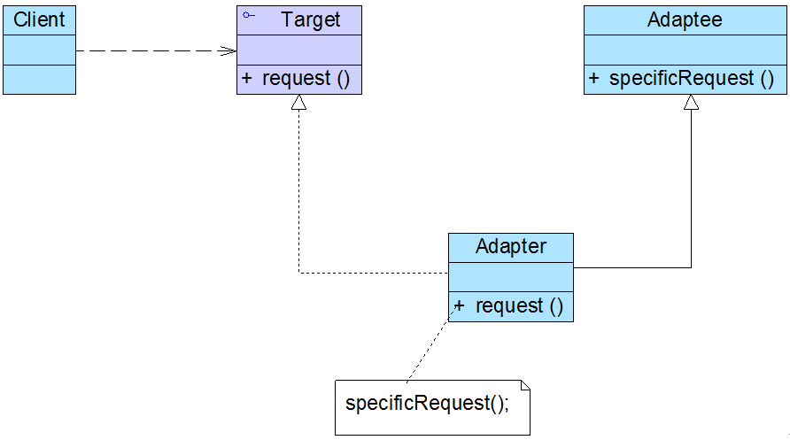
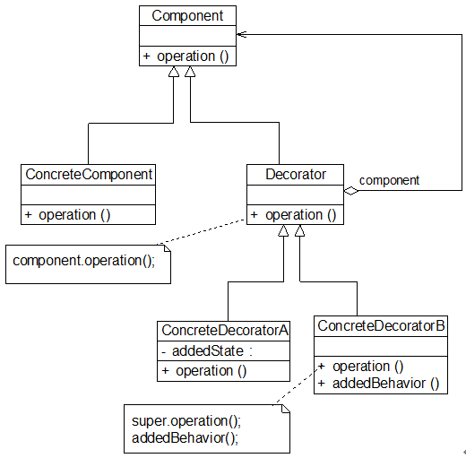
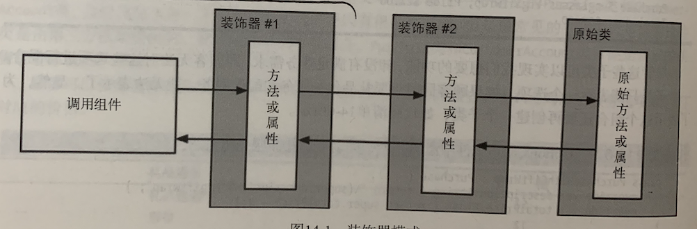

设计模式-Note 
--------------
**目录**

- [1.设计原则](#1设计原则)
- [2.六个创建型模式](#2六个创建型模式)
    - [2.1 简单工厂模式](#21-简单工厂模式)
    - [2.2 工厂方法模式](#22-工厂方法模式)
    - [2.3 抽象工厂模式](#23-抽象工厂模式)
    - [2.4 单例模式](#24-单例模式)
    - [2.5 原型模式](#25-原型模式)
    - [2.6 建造者模式](#26-建造者模式)
- [3.七个结构型模式](#3七个结构型模式)
    - [3.1 适配器模式](#31-适配器模式)
        - [3.1.1 对象适配器](#311-对象适配器)
        - [3.1.2 类适配器](#312-类适配器)
        - [3.1.3 小结](#313-小结)
    - [3.2 桥接模式](#32-桥接模式)
    - [3.3 组合模式](#33-组合模式)
    - [3.4 装饰模式](#34-装饰模式)
    - [3.5 外观模式](#35-外观模式)
    - [3.6 享元模式](#36-享元模式)
    - [3.7 代理模式](#37-代理模式)
- [4.十一个行为型模式](#4十一个行为型模式)
    - [4.1 责任链模式](#41-责任链模式)
    - [4.2 命令模式](#42-命令模式)
    - [4.3 解释器模式](#43-解释器模式)
    - [4.4 迭代器模式](#44-迭代器模式)
    - [4.5 中介者模式](#45-中介者模式)
    - [4.6 备忘录模式](#46-备忘录模式)
    - [4.7 观察者模式](#47-观察者模式)
    - [4.8 状态模式](#48-状态模式)
    - [4.9 策略模式](#49-策略模式)
    - [4.10 模板方法模式](#410-模板方法模式)
    - [4.11 访问者模式](#411-访问者模式)
- [5.其它](#5其它)

**重点:** 六大设计原则, 
# 1.设计原则

* **单一职责原则**. 一个类只负责一件事.
* **开闭原则**. 对修改关闭, 对扩展开放.
* **接口隔离原则**. 使用多个专门的协议, 而不是一个庞大臃肿的协议; 协议中方法尽量精简. 例如,UITableViewDelegate,UITableViewDataSource使用两个协议而不是一个协议, 这样更符合接口隔离原则.
* **依赖倒置原则**. 抽象不不应该依赖具体实现, 具体实现可以依赖于抽象.
* **里氏替换原则**. 父类可以被之类无缝替换, 且原有功能不受影响. (KVO遵从了这个法则,无缝使用子类)
* **迪米特法则**. 一个对象应当对其它对象尽可能少的了解. 高内聚,低耦合.

# 2.六个创建型模式
## 2.1 简单工厂模式
## 2.2 工厂方法模式
## 2.3 抽象工厂模式
## 2.4 单例模式
## 2.5 原型模式
## 2.6 建造者模式

# 3.七个结构型模式
## 3.1 适配器模式
> **例子:** 笔记本电脑工作电压是20V, 我国家庭用电电压是220V, 他们之间无法直接连接, 这时候就需要一个适配器来适配两者的工作, 这就引入了电源适配器. 


**适配器模式**: 将一个接口转换成客户希望的另一个接口, 使接口不兼容的哪些类型可以一起工作, 其别名为包装类. 适配器模式既可以作为类结构型模式, 也可以作为对象结构型模式. 

**在对象适配器模式中，适配器与适配者之间是关联关系；在类适配器模式中，适配器与适配者之间是继承（或实现）关系。**
### 3.1.1 对象适配器
**对象适配器模式类图:**


Adapter继承自目标抽象类, 实现request方法. Adapter引用了Adaptee, 在其request中调用需要适配的方法.

### 3.1.2 类适配器
类适配器模式和对象适配器模式最大的不同时适配器与适配者的关系不同, 对象适配器模式中适配器与适配者是关联关系; 类适配器中适配器与适配者是继承关系, 类适配器类图如下所示:



Adapter继承自Adaptee, 实现了目标协议的request协议方法, 在方法内部调用适配者相关的方法, 完成适配工作.

### 3.1.3 小结
**优点:** 

1. 将目标类和适配者类解耦, 通过引入一个适配者类来重用现有的适配者类, 无需修改原有结构.
2. 增加类的透明性和复用性. 将具体的业务封装在适配者类中, 对客户端而言是透明的, 提高了适配者的复用性.

**使用场景:**

1. 系统需要使用一些现有的类, 而这些类的接口(方法名)不符合系统的需要, 甚至没有这些类的源代码.
2. 向创建一个可以重复使用的类, 用于与一些彼此没有太大关联的类, 包括一些可能将来需要引进的类一起工作.的.

## 3.2 桥接模式
> 示例: 设计一款跨平台的图片解压程序. 不同的图片格式是一个变化的纬度, 不同的操作系统平台又是一个变化的纬度. 这时候我们需要使用桥接模式, 将两者的变化连接起来.


**桥接模式:** 将抽象部分和它的实现部分分离, 使他们可以独立的变化. 它是一种对象结构型模式, 又称为柄体模式或者接口模式.

**桥接模式用于软件系统中某个类存在两个独立变化的纬度, 通过该模式将两个或者多个纬度的变化分离开来, 使两者可以独立扩展**, 让系统更加符合"单一职责原则". 它将两个独立变化的纬度设计为两个独立的继承等级结构, 并且在抽象层简历抽象关联, 该关联关系类似一条链接两个独立继承结构的桥, 故称桥接模式.

**桥接模式类图:**


**桥接模式和适配器模式配合使用**, 示例类图如下所示:


读取excel报表的程序需要使用ExcelAPI, 这时候通过一个适配器关联读取API类的对象, 在响应的方法中调用读取方法.

**优点:**

1. 分离抽象接口和实现部分. 桥接模式使用“对象间的关联关系”解耦了抽象和实现之间固有的绑定关系，使得抽象和实现可以沿着各自的维度来变化。
2. 取代多重继承方案.
3. 提高系统扩展性, 在两个变化纬度中任意扩展一个纬度, 都不需要修改原有系统, 符合"开闭原则".

## 3.3 组合模式
**组合模式为处理树形结构提供了一种较为完美的解决方案, 它描述了如何将容器和叶子进行递归组合, 使得用户再使用时无需对他们进行区分, 可以一致的对待容器和叶子.**

**组合模式:** 组合多个对象形成树形结构以表示具有"整体-部分"关系的层次结构. 组合模式对整个对象和组合对象的使用具有一致性, 组合模式又称为"整体-部分"模式, 是一种对象结构型模式.

组合模式类图如下所示:


组合模式的关键是定义一个抽象构件类, 它既可以代表叶子, 也可以代表容器. 而客户端针对该抽象构件类进行编程, 无需知道它到底表示的是叶子还是容器, 可以对他们统一处理.

**组合模式在Cocoa框架中最重要的应用在页面布局通用行为的UIView这个类上. 视图层级中的单个视图对象可能是叶子结点, 也可以是包含其它视图集合的composite对象.**

**优点:**

1. 组合模式可以清楚地定义分层次的复杂对象, 表示对象的全部或者部分层次, 让客户端忽略层次的差异, 方便对这个那个层次结构进行控制.
2. 在组合模式中增加新的容器构建和叶子构件都很方便, 无需对现有类进行修改, 符合"开闭原则".
3. 组合模式为树形结构的面向对象实现提供了一种灵活的解决方案.

**使用场景:**

1. 在一个面向对象语言开发的系统中需要处理一个树形结构.
2. 在具有整体和部分的层次结构中, 希望通过一种方式忽略整体和部分的差异, 客户端可以一致的对待它们.

## 3.4 装饰模式
**装饰模式:** 动态的给一个对象增加一些额外的职责, 就增加对象功能来说, 装饰模式比生成子类实现更加灵活. 装饰模式是一种对象结构型模式.

装饰器模式类图:



由于具体构建类和装饰器类都实现了相同的抽象接口, 因此装饰器模式以对客户透明的方式动态给一个对象附加更多责任, 而客户端并不会觉得对象在装饰前和装饰后有什么不同. 装饰模式可以在不需要更多子类的情况下, 对对象的功能加一扩展.

装饰器模式可以多层嵌套, 每个装饰器实现不同的新功能, 并包装旧的装饰器或者原始类, 这一切对客户端来说都是透明的.



**优点:**

1. 对于扩展一个对象的功能, 装饰模式比继承更加灵活, 不会导致类数量急剧增加.
2. 可以通过一种动态的方式扩展一个对象功能. 
3. 可以对一个对象进行多次装饰, 通过使用不同的具体装饰类的排列组合, 可以创造出很多不同的行为组合, 得到功能更加强大的对象.

**使用场景:**

1. 在不影响其它对象的情况下, 以动态透明的方式给单个对象添加职责.
2. 当不能采用继承方式进行扩展, 或者扩展将产生大量子类的情况下.

## 3.5 外观模式
**外观模式:** 为子系统的一组接口提供一个统一的入口. 外观模式定义了一个高层的接口, 这个借口使得这一子系统更容易使用.

外观模式中, 一个子系统的外部与其内部通信通过一个统一的外观类进行, 外观类将客户类与子系统的内部复杂性分割开, 使得客户类只需要与外观角色打交道, 而不需要与子系统内部的很多对象打交道. **外观模式是迪米特法则的具体实现, 通过引入外观角色可以降低原有系统的复杂度, 同时降低客户类与子系统耦合度.**

外观模式类图如下所示:


**优点:**

1. 降低子系统和客户端之间的耦合;
2. 对客户端屏蔽了子系统组件, 减少客户端所需处理的对象数目, 使子系统使用起来更加方便;
3. 一个子系统的修改对其它子系统没有影响;

**使用场景:**

1. 为一系列复杂的子系统提供一个简单入口时候可以用外观模式;
2. 客户端与多个子系统之间存在很大的依赖性;
3. 层次化结构中, 可以用外观模式定义系统每一层的入口;

## 3.6 享元模式
## 3.7 代理模式

# 4.十一个行为型模式
## 4.1 责任链模式
**责任链模式:** 避免请求发送者和请求接收者耦合在一起, 让多个对象都有可能接收请求, 将这些对象链接成一条链, 并且沿着这条链传递请求, 直到有对象处理它为止. 责任链模式是一种对象行为型模式.


具体的处理者是抽象处理者的子类, 它有两大作用: 处理请求或者转发请求:

```
class ConcreteHandler extends Handler {
	public void handleRequest(String request) {
		if (请求满足条件) {
			//处理请求
		}
		else {
			this.successor.handleRequest(request);  //转发请求
		}
	}
}
```

责任链模式的关键在于对调用组件隐藏了责任链上单个链的实现细节. 责任链的创建可以放在客户端, 也可以放在责任链的基类中, 根据枚举类型创建不同的责任链.(放在客户端创建责任链可能更好一点, 更加符合开闭原则)

**应用:**

1. Cocoa框架中使用责任链来处理用户界面事件. 所有UI组件都派生自UIResponder类. 每个UI组件都是责任链中的链, 他们的位置反应的是其在界面组件层级关系中的位置, 层级顶端是责任链中的最后一个链.
2. 车主邦App中, Bundle图片获取器通过责任链模式实现. 如果是二倍屏, 则先获取二倍图, 没有的话获取三倍图, 一倍图. 
3. 消息处理也可以作为责任链来开发. 当收到一个消息, 把消息传递给第一个处理器, 如果不能处理则传递给第二个处理器...

**使用场景:** 当多个对象可以响应一个请求, 而最终只有一个对象会处理请求时, 可以使用此设计模式.

## 4.2 命令模式
## 4.3 解释器模式
## 4.4 迭代器模式
## 4.5 中介者模式
## 4.6 备忘录模式
## 4.7 观察者模式
## 4.8 状态模式
## 4.9 策略模式
## 4.10 模板方法模式
**模板方法模式**: 定义一个操作中算法的框架, 而将一些步骤延迟到子类中. 模板方法模式可以使得子类可以不改变一个算法结构即可重定义该算法的某些特定步骤.

**实现**: 在其他编程语言中, 模板方法模式的实现方式一般是定义一个基类, 并要求子类完善算法, 为缺失的步骤提供步骤. 实现此模式的第一步是将通用的固定的步骤归纳到一个类中, 而允许改变的步骤则需要定义成可通过属性配置的函数. 

**使用场景**: 此模式可以选择性的允许外界在不修改原有类的情况下, 修改任意算法中的某些步骤的具体实现. **钩子方法的引入使得子类方法可以控制父类的行为.** 

## 4.11 访问者模式

# 5.其它


单例模式, 命令模式