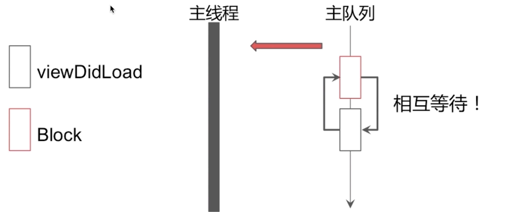
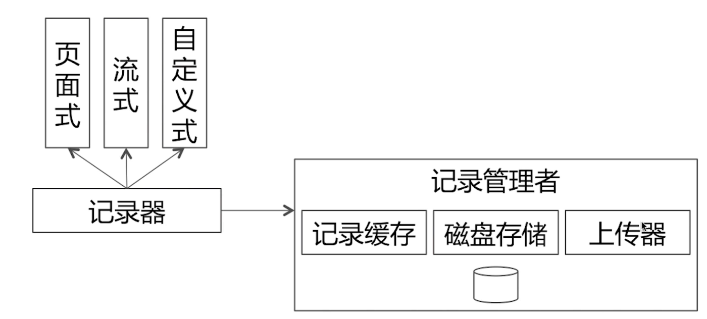

Table of Contents
=================

* [1. 内存管理](#1-内存管理)
 * [1.1 内存布局](#11-内存布局)
 * [1.2 内存管理方案](#12-内存管理方案)
    * [NONPOINTER_ISA：](#nonpointer_isa)
    * [散列表：](#散列表)
 * [1.3 数据结构](#13-数据结构)
    * [Spinlock_t自旋锁](#spinlock_t自旋锁)
    * [RefcountMap 引用计数表](#refcountmap-引用计数表)
    * [weak_table_t 弱引用表](#weak_table_t-弱引用表)
 * [1.4 ARC &amp; MRC](#14-arc--mrc)
 * [1.5 引用计数管理](#15-引用计数管理)
 * [1.6 弱引用管理](#16-弱引用管理)
 * [1.7 自动释放池](#17-自动释放池)
 * [1.8 循环引用](#18-循环引用)
    * [NSTimer的循环引用问题](#nstimer的循环引用问题)
* [2.Runtime](#2runtime)
 * [2.1 数据结构](#21-数据结构)
 * [2.2 类对象与元类对象](#22-类对象与元类对象)
 * [2.3 消息传递](#23-消息传递)
 * [2.4 方法查找](#24-方法查找)
 * [2.5 消息转发](#25-消息转发)
 * [2.6 Method-Swizzling](#26-method-swizzling)
 * [2.7 动态添加方法](#27-动态添加方法)
 * [2.8 动态方法解析](#28-动态方法解析)
* [3. Objective-C语言特性](#3-objective-c语言特性)
 * [3.1 分类(category)](#31-分类category)
 * [3.2 关联对象](#32-关联对象)
 * [3.3 扩展](#33-扩展)
 * [3.4 代理](#34-代理)
 * [3.5 通知](#35-通知)
 * [3.6 KVO](#36-kvo)
 * [3.7 KVC](#37-kvc)
 * [3.8 属性关键字](#38-属性关键字)
* [4.UI视图](#4ui视图)
 * [4.1 UITableView相关](#41-uitableview相关)
 * [4.2 事件传递&amp;事件响应](#42-事件传递事件响应)
 * [4.3 图像显示原理](#43-图像显示原理)
 * [4.4 UI卡顿和掉帧的原因](#44-ui卡顿和掉帧的原因)
 * [4.5 UI视图绘制原理&amp;异步绘制](#45-ui视图绘制原理异步绘制)
 * [4.6 离屏渲染](#46-离屏渲染)
* [5.Block](#5block)
 * [5.1 block介绍](#51-block介绍)
 * [5.2 Block截获变量](#52-block截获变量)
 * [5.3 __block修饰符](#53-__block修饰符)
 * [5.4 Block内存管理](#54-block内存管理)
 * [5.5 Block循环引用](#55-block循环引用)
* [6.多线程](#6多线程)
 * [6.1 GCD](#61-gcd)
 * [6.2 NSOperation](#62-nsoperation)
 * [6.3 多线程与锁](#63-多线程与锁)
* [7.Runloop](#7runloop)
 * [7.1 什么是Runloop](#71-什么是runloop)
 * [7.2 Runloop数据结构](#72-runloop数据结构)
 * [7.3 事件循环机制](#73-事件循环机制)
 * [7.4 Runloop与NSTimer](#74-runloop与nstimer)
 * [7.5 Runloop与多线程](#75-runloop与多线程)
 * [7.6 深入理解RunLoop](#76-深入理解runloop)
    * [runloop概念](#runloop概念)
    * [Runloop与线程关系](#runloop与线程关系)
    * [Runloop对外的接口](#runloop对外的接口)
    * [Runloop的Mode](#runloop的mode)
    * [Runloop的内部逻辑](#runloop的内部逻辑)
    * [Runloop的底层实现](#runloop的底层实现)
    * [苹果使用Runloop实现的功能](#苹果使用runloop实现的功能)
       * [AutoreleasePool](#autoreleasepool)
       * [事件响应](#事件响应)
       * [手势识别](#手势识别)
       * [界面更新](#界面更新)
       * [定时器](#定时器)
       * [PerformSelector](#performselector)
       * [关于GCD](#关于gcd)
       * [关于网络请求](#关于网络请求)
    * [Runloop的实际应用](#runloop的实际应用)
* [8.网络](#8网络)
 * [8.1 http协议](#81-http协议)
 * [8.2 https协议](#82-https协议)
* [9.架构框架](#9架构框架)
 * [9.1 图片缓存](#91-图片缓存)
 * [9.2 阅读时长统计的设计](#92-阅读时长统计的设计)
 * [9.3 复杂页面结构设计](#93-复杂页面结构设计)
 * [9.4 客户端整体架构](#94-客户端整体架构)
* [10.第三方库](#10第三方库)
 * [10.1 AFNetworking](#101-afnetworking)
 * [10.2 SDWebImage](#102-sdwebimage)
 * [10.3 ReactiveCocoa](#103-reactivecocoa)
 * [10.4 AsyncDisplayKit](#104-asyncdisplaykit)
* [11.设计模式](#11设计模式)
* [12.算法](#12算法)

## 1. 内存管理
### 1.1 内存布局


如上图所示, 是内存布局图. 整个内存上内存分为三部分, 内核区、保留区、程序区（我们的程序都是运行在程序区的）。

我们的应用程序被加载到程序区. 应用程序被分为三部分加载到内存中, 代码段区（text）、已初始化数据区（data）、未初始化数据区（bss）。此区域之外是堆区（heap）和栈区（stack），堆区内存地址从低向高增长，栈区的内存地址从高向低增长。

* stack：方法调用。
* heap：通过alloc等分配的对象。
* bss：未初始化的全局变量等。
* data：已初始化的全局变量等。
* text：程序代码。

### 1.2 内存管理方案
可参看此博客： https://www.jianshu.com/p/1637133949d8
iOS中的内存管理方法分为TaggedPointer（对于一些小对象如NSNumber对象采用此方式），NONPOINTER_ISA（64架构下ios应用程序），散列表（散列表是负责的数据结构，包含了引用计数表和弱引用表）。

以下内容是基于objc-runtime-680版本的内存管理。

#### NONPOINTER_ISA：

arm64架构才使用此结构，在ram64架构下，isa指针占据64比特位，实际上指针并不需要那么多的比特位，因此会使用多余的比特位存储其它的数据，比如此对象是否包含关联对象，是否使用c++下相关内容，是否正在释放，是否存在弱引用。

#### 散列表：

使用`SideTables（）`管理内存。在arm64中包含64个SideTable. SideTables() 实际上是一个哈希表，可通过一个对象指针，来找到它的引用计数表或者弱引用过表具体在哪个sideTable中。

SideTable结构如下所示：


> 问题：为什么需要多个SideTable呢？
> 提高效率。使用分离锁来提高访问效率。（试想每次retain或者release都需要改变引用计数，为了保证数据安全每次访问都需要对整个表加锁，如果使用一个表则访问效率过低，使用分离锁的技术分别对多个表添加多个锁，能够提高数据的访问效率。）

### 1.3 数据结构
#### Spinlock_t自旋锁

* **SpinLock是忙等的锁。**（忙等是指当要访问的数据被锁定的时候会不停的尝试获取锁，当锁被释放时候会第一时间获取到数据并访问；与之对应的信号量是非忙等的锁，数据被锁定后线程会被休眠，当资源释放时候会自动唤醒休眠的线程，继续执行任务）
* **适用于轻量级访问。**（轻量级访问是指被锁定的内容访问不会消耗很多的时长，这样使用忙等的自旋锁效率还是很高的，如果是重量级的访问，那么使用信号量效率会更高一点。）

更多内容可以参考多线程章节。

#### RefcountMap 引用计数表
引用计数表示一个哈希表，使用哈希表能够提高查找效率。

#### weak_table_t 弱引用表
弱引用表结构如图所示：


根据对象指针查找到一个数组，数组中存储弱引用指针。

### 1.4 ARC & MRC
MRC是手动管理内存，自己调用retain，release，autorelease等操作。

ARC自动引用计数

* 禁止手动调用retain/release/retainCount/dealloc等方法的；
* ARC是LLVM和Runtime协作的结果，并不仅仅是编译器在合适的地方插入retain/Release代码；
* ARC中新增了weak、strong的属性关键字。

> 问题：ARC和MRC的区别是什么？
> 可以从ARC引用计数的特点来讲起。ARC禁止调用内存管理相关的方法；ARC是LLVM和runtime协作的结果。

### 1.5 引用计数管理

retain的实现如下图所示，通过本对象查找到对应的SideTable，取出对应位置的值，执行添加引用计数的操作。实际上release、retainCount都是类似的实现。


delloc过程如下图所示：


delloc过程会去检查内存管理方式，是否包含弱引用指针，是否包含关联对象，是否使用哈希表进行引用计数管理等，如果有就进行相关的内存释放，没有则直接调用c函数的free进行释放操作。

### 1.6 弱引用管理
> 问题：弱引用是怎么被添加到弱引用表中的？
> 指定弱引用时候，会调用`weak_register_no_lock()`函数，其会通过对象的指针地址查找到对应的弱引用表，在弱引用表找查到对应的数组，在数组中添加一个弱引用指针即可。
> 问题：弱引用是怎么被自动置nil的？
> 通过`weak_clear_no_lock`函数，在对象被delloc时候，判断对象包含弱引用指针，则会查找根据对象指针在弱引用表中查到弱引用数组，便利数组分别置nil，因此，当一个对象被释放时候，其弱引用指针会被全部置nil。

### 1.7 自动释放池
> 问题：AutoreleasePool实现原理是怎样的？
> 以栈为结点，使用双向链表组合而成的。每次创建一个新的自动释放池，实际上是向自动释放池Push进去一个`AutoreleasePoolPage`对象，此对象是一个栈结构，包含child、parent指针。最新被加入autoreleasePool的对象会被加入到最顶层的AutoreleasePoolPage的栈中，当此AutoreleasePoolPage收到pop消息时候，会向栈中每个对象发送release消息，最后销毁整个顶层的AutoreleasePoolPage对象。
> 问题：AutoreleasePool为何可以嵌套使用？
> 栈为结点组成的双向链表，嵌套实际上是压栈。

自动释放池的数据结构：是以栈为结点，通过双向链表的形式组合而成的；自动释放池是和线程一一对应的。


* 在当次runloop将要结束的时候会调用`AutoreleasePoolPage::pop()`来释放加入自动释放池的对象。
* 自动释放池的多层嵌套就是多次插入哨兵对象。
* 什么时间应该使用autorelease：比如在for循环中alloc图片数据等内存消耗比较大的场景需要手动插入autoreleasePool来实时的释放内存。

### 1.8 循环引用
造成循环引用情况一般可以分为三种情况：自循环引用、相互循环引用、多循环引用。

* __weak:避免引起循环引用。
* __block:MRC下其修饰对象不会增加引用计数，避免引用计数；ARC下其会被强引用，无法避免循环引用，需要手动解环。
* __unsafe_unretained: 修饰对象不会增加引用计数，避免循环引用。如果其修饰对象在某一时刻被释放，则会产生悬垂指针。

#### NSTimer的循环引用问题
**NSTimer引起循环引用问题**。如图所示，及时vc对NSTimer弱引用，由于添加定时器时候，NSTimer对VC会产生强引用，而Runloop对NSTimer存在强引用，Runloop常驻内存，因此VC会被引用导致无法正确的释放。


**解决方案：**引入中间对象，对NSTimer和vc弱引用。如图所示。当定时器执行时候，检测如果vc已经不存在则让NSTimer停止并释放掉即可，以此破除NSTimer的循环引用。

  


## 2.Runtime
### 2.1 数据结构


```
objc_object  <==>  id
objc_class   <==>  Class
```

对象的isa指针指向其类对象, 类对象其isa指针指向元类对象.

objc_class继承子objc_object. objc_class主要包含三个成员变量: superClass, cache_t, class_data_bits_t.

* superClass: 一个指向其父类的指针.
* cache_t: 它是一个方法缓存列表, 主要用于快速查找方法执行函数; 是一个可增量扩展的哈希表结构; 是局部性原理的最佳应用(计算机中,个别的方法会被反复的调用,其它方法调用机会会很少).
* class_Data_bits_t: 通过多个引用层次, 包含属性列表, 协议列表, 方法列表等等信息.


method_t结构体主要包含函数的四要素. 名称, 返回值, 参数, 函数体. 函数体(函数的实现部分)被封装再IMP结构体中.

### 2.2 类对象与元类对象
类对象存储实例方法列表等信息. 元类对象存储类方法列表等信息.

类与元类继承关系图:


关于类与元类的详细介绍可以参看这里: [类与元类的关系](https://github.com/FrizzleFur/DailyLearning/wiki/OC%E7%9A%84%E7%B1%BB%E5%92%8C%E5%85%83%E7%B1%BB)

```
@interface Phone : Mobie
@end

@implementation Phone

- (id)init {
    self = [super init];
    if (self) {
        NSLog(@"%@", [self class]);
        NSLog(@"%@", [super class]);
    }
    return self
}
```

**以上代码会打印两个Phone**. 因为, class的实现在NSObject中, `[self class]`首先通过实例的isa指针找到Phone的类对象方法列表中查找实现,找不到就回去父类方法列表中找, 一直在NSObject中找到对应的实现. `[super class]`也是同样的查找过程. 而消息的接收者同样都是本类实例, 因此打印的结果都是Phone.

### 2.3 消息传递


oc中具体的消息传递过程如上图所示. 首先实例对象通过isa指针找到其类对象. 从类对象的方法缓存列表中查找方法, 如果找到就执行, 如果找不到就去当前类的方法列表中查找, 找不到就沿着继承关系逐级向上搜索, 如果一直找不到则进入消息转发流程, 然后结束.

我们在调用示例方法时候比如: `[self class]`, LLVM编译器会将此代码编译成`objc_msgSend(self,@selector(class))`这样的代码, 这个过程发生在编译器的编译期间. 同样的`[super class]`会被编译器编译成`objc_msgSendSuper(super,@selector(class))`.

### 2.4 方法查找
方法查找分为三个步骤, 首先在当前类的方法缓存列表中查找, 方法缓存列表是一个数组结构, 此过程会通过哈希运算计算对应实现的index; 如果方法缓存列表没有就会去当前类的方法列表中查找, 对于已排序好的列表,采用二分查找,没有排序的采用一般的遍历查找; 如果还没有找到,就沿着superClass指针从父类的方法列表中查找.

### 2.5 消息转发


具体的消息转发过程如上图所示. 对于找不到方法实现的选择子, 第一步会调用`resolveInstanceMethod`方法判断是否能够处理这个选择子, 我们可以在此实现中添加具体的方法实现, 如果返回了NO则表示无法处理, 会进入第二步的消息转发过程; 第二步, 调用`forwardingTargetForSelector`方法, 判断是否可以将消息发送给其它对象来处理, 如果可以则返回对应的对象, 不能则返回nil, 会进入第三步的转发过程; 第三步,首先调用`methodSignatureForSelector`方法, 我们可以实现此方法, 改变方法签名等信息, 然后在`forwardInvocation`中转发此消息.

### 2.6 Method-Swizzling
实际上就是交换了两个方法的实现.

### 2.7 动态添加方法
通过`class_addMethod`方法给实例添加方法.

### 2.8 动态方法解析
`@dinamic`关键字可以标记属性动态决议. 冬天运行时语言将函数决议推迟到运行时; 编译时语言再编译期进行函数的决议.

> 问题: 能否向编译后的类中增加实例变量? 
> 编译后, 类的内存布局已经确定了, 是无法添加实例变量的; 如果是动态添加的类, 是可以添加实例变量的. 
> 问题:runtime如何通过Selector找到对应的IMP地址的?
> 描述消息的传递过程.
> 问题:[obj foo]和objc_msgSend()函数之间有什么关系?
> 前者在编译后变成后者.

## 3. Objective-C语言特性
### 3.1 分类(category)
你用分类做什么?  声明私有方法; 分解体积庞大的类文件; 把framework的私有方法公开;

分类和扩展的区别: oc的特点之一就是我们可以给已存在的类型添加分类. 分类一般定义在新的文件中, 通过`@interface 已有类 (类别名)`来声明一个分类. 扩展通过`@interface 已有类 ()`来定义, 一般类扩展被写在类的实现文件中, 我们可以在类扩展中定义新的实例变量/方法等, 一般我们把私有方法和私有变量声明在类扩展中.

**分类的特点:**

1. 分类中可以添加实例方法/类方法/协议/属性(分类中的属性只会生成get,set方法,并不会生成实例变量)等内容.
2. 在分类方法的实现中可以访问原有类的实例变量以及方法.
3. 分类中可以重新实现原有类中的方法, 但是会覆盖掉原来的方法,导致原来的方法无法再使用.
4. 方法调用的优先级: `分类 > 原有类 > 父类`, `若包含多个分类, 则最后参与编译的分类优先`.
5. 分类时运行时决议的, 在运行时启动之后加载所有的分类(将分类中的方法以及属性添加的原始类上去).

分类使用`category_t`结构体表示, 其中包含分类名字, 分类原型的cls, 实例方法列表/类方法列表/协议列表/属性列表等信息. 如下图所示:


**分类的加载调用栈如下所示:**


`_objc_init`表示初始化runtime; `_read_images`表示读取镜像; `remethodsizeClass`表示加载分类内容, 程序启动后, 镜像读取完毕, 开始在runtime运行时加载所有的分类内容.

**分类方法附加到原始类方法列表的源码如下所示:**


1. 新申请一块内存区域, 内存大小是原始类方法列表和分类方法列表所占用空间的总和; 
2. 依次将原始类的方法列表拷贝到新内存区域的最后;
3. 将新增方法列表(所有分类中方法列表)拷贝到新内存区域的前部分;

> 事实上分类中方法相互`覆盖`, 以及`覆盖`原始类中方法的原理就在这. 分类中方法和原始类中方法实际上并不是被覆盖, 而是无法被访问到. runtime的方法调用决定在前面已经查找到了对应的方法, 后面同名的方法列表就不会被查找了. 

### 3.2 关联对象
我们可以通过关联对象在分类中给原始类添加实例变量. 主要是通过三个方法`objc_getAssociatedObject`,`objc_setAssoicatedObject`, `objc_removeAssiociatedObject`. 

**关联对象由AssociationsManager管理, 并在AssociationsHashMap存储. 所有对象的关联内容都存储一个全局容器中.**

关联对象的本质:


上图如果抽象成json如下图所示:


首先通过管理类`AssoicationManager`获取`AssociationsHashMap`对象, 通过对象的地址找到`ObjectAssociationMap`对象, 在其中根据`selector`找到`ObjcAssociation`对象, ObjcAssociation中存储具体的关联对象关联策略以及关联值.

**关联对象值设置为nil会擦出关联对象的值。**

### 3.3 扩展
使用扩展做什么？

* 声明私有属性。
* 声明私有方法（没有太大意义，一般直接写在实现中的方法就是私有方法）。
* 声明私有成员变量。

扩展的定义：

* 编译时决议，编译过程中生成相关set、get方法；（分类是运行时决议）
* 只以声明的形式存在，多数情况下寄生于宿主类的.m中。
* 不能为系统类添加扩展。

### 3.4 代理
代理是一对一的形式，使用代理设计模式实现。

### 3.5 通知
通知的特点，也是代理和通知的区别：

* 是使用观察者模式来实现的用于扩层传递消息的机制。（代理使用代理模式实现）
* 通知传递方式是一对多传递。（代理使用一对一的方式）

通知的实现原理：


### 3.6 KVO
什么是kvo， kvo的实现机制是什么？

* KVO是key-value observing的缩写；
* KVO是oc对观察者模式的又一种实现；
* Apple使用了isa混写（isa-swizzling）来实现KVO；

KVO实现机制与原理如下图所示：


当在对象上调用`addObserver...`方法时候，在运行时，系统为我们创建此类型的子类，并将本类的isa指针指向新创建的子类。子类通过重写set方法监听value值的变化。重写的setter方法负责通知所有的观察者对象。（当在对象上调用addObserver之后，系统动态生成此类型的子类，并将其isa指针指向其子类，此为isa混写技术）

> **注意：**1.使用kvc设置value，kvo是可以生效的。2.通过成员变量直接赋值时候是无法触发kvo的。 （如果需要直接通过成员变量赋值又要触发kvo，可以通过手动kvo方式：赋值之前和之后分别调用`willChangeValueForKey`,`didChangeValueForKey`）

### 3.7 KVC
使用kvc会破坏面向对象的封装性, 只要你知道私有变量的名称, 就能改变他的值.

**赋值的原理:**1.查找是否实现setter方法, 如果有这优先调用setter方法完成赋值(注意:setter后面的键的第一字母必须是大写!). 2.如果找不到setter,调用`accessInstanceVariablesDirectly`进行查询.(如果返回YES，顺序匹配变量名与 _<key>，_is<Key>,<key>,is<Key>,匹配到则设定其值; 如果返回NO,结束查找。并调用  setValue：forUndefinedKey：报异常). 3.如果没有setter耶没有实例变量, 调用`setValue:forUndefineKey:`.

**取值的原理:**和赋值的原理一一对应. 先检查是否有响应个getter; 再调用`accessInstanceVariablesDirectly`进行查询; 还没有则调用`valueForUndefinedKey:`方法, 并报异常.

### 3.8 属性关键字

* 读写权限:readwrite(default)/readonly
* 原子性:atomic(default)/nonatomic
* 引用计数:retain(mrc)/strong(arc),assign(arc)/unsafe_unretained, weak, copy

assign和weak的区别: assign可以用来修饰基本数据类型,修饰对象类型时候不改变其引用计数,会产生悬垂指针; weak只能修饰对象,不改变被修饰对象的应用计数,在所指兑现习惯释放之后会自动置为nil.

atomic保证的线程安全是通过属性访问时候的线程安全. 比如atomic修饰一个数组, atomic保证获取数组和设置数组变量的线程安全, 但并不保证操作数组(向数组中添加/移出object)的线程安全. 而atomic的效率非常的低下, 因此在开发中我们一般不使用atomic. 如果需要线程安全的访问变量则可以通过信号量来实现.

**浅拷贝和深拷贝:**浅拷贝是对内存地址的复制, 让目标对象指针和源对象指向同一片内存空间; 深拷贝让目标对象指针和源对象指针指向两片内容相同的内存空间.


**copy关键字: **可变对象的copy和mutableCopy都是深拷贝; 不可变对象的copy是浅拷贝,mutableCopy是深拷贝. copy过来的对象都是不可变对象.

**常考的题目:**

1. MRC下如何重写retain修饰变量的setter方法?
2. 请简述分类的实现原理.
3. KVO的实现原理是怎样的.
4. 能否为分类添加成员变量.

```
// MRC下如何重写retain修饰变量的setter方法?
- (void)setObj:(id)obj {
	if (_obj != obj) {
		[_obj release];
		_obj = [obj retain];
	}
}
```

**注意事项：** 

1. 当程序启动时，就会加载项目中所有的类和分类，而且加载后会调用每个类和分类的+load方法，只会调用一次；
2. 当第一次使用某个类时，就会调用当前类的+initialize方法；
3. 先加载父类，再加载子类（先调用父类的+load方法，再调用子类的+load方法，最后调用分类的+load方法），先初始化父类，再初始化子类（先调用父类的+initialize方法，再调用子类的+initialize方法）。
4. 注意：在初始化的时候，如果在分类中重写了+initialize方法，则会覆盖掉父类的。
5. 重写+initialize方法可以监听类的使用情况。

## 4.UI视图
### 4.1 UITableView相关
**tableView的重用机制原理.** 使用缓存池进行cell的重用. 如果缓存池中cell不足则创建新的cell, 如果cell从屏幕上编程invisible则将cell加入缓存池中, 以此达到cell重用的目的.

**数据源同步问题.** 主要有两种解决方案, 如下图所示:

方案一如下图所示. 子线程中发起网络请求后, 主线程删除数据源中一行, 此后网络请求数据返回导致数据不同步的问题. 解决: 删除数据时候, 记录删除的行, 在新的数据返回后新的数据中执行删除操作.


方案二如下图所示. 声明一个串行队列, 所有关于数据源的操作都放在串行队列中. 主线程中删除一行后, 将删除数据源数据的操作放在串行队列中. 这样可以保证数据源的同步.


### 4.2 事件传递&事件响应
UIView为CALayer提供内容, 处理触摸事件, 参与响应链; CALayer负责显示内容contents. UIView的显示部分由CALayer负责, 通过其contents属性显示内容.

**事件传递流程:** 点击屏幕UIApplication最先拿到点击事件, 然后传递给激活的UIWindow, 调用`hitTest:withEvent:`和`pointInside:withEvent:`方法查找可以响应事件的view. 找到则返回, 找不到则返回nil继续查找. 在遍历subviews时候按照倒序遍历的方式进行遍历.


**`hitTest:withEvent:`的内部实现:** 首先判断是否隐藏,是否支持交互,是否透明度大于0.01. 然后判断点是否在本view上. 如果在这倒序循环遍历其subviews, 找到最合适响应事件的点.


### 4.3 图像显示原理
CPU与GPU通过系统总线连接在一起, CPU将处理的位图通过总线交给GPU, GPU做位图的渲染和纹理的合成. GPU渲染完毕将图像存放在缓冲区中(FrameBuffer), 视频控制器会在下次刷新时候将图像从缓冲区中取出并显示在显示器上.


CPU和GPU渲染流程如下所示:


GPU的工作: Layout(主要是UI布局,文本宽高计算), Display(绘制,比如drawRect的绘制), Prepare(图片编码解码,比如UIImageView的解码动作), Commit(CoreAnimation对位图进行提交)

CPU的工作(OpenGL的渲染管线): 


### 4.4 UI卡顿和掉帧的原因


如上图所示, 每一帧的渲染都需要GPU和CPU的配合, 如果CPU计算时间过长或者GPU渲染时间过长超过了16.7毫秒, VSync信号来到后尚未渲染完成, 则会产生掉帧, 用户感觉起来就是卡顿.

**基于UITableView和UIScrollView的滑动优化方案**

1. CPU优化: 
	* 对象的创建,调整,销毁可以放在子线程中去完成.
	* 预排版(计算布局, 文本计算).
	* 预渲染(文本等异步绘制, 图片编解码等)
2. GPU优化:
	* 纹理渲染: 当有圆角,阴影等GPU纹理绘制的压力就会非常大, 开发尽量避免离屏渲染, 也可以采用CPU异步绘制来解决.
	* 视图混合: 叠加复杂的透明view时候, GPU需要进行大量的计算, 计算每个点的色值. 解决: 避免使用透明度view, 尽量减少视图的层级.

### 4.5 UI视图绘制原理&异步绘制
如下图所示, 当调用`[UIView setNeedLayout]`时候, CALayer会调用对应的`setNeedLayout`方法. 在一次事件循环结束时候才会开始真正的绘制工作. 判断如果实现了CALayer的代理方法`displayLayer`, 则系统会调用此代理方法进行视图的异步绘制工作; 如果不存在代理则会执行正常的系统绘制流程.(实现CALayer代理, 实现`displayLayer:`方法, 代理需要负责生成对应的bitmap; 设置bitmap作为layer的contents属性的值)


如下图所示, 是系统正常的视图绘制流程. 首先判断如果实现了`drawLayer:inContext:`方法, 则调用此方法进行绘制工作; 如果没有实现此代理方法则走系统默认的绘制方法. 最后将绘制结果提交到GPU.


CPU异步绘制原理如下图所示. 在异步线程中进行视图的绘制, 绘制结束后将结果赋值给`layer.contents`中.


### 4.6 离屏渲染

* 载屏渲染(On-Screen Rending): 指GPU的渲染操作是在当前用于显示的屏幕缓冲区中进行的.
* 离屏渲染(Off-Screen Rending): 指GPU在当前屏幕缓冲区外开辟新的缓冲区进行渲染操作.

**什么是离屏渲染, 你怎么理解离屏渲染的.**

标注答案: 当我们设置了某些图层属性, 标记未其在未预合成之前无法直接显示的时候呢, 就会触发离屏渲染. 离屏渲染指的是在GPU在当前屏幕缓冲区以外开辟新的缓冲区进行渲染操作.


**何时会触发离屏渲染.**

* 圆角(同时设置圆角和maskToBounds才会触发离屏渲染)
* 图层蒙版
* 阴影效果
* 光栅化

**为何要避免离屏渲染**

标准答案: 在触发离屏渲染时候会触发GPU的工作量, 这就很可能导致CPU+GPU渲染时间超过16.7ms, 那么可能导致卡顿和掉帧, 所以要避免离屏渲染.(离屏渲染需要创建新的渲染缓冲区, 还要进行上下文的切换)

面试题:

* 系统UI事件传递机制是什么?
* 使UITableView滑动更加流畅的方案和思路有哪些?
* 什么事离屏渲染?
* UIview和CALayer关系是什么? 

## 5.Block
### 5.1 block介绍
> 什么是block? **Block是将函数以及其执行上下文封装起来的对象.** 

**Block本质是什么?** 

block本质上是一个对象, 它封装了函数和执行的上下文. Block在编译之后, 会生成一个对象的形式, 对象包含一个函数以及其截取的上下文变量等信息.(包含函数的实现部分(__block_impl结构体), 函数描述, 函数截取的变量, 这些值通过C++的构造函数传到对象中去.)

__block_impl中包含isa指针(block是对象的标志), FuncPtr函数指针, 指向函数的实现部分.  

```
// 1.如下所示的一个类的实现文件, 其中包含一个method实例方法, 方法中定义了一个block.
@implementation MCBlock
// 全局变量
int global_var = 4;
// 静态全局变量
static int static_global_var = 5;

- (void)method
{
    static int multiplier = 6;
    int(^Block)(int) = ^int(int num)
    {
        return num * multiplier;
    };
    multiplier = 4;
    NSLog(@"result is %d", Block(2));
}
@end


//2.编译后以上代码会被编译成下面的c代码
static void _I_MCBlock_method(MCBlock * self, SEL _cmd) {

    int var = 1;

    __attribute__((objc_ownership(none))) id unsafe_obj = __null;
    __attribute__((objc_ownership(strong))) id strong_obj = __null;


    static int static_var = 3;

	// 声明一个block, 实际上是初始化一个`__MCBlock__method_block_impl_0` C++对象.第一个参数是一个函数指针, 第二个参数是block的描述, 以及截取的变量, block参数等.
    void(*Block)(void) = ((void (*)())&__MCBlock__method_block_impl_0((void *)__MCBlock__method_block_func_0, &__MCBlock__method_block_desc_0_DATA, var, unsafe_obj, strong_obj, &static_var, 570425344));

	// 执行一个block, 实际上是对Block变量强转成`__block_impl`结构体, 从中取出函数指针, 执行函数指针指向的函数.
    ((void (*)(__block_impl *))((__block_impl *)Block)->FuncPtr)((__block_impl *)Block);
}


//3.下面是block被转换成对象的实现部分. 包含一个构造函数以及截取的局部变量等信息.
struct __MCBlock__method_block_impl_0 {
  struct __block_impl impl;
  struct __MCBlock__method_block_desc_0* Desc;
    // 截获局部变量的值
  int var;
    // 连同所有权修饰符一起截获
  __unsafe_unretained id unsafe_obj;
  __strong id strong_obj;
    // 以指针形式截获局部变量
  int *static_var;
    // 对全局变量、静态全局变量不截获
    
  __MCBlock__method_block_impl_0(void *fp, struct __MCBlock__method_block_desc_0 *desc, int _var, __unsafe_unretained id _unsafe_obj, __strong id _strong_obj, int *_static_var, int flags=0) : var(_var), unsafe_obj(_unsafe_obj), strong_obj(_strong_obj), static_var(_static_var) {
    impl.isa = &_NSConcreteStackBlock;
    impl.Flags = flags;
    impl.FuncPtr = fp;
    Desc = desc;
  }
};


//4.block方法体的实现部分.
static void __MCBlock__method_block_func_0(struct __MCBlock__method_block_impl_0 *__cself) {
  int var = __cself->var; // bound by copy
  __unsafe_unretained id unsafe_obj = __cself->unsafe_obj; // bound by copy
  __strong id strong_obj = __cself->strong_obj; // bound by copy
  int *static_var = __cself->static_var; // bound by copy


        NSLog((NSString *)&__NSConstantStringImpl__var_folders_ch_9dscy_ws0wx5qxrkh9dhyrs40000gn_T_MCBlock_8f992f_mi_0, var);

        NSLog((NSString *)&__NSConstantStringImpl__var_folders_ch_9dscy_ws0wx5qxrkh9dhyrs40000gn_T_MCBlock_8f992f_mi_1, unsafe_obj);
        NSLog((NSString *)&__NSConstantStringImpl__var_folders_ch_9dscy_ws0wx5qxrkh9dhyrs40000gn_T_MCBlock_8f992f_mi_2, strong_obj);

        NSLog((NSString *)&__NSConstantStringImpl__var_folders_ch_9dscy_ws0wx5qxrkh9dhyrs40000gn_T_MCBlock_8f992f_mi_3, (*static_var));

        NSLog((NSString *)&__NSConstantStringImpl__var_folders_ch_9dscy_ws0wx5qxrkh9dhyrs40000gn_T_MCBlock_8f992f_mi_4, global_var);
        NSLog((NSString *)&__NSConstantStringImpl__var_folders_ch_9dscy_ws0wx5qxrkh9dhyrs40000gn_T_MCBlock_8f992f_mi_5, static_global_var);
    }
```

### 5.2 Block截获变量
针对不同的变量类型, block的截获方式也是不同的. 变量类型分为: 基本数据类型局部变量, 对象类型局部变量, 静态局部变量, 全局变量, 静态全局变量.

* 基本数据类型局部变量: 截获其值.
* 对象类型局部变量: 连同所有权修饰符一起截获.(所有权修饰符:__strong, __unsafe_unretain)
* 静态局部变量: 截获其指针.
* 全局变量, 静态全局变量: 不进行截获.

### 5.3 `__block`修饰符
一般情况下, 对被截获变量进行**赋值操作**需要添加`__block`修饰符. 仅仅是使用是不需要添加`__block`修饰符的, 例如在block中给array添加或者移出数据, array时不需要添加__block修饰符的.

修改静态局部变量, 全局变量和静态全局变量时候是不需要使用__block修饰符的.

如下图所示, 实际上使用__block修饰的变量都会被转换成对象. 其中有isa指针, 其中的`multiplier`就是变量真实的值. 在栈上的block其`__forwarding`指针指向其自身.


### 5.4 Block内存管理
block分为三种类型, 全局的block(`__NSConcreateGlobalBlock`), 栈上的block(`__NSConcerteStackBlock`), 堆上的block(`__NSConcreateMallocBlock`). 对栈上的block拷贝会拷贝到堆上, 全局blockcopy什么也不发生, 对堆上的block拷贝会增加其引用计数. 如下图所示.


如下图所示. 定义一个栈上的block, 然后copy到堆上. 随着局部作用于的结束, 栈上的block是会被销毁的, 当时堆上的block会继续存在. 当栈傻姑娘的block被拷贝到堆上时候, 其__block变量的__forwarding指针会指向堆上的__block变量.


`__forwarding`存在的意义: 不论在任何内存位置, 都可以通过__forwarding访问同一个__block变量. 如果block没有发生拷贝则访问的是栈上的block变量, 如果发生了拷贝, 则不论是栈上的block还是堆上的block其访问的都是堆上的__block变量, 如图所示.


### 5.5 Block循环引用
Block可能会造成自引用或者大环引用, 如下图所示是大环引用的示例. 当对象持有Block属性, Block通过__block持有对象本身, 这时候就会造成大环应用. 我们可以通过断环的方式规避此类问题.


什么是Block? 封装了函数以及其上下文的对象.
为什么Block会产生循环引用? 如果Block对当前对象属性进行截获, 那么就会发生循环引用. 
怎么理解Block截获变量? 对于基本数据类型直接获取值. 局部类变量截获指针以及其所有权修饰符. 局部静态变量获取其指针地址. 全局变量以及静态全局变量不进行截获.

## 6.多线程
### 6.1 GCD
GCD部分内容包括: 同步/异步, 串行/并发; dispatch_barrier_async; dispatch_group;

**同步/异步, 串行/并发**

**同步/异步执行**: 控制是否开辟新的线程来执行,同步则是获取当前线程,在当前线程执行, 异步可以生成新的线程执行.

**串行/并发队列**: 控制是否可以一次执行多个任务. 相当于是一个任务的容器, 串行控制一次只能从中拿出来一个任务进行执行, 执行完毕才能拿到下一个任务; 并发指可以一次从队列中获取多个任务并执行.

主线程上获取主线程执行任务会导致死锁(主线程任务队列是串行队列, 在串行队列中同步执行任务在同一个串行队列中执行, 都会导致死锁). 

如下图所示. viewDidLoad方法实际上是在主线程的主队列(串行队列)中执行的, 而执行同步任务需要获取主线程, block要想获取主线程必须等待当前主线程任务执行完毕, 而要想主线程任务执行完毕又必须执行完block, 因此造成了相互等待, 死锁.



`perform(aSelector:with:afterDelay:modes:)`方法会将任务提交到runloop上去, 即使delay=0也是如此. 如果在没有开启runloop的线程上执行此代码, 则实际上selector不会被触发. (global队列上执行的并发任务存在`performSelector`方法不会执行)

同步执行不管是在同步队列还是并发队列都可以直接拿到执行结果的

**dispatch_barrier_async**

**如何实现一个数据源的多读单写呢?** 创建一个并发队列, 在不同的线程中读取时候可以采用并发队列同步读取. 当要写入数据时候, 则添加barrier块来写入数据, 以此实现多读单写的功能. 具体实现代码如下所示.

```
//创建并发队列
let concurrentQueue = DispatchQueue(label: "com.dsdsd.sdsdsdd", attributes: .concurrent)

//
concurrentQueue {
    print("async 1")
    sleep(1)
}
concurrentQueue {
    print("async 2")
    sleep(1)
}
// 使用barrier分割任务的实行
concurrentQueue(flags: .barrier) {
    print("This is a barrier.")
    sleep(1)
}

concurrentQueue {
    print("async 5")
    sleep(1)
}
concurrentQueue {
    print("async 6")
    sleep(1)
}
```

> 注意: globalQueue和自行创建的并发队列是有区别的, 这里必须使用自行创建的并发队列才行!!! (个人理解可能是全局队列是所有应用程序共享的, 如果支持barrier者会影响其它应用程序的执行, 因此**global队列不支持barrier**)

**全局队列和并发队列区别:**

* 全局队列没有名字, 但是并发队列有名字. 可以方便查看日志.
* 全局队列是所有应用程序共享的, 并发队列是应用城区内部的.

**dispatch_group**

**dispatch_group有哪些用途?** 主要是用在异步执行多个任务时候, 任务执行完毕后获取通知这样的功能. 通过`dispatch_group_notify`获取组通知.

### 6.2 NSOperation
NSOperation和NSOperationQueue需要结合一起使用, 使用NSOperationQueue可以更精细化的控制任务的执行.

* 控制添加任务依赖;
* 控制任务执行状态(isReady, isExecuting, isFinish, isCancelled);
* 控制最大并发量;

**系统怎样移出一个isFinish=true的NSOperation?** 系统通过KVO来更改任务的执行状态.

**问题:**
iOS系统提供哪几种多线程技术方案? 
GCD, NSOperation, NSThread. 

### 6.3 多线程与锁
iOS中提供的锁: @synchronized, atomic, OSSpinLock, NSRecursiveLock, NSLock, dispatch_semaphore_t. 

1. @synchronized: 一般我们在创建对象时候使用这个锁, 用来锁定一小块代码块;
2. atomic: 声明属性时候使用, 其只负责属性的更改, 不负责属性的操作;
3. OSSpinLock: 自旋锁. 特点:循环等待, 主要用于轻量级的数据访问(runtime对引用计数的加减有用到自旋锁);
4. NSLock: 比较常用的锁, 能够比较细粒度的控制代码的执行. 
5. NSRecursiveLock: 递归锁, 可以多层嵌套使用.
6. dispatch_semphore_t: 信号量, 性能会更高一点. 可以用来代理NSLock, 并且可以控制同时执行代码的线程数量.

> **信号量的实现逻辑:** 线程调用`dispatch_semaphore_wait()`方法进行判断, 如果可用的值小于0, 则当前阻塞自己(**阻塞是一个主动行为**). 正在执行的任务执行完毕后, 调用`disptach_semaphore_singal()`方法, 判断如果有正在阻塞的任务, 则去唤醒线程(**线程的唤醒是一个被动行为**).

NSLock锁定代码的临界区调用方法重新获取锁, 则会**导致死锁**. 此种环境可以通过使用递归锁来解决NSRecursiveLock, 递归锁可以多层嵌套枷锁. 


**面试问题:**

1. 怎么实现GCD的多读单写?
2. iOS系统为我们提供几种多线程技术? 各自的特定是什么?
3. NSOperation对象在Finish之后是怎样从当前的queue中移出掉的?
4. 你都用过哪些锁? 结合实际谈谈你是怎样使用的?

## 7.Runloop
### 7.1 什么是Runloop
什么是Runloop? 
**Runloop是通过内部维护的`事件循环`来对`事件/消息进行管理`的一个对象.**


什么是事件循环, 事件循环的机制是什么? 
维护的事件循环可以用来不断的处理消息和事件, 然后对他们进行管理. 如果没有消息处理时候, 事件循环会进入休眠状态避免资源的占用; 当有消息处理时候, 事件循环会被立即唤醒.

main函数为什么不会自动退出?
main函数中会启动主线程的runloop, runloop是对事件循环的维护机制, 有消息时候就处理消息, 没有消息时候就会进入休眠状态. 在此期间设计到用户态到内核态, 内核态到用户态的切换.

### 7.2 Runloop数据结构
NSRunloop是对CFRunloop的封装, 提供了面相对象的API.

CFRunloop相关数据结构: CFRunloop, CGRunloopMode, Source/Timer/Observer.

CFRunloop的数据结构如下图所示: 


* pthread: 线程, 线程和runloop是一一对应的关系.
* currentMode: 是CFRunloopMode数据结构.
* modes: 本runloop支持的模式.
* commonModes: Set<String>类型.
* commonModeItems: 包含多个Observer, 多个Timer, 多个Source.

CFRunloopMode数据结构: 

* name: mode的名.
* sources0: CFRunloopSource类型.
* sources1: CFRunloopSource类型.
* observers: CFRunloopObserver类型.
* timers: CFRunloopTimer类型.

sources0和sources1有什么区别? sources0需要手动唤醒线程; sources1具备唤醒线程的能力.

CFRunLoopTimer是基于事件的定时器, 和NSTimer是通过bridge免费切换的.

CFRunloopObserver可以对runloop某些时机进行观察, 可观察的时机有6个:

* kCFRunloopEntry: runloop的入口时机, runloop即将启动发送的通知.
* kCFRunloopBeforeTimers: runloop对timers进行处理之前发送的通知.
* kCFRunloopBeforeSources: runloop要处理sources事件之前发送的通知.
* kCFRunloopBeforeWaiting: runloop即将进入休眠状态发送通知.
* kCFRunloopAfterWaiting: runloop即将退出休眠状态发送通知.
* kCFRunloopExit: runloop即将退出发送的通知

### 7.3 事件循环机制

### 7.4 Runloop与NSTimer
滑动tableview时候, 定时器还会生效吗?

默认情况下, 滑动tableView时候定时器是不会生效的. 因为默认情况下定时器会被添加到 runloop的`default` mode中. 而滑动tableview时候, runloop会将模式切换到`tracking`模式, 此时default mode下的定时器/sources等事件是不会被触发的(**设计不同mode的目的就是为了隔离事件的响应**). 

解决: 可以将定时器添加到commonMode中. commonMode并不是一个具体的mode, 而是多个模式的集合, 当把一个timer添加到一个commonMode时, 会将timer添加到多个runloop支持的mode中去.

> CommonMode并不是一个具体的mode，而是mode的集合。它存在的作用是同步Source、Timer、Observer到同一个Mode中的一种技术方案。

### 7.5 Runloop与多线程
线程和runloop是一一对应的. 默认情况下, 线程的runloop是没有创建的, 我们需要自己手动创建runloop. 

怎么实现一个常驻线程?
为线程开启一个runloop(调用`RunLoop.current`方法, 系统会为我们创建一个runloop)
向该线程添加一个Port/source登为此runloop的事件循环.(如果runloop没有事件源要处理的话, 就会自动退出, 因此需要添加source)
启动该runloop.

什么是Runloop, 它是怎么做到有事做事, 没事休息的?
当没有事情处理的时候, runloop会自动进入休眠状态, 有事件需要处理时候, 系统内核会唤醒我们的runloop, 我们的runloop会运行起来处理事件.

Runloop与线程是怎样的关系?
Runloop与线程是一一对应的关系, 但是线程的runloop默认是没有创建的, 当我们调用`Runloop.current`方法时候, 系统会为我们创建Runloop. 

如何实现一个常驻线程? 

```
// 如下代码所示, 只需获取当前的runloop, 然后执行`run()`方法即可.
let timer = Timer.scheduledTimer(withTimeInterval: 1, repeats: true, block: { (timer) in
    print("timer scheduled timer")
})
RunLoop.current.add(timer, forMode: .common)
RunLoop.current.run()
```

怎么保证子线程数据回来更新UI时候不打断用户的滑动操作? 

将子线程更新数据的代码块放在commonMode中.

### 7.6 深入理解RunLoop
Runloop详解: [https://blog.ibireme.com/2015/05/18/runloop/](https://blog.ibireme.com/2015/05/18/runloop/)

#### runloop概念
Runloop实际上是一个对象, 这个对象管理了其需要处理的事件和消息, 并提供一个入口函数来执行`事件循环`逻辑, 线程执行这个逻辑就会一直处于这个函数内部`接收消息->等待->处理消息`的循环中, 直到这个循环结束(比如传入quit消息). 

#### Runloop与线程关系
线程和Runloop是一一对应的, 它们的对应关系保存在一个全局的Dictionary中. 线程刚创建时候是没有Runloop的, 如果你不主动获取, 则一直不会有. Runloop的创建发生在第一次获取时, Runloop的销毁发生在线程结束时. 你只能在一个线程的内部获取其Runloop(主线程除外).

苹果不允许我们创建Runloop, 它提供两个自动获取的函数: `CFRunloopGetMain()`, `CFRunloopGetCurrent()`. 这两个函数的内部逻辑大概是这样的: 

```
/// 全局的Dictionary，key 是 pthread_t， value 是 CFRunLoopRef
static CFMutableDictionaryRef loopsDic;
/// 访问 loopsDic 时的锁
static CFSpinLock_t loopsLock;
 
/// 获取一个 pthread 对应的 RunLoop。
CFRunLoopRef _CFRunLoopGet(pthread_t thread) {
    OSSpinLockLock(&loopsLock);
    
    if (!loopsDic) {
        // 第一次进入时，初始化全局Dic，并先为主线程创建一个 RunLoop。
        loopsDic = CFDictionaryCreateMutable();
        CFRunLoopRef mainLoop = _CFRunLoopCreate();
        CFDictionarySetValue(loopsDic, pthread_main_thread_np(), mainLoop);
    }
    
    /// 直接从 Dictionary 里获取。
    CFRunLoopRef loop = CFDictionaryGetValue(loopsDic, thread));
    
    if (!loop) {
        /// 取不到时，创建一个
        loop = _CFRunLoopCreate();
        CFDictionarySetValue(loopsDic, thread, loop);
        /// 注册一个回调，当线程销毁时，顺便也销毁其对应的 RunLoop。
        _CFSetTSD(..., thread, loop, __CFFinalizeRunLoop);
    }
    
    OSSpinLockUnLock(&loopsLock);
    return loop;
}
 
CFRunLoopRef CFRunLoopGetMain() {
    return _CFRunLoopGet(pthread_main_thread_np());
}
 
CFRunLoopRef CFRunLoopGetCurrent() {
    return _CFRunLoopGet(pthread_self());
}
```

#### Runloop对外的接口
CoreFoundation中关于Runloop的类型主要有5个: CFRunloopRef, CFRunloopModeRef, CFRunloopSourceRef, CFRunloopTimerRef, CFRunloopObserverRef. 他们的关系如下图所示:


一个Runloop包含若干个mode, 每个mode包含若干个Source/Timser/Observer. 一个runloop同时只运行在一个mode下, 如果想要切换mode必须退出, 然后指定另一个Mode重新进入. 这样做的目的主要是为了风格开不同组的`Source/Timer/Observer`, 让他们互不影响.

**CFRunloopSourceRef**时事件产生的地方. source有两个版本: source0, source1. source0不能主动触发事件, 只会产生一个待处理的标记. source1可以主动触发事件, 它包含一个`mach_port`和一个回掉函数指针, 这种source能够主动唤醒Runloop线程.

**CFRunloopTimerRef**是基于时间的触发器, 和Timer是可以无缝桥接的, 可以混用. 当其加入到runloop中后, runloop会在执行时间被唤醒执行相关的回掉.

**CFRunloopObserverRef**是一个观察者, 每个Observer都包含一个回掉, 当Runloop状态发生变化时候, 观察者就会通过回掉接收这个变化. 主要有以下几个状态:

```
typedef CF_OPTIONS(CFOptionFlags, CFRunLoopActivity) {
    kCFRunLoopEntry         = (1UL << 0), // 即将进入Loop
    kCFRunLoopBeforeTimers  = (1UL << 1), // 即将处理 Timer
    kCFRunLoopBeforeSources = (1UL << 2), // 即将处理 Source
    kCFRunLoopBeforeWaiting = (1UL << 5), // 即将进入休眠
    kCFRunLoopAfterWaiting  = (1UL << 6), // 刚从休眠中唤醒
    kCFRunLoopExit          = (1UL << 7), // 即将退出Loop
};
```

上面的Source/Timer/Observer被统称为mode item, 一个item可以被加入到多个mode中. 但是一个item被重复加入同一个mode不会有效果的. 如果一个mode中一个item都没有, 这Runloop会直接退出, 不会进入循环.

#### Runloop的Mode
CFRunloopMode和CFRunloop的结构大概如下所示:

```struct __CFRunLoopMode {
    CFStringRef _name;            // Mode Name, 例如 @"kCFRunLoopDefaultMode"
    CFMutableSetRef _sources0;    // Set
    CFMutableSetRef _sources1;    // Set
    CFMutableArrayRef _observers; // Array
    CFMutableArrayRef _timers;    // Array
    ...
};
 
struct __CFRunLoop {
    CFMutableSetRef _commonModes;     // Set
    CFMutableSetRef _commonModeItems; // Set<Source/Observer/Timer>
    CFRunLoopModeRef _currentMode;    // Current Runloop Mode
    CFMutableSetRef _modes;           // Set
    ...
};
```
`__CFRunLoop`有个`_commonModes`属性, 一个Mode可以进自己标记为`Common`, Runloop会将`_commonModeItems`里面的`Source/Observer/Timer`同步到所有具有Common标记的Mode里.

**应用场景举例：**主线程的 RunLoop 里有两个预置的 Mode：kCFRunLoopDefaultMode 和 UITrackingRunLoopMode。这两个 Mode 都已经被标记为”Common”属性。DefaultMode 是 App 平时所处的状态，TrackingRunLoopMode 是追踪 ScrollView 滑动时的状态。当你创建一个 Timer 并加到 DefaultMode 时，Timer 会得到重复回调，但此时滑动一个TableView时，RunLoop 会将 mode 切换为 TrackingRunLoopMode，这时 Timer 就不会被回调，并且也不会影响到滑动操作。

有时你需要一个 Timer，在两个 Mode 中都能得到回调，一种办法就是将这个 Timer 分别加入这两个 Mode。还有一种方式，就是将 Timer 加入到顶层的 RunLoop 的 “commonModeItems” 中。”commonModeItems” 被 RunLoop 自动更新到所有具有”Common”属性的 Mode 里去。

#### Runloop的内部逻辑
Runloop内部逻辑大概如下图所示: 


Runloop就是这样的一个函数, 其内部是一个do-while循环. 当调用run()方法时候, 线程会一直停留在这个循环里, 直到超时或者手动停止.

#### Runloop的底层实现
为了实现消息的发送和接收，mach_msg() 函数实际上是调用了一个 Mach 陷阱 (trap)，即函数mach_msg_trap()，陷阱这个概念在 Mach 中等同于系统调用。当你在用户态调用 mach_msg_trap() 时会触发陷阱机制，切换到内核态；内核态中内核实现的 mach_msg() 函数会完成实际的工作，如下图：


Runloop的核心就是一个mach_msg(), runloop调用此函数去接收消息, 如果没有别人发送port消息过来, 内核会将线程置于等待状态. 

#### 苹果使用Runloop实现的功能
首先可以看一下App启动后的状态:

```
CFRunLoop {
    current mode = kCFRunLoopDefaultMode
    common modes = {
        UITrackingRunLoopMode
        kCFRunLoopDefaultMode
    }
 
    common mode items = {
 
        // source0 (manual)
        CFRunLoopSource {order =-1, {
            callout = _UIApplicationHandleEventQueue}}
        CFRunLoopSource {order =-1, {
            callout = PurpleEventSignalCallback }}
        CFRunLoopSource {order = 0, {
            callout = FBSSerialQueueRunLoopSourceHandler}}
 
        // source1 (mach port)
        CFRunLoopSource {order = 0,  {port = 17923}}
        CFRunLoopSource {order = 0,  {port = 12039}}
        CFRunLoopSource {order = 0,  {port = 16647}}
        CFRunLoopSource {order =-1, {
            callout = PurpleEventCallback}}
        CFRunLoopSource {order = 0, {port = 2407,
            callout = _ZL20notify_port_callbackP12__CFMachPortPvlS1_}}
        CFRunLoopSource {order = 0, {port = 1c03,
            callout = __IOHIDEventSystemClientAvailabilityCallback}}
        CFRunLoopSource {order = 0, {port = 1b03,
            callout = __IOHIDEventSystemClientQueueCallback}}
        CFRunLoopSource {order = 1, {port = 1903,
            callout = __IOMIGMachPortPortCallback}}
 
        // Ovserver
        CFRunLoopObserver {order = -2147483647, activities = 0x1, // Entry
            callout = _wrapRunLoopWithAutoreleasePoolHandler}
        CFRunLoopObserver {order = 0, activities = 0x20,          // BeforeWaiting
            callout = _UIGestureRecognizerUpdateObserver}
        CFRunLoopObserver {order = 1999000, activities = 0xa0,    // BeforeWaiting | Exit
            callout = _afterCACommitHandler}
        CFRunLoopObserver {order = 2000000, activities = 0xa0,    // BeforeWaiting | Exit
            callout = _ZN2CA11Transaction17observer_callbackEP19__CFRunLoopObservermPv}
        CFRunLoopObserver {order = 2147483647, activities = 0xa0, // BeforeWaiting | Exit
            callout = _wrapRunLoopWithAutoreleasePoolHandler}
 
        // Timer
        CFRunLoopTimer {firing = No, interval = 3.1536e+09, tolerance = 0,
            next fire date = 453098071 (-4421.76019 @ 96223387169499),
            callout = _ZN2CAL14timer_callbackEP16__CFRunLoopTimerPv (QuartzCore.framework)}
    },
 
    modes ＝ {
        CFRunLoopMode  {
            sources0 =  { /* same as 'common mode items' */ },
            sources1 =  { /* same as 'common mode items' */ },
            observers = { /* same as 'common mode items' */ },
            timers =    { /* same as 'common mode items' */ },
        },
 
        CFRunLoopMode  {
            sources0 =  { /* same as 'common mode items' */ },
            sources1 =  { /* same as 'common mode items' */ },
            observers = { /* same as 'common mode items' */ },
            timers =    { /* same as 'common mode items' */ },
        },
 
        CFRunLoopMode  {
            sources0 = {
                CFRunLoopSource {order = 0, {
                    callout = FBSSerialQueueRunLoopSourceHandler}}
            },
            sources1 = (null),
            observers = {
                CFRunLoopObserver >{activities = 0xa0, order = 2000000,
                    callout = _ZN2CA11Transaction17observer_callbackEP19__CFRunLoopObservermPv}
            )},
            timers = (null),
        },
 
        CFRunLoopMode  {
            sources0 = {
                CFRunLoopSource {order = -1, {
                    callout = PurpleEventSignalCallback}}
            },
            sources1 = {
                CFRunLoopSource {order = -1, {
                    callout = PurpleEventCallback}}
            },
            observers = (null),
            timers = (null),
        },
        
        CFRunLoopMode  {
            sources0 = (null),
            sources1 = (null),
            observers = (null),
            timers = (null),
        }
    }
}
```

可以看到，系统默认注册了5个Mode:

1. kCFRunLoopDefaultMode: App的默认 Mode，通常主线程是在这个 Mode 下运行的。
2. UITrackingRunLoopMode: 界面跟踪 Mode，用于 ScrollView 追踪触摸滑动，保证界面滑动时不受其他 Mode 影响。
3. UIInitializationRunLoopMode: 在刚启动 App 时第进入的第一个 Mode，启动完成后就不再使用。
4. GSEventReceiveRunLoopMode: 接受系统事件的内部 Mode，通常用不到。
5. kCFRunLoopCommonModes: 这是一个占位的 Mode，没有实际作用。

##### AutoreleasePool
App启动后, 苹果在主线程Runloop里注册了两个Observer, 回掉都是`_wrapRunLoopWithAutoreleasePoolHandler()`. 

第一个Observer监视的事件是Entry(即将进入Loop), 其回掉会调用`_objc_autoreleasePoolPush()`创建自动释放池. 其order是-2147483647, 优先级最高, 保证创建释放池发生在其它回掉之前.

第二个Observer监视两个事情:BeforeWaiting(准备进入休眠)时调用`_objc_autoreleasePoolPop()`和`_objc_autoreleasePoolPush()`, 释放旧的池并创建新的池; Exit(即将退出Loop)时调用`_objc_autoreleasePoolPop()`来释放自动释放池. 这个Observer的优先级最低, 保证释放池子发生在其它所有回掉之后. 

在主线程执行代码, 通常是写在诸如事件回掉, Timer回掉内的. 这些回掉被Runloop创建好的AutoreleasePool环绕着, 所以不会出现内存泄露, 开发者也不必显式的创建Pool.

**总结: 进入循环时候push自动释放池; 进入休眠的时候pop自动释放池; 退出的时候pop自动释放池; **

##### 事件响应
苹果注册一个Source1用来接收系统事件. 当一个硬件事件(触摸,锁屏,摇晃)发生后, 首先IOKit收到后生成一个IOHIDEvent事件进行传递, 随后通过mach port转发给需要的App进程. 随后苹果注册的那个Source1就会触发回掉, 并通过`_UIApplicationHandleEventQueue()`进行应用内部的分发. `_UIApplicationHandleEventQueue()`进一步包装成UIEvent, 在应用内部进行分发. 


##### 手势识别
当`_UIApplicationHandleEventQueue()`识别一个手势之后, 会将UIGestureRecognizer标记为待处理.

苹果注册了一个Observer监听`BeforeWaiting`事件, 这个事件回掉是`_UIGestureRecognizerUpdateObserver()`, 其内部会获取所有刚被标记待处理的GestureRecongnizer, 并执行其对调. 

##### 界面更新
当在操作UI时候, 比如改变Frame, 更新UIView/CALayer层次, 手动调用 setNeedsLayout/setNeedsDisplay时候, 这个UIView会被标记为待处理, 并被提交到一个全局容器中.

**苹果注册一个Observer监听BeforeWaiting(即将进入休眠)和Exit(即将退出Loop)事件, 回掉执行一个函数去遍历所有待处理的UIView以执行实际的绘制和调整, 并更新UI界面. **

##### 定时器
Timer其实就是CFRunloopTimerRef, 他们之间可以无缝转换. Timer注册到Runloop后, Runloop悔为其在重复的时间点注册好事件. 为了节省资源, Runloop并不会在非常精确的时间点调用Timer, Timer有个属性`tolerance`可以用来控制允许出现的误差.

CADisplayLink是一个和评估刷新率一致的定时器(内部原理更加复杂, 其内部操作了一个Source). 

##### PerformSelector
当调用`performSelecter:afterDelay:`时候, 实际上其内部会创建Timer并添加到当前Runloop中. 如果当前线程没有Runloop, 则这个方法将会失效.

##### 关于GCD
当调用`dispatch_async(dispatch_get_main_queue(), block)`时, `libDispatch`会向主线程的Runloop发送消息, Runloop会被唤醒, 并从消息中取得这个block, 并在回掉中执行这个block. 这个逻辑仅限于dispatch到主线程, dispatch到其它线程仍然是libDispatch处理的.

#### Runloop的实际应用
##### AsyncDisplayKit原理
UI线程一旦出现繁重的任务就会导致界面卡顿掉帧, 通常任务分为三类: 排版, 绘制, 对象操作.

排版包含计算视图大小, 计算文本高度, 重新计算子视图排版等; 绘制包括文本绘制, 图片绘制, 元素绘制; UI对象操作包含对象的创建, 设置属性和销毁. 

其中钱两类插座可以通过各种方法扔到后台线程执行, 最后一类操作只能在主线程完成, 并且后面的操作有时候依赖前面操作的结果. ASDK所做的就是将能够放在后台的尽量放在后台, 不能放后台的尽量推迟. 

为此, ASDK创建一个ASDisplayNode的对象, 饼子啊内部封装了UIView/CALayer, 它具有和UIView/CALayer相似的属性. 这些属性都可以在后台线程进行修改, 开发者可以只通过Node来操作内部的UIView/CALayer, 这样就可以将排版和绘制放在后台线程, 但是无论怎么操作, 这些属性总需要在某个时刻同步到主线程的UIView/CALayer中去.

ASDK仿照`QuartzCore/UIKit`框架的模式, 实现一套类似界面更新的机制: 即在主线程的Runloop中添加一个Observer, 监听BeforeWaiting和Exit事件, 在收到回掉时, 遍历所有放入其队列的待处理任务, 然后一一执行.

## 8.网络
### 8.1 http协议
http是超文本传输协议. 主要包含请求/响应报文, 连接建立流程, http的特点等内容.

**http有几种请求方式?** 

GET, POST, HEAD, PUT, DELETE, OPTIONS.

**get/post请求方式的区别是什么?**

get请求参数以?分割拼接到url后面, post请求参数在请求体body中; get请求限制2048个字符,post没有限制; get请求不安全,post相对比较安全. 
从语义上来看:get是获取资源, 是安全的(安全性:不应该引起server端的任何变化), 幂等的(同一个请求执行多次和执行一次的效果是完全相同的), 可缓存的(网关,代理服务器之类的缓存); post是非安全的, 非幂等的, 不可缓存的.

**有哪些常见的状态码, 都什么含义?**

* 1**:信息, 服务器收到请求, 需要请求者继续执行操作;
* 2**:成功, 操作被成功接收并处理;
* 3**:重定向, 需要进一步的操作以完成处理;
* 4**:客户端错误, 请求包含语法错误或无法完成请求;
* 5**:服务器错误, 服务器在处理请求过程中发生了错误;

**http链接建立流程是怎样的?**


具体过程如上图所示: 1.客户端向服务端发送连接请求; 2.服务端回应ACK; 3.客户端回应服务端ACK; 4.客户端向服务端发送报文信息; 5.服务端接收完毕后响应报文; 6.客户端收到报文后请求断开; 7.服务端接受断开请求; 8.服务端向客户端发送请求断开; 9.客户端回应ACK.

http请求需要经历三次握手建立连接, 传输数据, 四次挥手断开连接.

**http的特点**

http是无连接, 无状态的方式进行数据传输的. 针对无连接, 为了优化每次请求都需要建立连接, http支持`持久连接`的方式. 持久链接指打开一个http请求后连接会被保持一段时间, 在此时间段内所有的http请求都可以听过这个连接进行数据传输.(持久连接通过请求头的字段进行定义,`Connection:keep-alive`表示支持持久连接, `time:20`表示持久链接保持20s, `max:10`表示持久链接最大支持请求数量10)

**charles抓包原理是怎样的?**


利用http中间人攻击的漏洞. 如上图所示, 中间人拦截http请求, 修改请求信息后发送给服务端. 中间人接收到服务端返回信息, 加工后返回给客户端.

### 8.2 https协议
**http和https的区别是什么?** https在应用层和传输层增加了`SSL/TLS`协议来保证数据传输的安全性.

> 对称加密与非对称加密: 对称加密加密与解密使用相同的密钥, 所以速度快, 但是需要将密钥在网络中传输, 所以安全性不高; 非对称加密使用一对密钥, 公钥和私钥, 所以安全性高, 但是非对称加密的速度比较忙; 折中的方法是:将对称加密的密钥使用非对称加密传输, 然后双方使用对称加密来进行沟通.

http怎么保证传输安全的? https的连接建立流程是怎样的? http://www.wxtlife.com/2016/03/27/%E8%AF%A6%E8%A7%A3https%E6%98%AF%E5%A6%82%E4%BD%95%E7%A1%AE%E4%BF%9D%E5%AE%89%E5%85%A8%E7%9A%84%EF%BC%9F/  

建立连接为什么需要三次握手?
断开连接为什么需要四次挥手? 客户端与服务端断开连接后为什么需要服务端与客户端断开连接?


tcp/udp, dns解析, session/cookie

## 9.架构框架
### 9.1 图片缓存
**怎么设计一个图片缓存框架? **


架构和框架的设计一般会使用**模块化**的设计思想, 不同功能的代码进行**分层**, 达到不同功能的**解耦**, 最终**降低代码重合度**.

一个图片缓存框架, 一般第一层是一个管理器; 第二层是缓存部分:内存缓存/磁盘缓存/网络; 第三层是图片的解码器,可以使用策略模式针对不同图片格式做不同的编码解码.

**图片缓存读写过程是怎样的?**


**图片缓存框架需要注意的点:**

1. 内存设计:
	* 存储的大小: 例如,针对10kb以下的图片内存中缓存50个;针对100kb以下的图片内存中缓存20个;100kb以上的内存中缓存10个. 使用队列这样的数据结构来进行缓存.
	* 淘汰策略: 1.使用队列这样的数据结构,先进先出的方式进行淘汰; 2.使用LRU淘汰策略进行淘汰;(定时检查图片是否超时,在获取数据时候顺便检查数据是否超时)
2. 磁盘设计: 限制大小100M, 淘汰策略:超过7天进行删除.
3. 网络设计: 1.图片请求并发量(控制并发量不能过大); 2.图片请求超时策略(超时重试,等待重试登); 3.图片请求优先级(针对需要);
4. 图片解码: 设计模式-策略模式针对不同的解码算法做处理.

**图片缓存线程处理示意图**


### 9.2 阅读时长统计的设计
一个一般的时长统计框架结构如下图所示. 首先记录一起分为两部分: 时长记录器和记录管理器. 记录器又可以根据不同页面类型分为页面式(统计进入时机和退出时机), 流式(类似微博), 自定义记录器等. 记录管理器需要负责记录缓存, 磁盘缓存, 上传器(上传器控制在什么时机上传记录).



* 记录器:
	* 根据不同页面进行分类,比如分为流式页面记录器, 单页面记录器, 自定义记录器等.
* 记录管理器:
	* 记录管理器应该包含内存缓存, 磁盘缓存, 上传器. 
	* 上传器: 应该包含上传策略, 立即上传/延时上传(前后台切换时候上传, 定时上传).

怎么保证记录数据不丢失呢? 首先数据放入内存, 一定时长定时写入磁盘. 在一定的时机上传到服务器, 在退出App时候统一上传一次.

### 9.3 复杂页面结构设计
**MVVM数据流思想: **View层持有ViewModel层. ViewModel层持有Model层. View专注与处理视图以及数据更新相关问题. ViewModel专注处理业务逻辑问题. Model专注处理数据源获取存储等问题. 各个层级各司其职, 分工合作, 解除耦合. 


**RN数据流思想-反向更新: **如果其中一个结点需要更新, 则会反向遍历到根节点. 根节点以此向下遍历, 遇到被打上脏标机的view才会去更新. 既自顶向下更新需要更新的结点.


### 9.4 客户端整体架构 
**客户端整体架构: **首先最底层是独立于App的通用层 -> 通用业务层 -> 中间层 -> 业务组件 -> App.


业务组件解耦怎么做: OpenURL方式(通过约定的url直接调用对应的功能); 依赖注入方式引入中间层, 各个业务组件都通过中间层来相互联系, 最大程度上的解除组件之间的耦合.

## 10.第三方库 
### 10.1 AFNetworking
AFNetworking整体架构


核心类型是`AFURLSessionManager`. 其包含的内容如图所示.


### 10.2 SDWebImage
SDWebImage架构图如下所示:


最顶层是一个分类, 提供设置图片最基本的方法; 然后是SDWebImageManager管理类型, 负责协调缓存和下载器; SDImageCache负责缓存, 内存缓存, 磁盘缓存等; SDWebImageDownloader负责网络下载, 下载完成后进行缓存.

### 10.3 ReactiveCocoa
RAC中的信号订阅是什么意思, 怎么理解?

信号怎么理解: 信号代表一连串的状态, 在状态改变时候, 订阅者能够收到顺序的变化.

### 10.4 AsyncDisplayKit
AsyncDiplayKit主要做了什么?
主要是把主线程中的任务尽可能的放到子线程中去. 主要是从三方面入手: Layout(文本宽高计算,视图布局计算), Rendering(文本渲染,图片解码, 图形绘制), UIKit Objects(对象创建,对象销毁). 

AsyncDisplayKit基本原理是什么?

针对ASNode的修改和提交, 会对其进行封装并提交到一个全局容器中; ASDK也在Runloop中注册一个Observer; 当Runloop进入休眠前, ASDK执行该loop内提交的所有任务.


ASDK的实现原理是什么?
封装一个ASNode结点, 我们对UIView的操作都可以对应的映射成对ASNode的操作.这些设置会被放在后台线程中进行设置. ASNode会在合适的时机将渲染的结果交给UIView.

## 11.设计模式
[设计模式相关内容请点击](./设计模式-Note.md)

## 12.算法

1. 字符串反转: 依次交换起一个倒数只一个, 第二个倒数第二个字符, 直到`firstIndex==lastIndex`.
2. 链表倒序: 链表头插法.
3. 有序数组合并: 循环遍历, 将对应的数字放在新的数组中.
4. 两个视图的共同父视图: 先找到两个路径的长度, 然后长的先行到长度相等, 最后依次比较, 遇到第一个相等的结点既是公共父视图.
5. 求无序数组中的中位数: 使用快排的分支思想, 查找中间那个数字.


