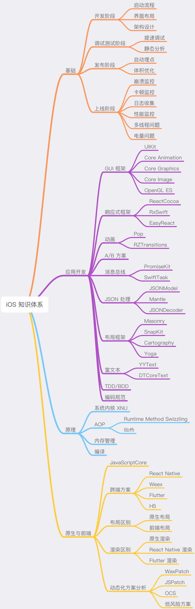
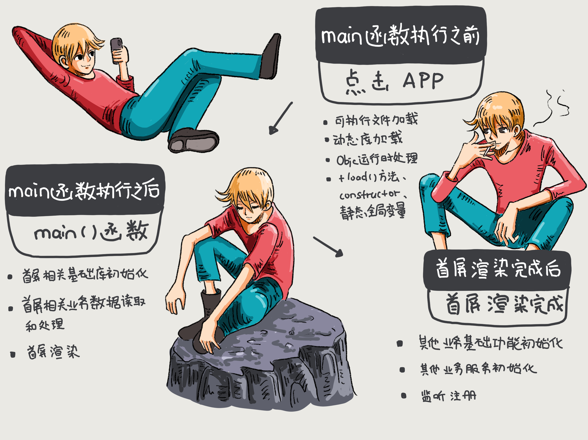
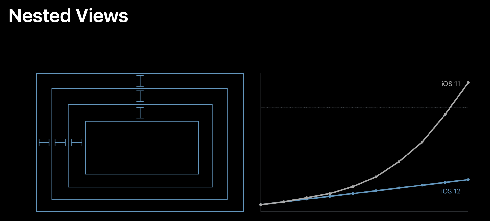
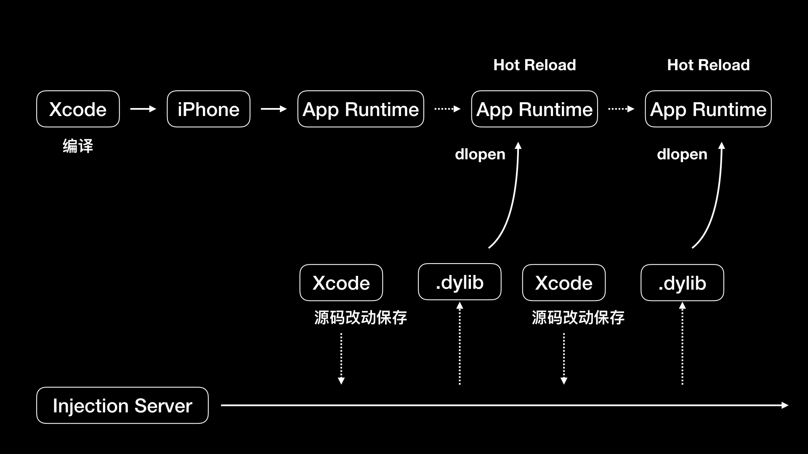
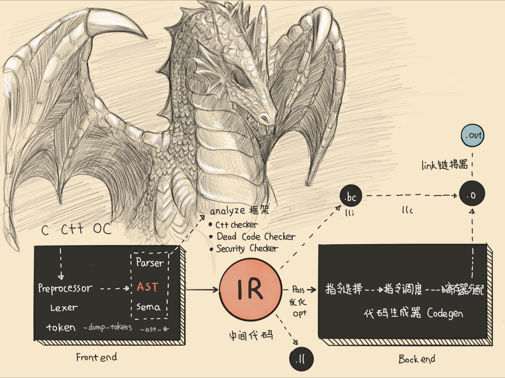
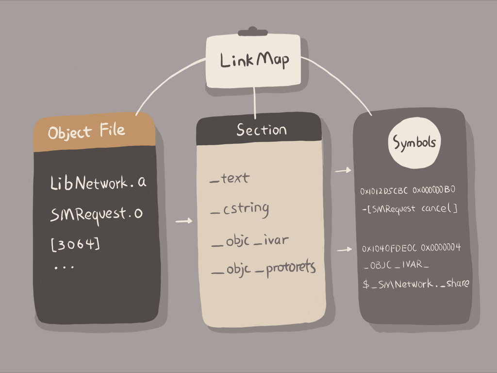
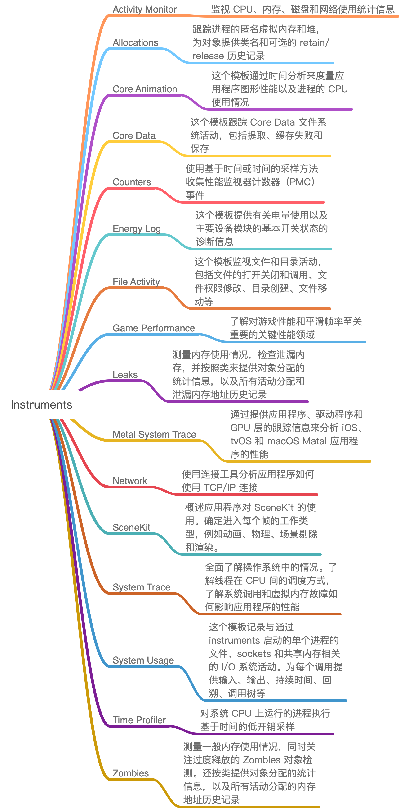
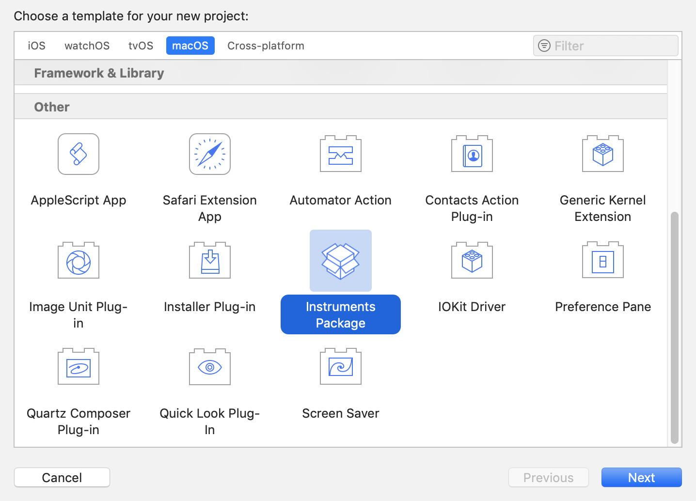
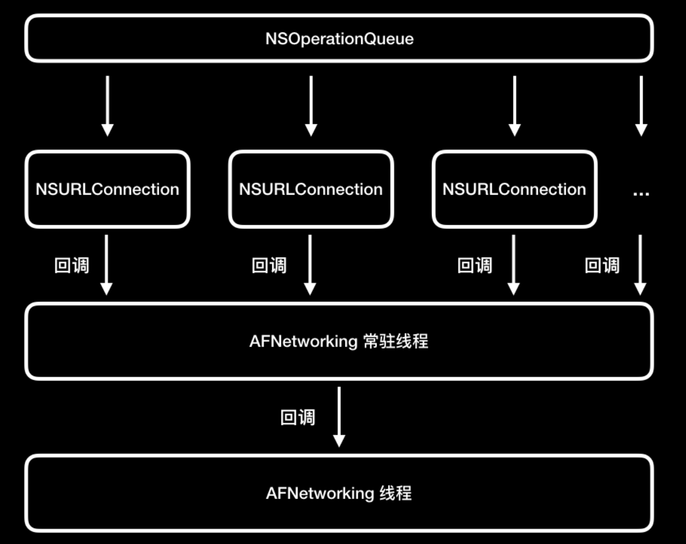

**未完成：2、8**


[TOC]

# 1.建立你自己的iOS开发知识体系

谈到学习，互联网时代学习资料是非常完备的。比如github上的Awesome系列。[iOS的Awesome](https://github.com/vsouza/awesome-ios)系列包括了iOS开发领域各个方面的资料。

**学习iOS开发这件事，不要一开始就求多，而要求精、求深。因为条条大路通罗马，计算机的细分领域虽然多，但学到底层都是一样的。**不要被新技术牵着鼻子走，而是要努力提升自己的内功，这样才能得心应手的应对层出不穷的新技术。

本课程会全面介绍iOS开发知识体系，包括了基础、原理、应用开发、原生与前端四大模块。

* 基础模块，让你具备基本的发现并解决开发问题的能力。
* 应用开发模块，指导应用开发。
* 好的知识体系要能够应对未来的变革，也就是需要打好底子掌握原理、理清规律看清方向。所以，**原理模块**的作用就是帮你掌握原理和理清规律。
* 原生与前端模块会帮助你看清楚方向。



# 2.App启动速度怎么做优化和监控

## 2.1 App启动时候都干了那些事？

一般情况下，App启动分为冷启动和热启动。

* 冷启动：App点击启动前，进程不在系统中，需要系统新创建一个进程分配给它启动的情况。这是一次完成的启动过程。
* 热启动：App冷启动后将App退到后台，App的进程还在系统的情况下，用户重新启动进入App的过程。

用户能够感知的启动慢，其实都发生在主线程上。而主线程慢的原因有很多，比如执行了大文件读写操作、渲染周期中执行大量计算等。

一般App启动时间可以分为三个阶段：

**main函数之前**

1. 加载可执行文件（App的.o文件的集合）；
2. 加载动态链接库，进行rebase指针调整和bind符号绑定；
3. objc运行时的初始处理：objc相关类的注册、category注册、selector唯一性检查等；
4. 初始化：load方法、attribute((constructor))修饰的函数的调用、创建c++静态全局变量。

相应的，这个阶段我们可以做的事情有：

1. 减少动态库加载。苹果建议使用更少的动态库，并且冬天库数量较多时候，尽量将多个动态库进行合并。
2. 减少加载启动后不会去使用的类和方法。
3. load方法内容可以放在首屏渲染完毕后再去执行。一个load方法中进行运行时方法替换会带来4ms的消耗。积少成多，这可能会严重影响启动速度。
4. 控制c++全局变量的数量。

**main函数之后**

main函数执行后阶段指，从main函数执行开始，到appDelegate的didFinishLaunchingWithOptions方法里首屏渲染相关方法执行完成。

首页的业务代码都是这个阶段执行的，也就是首屏渲染前执行的。主要包括：首屏初始化所需配置文件的读写操作、首屏列表大数据的读取、首屏渲染的大量计算等。

很多时候，开发者会把各种初始化工作都放在这个阶段，导致渲染完成滞后。更好的方法是 **从功能上梳理出哪些是首屏渲染必要的初始化功能，哪些是App启动必要的初始化功能，而哪些是只需要再对应功能开始使用才需要初始化的。**然后将初始化功能放在合适的阶段进行。

**首屏渲染完成后**

首屏渲染后的这个阶段，主要完成的是，非首屏其它业务服务模块的初始化、监听的注册、配置文件的读取等。从函数上看，这个阶段就是截止到`didFinishLaunchingWithOptions`方法作用于内执行首屏渲染之后的所有方法执行完成。这个阶段就是从渲染完成时开始，到`didFinishLaunchingWithOptions`方法作用于结束。

这个阶段用户已经能够看到App首页信息了，所以优化的优先级排在最后。但是那些会卡住主线程的方法还是需要最优先处理的，不然会影响到用户后面的交互操作。

## 2.2 功能级别的启动优化

功能级别的启动优化，就是从main()函数执行后的这个阶段下手。

优化的思路：main()函数开始执行后到首屏渲染完成前只处理首屏相关的业务，其它非首屏业务的初始化、监听注册、配置文件读取都放到首屏渲染完成后去做。如下图所示：



## 2.3 方法级别的启动优化


## 2.4 如何做一个方法级别启动耗时检查工具来辅助分析和监控


# 3.Auto Layout是怎么进行自动布局的，性能如何？

## 3.1 来历

早在1997年，Auto Layout用到的算法`Cassowary`被发明出来。2011年苹果将Cassowary算法应用到了自家的布局引擎AutoLayout中。

**Cassowary能够有效的解析线性等式系统和线性不等式系统，用来表示用户界面那些相等关系和不等关系。**基于此可以通过约束来描述视图间的关系，约束就是规则，这个规则能够表示出一个视图相对于另一个视图的位置。

## 3.2 生命周期

AutoLayout不仅仅是布局算法cassowary，还包含了布局在运行时的生命周期等一套布局引擎系统，用来统一管理布局的创建、更新、销毁。**这一套布局引擎系统叫做Layout Engine**，是AutoLayout的核心，主导着整个界面布局。

每个视图在得到自己的布局之前，LayoutEngine会将视图、约束、优先级、固定大小通过计算转换成最终的大小和位置。在LayoutEngine中，每当约束发生变化，就会触发`Deffered Layout Pass`，完成后进入监听约束变化状态。

> **约束原理：**当LayoutEngine监听到视图约束发生变化时候会重新计算布局，获取到布局后调用`superview.setNeedLayout()`，然后进入Deffered Layout Pass做约束的容错处理、从上到下调用layoutSubviews()来确定视图各个子视图的位置、将subview的frame从LayoutEngine中拷贝出来。

## 3.3 性能问题



上图是WWDC2018中苹果官方讲到的AotuLayout在iOS12中优化后的表现。可以看到，优化后的心梗，已经基本和手写布局一样可以达到性能随着视图乔涛数量呈线性增长了。

总的来说， **iOS12的AutoLayout更多的利用了cassowary算法的界面更新策略，使其真正完成了高效的界面线性策略计算。**

使用 Auto Layout 一定要注意多使用 Compression Resistance Priority 和 Hugging Priority，利用优先级的设置，让布局更加灵活，代码更少，更易于维护。

## 3.4 课后扩展

1.**关于UI布局，到底是使用frame还是使用AutoLayout？**复杂的视图关系直接使用frame，简单的视图关系使用AutoLayout。

2.**Auto Layout拥有一套Layout Engine引擎，由它来主导页面的布局。**App启动后，主线程的Run Loop会一直处于监听状态，当约束发生变化后会触发Deffered Layout Pass（延迟布局传递），在里面做容错处理（约束丢失等情况）并把view标识为dirty状态，然后Run Loop再次进入监听阶段。当下一次刷新屏幕动作来临（或者是调用layoutIfNeeded）时，Layout Engine 会从上到下调用 layoutSubviews() ，通过 Cassowary算法计算各个子视图的位置，算出来后将子视图的frame从Layout Engine拷贝出来，接下来的过程就跟手写frame是一样的了。

3.**关于自动布局下怎么做动画。**因为布局约束是脱离frame这种表达方式的，可是动画是需要根据这个来执行的，这里会有些矛盾。不过**根据布局约束的原理，在某个时刻约束也是会被还原成frame使视图显示，这个时刻可以通过layoutIfNeeded这个方法进行控制**。具体代码如下所示：

```objective-c
[aniView mas_makeConstraints:^(MASConstraintMaker *make) {
    make.top.bottom.left.right.equalTo(self.view).offset(10);
}];

[aniView mas_updateConstraints:^(MASConstraintMaker *make) {
    make.top.equalTo(self.view).offset(30);
}];
[UIView animateWithDuration:3 animations:^{
    [self.view layoutIfNeeded];
}];
```

4.**HuggingPriority和CompressionResistance。** 请参考 https://www.cnblogs.com/dev-walden/p/10833309.html 

#4.项目大了人员多了，架构该怎么设计？

当业务需求量和团队规模达到一定程度后，任何一款App都需要考虑架构设计的合理性。而谈到架构治理，就需要将老业务、老代码按照新的架构设计模式进行重构。所以，架构重构考虑的越晚，重构起来就越困难。

总的来说，架构是需要演进的。如果项目规模大了还不演进，必然会拖累业务的发展速度。

在简单架构向大型项目架构演进中，需要解决三个问题：**模块粒度如何划分？如何分层？多团队如何协作？**

## 4.1 模块粒度如何划分

1. 首先，模块规模变大之后，模块划分必须遵循一定的原则。如果划分不规范、不清晰，就会导致代码耦合严重的问题，并加大架构重构的难度。
2. 其次，要搞清楚模块的粒度采用什么标准进行划分，也就是要遵循的原则是什么。对于UIS这种面向对象编程的开发模式来说，主要有五个SOLD：单一职责原则、开闭原则、里氏替换原则、接口隔离原则、依赖倒转原则。
3. 最后要选择合适的粒度。过大和过小的粒度都是不合适的。

其中，组件可以认为是可组装的，独立的业务单元，具有高内聚、低耦合的特性，是一种比较适中的粒度。就像用乐高拼房子一样，每个对象就是一块小积木。一个组件就是由一块一块的小积木组成的单一功能的组合。

## 4.2 项目架构分层

组件分层并不是说要求每个组件间都没有耦合，组件间也需要上下层依赖关系。组件间的上下层关系划分清楚了，就会容易维护和管理。而对于组件分层这个问题，最多不要超过三层：

1. 底层可以是与业务无关的基础组件，如网络、存储等
2. 中间一般是通用的业务组件，比如账号、埋点、支付、购物车等。
3. 最上层是迭代业务组件，更新频率比较高。

需要注意的是，不必将所有功能够剁成组件，只有那些会被多个业务或者团队使用的功能模块才需要做成组件。因为改造组件也是需要时间成本的。

## 4.3 团队分工

在代码层面上，通过组件化可以解决大项目、多人、多团队架构的问题。但是为了能够让产品快速迭代和稳定发展，也需要一个合理的团队结构，一个合理的团队结构应该是这样的：

1. 首先需要一个专门的基建团队。负责业务无关的基础功能组件和业务相关通用业务组件的开发。
2. 然后每个业务都有一个专门的团队来负责开发。业务可以按照耦合度来划分，耦合度高的可以划分成单独的业务团队。
3. 基建团队人员应该是流动的。从业务团队来，到业务团队去。这样设计是因为业务团队和基建团队边界不应该非常明显，否则会出现基建团队埋头苦干，结果可能做得不够、过多、功能不好用等问题，造成资源浪费。

总结来讲，我想说的是团队分工要灵活，不要把人员隔离固化了，否则各干各的，做的东西相互都不用。核心上，团队分工还是要围绕着具体业务进行功能模块提炼，去解决重复建设的问题，在这个基础上把提炼出的模块做精做扎实。否则，拉一帮子人臆想出来的东西，无人问津，那就是把自己架空了。

更多案例，可以参考原文：https://time.geekbang.org/column/article/86522

# 5.链接器：符号是怎么绑定到地址上的

链接器最主要的功能是将符号绑定到地址上。

**更多关于编译链接和符号绑定请参考《程序员的自我修养》和LLVM原理总结。**

## 5.1 iOS开发为什么使用编译器

ios编写的代码是先使用编译器把代码编译成机器码，然后直接在CPU上执行机器码的。之所以不适用解释器来执行代码，是因为苹果公司希望iPhone的执行效率更高、运行速度能达到最快。

实际上，编译器和解释器各有各的优点，也各有各的缺点：

* 采用编译器生成机器码执行效率高。但是调试周期长；
* 解释器执行好处是编写调试方便，但是执行效率低。

苹果公司使用的编译器是LLVM，它比xcode5版本之前使用的GCC，便以速度提高了三倍。同时，苹果公司也反过来主导了LLVM的发展，让LLVM可以针对苹果公司的硬件进行更多的优化。

LLVM编译的几个主要过程：

1. 首先，你写好代码后，LLVM会预处理你的代码，比如把宏定义嵌入到对应的位置。
2. 预处理完毕后，LLVM会对代码进行词法分析和语法分析，生成AST。AST是抽象语法树，结构上比代码更精简，遍历起来更快，所以使用AST能够更快速的进行静态检查，同时能更快的生成IR。
3. 最后AST生成IR，IR是一种更接近机器码的语言，区别在于和平台无关性，通过IR可以生成多份适合不同平台的机器码。对于iOS系统，IR生成的可执行文件就是Mach-O。

## 5.2 编译时连接器做了什么

Mach-O文件中的内容，主要就是代码和数据：代码是函数的定义，数据是全局变量的定义，包括全局变量的初始值。不管是代码还是数据，他们的实例都需要由符号将其关联起来。

连接器的作用就是完成变量、函数符号和其它地址绑定这样的任务。而这里我们所说的符号，就可以理解为变量名和函数名。

连接器主要做的事情：

1. 去项目文件中查找目标代码文件中没有定义的变量。
2. 扫描项目的不同文件，将所有符号定义和引用地址搜集起来，并放到全局符号中。
3. 计算合并后的长度以及位置，生成同类型的段进行合并，建立绑定。
4. 对项目中不同文件里的变量进行地址重定位。

**更详细的内容请参考《程序员的自我修养》**

## 5.3 动态链接库

链接的公用库分为静态库和动态库：惊天库是编译时链接的库，需要链接进你的Mach-O文件，如果需要更新则要重新编译一次，无法动态加载和更新；**而动态库是运行时进行链接的库**，使用dyld就可以实现动态加载。

使用dyld加载动态库，有两种方式：有程序启动加载时绑定和符号第一次被用到时绑定。为了减少启动时间，大部分动态库使用的都是符号第一次被用到时再绑定的方式。

**更详细的内容请参考《程序员的自我修养》**

# 6.App如何通过注入动态库方式实现急速编译调试

## 6.1 Flutter Hot Reload原理

fultter在点击reload时会去查看上次编译以后改动过的代码，重新编译涉及到的代码库，还包括主库，以及主库的关联库。所有这些重新编译过的库都会转换成内核文件发到Dart VM里，Dart VM会重新架子啊新的内核文件，加载后让flutter framework触发所有的Widgets和Render Objects进行重建、重布局、重绘。

Flutter为了能够支持跨平台开发，使用自研的Dart语言配合在App内集成Dart VM的方式运行Flutter程序。

## 6.2 Infection for Xcode原理

John Holdsworth开发了一个叫做**Injection**的工具可以动态的将Swift或Objective-C的diamante在已运行的程序中执行，以加快调试速度，同时保证程序不用重启。作者已经开源了这个工具：https://github.com/johnno1962/InjectionIII

Injection会监听源代码文件的变化，如果文件被改动了，Injection Server就会执行rebuildClass重新进行编译、打包成动态库，也就是dyld文件。编译打包成动态库后使用writeString方法通过Socket通知运行的App。



**更多信息请参考：Infection原理以及实践。**

# 7.Clang、Infer、OCLint，我们该使用谁来做静态分析？

一款优秀的静态分析器，能够帮助我们更加全面的发现人工测试中的盲点，同时还可以检查代码规范和代码可维护性的问题，根据一些指标就能找出哪些代码需要优化。

## 7.1 OCLint

OCLint主要用来发现编译器检查不到的那些潜在关键技术问题。OCLint目前包含了近百种规则，这些规则基本覆盖了具有通用性的规则，主要包括语法上的基础规则、cocoa库相关规定、一些约定俗成的规则、各种空语句检查、是否按新语法改写的检查、命名上长变量名短变量名检查、无用的语句变量和参数的检查。

除此之外，还包括代码量大小是否合理相关的规则，比如过大的类、类中方法是否太多、参数是否太多、Block嵌套是否太深、方法中代码是否过多、圈复杂度的检查等。

对于OCLint的安装你可以使用HomebrewKauai安装，

## 7.2 SwiftLint

SwiftLint是一个用于强制检查Swift代码风格和规定的一个工具，基本上以 [GitHub's Swift 代码风格指南](https://github.com/github/swift-style-guide)为基础。SwiftLint Hook 了 [Clang](http://clang.llvm.org/) 和 [SourceKit](http://www.jpsim.com/uncovering-sourcekit) 从而能够使用 [AST](http://clang.llvm.org/docs/IntroductionToTheClangAST.html) 来表示源代码文件的更多精确结果。

## 7.3 Clang静态分析器

Clang静态分析器是一个用C++开发的，用来分析C、C++、Objective-C的开源工具，是Clang项目的一部分，构建在Clang和LLVM之上。Clang静态分析器的分析引擎用的就是Clang的库。

<strong>在 Clang 静态分析器中，常用的就是 scan-build 和 scan-view 这两个工具。</strong>

## 7.4 Infer

Infer是Facebook开源的，使用OCaml语言编写的静态分析工具，可以对C、Java和Objective-c代码进行静态分析，解压检查出空指针访问、资源泄露以及内存泄露。

## 小结

综合分析，以上几种工具都是基于Clang库开发的。其中OCLint检查规则多、定制性强，能够发现很多潜在问题。但是缺点是检查规则太多，反而容易找不到重点；可定制性过高，导致易用性变差。

Infer效率高，支持增量分析，可小范围分析。可定制性不算最强，属于中等。

综上所述，Infer在准确性、性能效率、规则、扩展性。易用性整体上把握做的最好。但是 **Infer不支持swift代码分析**。

swift项目的话，推荐使用SwiftLint进行静态分析。

# 8.如何利用Clang为App提质

## 8.1 什么是Clang

iOS开发完整编译流程图



如上图所示，左侧黑色部分就是Clang。Clang是C、C++、Objective-C的编译器前段，而swift有自己的编译器前段，也就是swift前段多出来的SIL optimizer。

Clang的优势简介（详细信息请参考[戴铭前辈的文章](https://time.geekbang.org/column/article/87844#previewimg)):

1. Clang的编译速度非常快，对内存使用率也非常低，并且兼容GCC；
2. 对于代码诊断，Clang也非常强大，Xcode也是用的Clang。Clang编译前段可以精确地显示出问题所在的行和具体位置，并且可以确切的说明出现这个问题的原因，并且指出错误类型是什么，使得我们可以快速掌握问题的细节。
3. Clang对typedef的保留和展开也处理的非常好。
4. Fix-it也是Clang提供的一种快捷修复源码问题的方式。
5. Clang的架构是模块化的。除了代码静态分析外，利用其输出的接口还可以开发用于代码转义、代码生成、代码重构的工具，方便与IDE进行集成。

## 8.2 Clang做了哪些事


## 8.3 Clang提供了什么能力


什么是Clang

Clang做了哪些事

Clang提供了什么能力

# 9.无侵入的埋点方案如何实现

在iOS开发中，埋点可以解决两类问题：首先可以了解用户使用App的行为；其次可以降低分析线上问题的难度。ios中的埋点方案可以分为：代码埋点、可视化埋点、无痕埋点这三种。

1. 代码埋点：手写代码方式进行埋点，可以很精确的在需要埋点的代码处加上埋点代码，可以方便的记录当前环境得代码量，方便调试，并跟踪埋点内容。但是开发工作量大，并且埋点代码到处都是，后期难以维护。
2. 可视化埋点：将埋点增加和修改的工作可视化了，提升了增加和维护埋点的体验。
3. 无埋点：更确切的说是全埋点，而且埋点代码不会出现在业务代码中，容易管理和维护。缺点是埋点成本高，后期的解析也比较复杂。这种方案并不适合所有的埋点需求，但对于大量通用的埋点需求来说，能够节省大量的开发和维护成本。

**接下来主要分析无侵入埋点方案的实现问题。**

## 9.1 运行时方法替换方式进行埋点

首先你可以实现一个方法专门用来实现运行时方法替换，因为有很多地方都需用方法替换这种方法hook特定的方法。

对于页面进入次数、页面停留时间都需要对UIViewController生命周期进行埋点，你可以创建一个UIViewController的分类来hook所有的关于UIViewController生命周期的方法，**在hook的方法中进行进入次数和页面停留时间的埋点**。

**对于点击事件，我们也可以通过运行时方法替换的方式进行无侵入埋点。**这里最主要的工作是，找到这个点击事件的方法 `sendAction:to:forEvent:`，然后在 +load() 方法使用 SMHook 替换成为你定义的方法。完整代码实现如下：

```
+ (void)load {
    static dispatch_once_t onceToken;
    dispatch_once(&onceToken, ^{
        // 通过 @selector 获得被替换和替换方法的 SEL，作为 SMHook:hookClass:fromeSelector:toSelector 的参数传入
        SEL fromSelector = @selector(sendAction:to:forEvent:);
        SEL toSelector = @selector(hook_sendAction:to:forEvent:);
        [SMHook hookClass:self fromSelector:fromSelector toSelector:toSelector];
    });
}

- (void)hook_sendAction:(SEL)action to:(id)target forEvent:(UIEvent *)event {
    [self insertToSendAction:action to:target forEvent:event];
    [self hook_sendAction:action to:target forEvent:event];
}
- (void)insertToSendAction:(SEL)action to:(id)target forEvent:(UIEvent *)event {
    // 日志记录
    if ([[[event allTouches] anyObject] phase] == UITouchPhaseEnded) {
        NSString *actionString = NSStringFromSelector(action);
        NSString *targetName = NSStringFromClass([target class]);
        [[[SMLogger create] message:[NSString stringWithFormat:@"%@ %@",targetName,actionString]] save];
    }
}
```

UIButton在一个试图类中可能有多个不同的继承类，相同的UIButton子类也需要区分开。所以我们需要通过选`择器名字+视图类名`组合起来形成唯一标识，来进行埋点记录。

Cococa框架中其它控件也可以使用这种方法来进行无侵入埋点。

## 9.2 事件唯一标识

通过运行时hookObjective-C方法的方式，能够帮助我们解决绝大部分的埋点问题。但是这种方式精确度不够高，那么应该怎么制定出这个埋点事件的唯一标识呢？

1. 可以通过从window到具体视图的view-path来确定。
2. 对于同一view上两个相同view视图的情况：
   * 通过视图在父视图中的索引来确定`subviews[index]`。
   * 如果是UITableViewCell，可以通过IndexPath来确定。
   * UIAlertController可以通过Alert视图内容来确定。

除了上述方法，其它情况我们要尽可能找出不同view所具有的不同特征来确定不同的视图。

## 9.3 小结

**运行时替换方法进行无侵入埋点的方案，由于唯一标识难以维护和准确性难以保证的原因，很难被采用，一般都只是用于一些功能和视图未定的地方，手动侵入式埋点依然占据大部分的场景。**

使用 Clang AST 的接口，在构建时遍历 AST，通过定义的规则将所需要的埋点代码直接加进去，可能会更加合适。这时，我们可以使用前一篇文章“如何利用 Clang 为 App 提质？”中提到的 LibTooling 来开发一个独立的工具，专门以静态方式插入埋点代码。这样做，既可以享受到手动埋点的精确性，还能够享受到无侵入埋点方式的统一维护、开发解耦、易维护的优势。

# 10.包大小：如何从资源和代码层面实现全方位瘦身

**更多内容请参考：知识小集-性能优化里面的安装包瘦身内容。**

App Store规定了安装包大小超过150MB的APP不能通过OTA(ovew the air)环境下载，也就是只能在WiFi环境下下载。所以150MB就成了App的生死线，一旦超过则可能失去大量的用户。

## 10.1 官方App Thinning

详情请参考：知识小集-性能优化。

## 10.2 无用图片资源

对于无用图片资源可以分为无用资源删除和图片资源压缩。

我们也可以通过转码将png转换成webp格式，进行图片的压缩。我们可以使用google的图片压缩工具 **cwebp**来将其他图片转成 WebP，也可以使用腾讯公司开发的**iSparta**来进行转换，iSparta是一个GUI工具，操作比较方便，可以实现PNG格式转WebP，同时提供批量处理和记录操作配置的功能。

对于webp格式的解析，我们可以使用 **libwebp**进行解析。不过webp在cpu消耗和解码时间上会比png高两倍。所以，我们有时候需要在性能和体积上做取舍。

我的建议是，**如果图片大小超过了 100KB，你可以考虑使用 WebP；而小于 100KB 时，你可以使用网页工具 TinyPng或者 GUI 工具ImageOptim进行图片压缩。**这两个工具的压缩率没有 WebP 那么高，不会改变图片压缩方式，所以解析时对性能损耗也不会增加。

## 10.3 代码瘦身

对可执行文件的瘦身就是找到并删除无用代码的过程。思路：**找到方法和类的全集；然后找到使用过的方法和类；取两者的差集得到无用代码；人工确认无用代码可删除后进行删除操作。**

**LinkMap结合Mach-O找出无用代码**

通过分析LinkMap可以获得所有的代码类和方法的信息。

LinkMap文件分为三部分：Object File、Section和Symbols，如下所示：



* Object File：包含了代码工程的所有文件。
* Section：描述代码段在生成的Mach-O里的偏移位置和大小。
* Symbols：列出每个方法、类、block，以及他们的大小。

通过LinkMap不仅可以统计出所有的方法和类，还能清晰的看到代码所占包大小的具体分布，进而有针对性的进行代码优化。

得到代码全集信息后，我们还需要找到已使用的方法和类，这样才能够获取到差集，找到无用代码。

iOS 的方法都会通过 objc_msgSend 来调用。而，objc_msgSend 在 Mach-O 文件里是通过 __objc_selrefs 这个 section 来获取 selector 这个参数的。

所以，\__objc_selrefs 里的方法一定是被调用了的。\_\_objc_classrefs 里是被调用过的类，\_\_objc_superrefs 是调用过 super 的类。通过 \_\_objc_classrefs 和 __objc_superrefs，我们就可以找出使用过的类和子类。

我们可以使用IDE或者Mach-OView来查看mach-O文件，并查看里面的内容。（我觉得通过代码也是可以解析分析的）

**通过AppCode找出无用代码**

**如果工程量不是很大的话，建议直接使用AppCode来做分析**。代码量达到百万时候，AppCode就歇菜了。这时候你需要通过Clang惊天分析来开发工具，去检查无用方法和类。

用 AppCode 做分析的方法很简单，直接在 AppCode 里选择 `Code-Inspect Code` 就可以进行静态分析。静态分析完毕后，就可以再`Unused code`里面看到无用代码。

# 11.热点问题答疑一：基础模块问题答疑

这篇博客，与其说是问题答疑，还不如说是知识点实践导览。

## 11.1 动态库加载方式的相关问题

**关于动态库是否参与链接的问题。**

实际上，动态库加载方式有两种：

1. 一种是，在程序开始运行时通过dyld动态加载。通过dyld加载的动态库是需要在编译时进行链接的，链接时会做标记，绑定的地址在加载后再确定。
2. 第二种是，显式的运行时链接，即在运行时通过动态连接器提供的API dlopen和dlsym来加载。这种方式，在编译时是不需要参与链接的。不过通过这种运行时加载远程动态库的App，苹果公司是不允许上线AppStore的，所以只能用于线下调试环节。

针对使用InjectionIII进行调试遇到的问题，**更重要的是能够了解InjectionIII的工作原理，从而加深对运行时动态库加载原理的理解。**然后，根据自己的工程情况动手改造或者直接造个新轮子，这会极大的提升你的技术水平，至少比直接使用现有轮子效果要好很多。

> 动手就会遇到问题，就会思考，这个主动过程会加深你的记忆，这样后面再碰到问题时，你就会更容易将相关知识串联起来，，形成创新式的思考。

关于App开始启动到main函数之间dyld内部细节，推荐看苹果的WWDC 2016 Session 406 [Optimizing App Startup Time](https://developer.apple.com/videos/play/wwdc2016/406/)。除此之外这个博客也是必看的：<a href="https://blog.automatic.com/how-we-cut-our-ios-apps-launch-time-in-half-with-this-one-cool-trick-7aca2011e2ea">How we cut our iOS app’s launch time in half (with this one cool trick)</a>

## 11.2 关于启动速度的相关问题

动手实现一个方法耗时检测工具。

大体上的实现原理是：**定时抓取主线程上方法调用堆栈，计算一段时间里各个方法的耗时。**

**首先需要开启一个定时器，来定时获取方法调用堆栈。一段时间内方法调用堆栈相同，那么这段时间，就是这个方法调用堆栈的栈顶方法耗时。**

这个很关键的一步是，应该怎么做好获取方法调用堆栈。

<p>callstackSymbols 是一种获取方法调用栈的方法，但是只能获取当前线程的调用栈，为了把对主线程的影响降到最小，获取当前线程调用栈的工作就需要在其他线程去做。所以，<strong>这个解题思路就需要换成：</strong>使用系统提供的 task_threads 去获取所有线程，使用 thread_info 得到各个线程的详细信息，使用 thread_get_state 方法去获取线程栈里的所有栈指针。</p>
如果接下来立刻进行符号化获取方法名，那么久需要去__LINKEDIT segment里查找栈指针地址所对应符号表的符号，特别是当你设置时间间隔较小时候，符号化过程会持续消耗较多的CPU资源，从而影响主线程。所以获取到栈指针后，我们可以不用立刻做符号化，而是先使用一个结构体将栈地址记录下来，最后再统一符号化，将对主线程的影响降到最低，这样获取到的数据也会更加准确。

## 11.3 关于汇编代码的学习

汇编并不是必学的技能，我们日常业务开发中很少会用到。而且现代编译器堆高级语言已经做得非常好了，手写汇编代码性能不一定更好。如果工作不涉及逆向和安全领域，能够看懂汇编就够了。

但是杜宇逆向和安全领域来说，掌握汇编技能还是非常必要的。**如果想学习汇编语言，同样需要动手去编写和调试代码，使用Xcode工具也没问题。开始学习时候，恶意按照教程边学边练，其实和学习其他编程语言一样。**

<p>而具体到 objc_msgSend 源码的剖析，你可以参考 Mike Ash 的 “<a href="https://www.mikeash.com/pyblog/friday-qa-2017-06-30-dissecting-objc_msgsend-on-arm64.html">Dissecting objc_msgSend on ARM64</a>”这篇博客，详细讲述了 objc_msgSend 的 ARM64 汇编代码。等你看完这篇博客以后，再来看我们这篇文章中的汇编代码就一定会觉得轻松很多。</p>
## 11.4 关于clang

clang的只是是需要投入大量精力才能掌握好的。那么有什么用处呢？实际上，**只有你掌握了某个方面的知识，在工作中碰到问题后才能想到用这个知识去解决问题。如果你都不知道有这么一个方法，又如何会用它解决自己的问题呢？**

学习使用Clang的LibTooling开发工具，分析AST，插入代码方式实现无侵入埋点方案；通过Clang静态分析来开发工具，检查无用的方法和类。

# 12.iOS崩溃千奇百怪，如何全面监控

App上线后，是很脆弱的，导致崩溃的问题有很多，不仅仅是编写代码的各种小马虎，还包括哪些被系统强杀的疑难杂症。

常见的应用崩溃有：

* 数组越界。取数据索引越界或者给数组添加了nil会导致崩溃。
* 多线程问题。子线程更新UI会导致崩溃；多线程进行数据操作会崩溃。
* 主线程无响应。就是常说的看门狗问题，如果主线程超过系统规定的时间无响应，就会被看门狗干掉。
* 野指针。指针指向一个已删除对象范文内存区域时候，会发生野指针崩溃。

崩溃率等技术指标都是通过崩溃监控系统来搜集的。同时，崩溃监控系统收集到的堆栈信息，也为将解决崩溃问题提供了最重要的信息。但是崩溃信息的收集并没有那么简单。**有的崩溃日志可以通过信号捕获得到，而很多崩溃日志却是通过信号捕获不到的。**

**KVO 问题、NSNotification 线程问题、数组越界、野指针等崩溃信息，是可以通过信号捕获的。但是，像后台任务超时、内存被打爆、主线程卡顿超阈值等信息，是无法通过信号捕捉到的。**

## 12.1 信号可捕获的崩溃日志收集

苹果有提供崩溃日志收集服务，但是查看日志操作每次都是纯手工方式，而且时效性很差。所以很多公司的崩溃日志监控系统，都是通过`PLCrashReporter`这样的第三方开源库捕获崩溃日志，然后上传到自己服务器上进行整体监控的。而没有服务端开发能力，或者对数据不敏感的公司，则会直接使用 <a href="https://get.fabric.io/">Fabric</a>或者<a href="https://bugly.qq.com/v2/">Bugly</a>来监控崩溃。

在崩溃日志中，通常有如下说明：`Exception Type:        EXC_BAD_ACCESS (SIGSEGV)`，这表示EXC_BAD_ACCESS这个异常通过SIGSEGV信号发现有问题的线程。虽然信号的种类有很多，但是都可以通过注册signalHandler来捕获到。代码如下所示：

```
void registerSignalHandler(void) {
    signal(SIGSEGV, handleSignalException);
    signal(SIGFPE, handleSignalException);
    signal(SIGBUS, handleSignalException);
    signal(SIGPIPE, handleSignalException);
    signal(SIGHUP, handleSignalException);
    signal(SIGINT, handleSignalException);
    signal(SIGQUIT, handleSignalException);
    signal(SIGABRT, handleSignalException);
    signal(SIGILL, handleSignalException);
}

void handleSignalException(int signal) {
    NSMutableString *crashString = [[NSMutableString alloc]init];
    void* callstack[128];
    int i, frames = backtrace(callstack, 128);
    char** traceChar = backtrace_symbols(callstack, frames);
    for (i = 0; i <frames; ++i) {
        [crashString appendFormat:@"%s\n", traceChar[i]];
    }
    NSLog(crashString);
}

```

上面这段代码对各种信号都进行了注册，捕获到异常信号后，在处理方法 handleSignalException 里通过 backtrace_symbols 方法就能获取到当前的堆栈信息。堆栈信息可以先保存在本地，下次启动时再上传到崩溃监控服务器就可以了。

## 12.2 信号捕获不到的崩溃信息怎么收集

**Background Task执行时间超过3min，App挂起**

设置计时器，3min时候判断任务是否还在执行，如果还在执行，则判断该程序即将后台崩溃，进行上报、记录，以便达到监控的效果。

**内存打爆或者主线程卡顿**

后面文章进行分析说明

## 12.3 采集到崩溃信息后如何解决崩溃问题

参考知识小集1-性能优化。

# 13.如何利用Runloop原理去监控卡顿

卡顿问题，就是在主线程上无法响应用户交互的问题。导致卡顿的主要原因有：复杂UI、图文混排的绘制量过大；主线程上做网络同步请求；主线程上做大量的IO操作；运算量大CPU持续高占用；死锁和主线程抢锁。

## 13.1 Runloop原理

对于iOS来说，监控卡顿就是要去找到主线程都做了哪些事情。而线程的消息事件是依赖NSRunloop的，所以我们通过监听NSRunloop的状态，就能够发现调用方法是否执行时间过长，从而判断是否出现卡顿。

戴铭推荐的监控卡顿方案：**通过监控Runloop的状态来判断是否会出现卡顿。**


更多关于Runloop原理以及作用的介绍请参考：[Interview Course Note-7.Runloop](./Interview Course Note.md)

ibireme的Runloop详解：https://blog.ibireme.com/2015/05/18/runloop/

## 13.2 如何检查卡顿

要想监听Runloop，首先需要创建一个`CFRunLoopObserverContext`观察者，代码如下：

```objective-c
CFRunLoopObserverContext context = {0,(__bridge void*)self,NULL,NULL};
runLoopObserver = CFRunLoopObserverCreate(kCFAllocatorDefault,kCFRunLoopAllActivities,YES,0,&runLoopObserverCallBack,&context);
```

**将创建好的观察者runLoopObserver添加到主线程Runloop的common模式下，然后创建一个子线程专门用来监控主线程Runloop状态。**

一旦发现进入睡眠前的 kCFRunLoopBeforeSources 状态，或者唤醒后的状态 kCFRunLoopAfterWaiting，在设置的时间阈值内一直没有变化，即可判定为卡顿。接下来，我们就可以 dump 出堆栈的信息，从而进一步分析出具体是哪个方法的执行时间过长。

开启一个子线程监控的代码：

```objective-c
// 创建子线程监控
dispatch_async(dispatch_get_global_queue(0, 0), ^{
    // 子线程开启一个持续的 loop 用来进行监控
    while (YES) {
        long semaphoreWait = dispatch_semaphore_wait(dispatchSemaphore, dispatch_time(DISPATCH_TIME_NOW, 3 * NSEC_PER_SEC));
        if (semaphoreWait != 0) {
            if (!runLoopObserver) {
                timeoutCount = 0;
                dispatchSemaphore = 0;
                runLoopActivity = 0;
                return;
            }
            //BeforeSources 和 AfterWaiting 这两个状态能够检测到是否卡顿
            if (runLoopActivity == kCFRunLoopBeforeSources || runLoopActivity == kCFRunLoopAfterWaiting) {
                // 将堆栈信息上报服务器的代码放到这里
            } //end activity
        }// end semaphore wait
        timeoutCount = 0;
    }// end while
});
```

## 13.3 如何获取卡顿的方法堆栈信息

第一种方法：直接调用系统函数。这种方法性能消耗小，但是只能获取简单的信息，无法配置dsym获取具体是哪行代码除了问题，并且能够获取的信息类型有限。这种方法性能比较好，适用于观察大盘统计卡顿情况，而不是想要找到卡顿原因的场景。

第二种方法：直接用[PLCrashRepoter](https://opensource.plausible.coop/src/projects/PLCR/repos/plcrashreporter/browse)开源库。这种方法能够定位到问题代码的具体位置，而且性能消耗也不大。具体用法：

```objective-c
// 获取数据
NSData *lagData = [[[PLCrashReporter alloc]
                                          initWithConfiguration:[[PLCrashReporterConfig alloc] initWithSignalHandlerType:PLCrashReporterSignalHandlerTypeBSD symbolicationStrategy:PLCrashReporterSymbolicationStrategyAll]] generateLiveReport];
// 转换成 PLCrashReport 对象
PLCrashReport *lagReport = [[PLCrashReport alloc] initWithData:lagData error:NULL];
// 进行字符串格式化处理
NSString *lagReportString = [PLCrashReportTextFormatter stringValueForCrashReport:lagReport withTextFormat:PLCrashReportTextFormatiOS];
// 将字符串上传服务器
NSLog(@"lag happen, detail below: \n %@",lagReportString);
```

# 14.临近OOM，如何获取详细内存分配信息，分析内存问题？

**OOM（Out of Memory）：App占用的内存达到了iOS系统对单个App占用内存上限后，而被系统强杀掉的现象。**

JetSam机制，指的是操作系统为了控制内存资源过度使用而采用的一种资源管控机制。物理内存和CPu对于手机这样的便携设备来说，可谓是稀缺资源。所以说，在iOS系统的虚拟内存管理中，内存压力的管控是一项很重要的内容。

## 14.1 如何计算内存限制阈值

### 通过JetsamEvent日志计算

查看手机中以JetsamEvent开头的系统日志（设置=>隐私=>分析）。在系统日志找，我们需要关注per-process-limit部分的rpages，找到一个App页数的限制。然后找到pageSize字段就是单页的字节数，相乘就是一个App所能占用最大的内存空间。

iOS系统会开启优先级最高的线程`vm_pressure_monitor`来监控系统的内存压力情况，并通过一个堆栈来维护所有App进程。另外iOS系统会维护一个内存快照表，用来保存每个进程的内存页的情况。

当监控系统内存的线程发现某个App内存有压力，就发出通知，内存有压力的App就回去执行对应的代理，通过这个代理，你可以获得最后一个便携逻辑代码释放内存的机会。这段代码执行后，就有可能会避免你的App被系统强杀。

系统在强杀App前会做优先级判断。iOS系统内核里有一个数组，专门用于维护线程的优先级。这个优先级规定是：**内核线程优先级最高，操作系统的优先级其次，App优先级排在最后。并且，前台App程序的优先级高于后台运行的App，线程私用优先级时，CPU占用多的线程的优先级会被降低。**

### 通过XNU获取内存限制值

在XNU中，有专门用于获取内存上限值的函数和宏。我们可以通过memorystatus_priority_entry这个结构体，得到进程的优先级和内存限制值。结构体代码如下所示:

```c
//其中priority表示进程的优先级，limit就是我们想要的进程内存限制值。
typedef struct memorystatus_priority_entry {
	pid_t pid;
	int32_t priority;
	uint64_t user_data;
	int32_t limit;
	uint32_t state;
} memorystatus_priority_entry_t;
```

**需要注意，使用XNU这种方法需要手机又root权限。**

### 通过内存警告获取内存限制值

通过`didReceiveMemoryWarning`也是可以获取到内存限制值的。

iOS系统在强杀掉App之前还有6s的时间，足够你去获取记录内存信息了。

iOS系统提供了一个函数task_info，可以帮助我们获取到当前任务信息。

```c
struct mach_task_basic_info info;
mach_msg_type_number_t size = sizeof(info);
kern_return_t kl = task_info(mach_task_self(), MACH_TASK_BASIC_INFO, (task_info_t)&info, &size);
//resident_size表示使用了多少内存。
float used_mem = info.resident_size;
NSLog(@" 使用了 %f MB 内存 ", used_mem / 1024.0f / 1024.0f)
```

## 14.2 定位内存问题信息收集

要想精确的定位问题，就需要dump出完整的内存信息，包括所有对象以及其内存占用值，在内存接近上限值的时候，收集并记录下所需信息，并在合适的时机上报到服务器。

**更多信息请参考《iOS开发高手课》第14章节。**


更多关于内存监控可以参考腾讯出品的[OOMDetector](https://github.com/Tencent/OOMDetector).

# 15.日志监控：怎么获取App中的全量日志

本篇文章，主要介绍了NSLog和CocoaLumberjack日志的获取方法。这两种方法基本覆盖了大部分的场景，在使用其他日志库的时候，只需要找到日志存储的目录，就可以进行日志的收集工作了。

收集全量日志，可以提高分析和解决问题的效率，节省下来的时间我们可以去做更有意义的事情。

获取NSLog日志的方法主要有三个：

1. 使用官方提供的ASL来获取。
2. 使用fishhook来hook住NSLog方法来获取。
3. 使用dup2函数和STDERR句柄来获取。

**更详细信息可以参考《iOS开发高手课》第15章节。**

# 16.性能监控：衡量App质量的那把尺

为了能够主动、高效得发现性能问题，避免App质量进入无人监管的失控状态，我们需要对App性能记性监控。本篇对App性能监控，主要从线下和线上两个维度展开。

## 16.1 线下性能监控

对于线下性能监控，苹果公司的Instruments是首选的工具。它功能非常强大，比如Energy Log专门用来监控耗电量，Leaks专门用来监控内存泄漏，Network专门检查网络情况，Time Profile通过时间采样来分析卡顿问题。

Instruments的各种性能检测工具，如下图所示：




**从整体架构上看，Instruments包括Standard UI和Analysis Core两个组件，它的所有工具都是基于这两个组件开发的，而且，如果要开发自定义的性能分析工具的话，完全可以基于这两个组件来实现。**

### 开发自定义Instruments工具

我们可以使用Xcode开发自定义的Instruments工具。Xcode -> New -> Project -> macOS -> Instruments Package。如下图所示：



在新创建的工程里面有一个.instrpkg文件，接下来的开发过程主要就是对这个文件的配置工作了。这些配置工作主要是完成Stardard UI和Analysis Code的配置。同时苹果公司还提供了大量的代码片段，帮助你进行个性化的配置。你可以[点击这个连接](https://help.apple.com/instruments/developer/mac/current/)，查看官方指南中的详细教程。

如果你想更好的进行个性化定制，就需要了解Instruments收集和处理数据的机制，也就是分析核心的工作原理。

Analysis Core收集和处理数据的过程，可以分为三步：

1. 处理我们配置好的各种数据表，并申请存储空间store。
2. store去找数据提供者，如果不嫩直接找到，就通过Modeler接收其它store的输入信号进行合成。
3. store获得数据源后，会进行Binding Solution工作来优化数据处理过程。

这里需要强调的是，在我们通过 store 找到的这些数据提供者中，对开发者来说最重要的就是 os_signpost。os_signpost 的主要作用，是让你可以在程序中通过编写代码来获取数据。你可以在工程中的任何地方通过 os_signpost API ，将需要的数据提供给 Analysis Core。

**更详细的demo请参考原文。**

## 16.2 线上性能监控

针对线上性能监控，我们要先明白两个原则：

1. 监控diamante不能侵入到业务代码中；
2. 采用性能消耗最小的监控方案；

线上性能监控，主要集中在CPU使用率，FPS的帧频和内存这三个方面，接下来分别展开讨论。

### 16.2.1 CPU使用率的线上监控方法

App作为进程运行起来后会有多个线程，每个线程对CPU的使用率不同。各个线程对CPU使用率的总和，就是当前App对CPU的使用率。在iOS系统中，你可以再usr/include/mach/thread_info.h中看到线程基本信息的结构体，其中的cpu_usage就是CPU使用率，结构体完整代码如下所示：

```c
struct thread_basic_info {
  time_value_t    user_time;     // 用户运行时长
  time_value_t    system_time;   // 系统运行时长
  integer_t       cpu_usage;     // CPU 使用率
  policy_t        policy;        // 调度策略
  integer_t       run_state;     // 运行状态
  integer_t       flags;         // 各种标记
  integer_t       suspend_count; // 暂停线程的计数
  integer_t       sleep_time;    // 休眠的时间
};
```

因为每个线程都会有这个thread_basic_info结构体，所以，你只需要定时（比如定时时间间隔2s）去遍历每个线程，累加每个线程的cpu_usage字段的值，就能够得到当前cpu所在的进程的CPU使用率了，代码如下所示：

```c
+ (integer_t)cpuUsage {
    thread_act_array_t threads; //int 组成的数组比如 thread[1] = 5635
    mach_msg_type_number_t threadCount = 0; //mach_msg_type_number_t 是 int 类型
    const task_t thisTask = mach_task_self();
    // 根据当前 task 获取所有线程
    kern_return_t kr = task_threads(thisTask, &threads, &threadCount);
    
    if (kr != KERN_SUCCESS) {
        return 0;
    }
    
    integer_t cpuUsage = 0;
    // 遍历所有线程
    for (int i = 0; i < threadCount; i++) {
        
        thread_info_data_t threadInfo;
        thread_basic_info_t threadBaseInfo;
        mach_msg_type_number_t threadInfoCount = THREAD_INFO_MAX;
        
        if (thread_info((thread_act_t)threads[i], THREAD_BASIC_INFO, (thread_info_t)threadInfo, &threadInfoCount) == KERN_SUCCESS) {
            // 获取 CPU 使用率
            threadBaseInfo = (thread_basic_info_t)threadInfo;
            if (!(threadBaseInfo->flags & TH_FLAGS_IDLE)) {
                cpuUsage += threadBaseInfo->cpu_usage;
            }
        }
    }
    assert(vm_deallocate(mach_task_self(), (vm_address_t)threads, threadCount * sizeof(thread_t)) == KERN_SUCCESS);
    return cpuUsage;
}
```

### 16.2.2 FPS线上监控方法

我们可以通过注册CADisplayLink得到屏幕的同步刷新率，记录每次刷新时间，然后就可以得到FPS。代码如下所示：

```objective-c
- (void)start {
    self.dLink = [CADisplayLink displayLinkWithTarget:self selector:@selector(fpsCount:)];
    [self.dLink addToRunLoop:[NSRunLoop mainRunLoop] forMode:NSRunLoopCommonModes];
}

// 方法执行帧率和屏幕刷新率保持一致
- (void)fpsCount:(CADisplayLink *)displayLink {
    if (lastTimeStamp == 0) {
        lastTimeStamp = self.dLink.timestamp;
    } else {
        total++;
        // 开始渲染时间与上次渲染时间差值
        NSTimeInterval useTime = self.dLink.timestamp - lastTimeStamp;
        if (useTime < 1) return;
        lastTimeStamp = self.dLink.timestamp;
        // fps 计算
        fps = total / useTime; 
        total = 0;
    }
}
```

### 16.2.3 内存使用量的内存监控方法

内存信息存储在task_info.h文件的task_vm_info结构体中，其中phys_footprint就是物理内存的使用，而不是驻留内存resident_size。结构体中内存相关代码如下所示：

```c
struct task_vm_info {
  mach_vm_size_t  virtual_size;       // 虚拟内存大小
  integer_t region_count;             // 内存区域的数量
  integer_t page_size;
  mach_vm_size_t  resident_size;      // 驻留内存大小
  mach_vm_size_t  resident_size_peak; // 驻留内存峰值

  ...

  /* added for rev1 */
  mach_vm_size_t  phys_footprint;     // 物理内存

  ...
```

对于内存使用率，我们只需要从这个结构体中取出phys_footprint字段的值，就能够监控到实际物理内存的使用情况了。具体代码如下所示：

```c
uint64_t memoryUsage() {
    task_vm_info_data_t vmInfo;
    mach_msg_type_number_t count = TASK_VM_INFO_COUNT;
    kern_return_t result = task_info(mach_task_self(), TASK_VM_INFO, (task_info_t) &vmInfo, &count);
    if (result != KERN_SUCCESS)
        return 0;
    return vmInfo.phys_footprint;
}
```

## 16.3 小结

作为一个名iOSer，与其到处去找各种解决方案，不如先摸透苹果公司自己的库和工具，这里面的设计思想和演进包含有大量可以吸取和学习的知识。掌握这些知识之后，你就能开发出适合自己团队的工具了。

# 17. 远超你想象的多线程的那些坑

多线程技术有两个常见的坑: **常驻线程**, **并发问题**.
## 17.1 常驻线程

**如果创建了过多的常驻线程，不但不能够提高cpu的利用率，返回会因为cpu不停在不同的场主线程中切换而导致cpu利用率降低。**

常驻线程就是将线程添加到runloop中, 一直存在的线程. 但是如果滥用常驻线程, 比如30个库, 每个都有自己的常驻线程, 那么**不但不能提高cpu的利用率, 反而会降低程序的执行效率**. 这样做不但不会提高cpu效率, 反而浪费了cpu资源. 

如果在程序中确实需要线程存活一段时间, 可以使用: `runUntilDate:`, `runMode:beforeDate`. 

`AFNetworking 2.0`中使用了常驻线程来完成网络请求和回掉. 这是因为其中用到了`NSURLConnection`, 而`NSURLConnection`在设计上有些缺陷. NSURLConnection发起请求后, 所在线程需要一直存活, 以等待接收回掉结果, 而网络返回时间不确定, 因此必须使用常驻线程.



## 17.2 并发

并发是多线程的第二个坑. 

在进行读写操作时, 总是需要一段时间来等待磁盘响应, 如果此时通过GCD发起一个任务, 那么GCD本着最大化利用CPU的原则, 在等待磁盘的空挡回再创建新的线程来保证能够充分利用cpu. 

如果这些新任务都是类似这些数据存储这样需要等待磁盘响应的人物, 那么随着人物数量的增加, 回导致内存资源越来越紧张. 结果导致内存占用过多.

FMDB使用了`FMDatabaseQueue`这个核心类, 将数据的读写等数据库操作都放到一个串行队列中, 避免线程创建过多造成系统资源紧张的问题.

## 17.3 内存问题

线程开辟过多就会导致内存问题，为什么会有内存问题呢？

因为，创建线程的过程，需要用到物理内存，cpu也会消耗时间。而且，新建一个线程，系统还需要为这个进程空间分配一定的内存作为线程对战。对战大小是4KB的倍数。在iOS开发中，主线程堆栈大小是1MB，新创建的子线程堆栈大小是512KB。

除了内存开销，线程创建多了，CPU在切换上下文时候，还会更新寄存器，更新寄存器的时候需要寻址，而寻址的过程还会有较大的CPU消耗。

所以，当线程过多时，内存和CPU都会有大量的消耗，从而导致App整体性能降低，使得用户体验变差。CPU和内存的使用超出系统限制时，甚至会造成系统强杀。


# 18. 怎么减少App电量消耗

1. cpu是耗电的大头, 对cpu的使用要精打细算, 要避免让cpu做多余的事情. 对于大量复杂的运算, 应该把数据传给服务器去处理.
2. 除了cpu, IO操作也是耗电的原因之一. 任何的IO操作都会破坏低功耗状态. 针对IO优化, 我们可以嫁给你碎片化的数据进行聚合, 在内存中进行存储. 在指定的时机(比如App进入后台/挂起)统一将数据进行存储.
3. 苹果的电量优化指南: [Energy Efficiency and the User Experience](https://developer.apple.com/library/archive/documentation/Performance/Conceptual/EnergyGuide-iOS/)

# 19.热点问题答疑2：基础模块问题答疑

这一节主要研究两个问题：

1. 使用dlopen()，App能不能审核通过？
2. matrix-iOS中的卡顿监控原理是怎样的。

## 19.1 使用dlopen()，App能不能审核通过？

首先答案是不能！苹果公司关于App审核的规定，你可以点击[这个链接](https://developer.apple.com/cn/app-store/review/guidelines/)查看。其中2.5.2规定：

> App 应自包含在自己的套装中，不得在指定容器范围外读取或写入数据，也不得下载、安装或执行会引入或更改 App 特性或功能的代码，包括其他 App。仅在特殊情况下，用于教授、开发或允许学生测试可执行代码的教育类 App 可以下载所提供的代码，但这类代码不得用于其他用途。这类 App 必须开放 App 提供的源代码，让客户可以完全查看和编辑这些源代码。

苹果公司不允许通过运行时加载远程动态库的App上线App Store。

## 19.2 matrix-iOS

微信开源的`matrix-iOS`对性能和优化的考虑非常全面，这些优化不仅能够用在卡顿监控上，对于其他监控都有很好的借鉴。

如果你的App还没有卡顿监控系统，可以考虑直接集成matrix-iOS，通过pod引入即可。如果已经有了卡顿监控系统，建议阅读下matrix-iOS源码，里面有很多细节值得我们学习。

* 子线程监控检测时间间隔：matrix-iOS监控卡顿的子线程是通过NSThread创建的，检测时间间隔正常情况是1s，在卡顿情况下，间隔的时间会受检测线程退火算法影响，按照斐波那锲递增，直到没有卡顿时恢复1s。
* 子线程监控退火算法：避免一个卡顿会写入多个文件的情况。
* Runloop卡顿时间阈值设置：对于Runloop超时阈值的设置，微信设置的是2s。
* CPU使用率阈值设置：当单核CPU使用率超过80%，就判定CPU占用过高。CPU使用率过高，可能导致卡顿。

以上这4点能够让卡顿监控系统在对App性能损耗很小的情况下，更好的监控到线上App卡顿的四个细节。

具体原理讲解可以参考[原文](https://time.geekbang.org/column/article/91714)或者[matrix-iOS详解](https://github.com/Tencent/matrix)。

# 20.iOS开发的最佳学习路径是什么

**在实践中积累**

基础知识不要贪多，但对于工作实践中涉及到的领域相关知识，一定要贪多，而且越多越好。在实践中多多积累工作中涉及到的相关知识，这种学习方法特备适合有了几年工作经验的开发者。此外还需要时刻关注和你工作内容相关的领域知识的发展动向，并全面掌握，从而额达到由量变到质变的效果，最终达到领域专家的水平。

比如一段时间你的工作是和性能相关的。那你就先收集性能相关的资料，然后学习相关知识，订阅博客并持续关注这个领域。等做出一定成绩后，及时整理和总结。这个过程中，再进一步思考多问自己为什么做，有没有更好的组佛啊。最后再输出，看看其他人和团队的意见和建议。

**殊途同归，深挖知识**

在基础知识掌握到一定程度、领域知识积累到一定程序后，我们需要再继续深挖知识，也就是众多计算机细分领域中的通用底层知识。

底层知识是最值得深挖的，不管哪个领域，殊途同归，底层都是需要持续学习的。推荐 Michael Ash 的“<a href="https://www.mikeash.com/book.html"><em>The Complete Friday Q&amp;A</em></a>”。这本书里面涉及的内容，都是对一些知识点更深一层的探究，会让你了解更多内存、性能和系统内部的原理，帮你理解那些万变不离其宗的核心知识。

如果你想对LLVM编译器能够有更加深刻的理解，那就去实现一个简单的编译器或者解释器。比如，这个最小的C解释器[OTCC](https://bellard.org/otcc/)就是一个很好的实践。

如果你想更多的链接操作系统，也可以学着从头创建一个。这样可以帮你更加深刻的理解分页、信号量、内存管理等知识。这里有很好的教程[os-tutorial](https://github.com/cfenollosa/os-tutorial)，你可以跟着动手做起来，去学习怎么开发一个麻雀虽小五脏俱全的操作系统，包括系统启动、中断处理、屏幕输入键盘输入、内存管理、文件存储系统、简单的shell、用户模式、多文本编辑器、多进程和调度等。

对于iOS 13老手，你能够使用自己掌握的技术栈，触类旁通的去接触其他领域来扩宽自己的技术视野。以服务端开发为例，使用[Prefect](https://github.com/PerfectlySoft)就能够使用Swift语言来做服务器的开发。

Perfect 是由加拿大一个团队开发并维护的，这个团队的成员对技术都很有热情，热衷于用优秀的技术去做优秀的事情。所以，Perfect 不仅功能丰富，而且紧跟最新技术的发展，对 TensorFlow、NIO、MySQL、MongoDB、Ubuntu、Redis 的支持做的都很到位。

、# 21.除了Cocoa，iOS还可以用哪些CUI框架开发

/# 33. iOS系统内核`XNU`:App如何加载

/# 34. iOS黑魔法`Runtime Method Swizzing`背后的原理