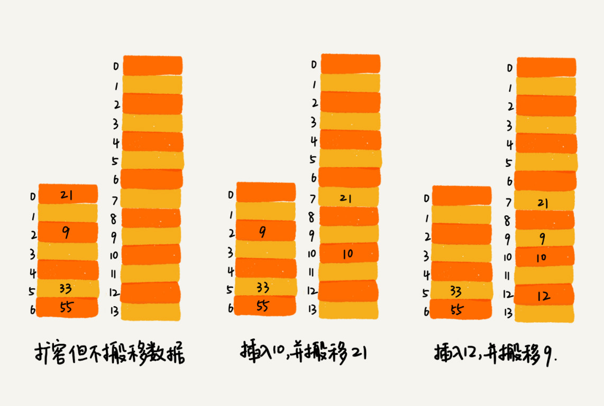
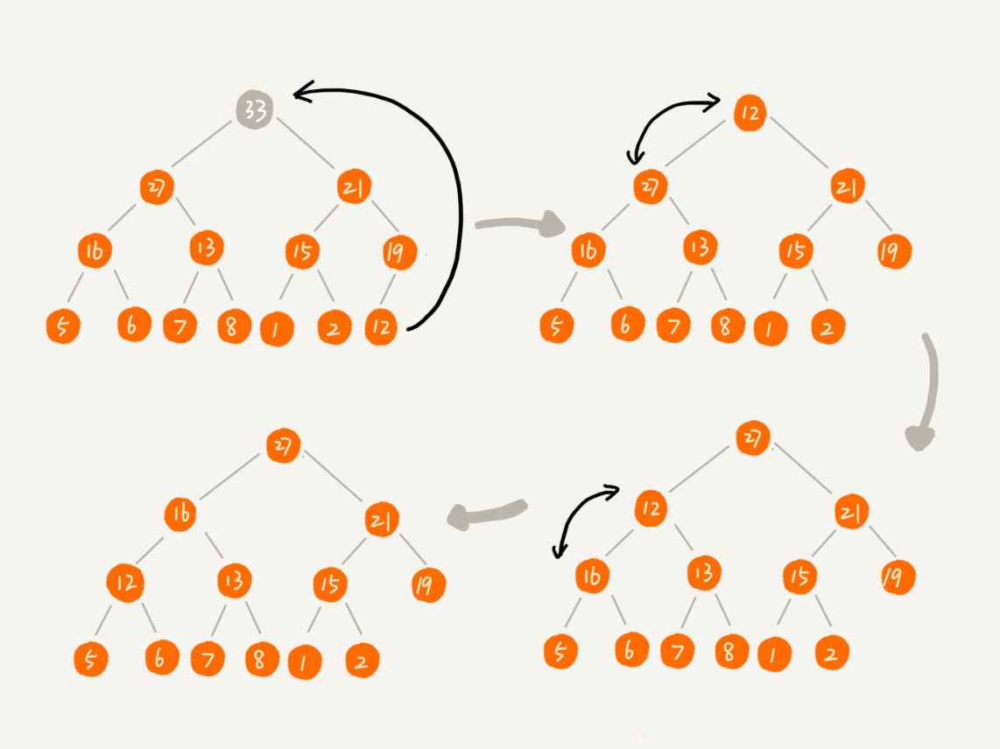

<!-- TOC -->


* 1.[为什么要学习数据结构与算法](#1为什么要学习数据结构与算法)

- [2.如何抓住重点, 高效的学习数据结构与算法](#2如何抓住重点-高效的学习数据结构与算法)
- [3.算法的复杂度分析](#3算法的复杂度分析)
    - [3.1 什么是时间复杂度](#31-什么是时间复杂度)
    - [3.2 大O复杂度表示法](#32-大o复杂度表示法)
    - [3.3 几种常见的事件复杂度分析示例](#33-几种常见的事件复杂度分析示例)
    - [3.4 最好/最坏时间复杂度](#34-最好最坏时间复杂度)
    - [3.5 平均时间复杂度](#35-平均时间复杂度)
    - [3.6 均摊时间复杂度](#36-均摊时间复杂度)
    - [3.7 空间复杂度](#37-空间复杂度)
    - [3.8小结](#38小结)
- [4.数组:为什么很多编程语言数组都从0开始?](#4数组为什么很多编程语言数组都从0开始)
- [5.链表:如何实现LRU缓存淘汰算法](#5链表如何实现lru缓存淘汰算法)
- [6.链表:如何轻松正确的写出链表代码](#6链表如何轻松正确的写出链表代码)
- [7.栈:实现浏览器的前进后退功能](#7栈实现浏览器的前进后退功能)
    - [7.1 栈的基本概念](#71-栈的基本概念)
    - [7.2 栈的应用](#72-栈的应用)
    - [7.3 如何实现浏览器的前进后退功能?](#73-如何实现浏览器的前进后退功能)
- [8.队列](#8队列)
- [9.递归](#9递归)
    - [9.1 递归基础](#91-递归基础)
    - [9.2 递归注意事项](#92-递归注意事项)
- [10.排序](#10排序)
    - [10.1 如何分析排序算法](#101-如何分析排序算法)
    - [10.2 冒泡排序](#102-冒泡排序)
    - [10.3 插入排序](#103-插入排序)
    - [10.4 选择排序](#104-选择排序)
    - [10.5 希尔排序](#105-希尔排序)
    - [10.6 归并排序](#106-归并排序)
    - [10.7 快速排序](#107-快速排序)
    - [10.8 桶排序](#108-桶排序)
    - [10.9 计数排序](#109-计数排序)
    - [10.10 基数排序](#1010-基数排序)
- [11.排序优化:实现一个通用的,高性能的排序函数](#11排序优化实现一个通用的高性能的排序函数)
    - [11.1 如何优化快速排序](#111-如何优化快速排序)
    - [11.2 举例分析排序函数](#112-举例分析排序函数)
- [12. 二分查找](#12-二分查找)
    - [12.1 二分查找的实现](#121-二分查找的实现)
    - [12.2 二分查找应用场景的局限性](#122-二分查找应用场景的局限性)
    - [12.3 四种二分查找的变形问题](#123-四种二分查找的变形问题)
- [13. 跳表](#13-跳表)
- [14. 散列表](#14-散列表)
    - [14.1 什么是散列表](#141-什么是散列表)
        - [散列思想](#散列思想)
        - [散列函数](#散列函数)
        - [散列冲突](#散列冲突)
    - [14.2 打造一个工业级的散列表](#142-打造一个工业级的散列表)
        - [如何`设计散列函数`](#如何设计散列函数)
        - [`装填因子`过大怎么办](#装填因子过大怎么办)
        - [如何`避免低效扩容`](#如何避免低效扩容)
        - [如何选择`冲突解决方案`](#如何选择冲突解决方案)
        - [工业级散列表举例分析](#工业级散列表举例分析)
    - [14.3 为什么散列表和链表经常一起使用](#143-为什么散列表和链表经常一起使用)
- [15. 哈希算法](#15-哈希算法)
    - [15.1 安全加密](#151-安全加密)
    - [15.2 唯一标识](#152-唯一标识)
    - [15.3 数据校验](#153-数据校验)
    - [15.4 散列函数](#154-散列函数)
    - [15.5 负载均衡](#155-负载均衡)
    - [15.6 数据分片](#156-数据分片)
    - [15.7 分布式存储](#157-分布式存储)
- [16. 二叉树基础](#16-二叉树基础)
- [其它](#其它)

<!-- /TOC -->

# 1.为什么要学习数据结构与算法

1. 为了通关大厂面试: 大厂面试都喜欢考算法, 现场写代码. 为了不跪在算法上, 需要好好学.
2. 不甘愿一辈子做业务代码: 虽然写业务代码的人很少需要自己实现数据结构和算法, 大部分时候都是使用别人的方法和框架. 但是不需要自己实现并不意味着什么都不需要了解. 写业务代码用到的很多第三方库都柔和了很多基础的数据结构和算法设计思想. 掌握数据结构与算法, 对于理解其背后设计思想非常有用. 理解第三方框架原理才能更好的使用第三方开源库.
3. 基础架构研发工程师,写出开源水平框架才是你的目标: 作为基础架构研发工程师, 只有了解数据结构和算法, 才能写出更好的基础组件.
4. 对编程的追求: 如果不想被行业淘汰, 就不要只写凑合能用的代码. 性能, 简装性, 可扩展性都是很重要的考量指标.

**掌握数据结构与算法, 你在看待问题的深度, 解决问题的角度都会完全不一样.** 这样的你, 就想式站在巨人的肩膀上, 拿着生存利器行走世界. 数据结构和算法, 会为你的编程之路, 甚至人生之路打开一扇通向新世界的大门. 

# 2.如何抓住重点, 高效的学习数据结构与算法
数据结构就是指一组数据的存储结构. 算法是操作数据的一组方法. 数据结构和算法是相辅相成的, 数据结构是为算法服务的, 算法要作用在特定的数据结构之上. 因此, 我们无法孤立数据结构来讲算法, 也不发孤立算法来讲数据结构.

要想掌握数据结构与算法, **最重要的是: 掌握复杂度分析.** 它有多重要呢? 几乎占据数据结构与算法的半壁江山. 

数据结构与算法知识点如下图所示:


这里有王峥老师推荐的20个最常用的最基础的数据结构与算法, 不管事应付面试还是工作需要, 只要逐一功课这20个知识点就足够了. 10个数据结构:数组,链表,栈,队列,散列表,二叉树,堆,跳表,图,Trie树; 10个算法:递归算法,排序,二分查找,搜索,哈希算法,贪心算法,分治算法,回溯算法,动态规划,字符串匹配算法.

事半功倍的学习技巧:

1. 边学边练,适度刷题: 把每节课上涉及到的习题都自己敲一遍. 对于刷题, 一定要适度, 海量的刷题可能反而会导致你对数据结构和算法失去信心.
2. 多问,多思考,多互动: 不懂得有疑问的地方, 找人一块学习探讨.
3. 知识需要沉淀, 不要想视图一下子掌握所有: 学习知识的过程是反复迭代不断沉淀的过程, 看不懂就反复看,反复练, 自己搞不懂的就问别人, 问google.

# 3.算法的复杂度分析
## 3.1 什么是时间复杂度
**复杂度分析是这个那个算法学习的精髓, 只要掌握了它, 数据结构与算法的内容基本上就掌握了一半.**

**为什么需要复杂度分析?** 因为真机上测试结果非常依赖测试环境, 同样算法在不同cpu/内存上运行时间可能不同. 测试的结果受数据规模的影响比较大, 如果数据规模非常大, 根本无法在真机上进行实际测试(比如跑一遍需要数年的算法). 

我们需要一个不用具体的测试数据来测试, 就可以粗略估计算法执行效率的方法. 这就是时间/空间复杂度分析方法.

## 3.2 大O复杂度表示法
大O时间复杂度实际上并不具体表示代码真正的执行事件, 而是表示**代码执行时间随数据规模增长的变化趋势**, 因此也称为**渐进时间复杂度**, 简称时间复杂度.

**如何分析一个算法时间复杂度?** 

1. 只关注循环次数最多的一段代码. 大O时间复杂度表示的是一种变化趋势, 我们通常会忽略掉公式中的常量, 低阶, 系数, 只要记录一个最大阶的量级就可以了. **所以我们在分析一个算法, 一段代码的时间复杂度时候, 只关注循环此书最多的一段代码就可以了**.
2. 加法法则:**总时间复杂度等于量级最大的那段代码的复杂度.** 
3. 乘法法则:**嵌套代码的复杂度等于嵌套内外代码复杂度的乘积.**

## 3.3 几种常见的事件复杂度分析示例


1. **O(1):**一般情况下, 只要算法不存在循环, 递归, 即使有成千上万行的代码, 其时间复杂度也是O(1).
2. **O(log n),O(n\*log n):**2^x=n 则x=log2n. 这也是比较常见的时间复杂度, 归并排序,快速排序的时间复杂度都是O(nlogn).
3. **O(m+n),O(m\*n):**当无法确定m和n的量级哪个更大时候, 则两者都要考虑.

## 3.4 最好/最坏时间复杂度
顾名思义, **最好时间复杂度指最理想情况下, 执行代码的时间复杂度. 最坏时间复杂度指最糟糕情况下, 执行代码的时间复杂度.**

## 3.5 平均时间复杂度
**平均时间复杂度全称是加权平均时间复杂度或者期望时间复杂度.** 是使用概率论中方法计算出来的时间复杂度.

大多数情况下, 我们并不需要区分最好/最坏/平局时间复杂度. 只有同一块代码在不同情况下, 时间复杂度有量级的差距, 我们才会使用这三种复杂度表示来区分.

## 3.6 均摊时间复杂度
**使用摊还分析法得到的时间复杂度叫做均摊时间复杂度.**

实际上**均摊时间复杂度就是一种特殊的平均时间复杂度**, 我们没必要话费太多精力区分它们. 关键是掌握它的分析方法: **摊还分析法.**

## 3.7 空间复杂度
**空间复杂度实际上是渐进空间复杂度. 表示的是算法的存储空间随着数据规模之间的增长关系.**

## 3.8小结

集中时间复杂度的渐进增长图:


# 4.数组:为什么很多编程语言数组都从0开始?
**数组是一种线性表数据结构. 它用一组连续的内存空间, 来存储一组具有相同类型的数据.** 

**线性表:** 线性表是指数据排成一条线一样的结构. 每个线性表的数据最多只有向前和向后来给你个方向. 除了数组, 链表, 队列, 栈等都是线性表.  **非线性表:** 二叉树, 图堆等. 之所以叫非线性表, 因为数据之间并不是简单的前后关系.

**连续内存空间相同数据类型:** 正是因为有了这两个特性, 它才有了堪称杀手锏的特性: **随机访问.**

数组随机访问的特性带来的缺点就是低效的插入和删除. 因为插入和查出设计到数据的移动. 

容器最大的好处是可以将很多数组操作的细节封装起来, 比如插入删除时候的数据移动. 另外容器一般支持动态扩容. **如果我们事先知道数组的最大容量, 那么我们最好指定数组的容量, 这样可以避免数据搬迁带来的额外开支.
**

**为什么数组编号从0开始呢?** 从数组存储的内存模型上看, 下标最确切的定义应该是"偏移". 因此使用0开头会更好一点. 更大的可能是历史原因造成的, C语言设计者使用0开始数组下标, 之后其它语言都效仿了C语言.

# 5.链表:如何实现LRU缓存淘汰算法
缓存是一种提高数据读取性能的技术, 在计算机领域有着广泛的应用. 缓存大小有限, 当缓存被用满时, 哪些数据被清除, 哪些被保留需要缓存淘汰策略决定. 常见的策略有三种: **先进先出策略FIFO**(First In, First Out), **最少使用策略LFU**(Least Frequently Used), **最近最少使用策略LRU**(Least Recently Used).

**链表相关概念:**

链表通过指针将一组零散的内存块串联在一起. 我们把内存块称为链表的**结点**. 内存块中记录链上下一个结点地址的指针称为**后继指针**, 记录前一个结点的指针叫做**前驱指针**. 我们习惯把链表的第一个结点称为**头结点**, 把最后一个结点称为**尾结点**. 尾结点指向头结点的链表称为**循环链表**. 

**如何实现一个LRU淘汰算法?**

思路: 维护一个有序单链表, 越靠近链表尾部的结点是越早之前访问的. 当有新的数据被访问时, 我们从链表头开始顺序遍历链表.

1. 如果此数据之前已经被缓存在链表中了, 我们得到这个数据对应的结点, 将其从原来的位置删除, 然后再插入到链表的头部. 
2. 如果吃数据没有在缓存列表中. 如果此时缓存未满, 则将结点插入到链表头部; 如果链表已满,则删除尾结点并将数据插入到头部.

以上LRU的实现, 不管结点是否存在都需要遍历一遍, 查找时间复杂度是O(n), 这里可以使用哈希表的方式进行缓存, 可以更快速的查找.

CPU在读取数据时候, 会把读到的数据加到CPU缓存中, 而cpu每次从内存中读取数据并不是只读取特定的地址, 而是读取一个数据块并保存在cpu缓存中, 然后下载访问就会先从cpu缓存中取, 取不到再去内存中取. 数组占用内存空间是连续的, 可能一次性读取多个数据到cpu缓存中, 而链表数据是不连续的, 无法享受到cpu缓存机制带来的好处.

# 6.链表:如何轻松正确的写出链表代码

1. 理解指针和应用的含义. 将某个变量赋值给指针时机上就是将这个变量的地址赋值给指针, 或者反过来说, 指针中存储了这个变量的内存地址, 指向这个变量, 通过指针就能找到这个变量.
2. 警惕指针丢失和内存泄露. 在插入或者删除结点时候一定要注意插入或者删除的顺序, 谨防指针丢失.
3. 利用哨兵简化实现难度. 针对链表的插入/删除操作, 需要对插入的第一个结点和删除最后一个结点情况特殊处理, 这样实现起来繁琐不简洁. 我们可以针对性的引入**哨兵结点**(包含哨兵结点的链表称为带头链表). 
4. 重点关注边界条件. 空链表能否正常运行? 一个结点是否正常? 两个结点是否正常? 处理头结点和尾结点是否正常?
5. 举例画图,辅助思考. 想不明白的地方, 多举例画图, 更加直观.
6. 多写多练. 

# 7.栈:实现浏览器的前进后退功能
## 7.1 栈的基本概念
后进先出,先进后出,这就是典型的栈结构. 从栈的操作特性上看, **栈是一种"操作受限"的线性表**. 当某个数据集合只设计在一端插入和删除数据,并且满足后进先出,先进后出的特性,我们就应该首选栈这种数据结构.

栈可以用数组实现, 也可以用链表实现. **用数组实现的栈叫顺序栈**, **用链表实现的栈叫做链式栈**.

**支持动态扩容的顺序栈**. 如果存储数据的数组支持动态扩容, 那么这个栈就可以支持动态扩容.

## 7.2 栈的应用

* **栈在函数调用中的应用**. 操作系统给每个线程分配一个独立的内存空间, 这块内存空间被组织成栈这种结构, 用来存储函数调用时的临时变量. 每进入一个函数, 就会将临时变量作为一个栈桢入栈, 当调用函数完成, 将这个函数对应的栈桢出栈.
* **栈在表达式求值中的应用**. 实际上编译期通过两个栈来实现表达式的求值. 其中一个保存操作数的栈, 另一个保存运算符的栈. 从左到右遍历表达式, 遇到数字就压入数据栈, 遇到操作符就与最顶层的进行比较. 如果比运算符栈顶部元素优先级高, 就将当前运算符压入栈; 反之则取出栈顶运算符, 取出两个操作数进行计算, 将结果压入操作数栈后继续进行比较.
* **栈在括号匹配中的应用**. 左括号入栈,右括号出栈, 最终栈是空的则括号是匹配的.

## 7.3 如何实现浏览器的前进后退功能?
方法1: 使用两个栈,如下图所示. 每打开一个页面将页面入栈到X栈中, 后退时候将X栈栈顶元素出栈并放到Y栈中. 前进时候从Y栈取栈顶元素放入X栈. 如果X栈入栈新的页面, 则清空Y栈.


方法2: 数组存储页面. 指定两个指针, x指针表示当前正在展示的页面, y指针表示最深能够达到的页面. 打开新页面时候移动x,移动y. 当返回时候x指针后退. 前进时候x前进并判断x<=y时候可前进. 当打开新页面时候,移动x,重置y=x.

# 8.队列
队列也是一种操作受限的线性表结构. 使用数组实现的队列叫做顺序队列. 使用链表实现的队列叫做链式队列. 队列需要两个指针head和tail.

循环队列: 首尾相连组成一个环的队列叫做循环队列. 循环队列可以使用数组实现.

队列最大的特点是先进先出, 主要有两个操作, 入队和出队. 可以用数组实现也可以用链表实现.

阻塞队列和并发队列, 底层都是队列这种数据结构, 只不过在之上附加了其它功能. 阻塞队列就是入队/出队操作可以阻塞. 并发队列就是队列的操作多线程安全(通过加锁的方式实现).

# 9.递归
## 9.1 递归基础
只要问题可以满足三个条件, 就可以使用递归来解决:

1. 一个问题的解可以分解为几个子问题的解;
2. 这个问题和分解之后的子问题, 除了数据规模不同, 求解思路完全相同;
3. 存在递归终止条件;

写递归代码最重要的是**写出递归公式, 找到递归终止条件.** 写递归代码的关键是找到如何将大问题分解为小问题的规律, 并且基于此写出递归公式, 然后再推敲出终止条件, 最后将递推公式和终止条件翻译成代码.

**编写递归关键是, 只要遇到递归, 我们就把它抽象成一个递推公司, 不用想一层一层的调用关系, 不要视图用人脑取分解递归的每个步骤.** 事实证明, 人脑并不擅长分解, 倒推, 但这确是计算机的长项.

## 9.2 递归注意事项
* 警惕堆栈溢出: 如果递归深度过深, 则可能导致函数调用栈溢出. 我们可以限制递归的调用深度来防止溢出; 另外通过堆上模拟栈调用也可以用来防止堆栈溢出.
* 递归代码警惕重复计算: 比如青蛙跳台阶的问题, 如下图所示. 事实上f(2)/f(1)会计算多次, 这会导致重复计算, 我们可以使用哈希表将对应的结果存储起来, 以此避免重复计算.


# 10.排序
排序算法种类繁多, 但是常用的比较少: 冒泡排序, 插入排序, 选择排序, 归并排序, 快速排序, 计数排序, 基数排序, 桶排序. 其时间复杂度如下所示:


## 10.1 如何分析排序算法
1. 最好/最坏/平均时间复杂度. 我们通过评估算法最好/最坏/平均时间复杂度来区分, 因为即使相同平均时间复杂度其还是会有差别的. 其次有的数据接近有序,有的数据完全无序, 我们需要知道算法在不同数据下的性能表现.
2. 时间复杂度的系数, 常数, 低阶. 时间复杂度表示的是一个增长趋势, 它忽略了系数, 低阶, 常数, 但是在实际开发中, 我们经常对很小规模数据排序, 这时候需要把系数/低阶/常数考虑进去.
3. 比较次数和移动次数. 对于小规模的数据排序, 我们需要考虑到算法的比较次数和移动次数.

**原地排序:** 原地排序是指空间复杂度是O(1)的排序算法.

**稳定性:** 稳定性指, 如果排序的序列中存在值相等的元素, 经过排序后, 相等元素之间原有的先后顺序不变.

## 10.2 冒泡排序
**冒泡排序**: 操作相邻的两个数据. 每次冒泡对相邻的两个数据进行比较, 看是否满足大小关系需要. 如果不满足就进行交换. 一次冒泡会让至少一个元素移动到它应该在的位置, 重复n次,就完成了n个数据的排序. 

优化: 当某次冒泡没有数据交换时候, 说明已经达到完全有序, 不需要继续执行后续冒泡操作了.

冒泡排序是一种原地排序算法, 是稳定的排序算法, 最好时间复杂度是O(1), 最坏时间复杂度是O(n^2).

冒泡排序的swift实现:

```swift
// bubble sort
func bubbleSort(_ nums: inout [Int]) {
    guard false == nums.isEmpty else { return }
    
    let count = nums.count
    for i in 0..<count {
        let tail = count - 1 - i
        for j in 0..<tail {
            if nums[j] > nums[j + 1] {
                (nums[j], nums[j + 1]) = (nums[j + 1], nums[j])
            }
        }
    }
}
```

## 10.3 插入排序
**插入排序**: 我们将数组中数据分为两个区间, 已排序区间和未排序区间. 初始已排序区间只有一个元素, 就是数组的第一个元素. 插入排序的核心思想是取未排序区间的元素, 在已排序区间中找到合适的为止进行插入, 并保证已排序区间数据一直有序. 重复此过程, 直到未排序区间为空.

插入排序是一种原地排序算法, 是稳定的排序算法, 最好时间复杂度是O(n), 最坏时间复杂度是O(n^2).

插入排序的Swift实现:
```swift
// insertion sort
func insertionSort(_ nums: inout [Int]) {
    guard nums.count > 1 else { return }
    
    for i in 1..<nums.count {
        let temp = nums[i]
        var j = i - 1
        while j >= 0 && nums[j] > temp {
            nums[j + 1] = nums[j]
            j = j - 1
        }
        if j != i - 1 {
            nums[j + 1] = temp
        }
    }
}
```
## 10.4 选择排序
**选择排序**: 选择排序类似插入排序, 也分为已排序区间和未排序区间. 但选择排序是每次从未排序区间中找到最小的元素, 将其放到已排序区间的末尾.

选择排序是原地排序, **不稳定排序**(数据交换导致前后顺序发生变化), 其最好, 最坏, 平均时间复杂度都是O(n^2). 

选择排序swift实现:

```swift
// selection sort
func selectionSort(_ nums: inout [Int]) {
    guard false == nums.isEmpty else { return }
    
    let count = nums.count
    for i in 0..<count {
        var minIndex = i
        for j in (i + 1)..<count {
            if nums[minIndex] > nums[j] {
                minIndex = j
            }
        }
        if i != minIndex {
            (nums[minIndex], nums[i]) = (nums[i], nums[minIndex])
        }
    }
}
```

冒泡排序和选择排序在实际开发中应用比较少.学习目的只是为了拓展思维. 但是插入排序还是比较有用的. 某些编程语言的排序函数实现原理会用到插入排序.

## 10.5 希尔排序
**希尔排序**: 把记录按照下标的一定增量分组, 对每组使用直接插入排序算法排序; 随着增量组件减少, 每组包含的关键词越来越多, 当增量减至1时, 整个文件恰被分成一组, 算法终止. 

希尔排序是原地排序, 不稳定排序(分组交换会破坏稳定性), 平均时间复杂度O(n^2)的的算法. 是**基于插入排序的优化版本**.

希尔排序过程(来自[wikipedia](https://zh.wikipedia.org/wiki/%E5%B8%8C%E5%B0%94%E6%8E%92%E5%BA%8F)):


希尔排序的swift实现:

```

```

## 10.6 归并排序
归并排序: 如果要排序一个数组, 先把数组从中间分成前后两部分, 然后对前后两部分分别排序, 再将排好序的两部分合并在一起, 这样整个数组就都是有序的了. 

归并排序采用分治思想. 将一个大问题分解成小的子问题来解决. 小问题解决了, 大问题自然就解决了. **分治是一种解决问题的处理思想, 递归是一种编程思想.** 

归并排序的示意图如下所示:


归并排序是否是稳定排序要看`merge()`函数, 归并排序可以是稳定的排序. 归并排序时间复杂度是O(nlog n). 归并排序的空间复杂度是O(n).

归并排序的swift实现

```swift
func mergeSort<T: Comparable>(nums: [T]) -> [T] {
    return mergeSort(nums: nums, low: 0, height: nums.count - 1)
}

/// 归并排序
func mergeSort<T: Comparable>(nums: [T], low: Int, height: Int) -> [T] {
    if low == height {
        return [nums[low]]
    }
    let mid = low + (height - low) / 2
    let leftArray = mergeSort(nums: nums, low: low, height: mid)
    let rightArray = mergeSort(nums: nums, low: mid + 1, height: height)
    var newArray = [T]()
    
    var i = 0, j = 0
    while i < leftArray.count && j < rightArray.count {
        if leftArray[i] <= rightArray[j] {
            newArray.append(leftArray[i])
            i += 1
        }else{
            newArray.append(rightArray[j])
            j += 1
        }
    }
    
    while i < leftArray.count {
        newArray.append(leftArray[i])
        i += 1
    }
    while j < rightArray.count {
        newArray.append(rightArray[j])
        j += 1
    }
    return newArray
}
```

## 10.7 快速排序
快速排序(快排QuickSort): 快排也是利用分治思想. 从要排序数组中选择一个数据作为分区点. 遍历数组, 将小于分区点的数据放在左边, 将大于分区点的数据放在右边, 重复此步骤. 最终整个数组就是有序的了.

快速排序涉及到分区和数据交换, 因此会破坏数据原有的顺序, 快排是不稳定的排序. 是一种原地排序算法. 大部分情况下时间复杂度都可以做到O(nlog n), 但是极端情况下会退化到O(n^2)(比如对于一个有序的数组, 每次选择其第一个元素,则时间复杂度会退化到O(n^2)). 

**快速排序和归并排序区别:**


如图所示, 归并排序的处理过程是由**下到上的**, 先处理子问题, 再合并. 快排恰好相反, **由上到下**, 先进行分区, 然后以此对每个分区进行排序.

快速排序的swift实现:

```swift
func quickSort(a: inout [Int], low: Int, high: Int) {
    if low >= high { // 递归结束条件
        return
    }
    var i = low
    var j = high
    let key = a[i]
    while i < j {
        // 从右边开始比较，比key大的数位置不变
        while i < j && a[j] >= key {
            j -= 1
        }
        // 只要出现一个比key小的数，将这个数放入左边i的位置
        a[i] = a[j]
        // 从左边开始比较，比key小的数位置不变
        while i < j && a[i] <= key {
            i += 1
        }
        // 只要出现一个比key大的数，将这个数放入右边j的位置
        a[j] = a[i]
    }
    a[i] = key // 将key放入i的位置，则左侧数都比key小，右侧数都比key大
    quickSort(a: &a, low: low, high: i - 1) // 左递归
    quickSort(a: &a, low: i + 1, high: high) // 右递归
}
 
// 示例
var m = [2,3,5,7,1,4,6,15,5,2,7,9,10,15,9,17,12]
quickSort(a: &m, low: 0, high: m.count - 1)
print(m)
```

## 10.8 桶排序
桶排序: 如果要排序的数据有n个, 我们把它均匀的划分到m个桶中, 每个桶内有k=n/m个元素. 每个桶内使用快速排序, 时间复杂度是O(klogk), m个桶排序的时间复杂度是O(`m*k*logk`)因为 k=n/m，所以整个桶排序的时间复杂度就是O(nlog(n/m)). 当桶的个数m接近数据个数n时, log(n/m)就是一个非常小的常量, 这个时候桶排序的时间复杂度接近O(n). 

桶排序对排序数据的要求非常苛刻. 首先数据需要很容易划分成m个桶, 并且桶和桶之间有着天然的大小顺序. 这样每个桶内数据排序完成之后, 桶桶之间数据不再需要进行排序. 

其次数据在各个桶之间的分布是比较均匀的. 如果不均匀, 比如极端情况下数据都在一个桶内, 则算法就会退化到O(nlogn). 

**场景:** 桶排序比较适合用在外部排序. 外部排序就是数据存乎在外部磁盘中, 数据量比较大, 内存有限, 无法将数据全部加载到内存中.

## 10.9 计数排序
计数排序是桶排序的一种特殊情况. 当要排序的n歌数据, 所处的范围不大时候, 比如最大k, 我们可以把数据划分成k个桶. 每个桶内的数据值是相同的, 省掉了桶内排序的时间.

**计数排序步骤:**

1. 遍历要排序的数组A, 使用数组C按照桶排序的规则在C内记录每个数据出现的次数;
2. 数组C从前到后以此累加;
3. 遍历数组A, 从C中取出对应value的个数, 其个数即为计数排序中其排序数组中的位置.
4. 根据找到的位置, 在数组R的对应位置存放数据, 将C中对应的value-1.

**总结:** 计数排序只能用在数据范围不大的场景中, 如果数据范围k比要排序的数据n大很多, 就不适合计数排序了. 而且, 计数排序只能给非负整数排序, 如果要排序的数据是其它类型, 则需要在不改变相对大小的情况下, 转化为非负整数.

计数排序swift实现:

```swift
计数排序实现:
假设我们现在需要对 D，a，F，B，c，A，z 这个字符串进行排序，要求将其中所有小写字母都排在大写字母的前面，但小写字母内部和大写字母内部不要求有序。比如经过排序之后为 a，c，z，D，F，B，A，这个如何来实现呢？如果字符串中存储的不仅有大小写字母，还有数字。要将小写字母的放到前面，大写字母放在最后，数字放在中间，不用排序算法，又该怎么解决呢？

```

## 10.10 基数排序
基数排序: 基数排序对要排序数据是有要求的, 需要可以分割出独立的位来来比较, 而且位之间有递进关系, 如果a数据的高位比b数据大, 那剩下的低位就不需要比较了. 除此之外, 每一位的数据范围不能太大, 要可以用线性排序算法来排序, 否则基数排序的时间复杂度就没办法做到O(n).

以对10万个手机号排序为例. 借助稳定排序算法, 我们先按照最后一位来排序手机号码, 然后按照倒数第二位重新排序, 经过11次排序后, 手机号码就都有序了. 需要注意的是, 这里按位排序的算法必须是稳定的, 否则先对低位进行排序就没有意义!

**扩展:** 有时候, 数据长度是不同的, 这时候我们可以对较短的数据末位进行补零, 不影响最后结果.

# 11.排序优化:实现一个通用的,高性能的排序函数
几种排序算法基本信息如下所示:


线性排序算法时间复杂度低, 但是适用场景有限. 所以通用的排序函数, 不能选择线性排序算法. 

对小规模数据进行排序, 可以选择时间复杂度O(n^2)的算法; 如果对大规模数据进行排序, 时间复杂度O(nlogn)的算法更加高效.

归并排序使用的并不多, 因为归并排序并不是原地排序算法, 空间复杂度O(n). 对于大规模的数据, 很容易导致内存暴涨.

## 11.1 如何优化快速排序
如果数据本身是有序或者接近有序, 每次分区都选择最后一个数据, 那么快速排序算法就会变得非常糟糕, 时间复杂度就会退化成O(n^2). 这主要是因为我们分区点选择不够合理造成的. **最理想的分区点, 被分开的两个分区中, 数据的数量差不多.**

两种常用的,简单的分区算法:

1. **三数取中法**. 从分区的首/尾/中各取一个点, 比较大小, 取中值作为分区点.
2. **随机法**. 随机从要排序区间内选择一个元素作为分区点.

## 11.2 举例分析排序函数
Glibc中的qsort()函数. 它并不仅仅是快速排序算法实现的, qsort()会优先使用归并排序来排序输入数据, 因为归并排序的空间复杂度是O(n), 所以对于小规模的数据排序问题不大. 这是个典型**空间换时间**的技巧; 当要排序的数据量很大时候, 就会采用快速排序算法来排序(使用三点取中法选择分区点); qsort()还用到了插入排序, 当数据个数小于4时候, qsort()就退化成了插入排序. 

# 12. 二分查找
**二分查找:** 二分查找针对的是有序的数据集合, 查找思想类似分治思想. 每次都通过跟区间的中间元素对比, 将查找区间缩小为原来一半, 直到找到需要查找的元素, 或者区间被缩小为0. **二分查找有着`O(logn)`的查找速度. **

## 12.1 二分查找的实现
最简单的二分查找是在有序数组中不存在重读元素, 我们在其中用二分查找值等于给定值得数据.

swift版本的代码实现如下所示:

```swift
func bsearch(arr: [Int], value: Int) -> Int? {
    var low = 0
    var high = arr.count - 1
    while low <= high {
        let mid = low + (high - low) / 2
        if arr[mid] == value {
            return mid
        }else if arr[mid] < value{
            low = mid + 1
        }else{
            high = mid - 1
        }
    }
    return nil
}
```
**二分查找容易出错的有三个地方.**

1. 循环退出条件. 注意是 `low<=high`，而不是 `low<high`.
2. mid的取值. `mid=low+(high-low)/2`, 防止溢出.
3. low和high的更新. `low=mid+1`, `high=mid-1`

## 12.2 二分查找应用场景的局限性

1. 二分查找依赖顺序表结构, 简单说就是数组;
2. 二分查找针对的是有序数据;
3. 数据量太小不适合二分查找. 数据量小, 顺序遍历就够了, 性能并不会差到哪.
4. 数据量太大不适合二分查找. 二分查找依赖顺序表结构, 也就是连续内存空间, 如果数据量太大, 会占用过多的内存空间.

## 12.3 四种二分查找的变形问题


**查找第一个值等于给定值的元素**

**查找最后一个值等于给定值的元素**

**查找第一个大于等于给定值的元素**

**查找最后一个小于等于给定值的元素**

# 13. 跳表
对于一个单链表来说, 即使链表中存储的数据是有序的, 我们要想在其中查找某个数据, 也只能从头到尾遍历链表. 这样查找效率就会很低, 时间复杂度会很高, O(n).


如下图所示, 针对链表建立一级索引, 查找起来会更快一点. 每两个结点提取一个结点到上一层, 我们把抽出来的那一层叫做`索引层`或者`索引`. 如果一级链表太长, 那么可以建立二级链表, 三级链表...


**如上这种链表添加多级索引的结构, 就是跳表.** 

跳表的优点:

1. **跳表查询效率高.**
2. **跳表并不会浪费很多内存.** 因为在实际开发中, 链表中存储的都是指针, 而对象所占的内存空间都远大于指针, 所以相对来说并不会占用太大的内存. 
3. **跳表支持高效的插入和删除.** 
4. **跳表支持高效的插入和删除操作.**

# 14. 散列表
## 14.1 什么是散列表
### 散列思想
**散列表用的是数组支持下标随机访问的特性, 所以散列表其实就是数组的一种扩展, 由数组演化而来. 可以说, 没有数组就没有散列表.**


如上图所示, 散列表用的是数组支持按照下标随机访问的时候, 时间复杂度是O(1)的特性. 我们可以通过散列函数把元素的键值映射为下标, 然后将数据存储在数组中对应下标的位置. 当我们按照键值查询元素时, 我们用同样的散列函数, 将键值转化为下标, 从对应的数组下标的位置取数据. 

### 散列函数
散列函数在散列表中起着非常重要的作用. 

**怎么设计散列函数?** 需要注意三点:

1. 散列函数计算得到的散列值是一个非负整数;
2. 如果key1=key2, 那么hash(key1) == hash(key2);
3. 如果 key1 ≠ key2，那 hash(key1) ≠ hash(key2).

针对第三条, 看起来合情合理, 但是真实情况下, **要想找一个不同的key对应的散列值都不一样的散列函数, 几乎是不可能的**, 即使是业界最有名的MD5/SHA/CRC等哈希算法, 也无法完全避免这种`散列冲突`. 而且因为数组的空间有限, 也会加大单列冲突的概率.

### 散列冲突
再好的散列函数也无法避免散列冲突. 我们常用的散列冲突解决方法有两类, `开放寻址法`和`链表法`. 

**开放寻址法**

开放寻址法的核心思想是, 如果出现散列冲突, 我们就重新探测一个空闲位置, 将其插入. 如何探测新的位置呢? 一般情况下有三种.

1. **线性探测**. 当我们往散列表中插入数据时, 如果某个数据经过散列函数散列之后, 存储位置已经被占用, 则我们从当前位置开始, 一次往后查找, 看是否有空闲位置, 直到找到为止.
2. **二次探测**. 类似线性探测, 线性探测每次探测的步长是1, 而二次探测的步长是`hash(key)+2^n`. 
3. **双重散列**. 意思是不仅要使用一个散列函数, 如果计算得到的存储位置已经被占用, 则再使用第二个散列函数, 以此类推, 直到找到空间的存储位置.

不管采用哪种探测方法, 当散列表中空闲位置不多的时候, 散列冲突的概率就会大大提高. 为了尽可能保证散列操作效率, 我们会尽可能保证散列表中有一定比例的空闲槽. 我们用`装填因子`来表示空位有多少. 装填因子越大, 空闲位置越少, 冲突越多, 散列表的性能就会下降.

`散列表的装载因子 = 填入表中的元素个数 / 散列表的长度`

`线性探测`查找数据. 类似插入过程, 如果散列函数要求查找元素的键再hash表中对应下标的散列值不是我们要找的元素(散列值要记录其值对应的key), 则一次向后查找, 如果一直找不到, 则返回空.

`线性探测`删除数据. 删除数据需要注意, 查找到要删除元素后不能直接删除, 如果给对应的值打上一个`delete`的标签. 如果直接删除, 下次查找可能会出问题(查找到空位置,停止查找, 查找链就断了).


**链表法**

链表法师更常用的散列冲突解决方案, 比开放寻址法更简单. 如果遇到散列冲突, 则我们直接在数组中拉一个链表来解决. 如下图所示:


当插入时候, 我们只需要通过散列函数计算出对应的散列槽位, 将其插入到对应的链表中即可. 所以插入的时间复杂度是O(1), 查找删除一个元素时, 同样计算出对应的槽位, 然后遍历链表查找或者删除. 

## 14.2 打造一个工业级的散列表
散列表的查询效率并不能笼统的说是O(1). 它跟散列函数, 装填因子, 散列冲突都有关系. 如果散列函数设计的不好, 或者散列因子过高, 都可能导致散列冲突发生的概率升高, 查询效率下降.

### 如何`设计散列函数`
**散列函数设计不能太复杂**, 复杂的散列函数会消耗很多计算时间, 间接影响散列表性能. **散列函数生成的值尽量均匀分布**, 这样才能避免或者最小化散列冲突.

散列函数设计方法有很多, 比如直接寻址法, 平方取中法, 折叠法等.

### `装填因子`过大怎么办
针对散列表, 当装填因子过大时, 我们可以进行动态扩容, 重新申请一个更大的散列表, 将数据搬迁到这个新的散列表中. 假设每次扩容我们都申请一个原来散列表大小两倍的空间, 那么经过扩容后, 新散列表的装填因子就下降为原来的一半了. 

针对散列表扩容后, 数据搬迁操作要更复杂. 因为散列表大小变了, 数据存储位置也变了, 所以我们需要通过散列函数重新计算每个数据存储的位置.

当散列表的装填因子超过某个阀值时, 需要进行扩容, 如果装填因子小于某个阀值也可以进行缩容. 因为装填因子过小会导致散列表占用过大的空间, 缩容会更加的节省内存.

### 如何`避免低效扩容`
大部分情况下, 直接申请内存并扩容并不会出现问题. 但是极端情况下, 比如哈希表占用1G内存, 需要扩容就需要申请2G内存并进行数据搬迁, 这时候会造成大量的计算和移动, 会消耗过多的时间. 一次性扩容的机制就不适用了.

这时候我们可以将扩容操作分批次完成. 

1. 申请新的内存;
2. 插入数据时候将数据插入到新的内存地址中, 每次插入数据都将一定数量的数据从老散列表搬迁到新散列表中;
3. 查找数据先从新的散列表中查找, 找不到则从老的散列表中查找;



通过这样均摊的方法, 将一次性扩容的代价均摊到多次插入操作中, 避免了一次性扩容耗时过多的情况.

### 如何选择`冲突解决方案`
**开放寻址法**

**当数据量较小, 装填因子小的时候, 适合使用开放寻址法. 这也是Java中的`ThreadLocalMap`使用开放寻址法解决散列冲突的原因.**

散列表中数据都存储在数组中, 可以有效的利用CPU缓存加快查询速度. 而且这种方法实现的散列表, 序列化也比较方便. 

开放寻址法解决冲突的散列表, 删除数据比较麻烦, 需要特殊标记已经删除. 使用开放寻址法, 装填因子不能太大, 这也导致这种方法比李恩表更加浪费内存空间.

**链表法**

**基于链表的散列冲突处理方法比较适合存储大对象, 大数据的散列表. 而且, 比起开放寻址法, 它更加灵活, 支持更多的优化策略, 比如用红黑树代替链表.**

1. 无法利用cpu缓存;
2. 可以接受装填因子比较高的情况, 即使装填因子是10, 只要数据均匀分布, 查找效率还是很高的;
3. 适合存储大对象(对象大小远大于一个指针的大小), 链表中存储的指针, 并不会导致哈希表占用过高的内存;
4. 对于链表可以稍加改造就能实现更高效的哈希表. 比如使用跳表, 红黑树. 这样即使出现哈希冲突, 极端情况下的查找效率也并不会很低.

### 工业级散列表举例分析
例如Java中`HashMap`的大小.

1. 初始大小. HashMap的默认初始大小是16.
2. 装填因子和动态扩容. 最大装填因子是0.75, 每次启动扩容, 都会扩容为原来的2倍.
3. 散列冲突解决方法. 使用链表法, 的那个链表结点大于8则转化成红黑树, 小于8则退化成链表.
4. 散列函数. 参考15章节.

设计一个散列表: **合适的散列函数; 定义装填因子和阀值; 选择合适的散列冲突解决方案.**

工业级散列表要求: **快速的查询/删除/插入操作; 内存占用合理, 不能浪费过多内存; 性能稳定, 极端情况下性能不会退化太多. **

## 14.3 为什么散列表和链表经常一起使用
散列表这种数据结构虽然支持非常高效的数据插入/删除/查找操作, 但**散列表中的数据都是通过散列函数打乱之后无规律存储的. 因此无法按照某种顺序快速的遍历数据**. 如果希望按照顺序遍历散列表中的数据, 那我们需要将散列表中的数据拷贝到数组中, 然后排序, 再遍历. 

**因为散列表是动态数据结构, 需要不停的有数据插入/删除, 所以每当我们希望按照顺序遍历散列表数据时候就需要先进行排序, 这样效率势必很低. 为了解决这个问题, 我们将散列表和链表结合在一起使用.**

> 比如LRU算法中, 引入一个数组存储每个双向链表的元素位置, 这样才能达到O(1)的查找时间复杂度.

# 15. 哈希算法
**将任意长度的二进制串映射为固定长度的二进制串, 这个映射规则就是`哈希算法`**.

哈希算法要求:

1. 从哈希值不能推导出原始数据(哈希算法也叫做单向哈希算法);
2. 对出入数据非常敏感, 哪怕只修改一个Bit, 最后得到的哈希值也大不相同;
3. 散列冲突的概率很小, 对于不同的原始数据, 哈希值相同的概率非常小;
4. 哈希算法执行效率尽量高效, 针对较长的文本, 也能快速计算出哈希值.

哈希算法应用非常多, 这里给出最常见的7个: **安全加密、唯一标识、数据校验、散列函数、负载均衡、数据分片、分布式存储.**

## 15.1 安全加密
最常用的就是安全加密. 最常用的哈希算法是MD5和SHA1. 

对于加密算法有两点很重要: 1. 很难根据哈希值反向推导出原始数据; 2.散列冲突的概率要足够小.

**鸽巢原理:**如果有10个鸽巢, 11只鸽子, 那么一定有1个鸽巢中有两个鸽子. 

**根据鸽巢原理, 无论是什么加密算法, 其结果都是有穷的, 因此不存在完全没有散列冲突的哈希算法.**

## 15.2 唯一标识
举个例子, 要在海量图库中搜索一个图片是否存在. 我们不能直接比较名字, 因为名字相同的可能不是一张图片, 也不能直接比较二进制码, 因为海量图片转换成二进制码是很长的, 比较太耗时.

我们可以给每个图片取一个唯一的标识, 比如从图片二进制中, 取开头100个字节, 中间100个字节, 最后100个字节, 合并后通过md5哈希算法得到一个二进制串, 作为图片的唯一标识. 通过这个串了确定图片是否在图库中.

## 15.3 数据校验
举个例子, BT种子下载. BT下载原理是基于P2P协议, 我们可以从多个机器上分片下载一部电影, 电影可以被分割成很多块, 等每块都下载完成最后再拼装在一起.

而网络传输是不安全的, 我们怎么知道文件再传输过程中是否被修改过呢? 

一种思路就是将每块电影都使用哈希算法得到一个值. 当电影电影片段传输完成后, 根据相同的哈希算法重新计算哈希值, 比较两次得到的哈希值是否相同. 如果相同则是正确的电影片段, 如果在传输过程中哪怕被改掉一个`Bit`, 哪儿最终得到的哈希结果也会有很大不同.

## 15.4 散列函数
散列函数也是哈希算法的一种. 

散列函数是设计一个散列表的关键. 直接决定了散列冲突的概率和散列表的性能. 散列函数并不关注哈希算法结果是否能够被方向推到, 而更关心哈行算法能够使值均匀分布. 初次之外, 散列函数执行的效率也会影响散列表的性能.

## 15.5 负载均衡
nginx就是一个用于负载均衡的服务. **负载均衡指将所有的网络请求都转发到别的服务器的服务.** 比如一个网站需要10台服务器, nginx将所有的网络请求均匀的转发到10台服务器上. 

我们可以借助哈希算法, 对客户端IP地址或者会话ID计算哈希值, 将取得的哈希值与服务器列表的大小进行取模运算, 最终得到的值应该就是呗路由到的服务器编号. 

## 15.6 数据分片
例如有1T的日志文件, 我们需要从中分析用户搜索关键字. 这时候需要使用一台服务器肯定扛不住, 时间上也会话费太多的时间. **针对这个问题, 我们可以先对数据进行分片, 然后用多台机器处理的方法, 来提高处理速度.**具体的思路是这样的：**为了提高处理的速度，我们用 n 台机器并行处理。我们从搜索记录的日志文件中，依次读出每个搜索关键词，并且通过哈希函数计算哈希值，然后再跟 n 取模，最终得到的值，就是应该被分配到的机器编号。**

实际上这就是`MapReduce`的基本设计思想.

## 15.7 分布式存储
当前互联网面对的都是海量的数据, 为了提高读写能力, 一般我们都采用分布式来存取数据. 我们海量的数据需要缓存, 所以使用一个缓存器肯定不够, 于是我们需要将数据分布在多台机器上. 

我们可以借助数据分片的思想, 通过哈希算法对数据取哈希值, 然后对机器数量取模, 最终得到的值就是存储的缓存机器编号.

# 16. 二叉树基础
## 16.1 树的基本概念
概念: `父结点`, `子结点`, `兄弟结点`, `根节点`, `叶子结点`.

* 结点的高度:结点到叶子结点的**最长路径(边数)**;
* 结点的深度:根节点到这个结点所经历**边的个数**;
* 结点的层数:**结点的深度+1**;
* 树的高度:**根节点的高度**.


## 16.2 二叉树
二叉树相关基础概念: `左子结点`, `右子结点`. 

* **满二叉树:** 叶子结点全在最底层, 除了叶子结点外, 每个结点都有左右两个子结点, 这种二叉树叫做满二叉树.  如下图2所示.
* **完全二叉树:** 叶子结点都在最底下两层, 最后一层的叶子结点都靠左排列, 除了最后一层, 其它层的结点个数都要达到最大, 这种树叫做完全二叉树.  如下图3所示.


### 二叉树的存储
一般有两种方法: 一种是基于指针/引用的二叉链式存储法; 另一种是基于数组的顺序存储法.

链式存储法不必多说, 基于数组的顺序存储法中, 我们把结点存储在下标`i=1`的位置,那么左子叶在`2*i`位置, 右子叶在`2*i+1`. 如下图所示:


如果某颗二叉树式一棵完全二叉树, 那么使用数组存储是最节省内存的一种方式.

### 二叉树的遍历
二叉树的遍历有`前序遍历`, `中序遍历`, `后续遍历`. 其中的前/中/后指的是结点与它左右子树结点的先后顺序. 如下图所示.


从上图可以看出, 每个结点最多被访问两次, 因此二叉树遍历时间复杂度是O(n).

## 16.3 二叉查找树
**二叉查找树: 在树的任意一个结点, 其左子树每个结点的值都小于这个结点的值, 其右子树每个结点的值都小于这个结点的值.**

二茬查找树/二叉搜索树的特点: **支持动态数据集合的快速插入, 删除, 查找操作.**

### 二叉查找树的查找操作
根据二叉查找树的特点,比较数据与结点比较结果, 然后递归从左子树或者右子树中继续查找...

### 二叉查找树的插入操作
类似于查找操作. 新插入的数据一般都是在叶子结点上. 如果要插入的数据比结点数据大,且节点的右子树为空, 则插入到右结点; 反之则插入到左结点.

### 二叉查找树的删除操作
1. 如果要删除结点没有子结点, 则直接将结点删除;
2. 如果要删除结点有一个子结点, 则删除结点的父指针指向结点的子指针地址即可;
3. 如果要删除结点有两个结点, 先找到这个结点右子树最小结点, 然后替换到要删除结点的位置.
4. 其实也可以将要删除的结点直接标记为已删除, 而不执行实际的删除, 但是这样可能会浪费很多内存空间.

### 二叉查找树的其它操作
除了插入, 删除, 查找操作之外, 二叉查找树还支持**快速查找最大结点, 最小结点, 前驱结点, 后继结点.**

**中序遍历二叉查找树, 可以输出有序的数据序列, 时间复杂度是O(n), 非常高效!**

# 17. 红黑树

##什么是"平衡二叉查找树"

**平衡二叉查找树:**二叉树中任意一个节点的左右子树的高度相差都不能大于1.

但是在实际的应用中，很多平衡二叉查找树并没有严格符合上面的定义，比如红黑树。学习数据结构和算法是为了应用到实际的开发中，所以没必要去死扣定义。**发明平衡二叉查找树这类数据结构的初衷是，解决普通二叉查找树在频繁的插入、删除等动态更新的情况下，出现时间复杂退化的问题。**

所以，平衡二叉查找树中“平衡”的意思，其实就是让整个树左右看起来比较对称，比较平衡，不要出现左子树很高右子树很低的情况。这样能够让整棵树的高度相对低一点，相应的插入、删除、查找等操作的效率高一点。

## 如何定义红黑树

红黑树并不是严格的平衡二叉查找树，红黑树中的节点，一类被标记为黑色，一类被标记为红色。此外一颗红黑树还需要满足这样几个要求：

1. 根节点是黑色的；
2. 每个叶子节点都是黑色的空节点，也就是说，叶子节点不存储数据；
3. 任何相邻的节点都不能同时为红色，也就是说，红色节点是被黑色节点隔开的；
4. 每个节点，从该节点到达其可达叶子节点的所有路径，都包含相同数据的黑色节点。

为什么说红黑树是近似平衡的：平衡二叉树的初衷，是为了解决二叉树因为动态更新导致的性能退化问题。所以，平衡的意思可以等价于性能不退化。近似平衡就等价于性能不会退化的太严重。

## 如何看待红黑树

实际上，只需要能够看懂红黑树的讲解实现过程即可。毕竟实际的软件开发并不是闭卷考试，当你真的需要实现一个红黑树的时候，可以对照着步骤一点一点去实现即可。

1. **把红黑树的平衡调整过程比作是魔方复原，不要过于深究这个算法的正确性。**你只需要明白，只要按照固定的步骤，保持茶树、删除的过程，不破坏平衡树的定义就行了。
2. **找准关注点，不要搞丢、搞错关键点。**因为每种操作规则，都是基于关注节点来做的，只有弄对了关注节点，才能对应到正确的操作规则中。在迭代的调整过程中，关注节点在不停的改变，所以这个过程一定要注意，不要弄丢了关注节点。
3. **插入操作的平衡调整比较简单，但是删除操作就比较复杂。**针对删除操作，我们有两次调整，第一次是针对要删除的节点做初步调整，让调整后的红黑树继续满足第四条定义，“每个节点可达叶子节点的路径都包含相同个数的黑色节点”。但是这个时候，第三条定义就不满足了，有可能存在两个红色节点相邻的情况。第二次调整就是解决这个问题，让红黑树不存在相邻的红色节点。

# 18. 递归树：如何借助树来求解递归算法的时间复杂度

递归的思想就是，将大问题分解成小问题来解决，然后再将小问题分解成小小问题，这样一层一层的分解，直到问题的数据规模被分解得足够小，不用继续递归分解为止。

如果我们把这个一层一层分解得过程画成图，它其实就是一棵树。我们给这棵树取一个名字，叫做 **递归树**。


例如全排列问题，如果我们确定了最后一位数据，那就变成了求解剩下n-1个数据的排列问题。而最后一位数据可以是n个数据中任意一个，因此它的取值就是n种情况。所以n个数据的排列问题，就可以分解成n与n-1个数据的排列的子问题。

如果我们把它写成递推公式，就是这个样子：

```
假设数组中存储的是 1，2， 3...n。
        
f(1,2,...n) = {最后一位是 1, f(n-1)} + {最后一位是 2, f(n-1)} +...+{最后一位是 n, f(n-1)}。

```

如果将递推公式翻译成代码，就是下面这个样子：

```
// 调用方式：
// int[]a = a={1, 2, 3, 4}; printPermutations(a, 4, 4);
// k 表示要处理的子数组的数据个数
public void printPermutations(int[] data, int n, int k) {
  if (k == 1) {
    for (int i = 0; i < n; ++i) {
      System.out.print(data[i] + " ");
    }
    System.out.println();
  }

  for (int i = 0; i < k; ++i) {
    int tmp = data[i];
    data[i] = data[k-1];
    data[k-1] = tmp;

    printPermutations(data, n, k - 1);

    tmp = data[i];
    data[i] = data[k-1];
    data[k-1] = tmp;
  }
}
```

**其实掌握分析的方法是很重要的，思路是重点，不要纠结于精确的时间复杂度到底是多少。**

# 19. 堆

## 19.1 如何理解堆

堆是一种特殊的树，只要满足以下两点要求，它就是一个堆。

1. 堆是一个完全二叉树。堆必须是一个完全二叉树，完全二叉树要求，除了最后一层，其它层的节点个数都是满的，最后一层的节点都靠左排列。
2. 堆中每个节点的值都必须大于等于（小于等于）其子树中每个节点的值。换种说法就是，堆中每个节点的值都大于等于（小于等于）其左右子节点的值。

对于每个节点的值都大于等于子树中每个节点值的堆，我们叫做 **大顶堆**。每个节点的值都小于等于子树中每个节点值的堆，我们叫做 **小顶堆**。

## 19.2 如果实现一个堆

**要实现一个堆，首先我们要知道，堆都支持哪些操作以及如何存储一个堆。**

完全二叉树比较适合用数组来存储，用数组存储完全二叉树是非常节省空间的，因为我们不需要存储左右子节点的指针，单纯的通过数组的小标就可以找到一个节点的左子节点和父节点。

对于堆的操作，最核心的是往堆上插入元素和删除堆顶元素。

### 往堆上插入一个元素

如果我们把插入元素放到堆的最后，那么这个树就不符合堆的特性了，这时候我们需要进行调整以便让堆重新符合堆的特性，这个过程叫做**堆化**。

堆化有两种方法，从下往上和从上往下。

堆化非常简单，就是顺着节点所在路径，向上或者向下，对比，然后交换。如下图所示：


堆化代码如下所示：

```java
public class Heap {
  private int[] a; // 数组，从下标 1 开始存储数据
  private int n;  // 堆可以存储的最大数据个数
  private int count; // 堆中已经存储的数据个数

  public Heap(int capacity) {
    a = new int[capacity + 1];
    n = capacity;
    count = 0;
  }

  public void insert(int data) {
    if (count >= n) return; // 堆满了
    ++count;
    a[count] = data;
    int i = count;
    while (i/2 > 0 && a[i] > a[i/2]) { // 自下往上堆化
      swap(a, i, i/2); // swap() 函数作用：交换下标为 i 和 i/2 的两个元素
      i = i/2;
    }
  }
 }
```

### 删除堆顶元素

假设是一个大顶堆，堆顶元素是最大的元素。当我们删除堆顶元素后，把最后一个元素放到堆顶，然后利用同样的父子节点对比方法，从上到下依次堆化即可。具体过程如下图所示：



翻译成代码如下所示：

```
public void removeMax() {
  if (count == 0) return -1; // 堆中没有数据
  a[1] = a[count];
  --count;
  heapify(a, count, 1);
}

private void heapify(int[] a, int n, int i) { // 自上往下堆化
  while (true) {
    int maxPos = i;
    if (i*2 <= n && a[i] < a[i*2]) maxPos = i*2;
    if (i*2+1 <= n && a[maxPos] < a[i*2+1]) maxPos = i*2+1;
    if (maxPos == i) break;
    swap(a, i, maxPos);
    i = maxPos;
  }
}

```

一个包含n个节点的完全二叉树，树的高度不会超过log2n。堆化的过程是顺着节点所在路径比较交换的，所以堆化的时间复杂度跟树的高度成正比，也就是O（log n）。插入数据和删除堆顶元素的主要逻辑就是堆化，所以往堆中插入元素和删除堆顶元素的时间复杂度都是O(Log n)。

## 19.3 如何实现堆排序

堆排序的过程大致可以分为两个步骤，**建堆**和**排序**。

#### 建堆

建堆的第一中思路是，在堆中插入元素的思路。尽管堆中有n个元素，但是我们可以假设起初堆中之包含1个元素。然后，我们调用前面讲的插入操作，将下标2~n的数据依次插入到堆中。

第二种思路是从后向前堆化。因为叶子节点的堆化只能跟自己比较，所以我们从第一个非叶子节点开始，依次堆化即可。具体过程如下图所示：


#### 排序

建堆结束后，数组中的数据已经是按照大顶堆的特性来组织的。数组中第一个元素就是堆顶，也就是最大的元素。我们把它与最后一个元素交换，最大元素就放到了下标n的位置。

这个过程类似于删除堆顶元素的操作，依次删除堆顶元素，即可完成排序操作。具体如下图所示：


#### 为什么说堆排序没有快速排序快？

1. 堆排序的数据访问没有快速排序友好。对于快排，数据是顺序访问的，而堆排序是跳着访问的，因此堆排序对CPU缓存是不友好的。
2. 对于同样的数据，在排序过程中，堆排序算法的数据交换次数要多于快速排序。堆排序的第一步是建堆，建堆会打乱数据原有的相对先后顺序，导致元数据的有序度降低。比如对于一组已经有序的数据来说，经过建堆之后，数据反而变得无序了。

## 19.4 堆的应用

堆的应用还是比较广泛的，在实际开发中，很多问题都可以通过堆这种数据结构来解决。堆这种数据结构最重要的应用有：**优先级队列、求TOP K、求中位数。**

### 1.优先级队列

优先级队列，顾名思义，它首先应该是一个队列。队列的最大特性就是先进先出，不过优先级队列中，数据的出兑顺序不是先进先出，而是按照优先级来，优先级最高的最先出队。**实现优先级队列的方法有很多，用堆实现是最直接、最高效的。**因为堆和优先级队列很相似，一个堆就可以看成是一个优先级队列。

优先级队列的应用场景还是比较多的，后面要讲的很多数据结构和算法都要依赖于它。比如赫夫曼编码、图的最短路径、最小生成树算法等。下面先举两个具体的例子：

#### 合并有序小文件

假设我们有100个小文件，每个文件大小是100M，每个文件存储的都是有序的字符串。我们希望将这些100个小文件合成一个有序的大文件。这里就会用到优先级队列。

我们从100个文件中，各取第一个字符串放入数组中，然后比较大小，把最小的那个字符串放入合并后的大文件，将它从数组中删除。

这里用数组存储并不是一个比较好的解决方案，因为每次从数组中取最小字符串都需要循环遍历整个数组，显然这并不高效。更好的方法是使用优先级队列，也就是堆。我们从小文件中取出来的字符串放入到小顶堆中，那堆顶元素就是最小的字符串。我们把堆顶元素放入大文件中并将其从堆顶删除，循环这个过程，就可以将100个小文件中的数据依次放入到大文件中。

删除堆顶和向堆中插入数据的时间复杂度都是O(log n)，n表示堆中数据个数，也就是100，使用堆这种结构要比数组的存储效率高很多。

#### 高性能定时器

问题：假设我们有一个定时器，定时器维护很多任务，每个任务都设定一个要触发执行的时间点。定时器每过1s就要扫描一遍任务，看是否有任务到达设定的执行时间，如果到达了就拿出来执行。

如上问题所述，每过1s都扫描全部的任务列表是比较低效的，因为首先任务约定执行时间距离当前时间可能还有很久；其次如果任务列表很大，那么扫描会浪费很多时间。

针对这些问题，我们可以用优先级队列来解决。我们需要按照任务设定的执行时间，将这些任务存储在优先级队列中，队列首部存储的是最先执行的任务。首先拿队首任务的执行时间点与当前时间点相减，得到一个时间间隔T。在这个时间间隔T内定时器不需要做任务操作。当Ts过后，定时器从优先级队列总队首的任务拿出来执行，然后再计算新的任务执行时间间隔T。依次往复循环即可。

### 2.利用堆求Top K

求Top K问题可以分成两类，一类是针对静态数据集合，也就是说数据集合事先是确定的，另一类是针对动态数据集合。

对于静态数据集合另一种解决方案是使用快排的思想，将前K大的数据放在前面，后面的数据放到后面。

对用堆的方案是，我们可以维护一个大小是K的小顶堆，顺序遍历数组，从数组中取出数据与堆顶元素比较。如果比堆顶元素大，我们就把堆顶元素删除，并将这个数据插入到堆中；如果比堆顶元素小，则不做任何处理。这样等数组中数据遍历完成之后，堆中的数据就是前K大的数据了。

如果是动态数据，需要做的变化是，当有数据被添加到集合中时，我们就拿它与堆顶元素对比，如果堆顶元素大，我们就把堆顶元素删除，并且将这个元素插入到堆中；如果比堆顶元素小，则不做处理。这样，无论何时需要查询当前的前K大数据，我们都能够立即返回给它。

### 3.利用堆求中位数

上面我们讲了如何求Top K的问题，现在我们求冬天数据集合中的中位数。

中位数顾名思义就是处在中间位置的哪个数字。对于静态数据，中位数是固定的，我们可以先排序，然后取中间那个数字。但是，如果我们面对的是动态数据集合，中位数不停的发生变化，如果使用先排序的方法，效率就会变得很低了。

**使用堆来求动态数据集合中位数。**首先，我们需要维护两个堆，一个大顶堆，一个小顶堆。大顶堆中存储前半部分数据，小顶堆中存储后半部分数据，且小顶堆中数据都大于大顶堆中数据。

当新加入数据小于等于大顶堆堆顶元素，我们将这个数据插入到大顶堆；否则，我们将这个数据插入到小顶堆。如果两个堆中数据不符合要求了，则我们对两个堆进行调整。

实际上，使用类似的算法处理思想，我们还可以处理前10%大的数据，前5%大的数据，都是一样的解决方案。


# 20. 图

## 20.1 图的基本概念

1. 顶点： 树中的元素我们称为节点, 图中的元素我们叫做**顶点**. 
2. 边: 图中一个顶点可以与任意其它顶点建立连接关系. 我们把这种关系叫做**边**.
3. 度: 与顶点相连接边的条数, 就叫做顶点的**度**.
4. 有向图: 从节点A指向节点B的有向线段, 我们把这种有方向的图叫做**有向图**.
5. 入度,出度: 在有向图中, 我们把指向一个节点有向线段条数叫做节点的**入度**.这个结点指向其它节点的条数叫做**出度**.
6. 带权图: 每条边都有一个权重weight, 我们可以通过这个权重来表示两个结点之间的关系程度, 边带有权重的图, 我们称之为**带权图**.


## 20.2 图的存储

### 邻接矩阵存储法

图的最直观的存储方法就是**邻接矩阵**。


使用邻接矩阵表示一个图， 虽然简单，直观但是比较浪费空间。

如果我们存储的是**稀疏图**，也就是说顶点很多，但每个顶点的边并不多，那么邻接矩阵的存储方法就更浪费空间了。

### 邻接表存储法

邻接表存储法如下图所示。


在邻接表中，每个顶点对应一条链表，链表中存储的是与这个顶点相连接的其它顶点，上图所示是一个有向图的邻接表存储法，每个顶点对应的链表里面存储的是指向的顶点。对于无向图来说也是类似的，不过每个链表存储的是跟这个顶点边相连的顶点。

邻接矩阵存储方法比较浪费空间，但是使用起来比较节省时间，邻接表比较节省空间，但是使用起来比较耗时。另外链表存储对CPU缓存不友好。

在邻接矩阵存储中，如果在顶点中的拉链过长，为了提高查找效率，我们可以将链表换成其他更加高效的数据结构，比如平衡二叉查找树。实际开发中，我们也可以使用红黑树等数据结构。

> **小结：**邻接矩阵存储方法的缺点是比较浪费空间，但是优点是查询效率高，而且方便矩阵运算。邻接表存储方法中每个顶点都对应一个链表，存储与其相连接的其他顶点。尽管邻接表的存储方式比较节省存储空间，但链表不方便查找，所以查询效率没有邻接矩阵存储方式高。针对这个问题，邻接表还有改进升级版，即将链表换成更加高效的动态数据结构，比如平衡二叉查找树、跳表、散列表等。

## 20.3 图的遍历

我们知道，算法是作用于具体数据结构之上的，深度优先搜索算法和广度优先搜索算法都是基于图这种数据结构的。这是因为图这种数据结构表达能力很强，大部分设计搜索的场景都可以抽象成图。

```java
public class Graph { // 无向图
  private int v; // 顶点的个数
  private LinkedList<Integer> adj[]; // 邻接表

  public Graph(int v) {
    this.v = v;
    adj = new LinkedList[v];
    for (int i=0; i<v; ++i) {
      adj[i] = new LinkedList<>();
    }
  }

  public void addEdge(int s, int t) { // 无向图一条边存两次
    adj[s].add(t);
    adj[t].add(s);
  }
}
```

### 广度优先搜索（BFS）

广度优先搜索BFS，其实就是一种地毯式层层推进的搜索策略，即先查找距离起始顶点最近的，然后是次近的，依次向外搜索。如下图所示。


图的广度优先搜索算法。

```java
public void bfs(int s, int t) {
  if (s == t) return;
  boolean[] visited = new boolean[v];
  visited[s]=true;
  Queue<Integer> queue = new LinkedList<>();
  queue.add(s);
  int[] prev = new int[v];
  for (int i = 0; i < v; ++i) {
    prev[i] = -1;
  }
  while (queue.size() != 0) {
    int w = queue.poll();
   for (int i = 0; i < adj[w].size(); ++i) {
      int q = adj[w].get(i);
      if (!visited[q]) {
        prev[q] = w;
        if (q == t) {
          print(prev, s, t);
          return;
        }
        visited[q] = true;
        queue.add(q);
      }
    }
  }
}

private void print(int[] prev, int s, int t) { // 递归打印 s->t 的路径
  if (prev[t] != -1 && t != s) {
    print(prev, s, prev[t]);
  }
  System.out.print(t + " ");
}
```

图的广度优先搜索算法需要几个辅助变量visited数组存储已经访问过的顶点，queue存储下次循环被访问的顶点，prev存储节点的上个节点。

### 深度优先搜索（DFS）

深度优先搜索示意图。


深度优先搜索算法。

```java
boolean found = false; // 全局变量或者类成员变量

public void dfs(int s, int t) {
  found = false;
  boolean[] visited = new boolean[v];
  int[] prev = new int[v];
  for (int i = 0; i < v; ++i) {
    prev[i] = -1;
  }
  recurDfs(s, t, visited, prev);
  print(prev, s, t);
}

private void recurDfs(int w, int t, boolean[] visited, int[] prev) {
  if (found == true) return;
  visited[w] = true;
  if (w == t) {
    found = true;
    return;
  }
  for (int i = 0; i < adj[w].size(); ++i) {
    int q = adj[w].get(i);
    if (!visited[q]) {
      prev[q] = w;
      recurDfs(q, t, visited, prev);
    }
  }
}
```

深度优先搜索用的是一种比较著名的算法思想，**回溯思想**。

深度优先搜索算法实现也要用prev，visited变量，它和广度优先搜索算法的作用一样。不过广度优先搜索算法需要一个特殊的变量found，它的作用是当找到顶点后，结束递归。

# 21. 字符串匹配算法

字符串匹配算法比较多，首先最容易理解的是BF（Brute Force）、RK算法，比较难理解，但是更高效的是BM算法和KMP算法。

以上的算法讲的都是单模式串匹配，后面还会讲多模式串匹配算法，也就是Trie树和AC自动机。

## 21.1 BF算法

首先需要明确几个概念。比如，我们要再A串中查找字符串B，那么字符串A就是 **主串**，字符串B就是 **模式串**。

BF算法可以用一句话概括，那就是，我们在主串中，检查起始位置分别是0、1、2…n-m且长度为m的n-m+1个子串，看有没有跟模式串匹配的。

理论上来说，BF算法的时间复杂度很高，是O（n*m），但在实际开发中，却是一个比较常用的字符串匹配算法。有两个原因：

1. 实际开发中，大部分情况下下，模式串和主串长度都不会太长。而且每次模式串和主串中的自传匹配时候，中途遇到不匹配的字符就停止了，不需要把m个字符都匹配一遍。尽管在理论上的最坏时间复杂度是O(m*n)，但是在统计意义上，大部分情况下，算法执行效率都比这个高很多。
2. 朴素字符串匹配算法思想简单，代码实现也非常简单。意味着不容易出错，如果有bug也比较容易暴露和修复。在工程中，在满足性能要求的前提下，简单是首选。也就是[KISS(Keep It Simple and Stupid)设计原则]([https://zh.wikipedia.org/wiki/KISS%E5%8E%9F%E5%88%99](https://zh.wikipedia.org/wiki/KISS原则))。

## 21.2 RK算法

RK算法的思想和BF算法类似，实际上可以看成是BF算法的升级版。


# 其它
算法书籍推荐: 


要点总结:

仔细归类后, 其实主要有两个基础的数据结构: **链表和数组.**

1. 数组有随机访问的优势, 确要占用连续内存空间的缺点;
2. 链表具有不需要连续空间的优势, 但访问查找是线性的;
3. 散列表和链表,跳表的使用, 是为了结合数组和链表的优势, 规避它们的不足.
4. 我们可以得出数据结构和算法的重要性排行榜: 连续空间 > 时间 > 碎片空间.


需要练习的题目: 

1. 链表练习题目: leetcode,206,141,21,19,876
2. LC关于栈的题目: 20, 155, 232, 844, 224, 682, 496

