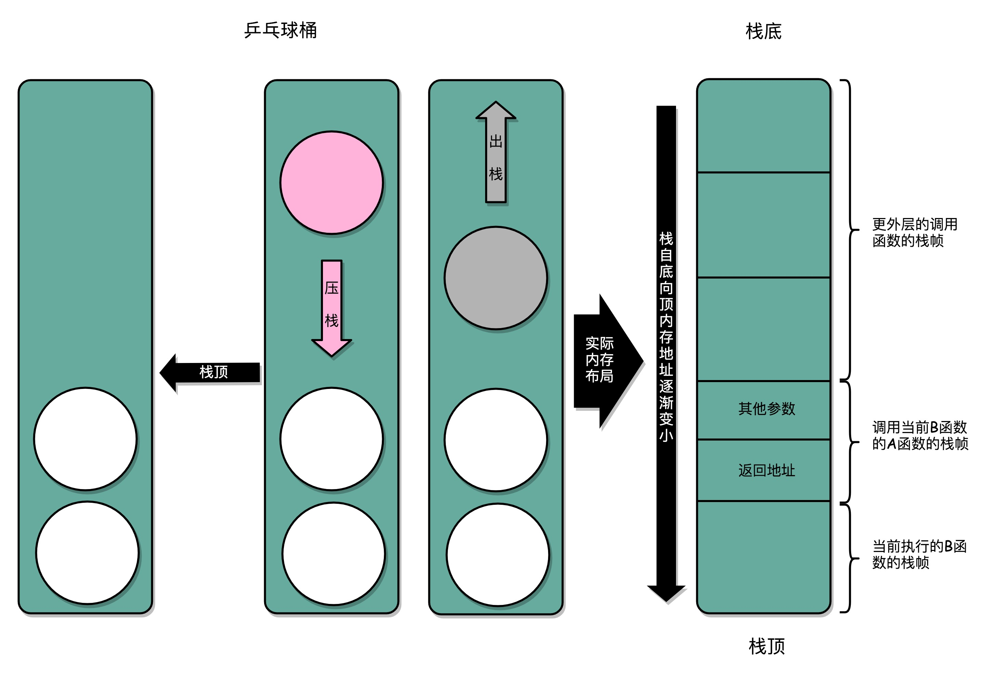
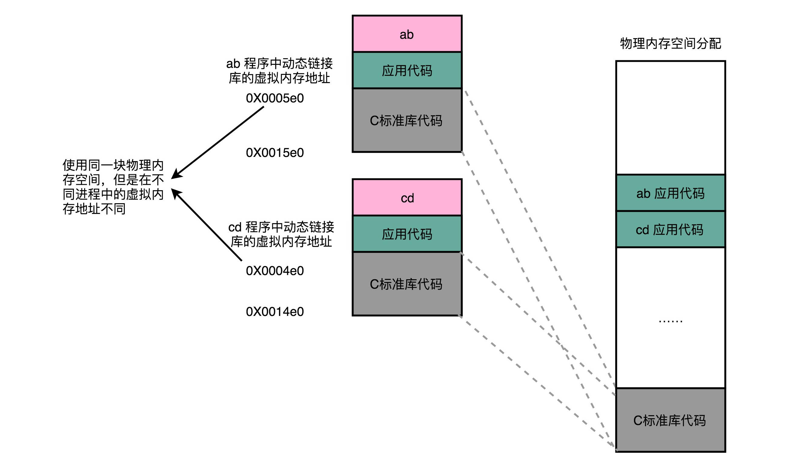
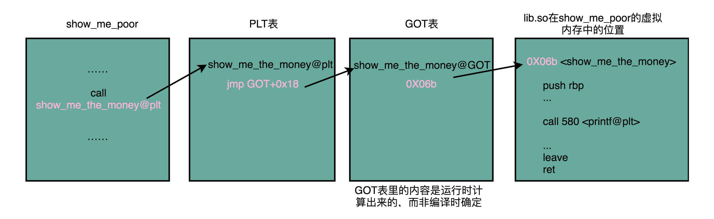
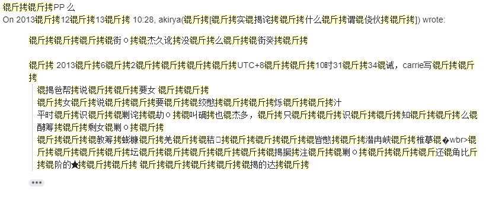
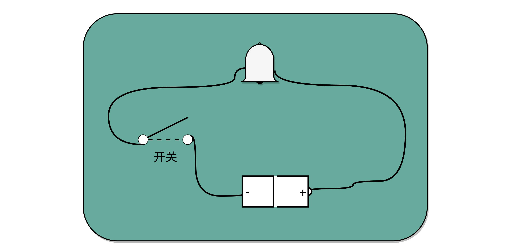
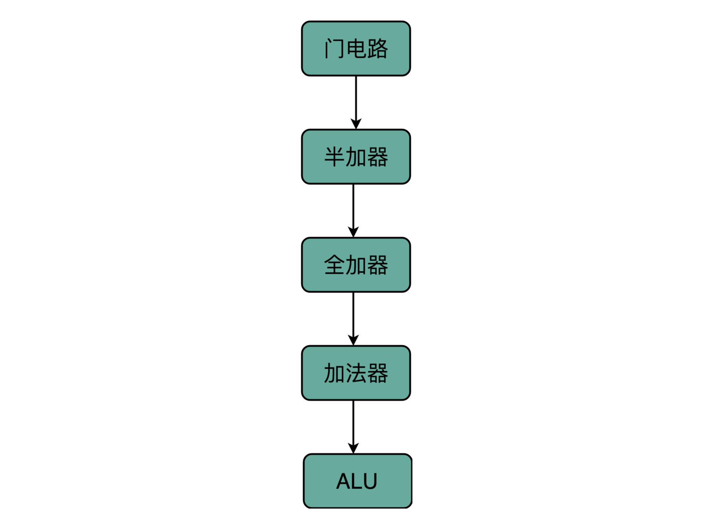

如果越早得弄清楚计算机的底层原理，在你的知识体系中“储蓄”起这些知识，也就意味着你有越长的时间来收货学习知识的利息。虽然一开始可能不起眼，但是随着时间带来的复利效应，你的长线投资项目，就能让你在成长的过程中越走越快。

# 1.冯诺依曼体系结构：计算机组成的金字塔

## 计算机硬件组成

要组装一台计算机，首先需要最核心的三大件：CPU、内存、主板。

**CPU**是计算机最核心配件，全名叫做中央处理器。计算机中所有的“计算”都是由CPU来进行的。自然CPU也是整个计算机中造价最昂贵的部分之一。CPU是一个超级精细的印刷电路板。

**内存**，所有测程序只有放在内存中才能被运行。内存越大能够加载的东西自然也越多。

**主板**，内存中程序和数据，需要被CPU读取，CPU计算之后还要写会内存。内存不能直接插在CPU上，于是就需要**主板**来连接两者了。主板的芯片组和总线解决了CPu和内存之间如何通信的问题。芯片组控制了数据传输的流转。总线则是数据传输的高速公路，总线速度决定了数据能传输多快。

有了以上三大件，再加上电源、IO设备、输出设备就是完整的计算机了。

**显卡**，显卡是除了CPU之外的另一个处理器，也就是GPU，GPU一样可以做各种”计算“的工作。

鼠标、键盘、硬盘都是插在主板上的，他们通过主板上的**南桥**芯片组来控制与CPU的通信。以前主板上通常有**北桥**来连接CPU、内存、显卡之间的通信，现在北桥已经被转移到CPU的内部。

## 冯诺依曼体系结构

现在市面上不管是手机还是pc机、pad都遵循冯诺依曼提出的**冯诺依曼体系结构**，也叫**存储程序计算机**。

**可编程**计算机。可编程指的是安装程序后是可以修改的，例如以前的计算器实际上就是不可编程的计算机。加减乘除运算被写入到硬件里面，一旦制作完毕无法修改。

**存储**式计算机。指程序本身存储在计算机内存中，可以通过加载不同程序来解决不同的问题。实际上最早的计算机是不可编程的非存储式的计算机。使用织带进行计算的计算机也是存储式计算机，不过程序是被存储在纸带上的。

计算机祖师爷冯诺依曼基于当时秘密开发的EDVAC谢了一片报告[First Draft of a Report on the EDVAC](https://en.wikipedia.org/wiki/First_Draft_of_a_Report_on_the_EDVAC),描述了计算机应该长什么样，这篇报告在历史上有个特殊的简称，叫做**First Draft**。

First Draft描述的计算机包括运算器、控制器、存储器、输入设备、输出设备，所有现代计算机也都是基于这个基础架构来设计开发的。

而所有的计算机程序，也都可以抽象为从**输入设备**读取输入信息，通过**运算器**和**控制器**来执行存储在存储器里的程序，最终把结果输出到**输出设备**中。而我们所有撰写的无论高级还是低级语言的程序，也都是基于这样一个抽象框架来进行运作的。

## 总结

可以说，冯·诺依曼体系结构确立了我们现在每天使用的计算机硬件的基础架构。因此，学习计算机组成原理，其实就是学习和拆解冯·诺依曼体系结构。

具体来说，学习组成原理，其实就是学习控制器、运算器的工作原理，也就是 CPU 是怎么工作的，以及为何这样设计；学习内存的工作原理，从最基本的电路，到上层抽象给到 CPU 乃至应用程序的接口是怎样的；学习 CPU 是怎么和输入设备、输出设备打交道的。

学习组成原理，就是在理解从控制器、运算器、存储器、输入设备以及输出设备，从电路这样的硬件，到最终开放给软件的接口，是怎么运作的，为什么要设计成这样，以及在软件开发层面怎么尽可能用好它。

**冯诺依曼机和图灵机的区别：**

- 图灵机是一种思想模型（计算机的基本理论基础），是一种有穷的、构造性的问题的问题求解思路，图灵认为凡是能用算法解决的问题也一定能用图灵机解决。图灵机不能模拟“所有”的计算过程，其实是解决的就是哪些“可计算”，哪些“不可计算”的问题。
- 冯诺依曼提出了“存储程序”的计算机设计思想，并“参照”图灵模型设计了历史上第一台电子计算机，即冯诺依曼机。

# 2.计算机组成原理学习方法

由图可知，整个计算机组成原理，实际就是围绕计算机是如何组织运作展开的。

学习过程是先学习计算机基本组成结构、计算机指令和运算、处理器设计、存储器和IO系统这样的步骤。

**最有效的方法不是短时间的冲刺，而是节奏的坚持。**

# 3. CPU主频

在整个计算机组成原理中，我们经常提到”性能“，但到底什么是性能呢？

计算机的性能，我们需要有个标准来衡量。这个标准主要有两个指标。第一是响应时间或者叫执行时间。第二是吞吐量或者叫做带宽。响应事件指执行一个程序，到底要花多长时间。花的时间越少，自然性能就越高；吞吐量指我们在一定时间范围内到底能做多少事，能处理的事情越多，自然性能就越高。（举例说明：一个人搬运重物或者多个人搬运重物；一个人搬一点和一个人搬很多）

## 计算机的计时单位：CPU时钟

`程序的CPU执行时间 = CPU时钟周期数 x 时钟周期时间`

我们先来理解一下什么是时钟周期时间。你在买电脑的时候，一定关注过 CPU 的主频。比如我手头的这台电脑就是 Intel Core-i7-7700HQ 2.8GHz，这里的 2.8GHz 就是电脑的主频（Frequency/Clock Rate）。这个 2.8GHz，我们可以先粗浅地认为，CPU 在 1 秒时间内，可以执行的简单指令的数量是 2.8G 条。

在我这个 2.8GHz 的 CPU 上，这个时钟周期时间，就是 1/2.8G。我们的 CPU，是按照这个“时钟”提示的时间来进行自己的操作。主频越高，意味着这个表走得越快，我们的 CPU 也就“被逼”着走得越快。

如果你自己组装过台式机的话，可能听说过“超频”这个概念，这说的其实就相当于把买回来的 CPU 内部的钟给调快了，于是 CPU 的计算跟着这个时钟的节奏，也就自然变快了。当然这个快不是没有代价的，CPU 跑得越快，散热的压力也就越大。就和人一样，超过生理极限，CPU 就会崩溃了。

对于 CPU 时钟周期数，我们可以再做一个分解，把它变成“指令数×每条指令的平均时钟周期数（Cycles Per Instruction，简称 CPI）”。不同的指令需要的 Cycles 是不同的，加法和乘法都对应着一条 CPU 指令，但是乘法需要的 Cycles 就比加法要多，自然也就慢。在这样拆分了之后，我们的程序的 CPU 执行时间就可以变成这样三个部分的乘积。

`程序的 CPU 执行时间 = 指令数×CPI×Clock Cycle Time`

因此，如果我们想要解决性能问题，其实就是要优化这三个。

1. 时钟周期时间，就是计算机主频，这个取决于计算机硬件。我们所熟知的摩尔定律就一直在不停地提高我们计算机的主频。比如说，我最早使用的 80386 主频只有 33MHz，现在手头的笔记本电脑就有 2.8GHz，在主频层面，就提升了将近 100 倍。
2. 每条指令的平均时钟周期数 CPI，就是一条指令到底需要多少 CPU Cycle。在后面讲解 CPU 结构的时候，我们会看到，现代的 CPU 通过流水线技术（Pipeline），让一条指令需要的 CPU Cycle 尽可能地少。因此，对于 CPI 的优化，也是计算机组成和体系结构中的重要一环。
3. 指令数，代表执行我们的程序到底需要多少条指令、用哪些指令。这个很多时候就把挑战交给了编译器。同样的代码，编译成计算机指令时候，就有各种不同的表示方式。

> 我们可以把自己想象成一个CPU，坐在那里写程序。计算机主频就好像是你的打字速度，打字越快，你自然可以多写一点程序。CPI相当于你写程序时候，熟悉各种快捷键，越是打同样的内容，需要敲击键盘次数就越少。指令数相当于你的程序设计的够合理，同样的程序要写的代码行数就少。如果三者都能实现，你自然可以很快的写出一个优秀的程序，你的性能从外面来看就是好的。

其实晶振时间是固定处理一个cpu简单指令的，CPI的平均时间是用来描述复杂指令的，指令数同样也是，其实整个公式如果用用简单指令来描述可能更容易理解一些.

为了理解简单可以暂且认为就是晶振在触发一条一条电路变化指令，就好像你拨算牌盘的节奏一样。算盘拨得快，珠算就算得快。结果就是一条简单的指令需要的事件就和一个时钟周期一样，实际这个问题要比这样一句话复杂很多。一方面，其实时钟周期应该是放下最复杂的一条指令的时间长度。我们是通过流水线来提升cpi的。我会在讲解cpu的部分更深入讲解始终信号和计数器，让大家能够理解cpu到底是怎么回事儿。

# 4.我们该工哪些方面提升性能

上节课程得到一个公式`程序的 CPU 执行时间 = 指令数×CPI×Clock Cycle Time`,那么我们可以从指令数、CPI、CPU主频三个地方入手。实际上从上个世纪80年代，CPU设计师就挑了CPU这个软柿子。在CPU中多放一点晶体管，不断提升CPU的时钟频率，这样就能让CPU变得更快，程序执行时间更短。

从80年代开始的20年内，CPU主频增长了300倍，而从00年开始至今的20年，CPU主频增长了3倍。目前为止，CPU主频的增长已经见顶了。

## 4.1 CPU的“人体极限”

## 4.2 为什么CPU主频无法保持增长呢？因为功耗问题。

我们的CPU，一般都被叫做 **超大规模集成电路**。这些电路，实际上都是一个个晶体管组合而成的。CPU的计算，其实就是让晶体管里面的开关不停的打开和关闭，来组合完成各种运算和功能。

想要计算的快，一方面我们要在CPU里，同样的面积里面，多方一些晶体管，也就是增加密度；另一方面，我们要让晶体管打开和关闭的快一点，也就是提升主频。而这两者都会增加功耗，带来耗电和散热问题。

那么我们为什么不能将CPU造大一点呢？CPU变大之后，信号在CPU内部传递也是需要时间的，造大之后传输速度反而会变得更慢。

那么，为了要提升性能，我们需要不断地增加晶体管数量。同样的面积下，我们想要多放一点晶体管，就要把晶体管造得小一点。这个就是平时我们所说的提升“制程”。从 28nm 到 7nm，相当于晶体管本身变成了原来的 1/4 大小。这个就相当于我们在工厂里，同样的活儿，我们要找瘦小一点的工人，这样一个工厂里面就可以多一些人。我们还要提升主频，让开关的频率变快，也就是要找手脚更快的工人。

并行优化，理解阿姆达尔定律

从奔腾 4 开始，Intel 意识到通过提升主频比较“难”去实现性能提升，边开始推出 Core Duo 这样的多核 CPU，通过提升“吞吐率”而不是“响应时间”，来达到目的。

提升响应时间，就好比提升你用的交通工具的速度，比如原本你是开汽车，现在变成了火车乃至飞机。本来开车从上海到北京要 20 个小时，换成飞机就只要 2 个小时了，但是，在此之上，再想要提升速度就不太容易了。我们的 CPU 在奔腾 4 的年代，就好比已经到了飞机这个速度极限。这种提升性能的方法叫做 **通过并行提高性能**。

> **阿达姆定律**：对于一个程序进行优化后，处理器并行运算之后效率提升情况。具体可以用一个公式表示`优化后的执行时间 = 受优化影响的执行时间 / 加速倍数 + 不受影响的执行时间`.

## 4.3 总结

在“摩尔定律”和“并行计算”之外，在整个计算机组成层面，还有这样几个原则性的性能提升方法。

1. 加速大概率事件。最典型的就是，过去几年流行的深度学习，整个计算过程中，99% 都是向量和矩阵计算，于是，工程师们通过用 GPU 替代 CPU，大幅度提升了深度学习的模型训练过程。本来一个 CPU 需要跑几小时甚至几天的程序，GPU 只需要几分钟就好了。Google 更是不满足于 GPU 的性能，进一步地推出了 TPU。后面的文章，我也会为你讲解 GPU 和 TPU 的基本构造和原理。
2. 通过流水线提高性能。现代的工厂里的生产线叫“流水线”。我们可以把装配 iPhone 这样的任务拆分成一个个细分的任务，让每个人都只需要处理一道工序，最大化整个工厂的生产效率。类似的，我们的 CPU 其实就是一个“运算工厂”。我们把 CPU 指令执行的过程进行拆分，细化运行，也是现代 CPU 在主频没有办法提升那么多的情况下，性能仍然可以得到提升的重要原因之一。我们在后面也会讲到，现代 CPU 里是如何通过流水线来提升性能的，以及反面的，过长的流水线会带来什么新的功耗和效率上的负面影响。
3. 通过预测提高性能。通过预先猜测下一步该干什么，而不是等上一步运行的结果，提前进行运算，也是让程序跑得更快一点的办法。典型的例子就是在一个循环访问数组的时候，凭经验，你也会猜到下一步我们会访问数组的下一项。后面要讲的“分支和冒险”、“局部性原理”这些 CPU 和存储系统设计方法，其实都是在利用我们对于未来的“预测”，提前进行相应的操作，来提升我们的程序性能。

# 5.计算机指令:试试纸带编程

如图所示，早期的计算机程序都是通过纸带来进行编程的。人们在特定的位置上打孔或者不打孔代表0或者1。至今CPU仍然不能理解高级编程语言，我们用高级语言编写的程序最终会编程0、1这样的机器码指令。

## 5.1 软硬件接口中，cpu帮我们做了什么？

CPU（Center Processing Unit）就是计算机的大脑，就是中央处理器。

**从硬件上看**，cpu是一个超大规模集成电路，通过电路实现了加法、乘法、乃至各种各样的处理逻辑。

**从软件上看**，cpu就是一个执行各种计算机指令的逻辑机器。这里的**计算机指令**就好比是一门cpu能够听得懂的语言，我们可以把它称为**机器语言**。

不同cpu能够听懂的语言也不太一样。比如我们个人电脑用的intel的cpu，苹果手机用的是ARM的cpu。这两者能够听懂的语言就不太一样。类似这种cpu各自支持的语言，就是两组不同的**计算机指令集**。

一个计算机程序，不可能只有一条指令，而是由成千上万条指令组成的。但是cpu里面不能一直存放所有指令，所以计算机程序平时就是存储在存储器中的。这种程序指令存储在存储器里面的计算机，我们就叫做**存储程序计算机**。

## 5.2 从编译到汇编，diamante怎么变成机器码？

要让一个程序在操作系统上跑起来，我们需要把整个程序翻译成汇编语言的程序，这个过程我们一般叫编译成汇编代码。

针对汇编代码，我们可以用汇编器翻译成机器码。这些机器码由0、1组成的机器语言表示。这一条条的机器码，就是一条条的**计算机指令**。这样一串串的16进制数字，就是我们cpu能够真正认识的计算机指令。

**汇编代码和机器码之间是一一对应的。**汇编代码其实就是“给程序员看的机器码”，其存在的目的就是方便程序员阅读。相同的汇编代码如果需要运行在不同的cpu架构上，那么可以翻译成不同的机器码。

从高级语言到汇编代码，再到机器码，就是一个日常开发程序最终编程cpu可以执行的计算机指令的过程。

## 5.3 解析指令和机器码

我们平时用的intel cpu，有2000条左右的指令。一般来说，常见的指令可以分为五大类。

1. **算术类指令**：我们的加减乘除，在cpuy层面，都会编程一条条算术指令。
2. **数据传输类指令**：给变量赋值、在内存中读写数据，用的都是数据传输类指令。
3. **逻辑类指令**：逻辑上的与或非，都是这一类指令。
4. **条件分支指令**：if/else、switch，其实都是条件分支类指令。
5. **无条件跳转指令**：一些函数调用或者方法调用，其实就是发起一个无条件跳转指令。

使用纸带进行编程，实际上是我们直接在纸带上写不同的cpu指令。

# 6.指令跳转：原来if/else就是goto

## 6.1 cpu是如何执行指令的

拿我们用的intel CPU来讲，里面差不多几百亿个晶体管。实际上，一条条计算机指令执行起来非常复杂。好在cpu在软件层面上已经为我们做好了封装。

在逻辑上，我们可以认为，cpu其实就是由一堆寄存器组成的。而寄存器就是cpu的内部。，由多个触发器或者锁存器组成的简单电路。

触发器和锁存器，其实就是两种不同原理的数字电路组成的逻辑门。n个触发器或者锁存器就可以组成一个n位的寄存器，能够保存n位的数据。比如我们用的64位的intel服务器，寄存器就是64位的。

一个cpu中一般有很多种不同功能的寄存器。比较特殊的有三种：

1. **PC寄存器**：也叫指令地址寄存器，就是用来存放下一条需要执行的计算机指令的内存地址。
2. **指令寄存器**：用来存放当前正在执行的指令。
3. **条件码寄存器**：用一个一个的标记位存放cpu进行算数或者逻辑计算的结果。

除了这些特殊的寄存器，CPU 里面还有更多用来存储数据和内存地址的寄存器。这样的寄存器通常一类里面不止一个。我们通常根据存放的数据内容来给它们取名字，比如整数寄存器、浮点数寄存器、向量寄存器和地址寄存器等等。有些寄存器既可以存放数据，又能存放地址，我们就叫它通用寄存器。

## 6.2 总结

除了简单的通过PC寄存器自增方式顺序执行外，条件寄存器会记录下当前执行指令的条件判断状态，然后通过跳转指令读取对应的条件码，修改pc寄存器内的下一条指令的地址，最终实现if/else以及for/while这样的程序控制流程。

你会发现，虽然我们可以用高级语言，可以用不同的语法，比如`if…else…`这样的条件分支，或者while/for这样的循环分支，来实现不同的程序运行流程，但是回归到计算机可以识别的机器指令级别，其实都只是一个简单的地址跳转而已，也就是一个类似于goto的语句。

想要在硬件层面上来实现这个goto语句，除了本身需要保存下一条指令地址，以及当前正要执行指令的pc寄存器，指令寄存器外，我们只需要再增加一个条件码寄存器，来保留条件判断的状态。这样简简单单的三个寄存器，就可以实现条件判断和循环重复执行代码功能。

# 7.函数调用：为什么会发生stack overflow？

## 7.1 为什么我们需要程序栈

在开发过程中我们无法避免使用函数调用。函数调用不同于if…else判断，if…else判断之后跳转到新的地址后不需要返回原地址；但是函数调用需要在调用结束后跳转回原地址继续执行。而函数调用的函数可能调用了别的函数，函数调用是层层嵌套的。需要需要实现这样的功能，那么我们需要记录下每个函数跳转前执行代码地址位置。如果使用PC寄存器类似方法，专门设立一个程序调用寄存器来存储接下来要跳转回来执行的指令地址，等到函数调用结束，从这个寄存器取出气质，再跳转到新的地址就好了。但是在多层函数调用中，简单只记录一个地址也是不够的，而我们cpu中寄存器数量并不多。调用层数多了就不够使了，因此这种方法无效。

最终，计算机科学家想到了一个比单独记录跳转回来地址更完善的办法。我们在内存里面开辟一段空间，用栈这个 **后进先出**的数据结构。站那就像一个乒乓球桶，每次函数调用之前，我们都把调用返回后的地址写到一个乒乓球上，然后塞进这个球桶中。其实这个操作就是我们常说的**压栈**。如果函数执行完毕，我们就从球桶中取出最上面的哪个乒乓球，这就是**出栈**。

在真实的程序里，压栈的不只有函数调用完成后的返回地址。比如函数 A 在调用 B 的时候，需要传输一些参数数据，这些参数数据在寄存器不够用的时候也会被压入栈中。整个函数 A 所占用的所有内存空间，就是函数 A 的 **栈帧**（Stack Frame）。Frame 在中文里也有“相框”的意思，所以，每次到这里，我都有种感觉，整个函数 A 所需要的内存空间就像是被这么一个“相框”给框了起来，放在了栈里面。

**总的来说，使用程序栈是为了解决函数层层嵌套的问题。**

## 7.2 如何自行构造一个stack overflow？

首先栈空间是从高向低扩展的，栈空间的大小是有限的。如果我们不停的递归调用一个函数，那么就能制造栈溢出了。

## 7.3 如何利用内联进行性能优化？

实际上，一个常见的编辑器进行自动优化的场景，我们通常叫做 **函数内联**。函数内联只讲函数调用的地方替换成函数体执行的具体代码。

*  函数内联的优点：避免了函数调用时候的跳转，避免开辟新的栈帧，存储形参等，一定程度上提升代码的执行效率。
* 函数内联的缺点：如果函数比较长，并且函数在很多地方都有调用，那么内联将增加程序的体积。

# 8. ELF和静态链接：为什么程序无法同时在Linux和Windows下运行

既然我们的程序最终都是变成一条条的机器码去执行，那为什么同一个程序，在同一台计算机上，在linux下可以执行，而在windows下就不行了？反过来同样也不行？

## 8.1 编译、链接和装载：拆解程序执行

实际上，**C语言代码-汇编代码-机器码**这个过程，在我们的计算机上进行的时候是由两部分组成的。

1. 编译、汇编以及链接三个阶段组成，在这三个阶段完成之后，我们就生成了一个可执行文件。
2. 我们通过装载器把可执行文件装载到内存中。cpu从内存中读取指令和数据，来来时真正执行函数。

具体的过程如下图所示：

经过汇编器编译后代码是并不是一个可执行文件，而是目标文件。只有通过连接器把多个目标文件以及调用的各种函数库链接起来，我们才能得到一个可执行文件。

## 8.2 ELF格式和链接：理解链接过程

在linux下，可执行文件和目标文件都使用一种叫做ELF（Execuatable and Linkable Format）的文件格式，中文名字叫做 **可执行与可连接文件格式**，这里面不仅存放了编译成的汇编指令，还保留了很多别的数据。

比如我们过去所有 objdump 出来的代码里，你都可以看到对应的函数名称，像 add、main 等等，乃至你自己定义的全局可以访问的变量名称，都存放在这个 ELF 格式文件里。这些名字和它们对应的地址，在 ELF 文件里面，存储在一个叫**作符号表（Symbols Table）**的位置里。符号表相当于一个地址簿，把名字和地址关联了起来。

ELF文件格式结构图如下所示：

连接器会搜索所有输入的目标文件，然后把所有包含的符号信息收集起来，构成一个全局的符号表，再根据重定向表，把所有不确定要跳转地址的代码，根据符号表中存储的地址，进行一次修正。最后，把所有的目标文件对应段进行一次合并，编程了最终的可执行代码。这就是为什么可执行文件里面的函数调用地址是正确的。

在连接器把程序变成可执行文件之后，要装载器去执行程序就容易多了。装载器不再需要考虑跳转问题，只需要解析ELF文件，把对应的指令和数据加载到内存中供CPU执行就可以了。

## 8.3 为什么程序无法同时在Linux和Windows下运行

今天学习到Linux下可执行文件是ELF格式的，而Windows下可执行文件是PE都得文件格式。Linux装载器只能装载ELF格式文件，而不同解析PE格式。这就是原因。

> 为什么程序无法同时在Linux和Windows下运行
>
> Java是通过实现不同平台上的虚拟机，然后即时翻译javac生成的中间代码来做到跨平台的。跨平台的工作被虚拟机开发人员来解决了.

# 9.程序装载：640K内存真的不够用么？

## 9.1 程序装载面临的挑战

我们通过连接器，把多个文件合并成一个最终可执行文件。在运行这些可执行文件时候，我们其实需要一个装载器，解析ELF或者PE格式的可执行文件。装载器会把对应的指令和数据加载到内容里面来，让CPU去执行。

实际上，装载器要满足两个需求：

1. **可执行程序加载后占用内容空间应该是连续的。**执行指令时候，程序计数器是顺序一条一条指令进行下去的。这就意味着，这一条指令需要连续的存储在一起。
2. **我们需要同时加载很多个程序，并且不能让程序自己规定在内存中加载的位置。**虽然编译出来的指令里已经有了对应的各种各样的内存地址，但是实际加载时候，我们其实没办法确保，这个程序一定加载在哪一段内存地址上。因为我们现在计算机通常会运行很多的程序，可能你想要的内存地址已经被其它加载了的程序占用了。

我们很容易想到一个办法，我们可以再内存里面，找到一段连续的内存空间，然后分配给装载的程序，然后把这段连续的内存空间地址，和整个程序指令里指定的内存地址做一个映射。我们把指令里的内存地址叫做 **虚拟内存地址**，实际在内存硬件里的空间地址，我们叫做 **物理内存地址**。

程序里有指令和各种内存地址，我们只需要关心虚拟内存地址就行了。对于任何一个程序来说，它看到的都是同样的内存地址。我们维护一个虚拟内存到物理内存的映射表，这样实际程序指令执行的时候，会通过虚拟内存地址，找到对应的物理内存地址，然后执行。因为是连续的内存地址空间，所以我们只需要维护映射关系的起始地址和对应的空间大小就可以了。

## 9.2 内存分段

像这种，找出一段连续物理内存和虚拟内存地址进行映射的方法，我们叫**分段**。这里的段指系统分配出来那个连续的内存空间。

内存分段方法，解决了程序本身不需要关心具体物理内存地址的问题，但是它也引入了其它的问题。第一个问题是**内存碎片**问题。针对内存碎片问题可以通过 **内存交换**来解决。

虚拟内存、分段，再加上内存交换，看起来似乎已经解决了计算机同时装载运行很多个程序的问题。不过，你千万不要大意，这三者的组合仍然会遇到一个性能瓶颈。硬盘的访问速度要比内存慢很多，而每一次内存交换，我们都需要把一大段连续的内存数据写到硬盘上。所以，如果内存交换的时候，交换的是一个很占内存空间的程序，这样整个机器都会显得卡顿。

## 9.3 内存分页

既然问题出在内存碎片和内存交换的空间太大上，那么解决办法就是，少出现一些内存碎片，另外，当需要进行内存交换的时候，让需要交换写入或者从磁盘装载的数据少一掉，这样就可以解决这个问题。这个办法，在现代计算机内存管理里面，叫做内存分页。

**和分段这样分配一整段连续内存空间给到程序相比，分页是把整个物理内存空间切成一段段固定尺寸大小。**而真个程序所占用的虚拟内存空间，同样被切成一段一段固定尺寸大小。这样连续并且尺寸固定的内存空间，我们叫**页**。从虚拟内存到物理内存的映射，不再是拿整段连续内存的物理地址，而是按照一个一个页来的。页的尺寸远小于整个程序的大小。在Linux下，我们通常只设置成4kb。

分页的方法，使得我们在加载程序时候，，不再需要一次性把程序加载到物理内存中，我们完全可以再进行虚拟内幕才能和物理内存页之间的映射后，并不真的把页加载到内存中，而是只在程序运行中，需要用到对应虚拟内存页里面的指令和数据时候，再加载到物理内存中。

实际上，我们的操作系统，的确是这么做的。当要读取特定的页，却发现数据并没有加载到物理内存里的时候，就会触发一个来自于 CPU 的**缺页错误**（Page Fault）。我们的操作系统会捕捉到这个错误，然后将对应的页，从存放在硬盘上的虚拟内存里读取出来，加载到物理内存里。这种方式，使得我们可以运行那些远大于我们实际物理内存的程序。同时，这样一来，任何程序都不需要一次性加载完所有指令和数据，只需要加载当前需要用到就行了。

通过虚拟内存、内存交换和内存分页这三个技术的组合，我们最终得到了一个让程序不需要考虑实际的物理内存地址、大小和当前分配空间的解决方案。这些技术和方法，对于我们程序的编写、编译和链接过程都是透明的。这也是我们在计算机的软硬件开发中常用的一种方法，**就是加入一个间接层。**

通过引入虚拟内存、页映射和内存交换，我们的程序本身，就不再需要考虑对应的真实的内存地址、程序加载、内存管理等问题了。任何一个程序，都只需要把内存当成一块完整而连续的空间来使用。

> 在 Java 这样使用虚拟机的编程语言里面，我们写的程序是怎么装载到内存里面来的呢？它也和我们讲的一样，是通过内存分页和内存交换的方式加载到内存里面来的么？
>
> 答：jvm已经是上层应用，无需考虑物理分页，一般更直接是考虑对象本身的空间大小，物理硬件管理统一由承载jvm的操纵系统去解决吧。

# 10. 动态链接：程序内部的“共享单车”

## 10.1 链接分为动、静，共享运行省内存

上一节解决程序装载到内存时候，讲了很多方法。最根本的问题其实就是**内存空间不够用**。如果我们能够让同样功能的代码，在不同的程序里面，不需要各占一份内存空间，那多好呀！这个思路引入了一种新的链接方法，叫做 **动态链接**。相应的，我们之前说的合并代码段的方法，就是**静态链接**。

在动态链接中，我们想要链接的，不是存储在硬盘上的目标代码，而是加载到内存中的**共享库**。

在wins平台下，这些共享库文件是.dll文件（Dynamic-Link Libary）；在linux下，这些共享库是.so文件(Shared Libraries)。

## 10.2 地址无关很重要，相对地址解烦恼

要想要在程序运行的时候共享代码，也是有一定要求的，就是这些机器码必须是**“地址无关”**的。也就是说，我们编译出来的共享文件的指令代码，是地址无关码。换句话说，这段代码，无论加载到哪个内存地址，都能够正常执行。如果不是这样，就是地址相关的代码。

对于所有动态链接共享库的程序来讲，虽然我们的共享库用的都是同一段物理内存地址，但是在不同的应用程序中，它的虚拟内存地址是不同的。我们没办法、也不应该要求动态链接同一个共享库的不同程序，必须把这个共享库所使用的虚拟内存地址变成一致。如果这样的话，我们写的程序就必须明确地知道内部的内存地址分配。

那么如何实现，动态共享库编译出来的代码指令，都是地址无关的呢？

动态代码库内部的变量和函数调用都很容易解决，我们只需要使用相对地址就好了。各种指令中使用的内存地址，给出的不是一个绝对的地址空间，而是一个相对于当前指令偏移量的内存地址。因为整个共享库是放在一段连续的虚拟内存地址中的，无论装载到哪一段地址，不同指令之间的相对地址都是不变的。

## 10.3 PLT和GOT，动态链接解决方案

我们程序在编译时候会确定，如果程序中调用了动态链接库中的代码，那么就会生成一个PLT表，PLT表实际上是以一段一段的代码段的形式存在的。编译后存放在源程序代码中。PLT表也就是 **程序链接表(Procedure Link Table)**。

在动态链接库库中的`data section`中，保存了一张**全局偏移表（GOT，Golbal Offset Table）**。虽然共享库的代码部分的物理内存是共享的，但是数据部分是各个动态链接它的应用程序里面各加载一份的。所有需要引用当前共享库外部的地址的指令，都会查询GOT，来找到当前运行程序的虚拟内存中的对应位置。而GOT中数据，则是我们加载一个个共享库时候写进去的。

这样，虽然不同的程序调用的同样的动态库，各自的内存地址是独立的，调用的又都是同一个动态库，但是不需要去修改动态库里面的代码所使用的地址，而是各个程序各自维护好自己的 GOT，能够找到对应的动态库就好了。

我们的 GOT 表位于共享库自己的数据段里。GOT 表在内存里和对应的代码段位置之间的偏移量，始终是确定的。这样，我们的共享库就是地址无关的代码，对应的各个程序只需要在物理内存里面加载同一份代码。而我们又要通过各个可执行程序在加载时，生成的各不相同的 GOT 表，来找到它需要调用到的外部变量和函数的地址。

> 想要更加深入地了解动态链接，我推荐你可以读一读**《程序员的自我修养：链接、装载和库》**的第 7 章，里面深入地讲解了，动态链接里程序内的数据布局和对应数据的加载关系。

PLT存在的意义是**延迟绑定**。动态链接比静态链接慢的主要原因是动态链接下对于全局和静态数据访问都要通过GOT，然后再通过间接跳转；另一方面，动态链接的链接工作在运行时完成，即程序开始执行时，动态链接器都要进行一次链接工作，动态连接器需要巡展并装载所需要的共享对象，然后进行符号查找地址重定位等工作。ELF为了优化这种浪费，采用了延迟绑定的做法，基本思想就是 **函数第一次被用到时候才进行绑定**，如果没有用到就一直不进行绑定。这种做法可以大大的加快程序的启动速度，这种做法特别有利于一些有大量函数引用和大量模块的程序。

# 11. 二进制编码：手持两把锟斤拷，口中疾呼烫烫烫

现代计算机都是用0和1组成的二进制来表示所有的信息。我们存储在内存中的字符串、整数、浮点数都是用二进制表示的。万事万物在计算机里都是0和1组成的，所以，搞清楚各种数据在二进制层面是怎么表示的，是我们必备的一课。

## 11.1 理解二进制的“逢二进一”

二进制和我们平时用的十进制，其实并没有什么本质区别，只是平时我们是逢十进一，这里变成了逢二进一。

二进制转十进制：比如 0011 这个二进制数，对应的十进制表示，就是 `0×2^3+0×2^2+1×2^1+1×2^0=3`，代表十进制的3.

十进制转二进制：使用短除法即可。

在计算机的整数表示中，一般使用补码的方式表示整数，这样可以节省空间，不会浪费任何一个bit位。正数的补码是它本身；负数的补码是其`原码除了符号位其他位取反+1`;

使用补码来表示负数，使得我们的整数相加变得很容易，不需要做任何特殊处理，只把它当成普通的二进制相加就能得到正确的结果。

例如-5 + 1 = -4，-5 + 6 = 1。

## 11.2 字符串的表示，从编码到数字

字符集，表示的可以是字符的一个集合。比如我们日常说的Unicode，其实就是一个字符集，包含了150种语言的14w个不同的字符。

同样的文本，采用不同的编码存储下来。如果另外一个程序，用一种不同的编码方式来进行解码和展示，就会出现乱码。就好像两个军队用密语通信，如果用错了密码本，看到的消息就会不知所云。在中文世界里，最常见的就是“手持两把锟斤拷，口中疾呼烫烫烫”。

首先，“锟斤拷”的来源是这样的。如果我们想要用 Unicode 编码记录一些文本，特别是一些遗留的老字符集内的文本，但是这些字符在 Unicode 中可能并不存在。于是，Unicode 会统一把这些字符记录为 U+FFFD 这个编码。如果用 UTF-8 的格式存储下来，就是\xef\xbf\xbd。如果连续两个这样的字符放在一起，\xef\xbf\xbd\xef\xbf\xbd，这个时候，如果程序把这个字符，用 GB2312 的方式进行 decode，就会变成“锟斤拷”。这就好比我们用 GB2312 这本密码本，去解密别人用 UTF-8 加密的信息，自然没办法读出有用的信息。

而“烫烫烫”，则是因为如果你用了 Visual Studio 的调试器，默认使用 MBCS 字符集。“烫”在里面是由 0xCCCC 来表示的，而 0xCC 又恰好是未初始化的内存的赋值。于是，在读到没有赋值的内存地址或者变量的时候，电脑就开始大叫“烫烫烫”了。

## 11.3 总结

我们可以用二进制表示任意的信息。只要简历字符集和字符编码，并且得到大家的认同，我们就可以再计算机里面表示这样的信息了。

# 12. 理解电路：从电报机到门电路，我们如何做到千里传信？

## 12.1 从信使到电报，我们怎么做到千里传书？

从信息编码的角度来说，以前的烽火台、灯塔都雷速电报的二进制编码。电报传输的信息有两种，一种是短促的 **点信号**，一种是长一点的 **划信号**。我们把点当成1，把划当成0.这样，我们电报信号就是另一种特殊的二进制编码了。

电报机的原理非常简单。电报机本质上就是一个 **蜂鸣器+长长的电线+按钮开关**。蜂鸣器装在接收方手里，开关留在发送方手里。双方用长长的电线连在一起。当按钮开关按下时候，电路就接通了，蜂鸣器就会响。短促的按下，就死一个短促的点信号；按的时间稍微长一点，就是一个稍长的划信号。

## 12.2 理解继电器，给跑不动的信号续一秒

有了电报机，只要铺设好电报线路，就可以传输我们需要的讯息了。但是这里面又出现一个新的问题，随着电线线路越长，电线的电阻就越大。当电阻很大，而电压不够的时候，即使你按下开关，蜂鸣器也不会响。

实际上有个叫做 **继电器**的设备，可以用来做这件事情。我们把原先用来输出声音的蜂鸣器，换成一段环形的螺旋线圈，让电路封闭通上电。因为电磁效应，这段螺旋线圈会产生一个带有磁性的电磁场。我们原本需要输入的按钮开关，就可以用一块磁力稍弱的磁铁把它设在“关”的状态。这样，按下上一个电报站的开关，螺旋线圈通电产生了磁场之后，磁力就会把开关“吸”下来，接通到下一个电报站的电路。如下图所示。

## 12.3 总结

可以说，电报是现代计算机的一个最简单的原型。它和我们现在使用的现代计算机有很多相似之处。我们通过电路的“开”和“关”，来表示“1”和“0”。就像晶体管在不同的情况下，表现为导电的“1”和绝缘的“0”的状态。

我们通过电报机这个设备，看到了如何通过“螺旋线圈 + 开关”，来构造基本的逻辑电路，我们也叫门电路。一方面，我们可以通过继电器或者中继，进行长距离的信号传输。另一方面，我们也可以通过设置不同的线路和开关状态，实现更多不同的信号表示和处理方式，这些线路的连接方式其实就是我们在数字电路中所说的门电路。而这些门电路，也是我们创建 CPU 和内存的基本逻辑单元。我们的各种对于计算机二进制的“0”和“1”的操作，其实就是来自于门电路，叫作组合逻辑电路。

# 13. 加法器：如何像乐高一样搭电路（上）

上一节，我们看到如何通过电路，在计算机硬件层面设计最基本的单元，门电路。下面是一些门电路的标识：

这些基本的门电路，是我们计算机硬件段的最基本的积木，就好像乐高积木里面最简单的小方块。看起来不起眼，但是把他们组合起来，最终可以搭出一个星球大战里航天母舰。我们今天包含十亿级别晶体管的现代CPU，都是由这样一个一个的门电路组合而成的。

## 总结

我们想要搭建一个摩天大楼，我们需要很多很多楼梯，但是这个时候，我们已经不再关注最基础的一节楼梯是怎么用一块块积木搭建起来的。这其实就是计算机中，无论是软件还是硬件中很重要的设计思想，**分层**。

从简单到复杂，我们一层一层搭出了拥有更强能力的功能组件。在上面一层，我们只需要考虑怎么用下一层的组件搭建出自己的功能，而不需要下沉到更低的其他组件。就像你之前并没有深入学习计算机组成原理，一样可以直接通过高级语言撰写代码，实现功能。

在硬件层面，我们通过门电路、半加器、全加器一层层搭出了加法器这样的功能组件。我们把这些用来做算术逻辑计算的组件叫作 ALU，也就是算术逻辑单元。当进一步打造强大的 CPU 时，我们不会再去关注最细颗粒的门电路，只需要把门电路组合而成的 ALU，当成一个能够完成基础计算的黑盒子就可以了。

# 14. 乘法器：如何像乐高一样搭电路（下）

好吧，我承认，这块看起来对我来说有一定的难度。目前这个阶段不打算在这块花费太多的时间，因此，乘法器的详细实现步骤就不做学习记录了。目前我只想简单的了解，乘法在计算机中大概的实现逻辑，仅此而已。

这一节主要讲，通过前面两节讲的ALU电路和门电路，搭建出来了乘法器。

我们也看到，通过精巧的设计电路，用较少的门电路和寄存器，就能计算完成乘法这样相对复杂的运算。使用更简单的电路，但是需要更长的门延迟和时钟周期；还是用更复杂的电路，但是更短的门延迟和时钟周期来计算一个复杂指令，这之间的权衡，其实就是计算机体系结构中RISC和CISC经典历史路线之争。

# 15. 浮点数和定点数（上）：怎么用有限的Bit表示尽可能多的信息？

## 15.1 定点数

有一个很直观的想法，就是我们用4个bit来表示0~9的整数，那么32个bit就可以表示8个这样的整数。然后我们把右边的2个0~9的整数，当成是小数部分；把坐标6个0~9的整数，当成是整数部分。这样，我们可以用32个bit，来表示0~999999.99这样1亿个实数了。

这种用二进制表示十进制的编码方式，叫做 **BCD编码**。其实在超市、银行系统使用这种方式计数还是非常普遍的。但是这种表示方式有几个缺点：

1. **这种表示方式有点浪费。**本来32bit能够表示40亿个数，但是在BCD编码下，只能表示1亿个数。如果需要更加精确的小数，BCD编码也无法实现。
2. **这种表示方式没办法同时表示很大的数字和很小的数字。**

## 15.2 浮点数

float类型也就是浮点数，可以解决上面的两个问题。

在计算机中，我们同样可以使用科学计数法来表示实数。

如上图所示，一个单精度的32bit浮点数可以分为三部分：

1. 符号位（s）：占用1个bit，用来表示是正数还是负数。一般用s表示，在浮点数中，不管是正数还是负数都是有符号位的。
2. 指数位（e）：一般用e表示。占用8bit，表示范围0~255，这里我们用1~254映射到-126~127这254个有正负的数上。因为浮点数不仅要表示很大的数，还要表示很小的数，所以指数位也有可能是负数。
3. 有效数位（f）：一般用f表示。占用23个bit。

浮点数使用公式表示就是：**(-1)^s x 1.f x 2 ^e**

在这样的浮点数表示下，不考虑符号的话，浮点数能够表示的最小的数和最大的数，差不多是 1.17×10^{-38} 和 3.40×10^{38}。比前面的 BCD 编码能够表示的范围大多了。

## 15.3 总结

在这样的表示方法下，浮点数能够表示的范围一下子大了很多。正是因为这个数对应的小数点的位置是浮动的，它才被称为浮点数。随着指数位e的值的不同，小数点的位置也在变动。对应的前面BCD编码的实数，就是小数点固定在某一位的方式，我们把它称为定点数。

# 16. 浮点数和定点数（下）：深入理解浮点数到底有什么用？

## 16.1 浮点数的二进制转化

**以0.1001这样一个十进制数为例。**和整数的二进制表示采用“除以 2，然后看余数”的方式相比，小数部分转换成二进制是用一个相似的反方向操作，就是乘以 2，然后看看是否超过 1。如果超过 1，我们就记下 1，并把结果减去 1，进一步循环操作。在这里，我们就会看到，0.1 其实变成了一个无限循环的二进制小数，0.000110011。这里的“0011”会无限循环下去。

然后，我们把整数部分和小数部分拼接在一起，9.1这个十进制数就会变成`1001.000110011…`这样的二进制数。

## 16.2 总结

浮点数虽然能够表示的数据范围变大了很多，但是在实际应用中，因为存在经度损失，会导致加法的结果和我们预期不同，乃至于完全没有加上的情况。

一般情况下，在实践应用中，对于需要精确数值的，比如银行存款、电商交易，我们都会使用定点数或者整数类型表示。

浮点数，更适合我们不需要一个非常精确的计算结果的情况。因为在真实的物理世界里，很多数值本身就不是精确的，我们只需要有限范围内的经度就够了。