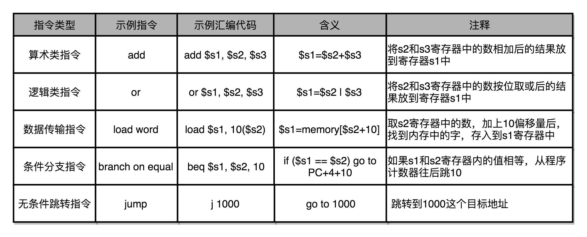

如果越早得弄清楚计算机的底层原理，在你的知识体系中“储蓄”起这些知识，也就意味着你有越长的时间来收货学习知识的利息。虽然一开始可能不起眼，但是随着时间带来的复利效应，你的长线投资项目，就能让你在成长的过程中越走越快。

# 1.冯诺依曼体系结构：计算机组成的金字塔

## 计算机硬件组成

要组装一台计算机，首先需要最核心的三大件：CPU、内存、主板。

**CPU**是计算机最核心配件，全名叫做中央处理器。计算机中所有的“计算”都是由CPU来进行的。自然CPU也是整个计算机中造价最昂贵的部分之一。CPU是一个超级精细的印刷电路板。

**内存**，所有测程序只有放在内存中才能被运行。内存越大能够加载的东西自然也越多。

**主板**，内存中程序和数据，需要被CPU读取，CPU计算之后还要写会内存。内存不能直接插在CPU上，于是就需要**主板**来连接两者了。主板的芯片组和总线解决了CPu和内存之间如何通信的问题。芯片组控制了数据传输的流转。总线则是数据传输的高速公路，总线速度决定了数据能传输多快。

有了以上三大件，再加上电源、IO设备、输出设备就是完整的计算机了。

**显卡**，显卡是除了CPU之外的另一个处理器，也就是GPU，GPU一样可以做各种”计算“的工作。

鼠标、键盘、硬盘都是插在主板上的，他们通过主板上的**南桥**芯片组来控制与CPU的通信。以前主板上通常有**北桥**来连接CPU、内存、显卡之间的通信，现在北桥已经被转移到CPU的内部。

## 冯诺依曼体系结构

现在市面上不管是手机还是pc机、pad都遵循冯诺依曼提出的**冯诺依曼体系结构**，也叫**存储程序计算机**。

**可编程**计算机。可编程指的是安装程序后是可以修改的，例如以前的计算器实际上就是不可编程的计算机。加减乘除运算被写入到硬件里面，一旦制作完毕无法修改。

**存储**式计算机。指程序本身存储在计算机内存中，可以通过加载不同程序来解决不同的问题。实际上最早的计算机是不可编程的非存储式的计算机。使用织带进行计算的计算机也是存储式计算机，不过程序是被存储在纸带上的。

计算机祖师爷冯诺依曼基于当时秘密开发的EDVAC谢了一片报告[First Draft of a Report on the EDVAC](https://en.wikipedia.org/wiki/First_Draft_of_a_Report_on_the_EDVAC),描述了计算机应该长什么样，这篇报告在历史上有个特殊的简称，叫做**First Draft**。

First Draft描述的计算机包括运算器、控制器、存储器、输入设备、输出设备，所有现代计算机也都是基于这个基础架构来设计开发的。

而所有的计算机程序，也都可以抽象为从**输入设备**读取输入信息，通过**运算器**和**控制器**来执行存储在存储器里的程序，最终把结果输出到**输出设备**中。而我们所有撰写的无论高级还是低级语言的程序，也都是基于这样一个抽象框架来进行运作的。

## 总结

可以说，冯·诺依曼体系结构确立了我们现在每天使用的计算机硬件的基础架构。因此，学习计算机组成原理，其实就是学习和拆解冯·诺依曼体系结构。

具体来说，学习组成原理，其实就是学习控制器、运算器的工作原理，也就是 CPU 是怎么工作的，以及为何这样设计；学习内存的工作原理，从最基本的电路，到上层抽象给到 CPU 乃至应用程序的接口是怎样的；学习 CPU 是怎么和输入设备、输出设备打交道的。

学习组成原理，就是在理解从控制器、运算器、存储器、输入设备以及输出设备，从电路这样的硬件，到最终开放给软件的接口，是怎么运作的，为什么要设计成这样，以及在软件开发层面怎么尽可能用好它。

**冯诺依曼机和图灵机的区别：**

- 图灵机是一种思想模型（计算机的基本理论基础），是一种有穷的、构造性的问题的问题求解思路，图灵认为凡是能用算法解决的问题也一定能用图灵机解决。图灵机不能模拟“所有”的计算过程，其实是解决的就是哪些“可计算”，哪些“不可计算”的问题。
- 冯诺依曼提出了“存储程序”的计算机设计思想，并“参照”图灵模型设计了历史上第一台电子计算机，即冯诺依曼机。

# 2.计算机组成原理学习方法

由图可知，整个计算机组成原理，实际就是围绕计算机是如何组织运作展开的。

学习过程是先学习计算机基本组成结构、计算机指令和运算、处理器设计、存储器和IO系统这样的步骤。

**最有效的方法不是短时间的冲刺，而是节奏的坚持。**

# 3. CPU主频

在整个计算机组成原理中，我们经常提到”性能“，但到底什么是性能呢？

计算机的性能，我们需要有个标准来衡量。这个标准主要有两个指标。第一是响应时间或者叫执行时间。第二是吞吐量或者叫做带宽。响应事件指执行一个程序，到底要花多长时间。花的时间越少，自然性能就越高；吞吐量指我们在一定时间范围内到底能做多少事，能处理的事情越多，自然性能就越高。（举例说明：一个人搬运重物或者多个人搬运重物；一个人搬一点和一个人搬很多）

## 计算机的计时单位：CPU时钟

`程序的CPU执行时间 = CPU时钟周期数 x 时钟周期时间`

我们先来理解一下什么是时钟周期时间。你在买电脑的时候，一定关注过 CPU 的主频。比如我手头的这台电脑就是 Intel Core-i7-7700HQ 2.8GHz，这里的 2.8GHz 就是电脑的主频（Frequency/Clock Rate）。这个 2.8GHz，我们可以先粗浅地认为，CPU 在 1 秒时间内，可以执行的简单指令的数量是 2.8G 条。

在我这个 2.8GHz 的 CPU 上，这个时钟周期时间，就是 1/2.8G。我们的 CPU，是按照这个“时钟”提示的时间来进行自己的操作。主频越高，意味着这个表走得越快，我们的 CPU 也就“被逼”着走得越快。

如果你自己组装过台式机的话，可能听说过“超频”这个概念，这说的其实就相当于把买回来的 CPU 内部的钟给调快了，于是 CPU 的计算跟着这个时钟的节奏，也就自然变快了。当然这个快不是没有代价的，CPU 跑得越快，散热的压力也就越大。就和人一样，超过生理极限，CPU 就会崩溃了。

对于 CPU 时钟周期数，我们可以再做一个分解，把它变成“指令数×每条指令的平均时钟周期数（Cycles Per Instruction，简称 CPI）”。不同的指令需要的 Cycles 是不同的，加法和乘法都对应着一条 CPU 指令，但是乘法需要的 Cycles 就比加法要多，自然也就慢。在这样拆分了之后，我们的程序的 CPU 执行时间就可以变成这样三个部分的乘积。

`程序的 CPU 执行时间 = 指令数×CPI×Clock Cycle Time`

因此，如果我们想要解决性能问题，其实就是要优化这三个。

1. 时钟周期时间，就是计算机主频，这个取决于计算机硬件。我们所熟知的摩尔定律就一直在不停地提高我们计算机的主频。比如说，我最早使用的 80386 主频只有 33MHz，现在手头的笔记本电脑就有 2.8GHz，在主频层面，就提升了将近 100 倍。
2. 每条指令的平均时钟周期数 CPI，就是一条指令到底需要多少 CPU Cycle。在后面讲解 CPU 结构的时候，我们会看到，现代的 CPU 通过流水线技术（Pipeline），让一条指令需要的 CPU Cycle 尽可能地少。因此，对于 CPI 的优化，也是计算机组成和体系结构中的重要一环。
3. 指令数，代表执行我们的程序到底需要多少条指令、用哪些指令。这个很多时候就把挑战交给了编译器。同样的代码，编译成计算机指令时候，就有各种不同的表示方式。

> 我们可以把自己想象成一个CPU，坐在那里写程序。计算机主频就好像是你的打字速度，打字越快，你自然可以多写一点程序。CPI相当于你写程序时候，熟悉各种快捷键，越是打同样的内容，需要敲击键盘次数就越少。指令数相当于你的程序设计的够合理，同样的程序要写的代码行数就少。如果三者都能实现，你自然可以很快的写出一个优秀的程序，你的性能从外面来看就是好的。

其实晶振时间是固定处理一个cpu简单指令的，CPI的平均时间是用来描述复杂指令的，指令数同样也是，其实整个公式如果用用简单指令来描述可能更容易理解一些.

为了理解简单可以暂且认为就是晶振在触发一条一条电路变化指令，就好像你拨算牌盘的节奏一样。算盘拨得快，珠算就算得快。结果就是一条简单的指令需要的事件就和一个时钟周期一样，实际这个问题要比这样一句话复杂很多。一方面，其实时钟周期应该是放下最复杂的一条指令的时间长度。我们是通过流水线来提升cpi的。我会在讲解cpu的部分更深入讲解始终信号和计数器，让大家能够理解cpu到底是怎么回事儿。

# 4.我们该工哪些方面提升性能

上节课程得到一个公式`程序的 CPU 执行时间 = 指令数×CPI×Clock Cycle Time`,那么我们可以从指令数、CPI、CPU主频三个地方入手。实际上从上个世纪80年代，CPU设计师就挑了CPU这个软柿子。在CPU中多放一点晶体管，不断提升CPU的时钟频率，这样就能让CPU变得更快，程序执行时间更短。

从80年代开始的20年内，CPU主频增长了300倍，而从00年开始至今的20年，CPU主频增长了3倍。目前为止，CPU主频的增长已经见顶了。

## 4.1 CPU的“人体极限”

## 4.2 为什么CPu主频无法保持增长呢？因为功耗问题。

我们的CPU，一般都被叫做 **超大规模集成电路**。这些电路，实际上都是一个个晶体管组合而成的。CPU的计算，其实就是让晶体管里面的开关不停的打开和关闭，来组合完成各种运算和功能。

想要计算的快，一方面我们要在CPU里，同样的面积里面，多方一些晶体管，也就是增加密度；另一方面，我们要让晶体管打开和关闭的快一点，也就是提升主频。而这两者都会增加功耗，带来耗电和散热问题。

那么我们为什么不能将CPU造大一点呢？CPU变大之后，信号在CPU内部传递也是需要时间的，造大之后传输速度反而会变得更慢。

那么，为了要提升性能，我们需要不断地增加晶体管数量。同样的面积下，我们想要多放一点晶体管，就要把晶体管造得小一点。这个就是平时我们所说的提升“制程”。从 28nm 到 7nm，相当于晶体管本身变成了原来的 1/4 大小。这个就相当于我们在工厂里，同样的活儿，我们要找瘦小一点的工人，这样一个工厂里面就可以多一些人。我们还要提升主频，让开关的频率变快，也就是要找手脚更快的工人。

并行优化，理解阿姆达尔定律

从奔腾 4 开始，Intel 意识到通过提升主频比较“难”去实现性能提升，边开始推出 Core Duo 这样的多核 CPU，通过提升“吞吐率”而不是“响应时间”，来达到目的。

提升响应时间，就好比提升你用的交通工具的速度，比如原本你是开汽车，现在变成了火车乃至飞机。本来开车从上海到北京要 20 个小时，换成飞机就只要 2 个小时了，但是，在此之上，再想要提升速度就不太容易了。我们的 CPU 在奔腾 4 的年代，就好比已经到了飞机这个速度极限。这种提升性能的方法叫做 **通过并行提高性能**。

> **阿达姆定律**：对于一个程序进行优化后，处理器并行运算之后效率提升情况。具体可以用一个公式表示`优化后的执行时间 = 受优化影响的执行时间 / 加速倍数 + 不受影响的执行时间`.

## 4.3 总结

在“摩尔定律”和“并行计算”之外，在整个计算机组成层面，还有这样几个原则性的性能提升方法。

1. 加速大概率事件。最典型的就是，过去几年流行的深度学习，整个计算过程中，99% 都是向量和矩阵计算，于是，工程师们通过用 GPU 替代 CPU，大幅度提升了深度学习的模型训练过程。本来一个 CPU 需要跑几小时甚至几天的程序，GPU 只需要几分钟就好了。Google 更是不满足于 GPU 的性能，进一步地推出了 TPU。后面的文章，我也会为你讲解 GPU 和 TPU 的基本构造和原理。
2. 通过流水线提高性能。现代的工厂里的生产线叫“流水线”。我们可以把装配 iPhone 这样的任务拆分成一个个细分的任务，让每个人都只需要处理一道工序，最大化整个工厂的生产效率。类似的，我们的 CPU 其实就是一个“运算工厂”。我们把 CPU 指令执行的过程进行拆分，细化运行，也是现代 CPU 在主频没有办法提升那么多的情况下，性能仍然可以得到提升的重要原因之一。我们在后面也会讲到，现代 CPU 里是如何通过流水线来提升性能的，以及反面的，过长的流水线会带来什么新的功耗和效率上的负面影响。
3. 通过预测提高性能。通过预先猜测下一步该干什么，而不是等上一步运行的结果，提前进行运算，也是让程序跑得更快一点的办法。典型的例子就是在一个循环访问数组的时候，凭经验，你也会猜到下一步我们会访问数组的下一项。后面要讲的“分支和冒险”、“局部性原理”这些 CPU 和存储系统设计方法，其实都是在利用我们对于未来的“预测”，提前进行相应的操作，来提升我们的程序性能。

# 5.计算机指令:试试纸带编程

如图所示，早期的计算机程序都是通过纸带来进行编程的。人们在特定的位置上打孔或者不打孔代表0或者1。至今CPU仍然不能理解高级编程语言，我们用高级语言编写的程序最终会编程0、1这样的机器码指令。

## 5.1 软硬件接口中，cpu帮我们做了什么？

CPU（Center Processing Unit）就是计算机的大脑，就是中央处理器。

**从硬件上看**，cpu是一个超大规模集成电路，通过电路实现了加法、乘法、乃至各种各样的处理逻辑。

**从软件上看**，cpu就是一个执行各种计算机指令的逻辑机器。这里的**计算机指令**就好比是一门cpu能够听得懂的语言，我们可以把它称为**机器语言**。

不同cpu能够听懂的语言也不太一样。比如我们个人电脑用的intel的cpu，苹果手机用的是ARM的cpu。这两者能够听懂的语言就不太一样。类似这种cpu各自支持的语言，就是两组不同的**计算机指令集**。

一个计算机程序，不可能只有一条指令，而是由成千上万条指令组成的。但是cpu里面不能一直存放所有指令，所以计算机程序平时就是存储在存储器中的。这种程序指令存储在存储器里面的计算机，我们就叫做**存储程序计算机**。

## 5.2 从编译到汇编，diamante怎么变成机器码？

要让一个程序在操作系统上跑起来，我们需要把整个程序翻译成汇编语言的程序，这个过程我们一般叫编译成汇编代码。

针对汇编代码，我们可以用汇编器翻译成机器码。这些机器码由0、1组成的机器语言表示。这一条条的机器码，就是一条条的**计算机指令**。这样一串串的16进制数字，就是我们cpu能够真正认识的计算机指令。

**汇编代码和机器码之间是一一对应的。**汇编代码其实就是“给程序员看的机器码”，其存在的目的就是方便程序员阅读。相同的汇编代码如果需要运行在不同的cpu架构上，那么可以翻译成不同的机器码。

从高级语言到汇编代码，再到机器码，就是一个日常开发程序最终编程cpu可以执行的计算机指令的过程。

## 5.3 解析指令和机器码

我们平时用的intel cpu，有2000条左右的指令。一般来说，常见的指令可以分为五大类。

1. **算术类指令**：我们的加减乘除，在cpuy层面，都会编程一条条算术指令。
2. **数据传输类指令**：给变量赋值、在内存中读写数据，用的都是数据传输类指令。
3. **逻辑类指令**：逻辑上的与或非，都是这一类指令。
4. **条件分支指令**：if/else、switch，其实都是条件分支类指令。
5. **无条件跳转指令**：一些函数调用或者方法调用，其实就是发起一个无条件跳转指令。

使用纸带进行编程，实际上是我们直接在纸带上写不同的cpu指令。

# 6.指令跳转：原来if/else就是goto

## 6.1 cpu是如何执行指令的

拿我们用的intel CPU来讲，里面差不多几百亿个晶体管。实际上，一条条计算机指令执行起来非常复杂。好在cpu在软件层面上已经为我们做好了封装。

在逻辑上，我们可以认为，cpu其实就是由一堆寄存器组成的。而寄存器就是cpu的内部。，由多个触发器或者锁存器组成的简单电路。

触发器和锁存器，其实就是两种不同原理的数字电路组成的逻辑门。n个触发器或者锁存器就可以组成一个n位的寄存器，能够保存n位的数据。比如我们用的64位的intel服务器，寄存器就是64位的。

一个cpu中一般有很多种不同功能的寄存器。比较特殊的有三种：

1. **PC寄存器**：也叫指令地址寄存器，就是用来存放下一条需要执行的计算机指令的内存地址。
2. **指令寄存器**：用来存放当前正在执行的指令。
3. **条件码寄存器**：用一个一个的标记位存放cpu进行算数或者逻辑计算的结果。

除了这些特殊的寄存器，CPU 里面还有更多用来存储数据和内存地址的寄存器。这样的寄存器通常一类里面不止一个。我们通常根据存放的数据内容来给它们取名字，比如整数寄存器、浮点数寄存器、向量寄存器和地址寄存器等等。有些寄存器既可以存放数据，又能存放地址，我们就叫它通用寄存器。

## 6.2 总结

除了简单的通过PC寄存器自增方式顺序执行外，条件寄存器会记录下当前执行指令的条件判断状态，然后通过跳转指令读取对应的条件码，修改pc寄存器内的下一条指令的地址，最终实现if/else以及for/while这样的程序控制流程。

你会发现，虽然我们可以用高级语言，可以用不同的语法，比如`if…else…`这样的条件分支，或者while/for这样的循环分支，来实现不同的程序运行流程，但是回归到计算机可以识别的机器指令级别，其实都只是一个简单的地址跳转而已，也就是一个类似于goto的语句。

想要在硬件层面上来实现这个goto语句，除了本身需要保存下一条指令地址，以及当前正要执行指令的pc寄存器，指令寄存器外，我们只需要再增加一个条件码寄存器，来保留条件判断的状态。这样简简单单的三个寄存器，就可以实现条件判断和循环重复执行代码功能。

