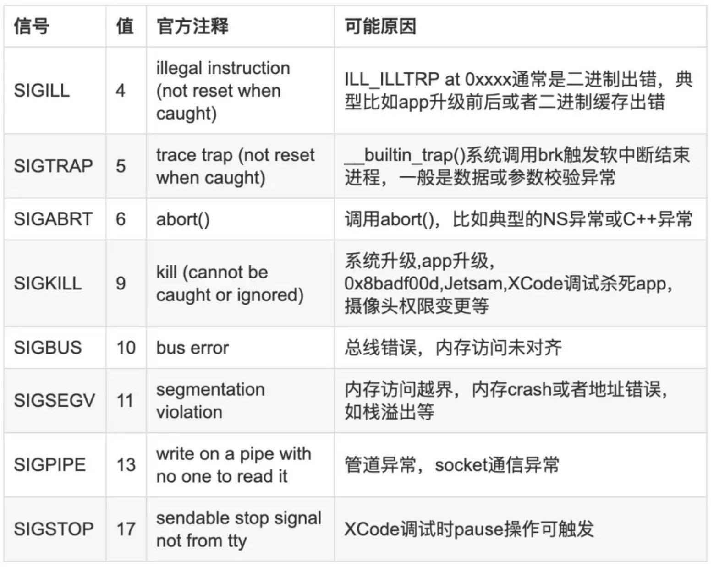
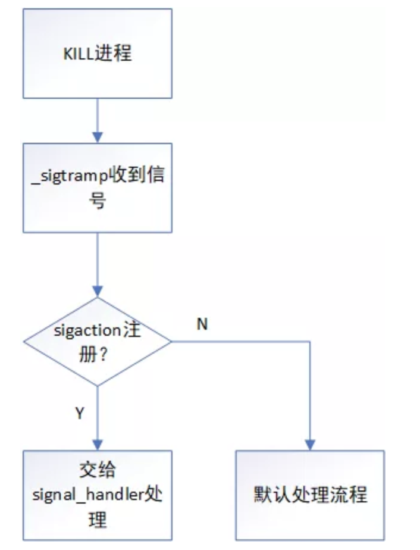

[TOC]

# 1. 深入理解iOS Crash Log

> 本篇算是Crash Log分析入门和整体上间接。

Crash Log主要有两个来源：

1. Apple提供的，可以从用户设备中直接拷贝，或者从Xcode下载。
2. 三方或者自研Framework统计，三方服务包括Fabric、Bugly等。

## 1.1 获取Crash Log

**从iOS设备中获取：**Window -> Devices And Simulators -> View Device Logs，等待Xcode从设备拷贝Crash Log，然后通过搜索应用名字获取详细的Crash Log。

**从Xcode中下载：**Window -> Origanizer -> Crashes Tab。

## 1.2 分析

* **Header**：Crash Log最开始的头部，这里包含了日志的元数据。
* **Reason**：发生崩溃的模块。
* **Thread(Thread 0 Crashed)：**发生崩溃时候各个线程的状态。
* **寄存器(Thread 0 crashed with ARM Thread State (64-bit))：**一堆的程序调用栈后，还可以看到Crash的时候寄存器状态。
* **可执行文件(Binary Images)：**Crash Log的最后是可执行文件，这里你可以看到当时加载的动态库。

```
*********************** Crash Header *******************
Incident Identifier: FDBCC9DD-D2D2-4D14-9E04-BDFE29BF53BB
CrashReporter Key:   22ba8e7bf89b264a4350ee430220acf30f775f40
Hardware Model:      iPhone10,2
Process:             AlipayWallet [398]
Path:                /private/var/containers/Bundle/Application/BBA23A5B-DAB8-4311-88E2-68B1D551B859/AlipayWallet.app/AlipayWallet
Identifier:          com.alipay.iphoneclient
Version:             10.1.68.6000 (10.1.68)
AppStoreTools:       10G3
AppVariant:          1:iPhone10,2:12.2
Code Type:           ARM-64 (Native)
Role:                Non UI
Parent Process:      launchd [1]
Coalition:           com.alipay.iphoneclient [482]

Date/Time:           2019-07-06 10:52:38.4755 +0800
Launch Time:         2019-07-06 10:40:15.1784 +0800
OS Version:          iPhone OS 12.3.1 (16F203)
Baseband Version:    3.60.01
Report Version:      104

*********************** Crash Reason *******************
Exception Type:  EXC_CRASH (SIGKILL)
Exception Codes: 0x0000000000000000, 0x0000000000000000
Exception Note:  EXC_CORPSE_NOTIFY
Termination Reason: Namespace ASSERTIOND, Code 0x8badf00d
Triggered by Thread:  0

*********************** Crash Thread *******************
Thread 0 name:  Dispatch queue: com.apple.main-thread
Thread 0 Crashed:
0   libsystem_kernel.dylib        	0x00000001ba8630f4 mach_msg_trap + 8
1   libsystem_kernel.dylib        	0x00000001ba8625a0 mach_msg + 72
2   CoreFoundation                	0x00000001bac62a10 __CFRunLoopServiceMachPort + 236
3   CoreFoundation                	0x00000001bac5d920 __CFRunLoopRun + 1360
4   CoreFoundation                	0x00000001bac5d0b0 CFRunLoopRunSpecific + 436
5   GraphicsServices              	0x00000001bce5d79c GSEventRunModal + 104
6   UIKitCore                     	0x00000001e760b978 UIApplicationMain + 212
7   AlipayWallet                  	0x0000000100221644 0x10021c000 + 22084
8   libdyld.dylib                 	0x00000001ba7228e0 start + 4

Thread 1:
0   libsystem_kernel.dylib        	0x00000001ba8630f4 mach_msg_trap + 8
1   libsystem_kernel.dylib        	0x00000001ba8625a0 mach_msg + 72
2   AlipayWallet                  	0x00000001008cf9c0 0x10021c000 + 7027136
3   libsystem_pthread.dylib       	0x00000001ba8f02c0 _pthread_body + 128
4   libsystem_pthread.dylib       	0x00000001ba8f0220 _pthread_start + 44
5   libsystem_pthread.dylib       	0x00000001ba8f3cdc thread_start + 4
...

*********************** 寄存器状态 *******************
Thread 0 crashed with ARM Thread State (64-bit):
    x0: 0x0000000010004005   x1: 0x0000000007000806   x2: 0x0000000000000000   x3: 0x0000000000000c00
    x4: 0x0000000000001d03   x5: 0x00000000ffffffff   x6: 0x0000000000000000   x7: 0x000000000000000c
    x8: 0x00000000fffffbbf   x9: 0x0000000007000000  x10: 0x0000000007000000  x11: 0x000000b2f4931976
   x12: 0x00000000016e3600  x13: 0x0000000000781e8c  x14: 0x0000000000057c00  x15: 0x00057c0000000000
   x16: 0xffffffffffffffe1  x17: 0x0000000000000001  x18: 0x0000000000000000  x19: 0x0000000000000000
   x20: 0x00000000ffffffff  x21: 0x0000000000001d03  x22: 0x0000000000000c00  x23: 0x000000016fbe2cd0
   x24: 0x0000000007000806  x25: 0x0000000000000000  x26: 0x0000000007000806  x27: 0x0000000000000c00
   x28: 0x0000000000000001   fp: 0x000000016fbe2bc0   lr: 0x00000001ba8625a0
    sp: 0x000000016fbe2b70   pc: 0x00000001ba8630f4 cpsr: 0x60000000
...

*********************** 加载的动态库 *******************
Binary Images:
0x10021c000 - 0x1048d3fff AlipayWallet arm64  <2ef59c1052553e60a6a87a3655c0176a> /var/containers/Bundle/Application/BBA23A5B-DAB8-4311-88E2-68B1D551B859/AlipayWallet.app/AlipayWallet
0x107110000 - 0x107167fff dyld arm64  <9c893b6aa3b13d9596326ef6952e7195> /usr/lib/dyld
0x10a228000 - 0x10a233fff libobjc-trampolines.dylib arm64  <7e51dd446ecc38e6a5ab21d88fc0e15b> /usr/lib/libobjc-trampolines.dylib
0x114fd0000 - 0x115137fff APBifrostDynamic arm64  <ae566ac64aa132efa71da7673a4939bc> 
...
```

**Exception Typs**

`Exception Type:  EXC_CRASH (SIGKILL)`：我们可以找到这个`EXC_CRASH`的具体含义：非正常进程退出。`SIGKILL`表示这是一个无法捕获也不能忽略的异常，所以系统决定杀掉这个进程。

`Termination Reason: Namespace ASSERTIOND, Code 0x8badf00d`：Terminaiton Reason给出了崩溃更详细的信息，`0x8badf00d`是一个很常见的Code，表示App启动时间过长或者主线程卡住时间过长，导致WatchDog杀掉当前App进程。

## 1.3 Symbolication

我们从Crash Thread中拿到崩溃时候的函数调用栈，如下所示：

```
7   AlipayWallet                  	0x0000000100221644 0x10021c000 + 22084
8   libdyld.dylib                 	0x00000001ba7228e0 start + 4
```

这些地址其实并没有提供什么有用的信息，我们需要把他们转换成类/函数才能找到问题，这个过程叫做**符号化**。

符号化需要一样东西：Debug Symbol文件，也就是我们常说的dysm文件。

机器指令通常会对应你源文件中的一行代码，在编译的时候，编译器会生成这个映射关系的信息。根据build setting中的DEBUG_INFORMATION_FORMAT设置，这些信息有可能会存在二进制文件或者dsym文件里。

> 注意，crash log中的二进制文件会有一个唯一的uuid，dsym文件也有一个唯一的uuid，这两个文件的uuid对应到一起才能够进行符号化。

具体符号化的方式有很多，具体操作过程可参考后面章节。**具体的有：Xcode、xcrun、atos、symbolicatecrash、lldb等。**

## 1.4 常见的Code和Debug技巧

**EXC_BAD_ACCESS/SIGSEGV/SIGBUS**

这三个都是内存访问错误，比如数组越界，访问一个已经释放的OC对象，尝试往readonly地址写入等等。这种错误往往可以在Exception的Subtype找到错误地址的一些详细信息。

1. 如果你在上下文看到objc_msgSend和objc_release，往往是尝试对一个已经释放的OC对象发送消息，可以用Zombies来调试
2. 多线程也有可能是导致内存问题的原因，这时候可以打开Address Sanitizer，让它帮助你找到多线程的Data Race。

**EXC_CRASH/SIGABRT**

这个Code表示进程异常退出，最常见的是一些没有被处理的OC/C++异常。App Extensions如果初始化时候占用时间太多，被watchdog杀掉，也会出现这种code。

**EXC_BREAKPOINT/SIGTRAP**

这种异常尝试告诉调试器发生了这种异常，如果没有调试器依附，那么会导致进程被杀掉。这种Crash在iOS底层的框架中经常出现，最常见的是GCD，比如dispatch_group。

Swift代码在以下情况也会出现这种异常：给一个非可选类型赋值nil；失败的强制类型转换。

**Killed [SIGKILL]**

进程被系统杀掉，通常在Termination Reason可以找到被强杀的原因。`0x8badf00d` 表示watch dog超时，通常是主线程卡住或者启动时间超过20s。

# 2. Crash优化与建议

## 2.1 Crash与信号

### Crash的产生

**在iOS上Crash最终都是通过signal的形式发送给应用，应用可以通过注册signal handler来选择处理或者忽略大部分的信号。**

Crash的原因有多种，系统通过不同的sianal来告知应用这大概是什么原因造成的，常见的有：SIGSEGV，SIGTRAP，SIGABRT。

**signal是一个4字节的整形数字，在iOS/OSX中定义了31个已知的信号。**crash仅仅是signal触发的一个行为，signal还可以用来做很多其他的事情，比如：job控制、改变子进程状态、致命性中断、timer过期等。

每种signal都有默认的action，可以通过`sigaction()`系统调用来修改signal actions，为SIG_DFL(use the default action)或者修改SIG_IGN(ignore the signal)，或者指定signal handler function。

常见的信号和原因如下所示：



> *其中SIGKILL,SIGSTOP信号是无法被捕获或忽略等自定义处理的；*

### signal处理流程

signal的一般流程如下所示：



我们可以简单的使用kill函数来向应用、线程发送信号：

```c
int kill(pid_t pid, int sig);
int pthread_kill(pthread_t thread, int sig);
```

### signal捕获

一般情况下signal异常捕获工具会基于上述方式来修改signal的actions或执行signal handler，从而达到异常捕获的目的。我们可以通过修改signal action来让应用直接忽略某个信号，而不发生异常退出。但是SIGKILL,SIGSTOP 无法被捕获或忽略。

### Crash日志简介

详情参考：[1.2 分析  ](# 1.2 分析)   

## 2.2 Crash优化思路

### 分析问题

正常情况下，得到crash堆栈后，结合堆栈信息，signal信息我们可以大概知道crash触发原因，接下来关注触发崩溃堆栈、翻译符号表即可。

个别情况，仅仅使用crash堆栈信息是不够的，这时候我们需要关注ARM Thread State（Crash线程的寄存器信息）。重点关注以下几个寄存器即可：

1. x0：
2. x1：如果发送消息的话，x1通常指向selector。
3. lr：
4. pc：下一条指令地址

### 易复现问题

再比如某些unrecognized selector类问题，我们可以通过开启zoombie来增加复现的概率。

zoombie的本质大概就是在对象释放后，让已使用的内存地址不可被重用/访问，这样我们一定无法再访问一个已经使用过的内存地址，那么下次访问这个内存地址时就一定会出现访问错误，从而触发了crash。也间接达到了提高复现概率的问题。

### 难复现的crash

对于难复现的问题，我们可以把经历回归到解决问题的本质上，即这个问题是怎么产生的，从结果倒推原因；相当于一种更强调逆向分析的过程。这个本质上要求crash分析者堆应用的运行机制、内存管理，以及Xcode调试要求更高。

**1. 可以通过信号进行分析。**

1. **SIGILL**：二进制出错，app升级前后二进制缓存出错，此问题无解，用户重启手机即可。
2. **SIGTRAP**：系统调用brk触发软件中断结束进程，一般是数据或参数校验异常。
   * CFArray/CFDictionary内存越界或者多线程访问问题；
   * gcd问题，当前线程执行dispatch_sync，dispatch_once递归调用自己；
   * 子线程访问WebKit接口，比如子线程访问`[wkwebview evaluateJavaScript:] `。
   * __block多线程并发访问导致引用计数出错
3. **SIGABRT**：调用abort()，比如典型的NS异常或C++异常；重点关注uncaught exception xxx这时可以留意Last Exception Backtrace的信息就能帮助定位问题了。如果提醒`CALayer bounds contains NaN: [0 0; nan nan]`错误，可以借助image lookup命令即可快速翻译符号表。
4. **SIGKILL**：SIGKILL问题最常见的就是0xbadf00d。此类问题无法被异常捕获工具捕获，因为SIGKILL信号无法被忽略或被捕获。我们只有在系统设置->隐私->分析->分析数据，中找到对应的闪退日志文件。
5. **SIGPIPE**：主要问题是socket通信异常。解决可以参考[*Avoiding Common Networking Mistakes*](https://developer.apple.com/library/archive/documentation/NetworkingInternetWeb/Conceptual/NetworkingOverview/CommonPitfalls/CommonPitfalls.html)
6. **SIGBUS**：内存访问错误，可能原因：内存访问未对齐；访问内存地址有效但是无权限。
7. **SIGSEGV**：内存访问出错。原因：
   * 对应虚拟地址映射空间无访问权限；
   * 不存在对应的虚拟地址映射空间；
   * 访问已经释放的内存；
   * stack overflow；

**2. 可以根据exception信息提示**

比如基于Last Exception Backtrace:以及crash收集组件收集到的exception codes信息；比如这里我们知道是什么异常类型，那就直接根据异常类型和提示去在对应堆栈找问题该问题即可。

**3. 可以根据异常地址分析**

此类问题主要是SIGSEGV类内存访问错误问题；比如如果所有的异常地址都指向同一个地址，那肯定说明这里有一个很特别或奇怪的逻辑。

**4. 根据寄存器信息**

可以重点关注x1、lr、pc寄存器。

**关注x1寄存器是为了看下x1寄存器的值是否能在符号表中查找得到。**根据arm64函数调用阅读，x0~x7一般为函数的前8个参数，函数如果有返回值一般就存在x0寄存器内。因此objc_msgSend中，**x0指向当前对象**，**x1指向selector**。知道selector也有利于进一步确定上下文或可能的具体问题。

关注pc寄存器，**pc寄存器顾名思义指向了下一条执行指令**，所以也可以用来缩小堆栈范围。

关注lr寄存器是为了解决leaf function优化和tail call优化的问题；编译器会对函数调用进行优化，从而导致对于leaf function和tail call会尽可能的不适用bl调用，从而减少了对栈的操作，但导致lr的值为当前上层的lr，而非原本代码内函数调用后的lr。

**5. 根据附加信息**

一个合格的异常收集组件，肯定需要对一些view路径，跳转路径做记录；也最好能允许应用开发者写一些关键信息。当crash时，把这些信息一并记录，这样我们就能利用这些信息去定位问题。

比如我们的应用就曾遇到过用户访问某个页面时发现高概率闪退，我们根据这些附加信息，直接就知道了页面地址，就利于我们去定位解决问题了。

**6. 根据静态、动态分析**

**静态分析常用的工具主要用Hopper**，比较简单方便，当然也可以用强大的IDA。进行静态/动态分析能帮我们稳定的找到的crash的根源，但是能不能解还是不一定的。比如你最后追根溯源得到这是个系统bug，且crash的符号和内存都和objc没有半点关系，连hook也没有思路，又是处于只有汇编代码的前提下，难度还是很大的，问题基本无解了。可能就需要从其它地方入手解决了。但无论如何，我们能定位到原因后，就可以有更多的思路去寻找解决办法了。

**Reference：**

https://mp.weixin.qq.com/s/srG0xXvWGEfGt9nHN4YOjQ

https://developer.apple.com/library/archive/technotes/tn2151/_index.html

# 3. iOS瘦包常见方式梳理

Reference：https://mp.weixin.qq.com/s/J_XYpIfDeeWJBlk9sRQMAA

## 3.1 预备知识

### 3.1.1 App Thinning

App Thinning是指iOS9引进的一个App优化方案。即苹果会尽可能的自动降低分发到用户时所需要下载的App大小。其中主要包括三项内容：**Slicing**、**Bitcode**、**On-Demand Resourse**。

**1. Slicing**

> **Slicing是创建、分发不同变体以适应不同目标设备的过程。**

当向App Store Connect上传.ipa后，App Store Connect构建构成中，会自动分割App，创建特定的变体以适配不同的设备。然后用户从App Store下载到的安装包是一个特定的变体。这个过程就是Slicing。

各个变体版本之间的差异，又体现在架构和资源上。换句话说，App Slicing仅向设备传送与之相关的资源（取决于屏幕分辨率、架构等）。

**其中2X和3X的细分，要求图片放在Asset Catalog中管理。Bundle内的则还是会同时包含。**

**2. Bitcode**

Bitcode是一种程序中间码。包含Bitcode配置的程序将会在App Store connect上被重新编译和链接，进而对可执行文件做优化。这部分都是在服务端自动完成的，所以加入以后得Apple推出了新的CPU架构或者以后LLVM退出了一系列优化，我们也不需要为其重新发布新的安装包了，苹果会为我们完成这个步骤。

> 1. 目前iOS中Bitcode是可选的，但是watchOS和tvOSBitcode是必须开启的。
> 2. 如果要开启Bitcode，那么项目用到的全部三方库都必须支持Bitcode。
> 3. 开启Bitcode后，最终的可执行文件是Apple自动生成的，同时会产生新的符号文件，所以我们无法使用自己包生成的dysm符号化文件来进行符号化。（我们可以在xcode或者App Store Connect中下载对应的dsym）

**Bitcode是指令集优化。根据你设备状态去做编译优化，进而提升程序运行性能，但是对包大小优化起不到本质上的作用。**

**3. On-Demand Resources**

On-Demand Resourse指可以将一部分图片放在苹果的服务器上，不随着App的下载而下载，直到用户真正进入某个页面时才下载这些资源。（iOS9以下系统无法使用这个功能）

### 3.1.2 包体积

首先需要区分清楚两个概念：

* **.ipa**：iOS应用程序归档文件，即提交到App Store Connect的文件。

* **.app**：是应用的具体描述，即安装到iOS设备上的文件。

当我们拿到Archive后的ipa，使用zip解压后，Payload目录下放的就是.app文件，二者大小相当。

对于安装包体积，我们一般以App Store上看到的为准。当我们把安装包上传到App Store Connect上后，我们可以看到App版本在不同设备上大概的尺寸。查看方式见苹果官方：[查看构建版本和文件大小](https://help.apple.com/app-store-connect/?lang=zh-cn#/dev3b56ce97c)。

> Universal 指通用设备，即未应用 App Slicing 优化，同时包含了所有架构、资源。所以把体积特别大。
>
> 同时，观察 .ipa 文件的大小，可以发现和 Universal 对应的安装大小相当，稍微小一点，因为 App Store 对 .ipa 又做了加密处理。

### 3.1.3 .app的组成

> 首先需要明确一个误区：App Store中显示的应用程序大小并不是下载ipa文件的大小，而是应用程序安装到手机上后占用存储空间的大小。

这里需要介绍一款工具：**Hazel**。这款工具可以自动监控并整理文件夹。我们可以自定义规则堆文件进行归类。

对.app文件夹归类后我们可以更好的查看和区分文件夹中内容。

> 目前来讲，大部分的app已经放弃了支持iOS8系统，因此app只需要支持arm64架构cpu即可。

## 3.2 Resources

资源部分的优化，说白了就是对内的依次审查，规范化。

App内资源主要包括：图片资源Assets.car、Bundle文件、字体文件、音视频资源等。针对这些资源文件，我们主要有以下几种方式进行：删除无用文件、删除重复文件、大文件压缩、图片管理方式规范、On-Demand Resource。

### 3.2.1 删除无用文件

无用文件，包括无用图片文件和非图片文件。非图片文件一般都比较少，我们可以靠人力去排查。但是图片文件就比较多了，我们可以借助一个开源的工具：`LSUnusedResources`，当然，找到之后我们最后人工确认文件是否真的没用了，然后再删除，以免引起不必要的事故。

其实对于这部分的优化，如果之前团队内部一直做的很规范，那这部分的优化空间会比较小。

> **LSUnusedResources原理：**对某一个文件目录下所有的原地阿妈文件进行扫描，用正则表达式匹配出所有的字符串，然后形成”使用到图片的集合“，然后扫描所有的图片文件名，查看哪些图片文件名不在”使用到图片的集合“中，然后将这些图片文件呈现在结果中。

### 3.2.2 删除重复文件

重复文件指的是两个内容完全一致的文件。这类文件命名上一般是不同的。对于这部分，主要是借助`fdupes`这个开源工具，它可以校验各资源的MD5。

> Fdupes 这个程序主要是在指定的目录中查找重复的文件。通过对比文件的MD5签名，以及逐字节比较文件来识别重复内容，它各种选项，可以实现堆文件的列出、删除、替换为文件副本的硬链接等操作。比较顺序：大小对比 > 部分 MD5 签名对比 > 完整 MD5 签名对比 > 逐字节对比。效率和准确率都极其高。

找到重复文件之后，剩下的就是具体的优化了。

### 3.2.3 大文件压缩

大文件压缩主要指针对项目中存储的体积比较大的图片资源进行压缩处理。Mac平台上的`ImageOptim`、在线压缩工具`tinypng`等压缩工具都是比较不错的。

Xcode给我们提供两个编译选项来帮助压缩png图像：

* **Compress PNG Files：**打包时候自动对图片进行无损压缩，使用的工具是pngcrush，压缩比还是相当高的，比较流行的ImageOptim也是使用pngcrush进行压缩PNG的。
* **Remove Text Medatata From PNG Files：** 移除PNG资源的文本字符，比如图像名称、作者、版权、创作时间、注释等信息。

测试发现，开启Xcode内置PNG压缩后，使用ImageOptim对图片手动进行一轮压缩，发现表现是正向的。

**尤其是Bundle内部的图片一定要进行压缩，因为Bundle是直接拷贝进项目的，并不会被Xcode进行压缩。还有JPEG格式图片也需要进行手动压缩。**

### 3.2.4 图片管理方式规范

这里有些常见的问题需要规避。

首先iOS中图片资源管理一般分为两种方式，可以放在Bundle中，也可以放在xcassets中。

* xcassets中图片只能通过imageNamed加载。Bundle中还可以通过iamgeWithContentOfFile等方式加载。
* xcassets里会对2x、3x根据具体设备分发，不会同时包含。而Bundle都会包含。
* xcassets内可以对图片进行slicing操作，Bundle不支持。
* Bundle支持多语言，xcassets不支持。
* 使用imageNamed创建的UIImage会被立刻加入到NSCache中（解码后的Image Buffer），直到收到内存警告时候才会释放不再使用的UIImage。而imageWithContentsOfFile每次都会重新申请内存，相同图片不会缓存。

综上所述，常用的，较小的图，应该放在xcassets内管理。而大图放在Bundle中管理。甚至更大的图片，我们直接废掉2x，全部使用3x的jpg图片。使用的时候采用`downsample`降低采样。

Downsample使用示例：

```swift
// Downsampling large images for display at smaller size 
func downsample(imageAt imageURL: URL, to pointSize: CGSize, scale: CGFloat) -> UIImage {  
  let imageSourceOptions = [kCGImageSourceShouldCache: false] as CFDictionary 
 
  let imageSource = CGImageSourceCreateWithURL(imageURL as CFURL, imageSourceOptions)! 
  
  let maxDimensionInPixels = max(pointSize.width, pointSize.height) * scale  
  let downsampleOptions =  [kCGImageSourceCreateThumbnailFromImageAlways: true,
  kCGImageSourceShouldCacheImmediately: true, 
  kCGImageSourceCreateThumbnailWithTransform: true,
  kCGImageSourceThumbnailMaxPixelSize: maxDimensionInPixels] as CFDictionary   
  let downsampledImage =   CGImageSourceCreateThumbnailAtIndex(imageSource, 0, downsampleOptions)!  
  return UIImage(cgImage: downsampledImage) 
}
```

详情可参考以下链接：

[WWDC Image and Graphics Best Practices](https://developer.apple.com/videos/play/wwdc2018/219/)

[Image usage, memory comparison and best practices in iOS ](https://medium.com/@prafullkumar77/image-usage-memory-comparison-and-best-practices-in-ios-wwdc2018-4a8919019ae9)

我们可以使用`Asset Catalog Tinkerer`打开Assets.car并查看其中文件，导出其中的图片资源。需要注意的是，这里不要存放大图，因为大图会产生缓存；不要存放JPEG图片，jpeg图片在苹果压缩后会变得更大。【.xcassets中要避免使用JPEG图像】。

## 3.3 Executable File

可执行文件，就是Mach-o文件，一般是应用程序中体积最大的文件。关于这部分的瘦身主要有两方面：编译优化、文件优化。

### 3.3.1 编译选项优化

**1. Generate Debug Symbols**

调试符号是在编译时生成的。当 Generate Debug Symbol s选项设置为 YES时，每个源文件在编译成 .o 文件时，编译参数多了 -g 和 -gmodules 两项。打包会生成 symbols 文件。

设置为 NO 则 ipa 中不会生成 symbol 文件，可以减少 ipa 大小。但会影响到崩溃的定位。

保持默认的开启，不做修改。

**2. Asset Catalog Compiler**

optimization 选项设置为 space 可以减少包大小

默认选项，不做修改。

**3. Dead Code Stripping**

删除静态链接的可执行文件中未引用的代码

Debug 设置为 NO， Release 设置为 YES 可减少可执行文件大小。

Xcode 默认会开启此选项，C/C++/Swift 等静态语言编译器会在 link 的时候移除未使用的代码，但是对于 Objective-C 等动态语言是无效的。因为 Objective-C 是建立在运行时上面的，底层暴露给编译器的都是 Runtime 源码编译结果，所有的部分应该都是会被判别为有效代码。

默认选项，不做修改。

**4. Apple Clang - Code Generation**

Optimization Level编译参数决定程序编译过程中两个指标：编译速度和内存占用，也决定了编译之后执行结果的两个指标：速度和文件大小：


6个级别对应含义如下所示：

* **None[-O0]**。 Debug 默认级别。不进行任何优化，直接将源代码编译到执行文件中，结果不进行任何重排，编译时比较长。主要用于调试程序，可以进行设置断点、改变变量 、计算表达式等调试工作。
* **Fast[-O,O1]**。最常用的优化级别，不考虑速度和文件大小权衡问题。与-O0级别相比，它生成的文件更小，可执行的速度更快，编译时间更少。
* **Faster[-O2]**。在-O1级别基础上再进行优化，增加指令调度的优化。与-O1级别相，它生成的文件大小没有变大，编译时间变长了，编译期间占用的内存更多了，但程序的运行速度有所提高。
* **Fastest[-O3]**。在-O2和-O1级别上进行优化，该级别可能会提高程序的运行速度，但是也会增加文件的大小。
* **Fastest Smallest[-Os]**。Release 默认级别。这种级别用于在有限的内存和磁盘空间下生成尽可能小的文件。由于使用了很好的缓存技术，它在某些情况下也会有很快的运行速度。
* **Fastest, Aggressive Optimization[-Ofast]**。 它是一种更为激进的编译参数, 它以点浮点数的精度为代价。

默认选项，不做修改。

**5. Swift Compiler - Code Generation**

Xcode9.3之后，swift编译器提供了新的Optimization Level来帮助减少swift可执行文件大小，有三个级别：

- **No optimization[-Onone]**：不进行优化，能保证较快的编译速度。
- **Optimize for Speed[-O]**：编译器将会对代码的执行效率进行优化，一定程度上会增加包大小。
- **Optimize for Size[-Osize]**：编译器会尽可能减少包的大小并且最小限度影响代码的执行效率。

> We have seen that using -Osize reduces code size from 5% to even 30% for some projects.
>
> But what about performance? This completely depends on the project. For most applications the performance hit with -Osize will be negligible, i.e. below 5%. But for performance sensitive code -O might still be the better choice.

官方提到-OSize选项根据项目不同，大致可以优化掉5%~30%的代码空间占用，相比-O来说，会损失大概5%的运行时性能 。如果你的项目对运行速度不是特别敏感，可以接受轻微的性能损失，那么-OSize是首选。

除了-O和-OSize、还有另外一个概念。Single File和Whole Module。

这两个模式告诉编译器以什么方式处理优化操作。

* **Single File：**逐个文件进行优化，它的好处是对于增量编译的项目来说，它可以减少编译时间，对于没有更改的源文件不用每次都编译。并且可以充分利用多核CPU，并行优化多个文件，提高编译速度。但是它的缺点是对于一些跨文件的优化操作，它没办法处理。如果某个文件被多次引用，那么对这些引用文件进行优化的时候，会反复处理这个被引用的文件，如果你项目中类似交叉比较多，会影响性能。
* **Whole Module**：将项目所有文件看成一个整体，不会产生Single File模式对同一个文件反复处理的问题，并且可以进行最大限度优化，包括跨文件的优化操作。缺点是不能充分利用多核CPU的性能，对于增量编译，每次都会编译整个项目。

如果没有特殊情况，使用Whole Module优化即可。它会牺牲部分编译性能，但是优化结果是最好的。因此在Release模式下，-Osize和Whole Module同时开启效果会更好。

**6.  Strip Symbol Information**

1、Deployment Postprocessing
2、Strip Linked Product
3、Strip Debug Symbols During Copy
4、Symbols hidden by default

设置为yes可以去掉不必要的符号信息，可以减少可执行文件大小。但是去除符号信息之后我们就只能使用dsym来进行符号化 了，所以需要将`Debug Information Format`改为`DWARF with dSYM file`。

Symbols Hidden by Default 会把所有符号都定义成”private extern”，详细信息见官方文档。

故，Release 设置为 YES，Debug 设置为 NO。

**7. Exceptions**

在 iOS微信安装包瘦身 一文中，有提到：

> 去掉异常支持，Enable C++ Exceptions和Enable Objective-C Exceptions设为NO，并且Other C Flags添加-fno-exceptions，可执行文件减少了27M，其中__gcc_except_tab段减少了17.3M，__text减少了9.7M，效果特别明显。可以对某些文件单独支持异常，编译选项加上-fexceptions即可。但有个问题，假如ABC三个文件，AC文件支持了异常，B不支持，如果C抛了异常，在模拟器下A还是能捕获异常不至于Crash，但真机下捕获不了（有知道原因可以在下面留言：）。去掉异常后，Appstore后续几个版本Crash率没有明显上升。
>
> 个人认为关键路径支持异常处理就好，像启动时NSCoder读取setting配置文件得要支持捕获异常，等等

看这个优化效果，感觉发现了新大陆。关闭后验证.. 毫无感知，基本没什么变化。

可能和项目中用到比较少有关系。故保持开启状态。

**8. Link-Time Optimization**

Link-Time Optimization是LLVM编译器的一个特性，用于在link中间代码时，对全局代码进行优化。这个优化是自动完成的，因此不需要修改现有的代码；这个优化也是高效的，因为可以再全局视角下优化diamante。

它的主要优化体现在如下几个方面：

1. **Dead code elimination（去除多余代码）**：如果一段代码分布在多个文件中，但是从来没有被使用，普通的-O3优化方法不能发现跨中间代码文件的多余代码，因此是一个局部优化。但是Link-Time Optimization技术可以再link时发现中间代码文件的多余代码。
2. **Interprocedural analysis and Optimization（跨过程优化）**：这是个相对广泛的概念。局里来说，如果一个if方法某个分支永远不可能执行，那么在最后生成的二进制文件中就不应该有这个分支的代码。
3. **Inlining Optimization（内联优化）**：内联优化形象来说，就是在会标中不使用`call func_name`语句，直接将外部方法内的语句复制到调用者代码段内。这样避免进行调用函数前的压栈、调用函数后的出栈操作，提高运行效率和栈空间利用率。

在新的版本中，苹果使用了新的优化方式 Incremental，大大减少了链接的时间。建议开启。

总结，开启这个优化后，一方面减少了汇编代码的体积，一方面提高了代码的运行效率。

### 3.3.2 文件优化

文件的优化，是指通过删除无用类、无用方法、重复方法等，来达到可执行文件大小的减少。而如何筛选出符合条件的类、方法，则需要通过一些工作来完成。

扫描无用代码的基本思路都是查找已经使用的方法、类和所有的方法、类，然后从所有的方法、中中提出已经使用的方法和类，剩下的基本就是无用的方法、类。但是OC是动态的语言，可以使用字符串来调用类和方法，所以检查结果并不是特别准确，需要进行二次确认。目前市面上扫描的思路大概可以分为3种：

1. 基于Clang扫描；
2. 基于可执行文件的扫描；
3. 基于源码的扫描；

**1. 基于Clang的扫描**

基本思路是基于clang AST。追溯到函数调用层级，记录所有定义的方法、类，与所有调用的方法、类做对比，取差集。基本原理可以参考：[如何使用 Clang Plugin 找到项目中的无用代码](https://blog.gocy.tech/2017/09/13/DetectingUselessCodeWithClang-p2/)，目前没有找到好使的工具。

**2. 基于可执行文件的扫描**

Mach-O文件中的`(_DATA._objc_classlist)`段表示所有定义的类，`(_DATA._objc_classrefs)`表示所有引用的类（集成关系是在`_DATA._objc_superrefs`中）；使用的方法和引用的方法也是类似的原理。因此我们使用otool等命令逆向可执行文件中引用的类和方法与所有定义的类和方法进行对比，计算差集。可以参考：[iOS微信安装包瘦身](https://cloud.tencent.com/developer/article/1030792)，目前没有找到好使工具。

**3.基于源码的扫描 **

一般都是对源码文件进行字符串匹配。例如将 A *a、[A xxx]、NSStringFromClass("A")、objc_getClass("A") 等归类为使用的类，@interface A : B 归类为定义的类，然后计算差集。

> 由于OC语言的动态性，这种方法可能更加的不准确，排除代码之前一定要二次确认。

**4. 通过AppCode查找无用代码**

AppCode提供Inspect Code来诊断代码，其中包含查找无用代码的功能。

具体的功能可以参考这里：[AppCode inspections for your code perfection](https://blog.jetbrains.com/objc/2014/01/appcode-inspections-for-your-code-perfection/)

### 3.3.3 Linkmap查找大文件

iOS App编译后，除了一些资源文件，剩下的就是一个可执行文件，而可执行文件一般是项目中最大的一个文件。如果项目大了，引用的库多了，这个文件会变得格外庞大，想要知道这个可执行文件的构成是怎样的，里面内容是什么，那些库占用空间高，就需要借助Link Map来勘察。

首先需要Xcode开启编译选项`Write Link Map File`。XCode -> Project -> Build Settings -> 搜map -> 把Write Link Map File选项设为yes，并指定好linkMap的存储位置即可。

**LinkMap文件里面展示了整个可执行文件的全貌，列出了编译后的每个.o目标文件的信息（包括静态链接库里.a里的），以及每一个目标文件代码段，数据段存储的详情。**

 这个文件可以让你了解整个APP编译后的情况，也许可以从中发现一些异常，还可以用这个文件计算静态链接库的项目里的占用大小。有时候我们项目中链接了很多第三方库，导致APP体积变大很多，我们想确切知道每个库占用了多大空间，可以给我们优化提供方向。

**LinkMap里有了每个目标文件每个方法每个数据的占用大小数据，所以只要写个脚本，就可以统计出每个.o最后的大小，属于一个.a静态链接库的.o加起来，就是这个库在APP里占用的空间大小。**

[iOS APP可执行文件的组成](http://blog.cnbang.net/tech/2296/)

[检查每个类占用空间大小工具](https://github.com/huanxsd/LinkMap)

## 3.4 Frameworks

Framework文件夹存放的是动态库。在App启动的时候才会被链接和加载。里面主要有两类，swift标准库和自己引入的其它依赖库。

> Swift standard libraries are copied into a bundle if and only if you are building an application and this application contains Swift source files by itself. You can check whether a product such as a framework includes Swift source files by running otool -L on its executable in the Terminal. This command displays all shared libraries and frameworks that your product dynamically links against. Your product uses Swift if any of the Swift libraries appear among the result of otool -L as shown in Figure 1.
>
> Embedding Content with Swift in Objective-C

当使用swift后，会自动拷贝对应的标准库（Swift ABI稳定之前，swift标准库是会被自动包含的）。开启swift汇编后，这部分占用大概8M左右。

## 3.5 App Extension

App Extension 的占用，都放在 Plugin 文件夹内。它是独立打包签名，然后再拷贝进 Target App Bundle 的。

关于 Extension，有两个点要注意：

- 静态库最终会打包进可执行文件内部，所以如果 App Extension 依赖了三方静态库，同时主工程也引用了相同的静态库的话，最终 App 包中可能会包含两份三方静态库的体积。
- 动态库是在运行的时候才进行加载链接的，所以 Plugin 的动态库是可以和主工程共享的，把动态库的加载路径 Runpath Search Paths 修改为跟主工程一致就可以共享主工程引入的动态库。

所以，如果可能的话，把相关的依赖改成动态库方式，达到共享。


**其它可参考的相关文章**

- Build settings reference
  https://help.apple.com/xcode/mac/current/#/itcaec37c2a6
- Tuning for Performance and Responsiveness
  https://developer.apple.com/library/content/documentation/General/Conceptual/MOSXAppProgrammingGuide/Performance/Performance.html#//apple_ref/doc/uid/TP40010543-CH9-SW12
- Code Size Optimization Mode in Swift 4.1
  https://swift.org/blog/osize/
- XCode 9.3 新的编译选项，优化 Swift 编译生成代码的尺寸
  https://swiftcafe.io/post/swift-optimization
- 干货|今日头条iOS端安装包大小优化—思路与实践
  https://techblog.toutiao.com/2018/06/04/gan-huo-jin-ri-tou-tiao-iosduan-an-zhuang-bao-da-xiao-you-hua-si-lu-yu-shi-jian/
- iOS可执行文件瘦身方法
  https://blog.cnbang.net/tech/2544/
- iOS 安装包瘦身
  https://sq.163yun.com/blog/article/200384401846304768
- 不改代码，Link-Time Optimization提高iOS代码效率 + 汇编代码原理分析
  https://wuwm.nuaax.com/?p=412


# 4. iOS启动优化


# 5. iOS Memory Deep Dive

[iOS Memory Deep Dive](https://mp.weixin.qq.com/s/WQ7rrTJm-cn3Cb6e_zZ4cA) **Memory**

[OOM探究：XNU 内存状态管理](https://mp.weixin.qq.com/s/fRm6IrBh83-NxWT7g9UzbA) **内存**

[DEAD in iOS Memory](https://mp.weixin.qq.com/s/7VNVc5LBp-87giKrEOqp5A) **Memory**


# 6. 二进制文件重排


https://mp.weixin.qq.com/s/F-c1Fk7bMg0DGqtF5i74kg


App网络连接优化

APP DNS优化