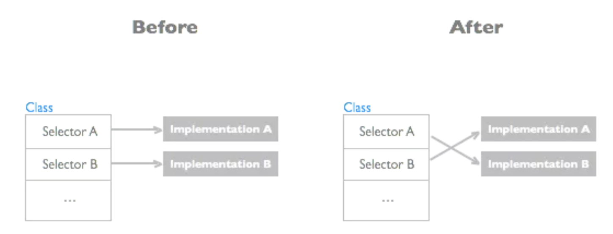
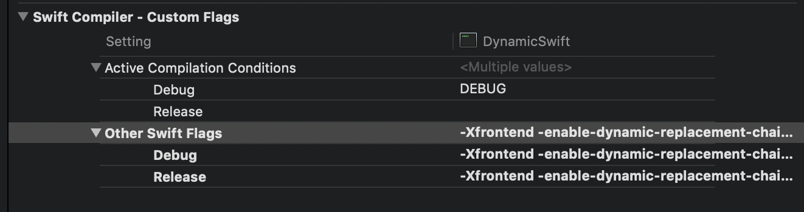
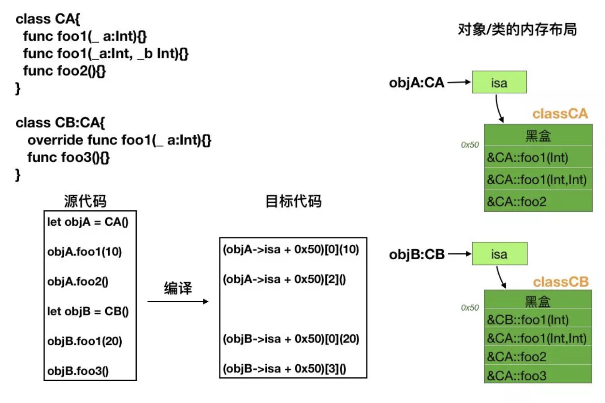
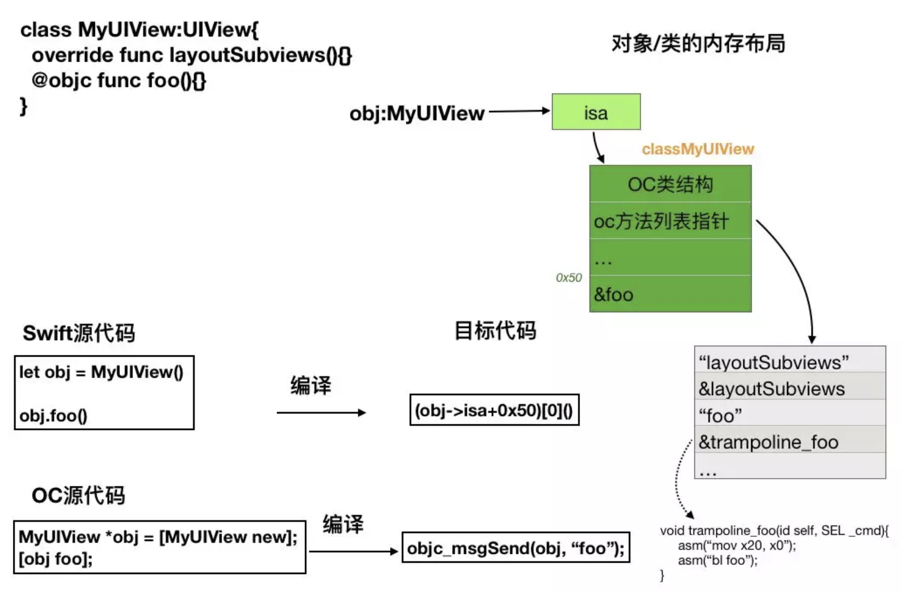

[知识小集swift专题](https://awesome-tips.github.io/zhuanti-07/)

[TOC]

# 1. Swift5之后"Method Swizzling"

swift5中的Method Swizzling

```swift
class Person {
    dynamic func foo() {
        print("raw foo")
    }
}

extension Person {
    @_dynamicReplacement(for: foo)
    func foo_new() {
        print("new foo")
    }
}
//输出:new foo
```

在swifrt5中，我们可以通过`@_dynamicReplacement(for:)`注解进行方法替换。

## 1.1 Objective-C Method Swizzling原理

我们知道，**在OC中方法替换的原理是方法交换，即两个Method指向地址相互交换**。Objc的Runtime 750版本源码:

```objective-c
void method_exchangeImplementations(Method m1, Method m2)
{
    if (!m1  ||  !m2) return;

    mutex_locker_t lock(runtimeLock);

        // 重点在这里，将两个方法的实例对象 m1 和 m2 传入后做了一次啊 imp 指针的交换
    IMP m1_imp = m1->imp;
    m1->imp = m2->imp;
    m2->imp = m1_imp;


    // RR/AWZ updates are slow because class is unknown
    // Cache updates are slow because class is unknown
    // fixme build list of classes whose Methods are known externally?

    flushCaches(nil);

        // 来更新每个方法中 RR/AWZ 的 flags 信息
        // RR/AWZ = Retain Release/Allow With Zone（神奇的缩写）
    updateCustomRR_AWZ(nil, m1);
    updateCustomRR_AWZ(nil, m2);
}
```



在连环hook的场景中，在OC中是可以完美实现的，即如果有两个地方hook同一个方法并调用原有方法，两个hook地方都可以生效。但是这在swift中似乎无法直接实现。

```swift
class Person {
    dynamic func foo() {
        print("raw foo")
    }
}

extension Person {
    @_dynamicReplacement(for: foo)
    func foo_new() {
        foo()
        print("new foo")
    }
    
    @_dynamicReplacement(for: foo)
    func foo_new2() {
        foo()
        print("new foo 2")
    }
}
//如上代码所示，输出结果是
raw foo
new foo 2
```

**在执行顺序上，后声明的replaceMent会生效。**

## 1.2 swift连环hook解决方案

实际上，我们只需要在`Other Swift Flags`中添加一个参数即可实现连环hook的场景：`-Xfrontend -enable-dynamic-replacement-chaining`。



**原理：**Swift在处理`dynamic`是将所有实现的`imp`保存，并且也有办法根据记录的 链表来触发实现。

Reference: https://mp.weixin.qq.com/s/VX7_Iqq9eAM73pIjtUVC5Q

# 2.Swift4.2新特性预览

## 2.1 CaseInterable协议

新增`CaseInterable`协议 ，枚举类型实现这个协议后 ，能自动生成一个包含所有case项的数组。这个操作是在编译时进行的，Swift会自动合成一个叫做`allCases`属性，包含枚举所有 的case项。

如果枚举中有关联值或者枚举中包含`unavailable`枚举类型时候，不会自动合成allCases，如果有需要可以自己手动合成，详情请参考代码。

```swift
enum ButtonType: CaseIterable {
// 1.手动合成 allCases 属性,重写CaseIterable的allCases方法即可
//    static var allCases: [ButtonType] {
//        return [.disable, .highlighted, .normal, .custom(title: "custom")]
//    }
    
    case normal, disable, highlighted
    
// 2.当枚举中有枚举是关联值时候,不会自动生成 allCases 属性,如有需要可以手动合成
//    case custom(title: String)
    
// 3.当枚举中有枚举被标记为不可用状态时候,不会生成 allCases 属性,如有需要可以手动合成
//    @available(*, unavailable)
//    case unavailable
}

for type in ButtonType.allCases {
    print(type)
}	
```

## 2.2 `#warning` 和 `#error` 编译指令

 新增 `#warning` 和 `#error` 编译指令，强制 `Xcode` 在 `build` 时生成警告或错误信息。[SE-196]

```swift
#warning("This is a warning.")
func warnTest() {}

#error("This is a error.")
func errorTest() {}
```

## 2.3 `@dynamicMemberLookup`和`subscript(dynamicMember:)` 方法

`@dynamicMemberLookup`和`subscript(dynamicMember:)`方法，让swift可以以属性访问的方式进行下标操作。这让我们可以像Python一样来访问字典值，不过是以类型安全的方式。示例代码如下所示：

```swift
@dynamicMemberLookup
class Person {
    private var properties = ["name": "walden", "cyty": "Beijing"]
    subscript(dynamicMember element: String) -> String {
        get{
            return properties[element, default: ""]
        }
        set{
            properties[element] = newValue
        }
        
    }
}

var p = Person()
p.name = "wang"	//可以直接给已有的属性赋值
p.sex = "1"			//可以添加不存在的属性
print(p.sex)
```

## 2.4 集合类型新增`removeAll(where:)`方法

```swift
var arr = [1,2,3,4,5,6,7]
arr.removeAll(where: {$0 > 5})
print(arr)
```

## 2.5 Bool类型的`toggle()`方法

`toggle()`方法可以在true和false之间进行切换。[SE-0119]

```swift
extension Bool {
   mutating func toggle() {
      self = !self
   }
}

var loggedIn = false
loggedIn.toggle()
```

## 2.6 增强的条件一致性

运行时查询条件一致性、提升自动合成Hashable一致性的能力（一个类型的所有元素如果符合`Hashable`协议，则类型自动符合`Hashable`协议）。

```swift
protocol Purchaseable {
    func buy()
}

struct Book: Purchaseable {
    func buy() {
        print("You bought a book")
    }
}

extension Array: Purchaseable where Element: Purchaseable {
    func buy() {
        for item in self {
            item.buy()
        }
    }
}

let arr: Any = [
    Book(),
    Book()
]

// 下面代码在 4.1 中会崩溃，而在 4.2 中则不会
if let books = arr as? Purchaseable {
    books.buy()
}
```

# 3. Swift5中如何使用原始字符串

swift5中的`原始字符串(raw string)`让我们能够编写出更自然的字符串，尤其是在使用反斜杠 和括号时。

**原始字符串**

```swift
//如下所示两个字符串是完全相同的，以#开始和结尾表示是一个原始字符串，
let regularString = "\\hello \\world"
let rawString       = #"\hello \world"#

//如果需要在原始字符串中使用插值，则可以使用`\#()`代替`\()`即可
let name = "walden"
let rawString1 = #"hello \#(name)"#
print(rawString1)

//原始字符串和多行字符串是可以联合使用的
let message = #"""
This is rendered as text: \(example).
This uses string interpolation: \#(example).
"""#

//如果需要在字符串中包含#，我们可以将字符串前后 的#换乘##或者###、####效果都是相同的
let str = ##"My dog said "woof"#gooddog"##
```

**为什么需要原始字符串呢？**

1. 被转义掩盖。转义会损害代码审查和验证。
2. 已经转义了。转义的内容不应该由比那一起预先解释。
3. 无论是为了测试还是仅更新源，都需要在源和代码之间轻松传输。

```swift
例如如下两个正则表达式是等价的
let regex = try NSRegularExpression(pattern: "\\\\\\([^)]+\\)")
let regex = try NSRegularExpression(pattern: #"\\\([^)]+\)"#)
```

# 4. swift中的String和Substring如何工作

字符串在不同的swift版本中变化比较大。在swift4中，当需要从一个字符串中获取子串时，我们获取到的是Substirng类型而不是String类型。这是因为，在swift中，string是值类型。就是说如果从一个字符串中生成一个新的字符串，则需要做拷贝处理。这对于稳定性来说是有益的，但是效率却不高。

另一方面上，Substring是String的一个引用。它不需要做拷贝处理，所以更加高效。但是另一个问题是，加入我们从一个很长的字符串 上获取一个长度是10的Substring，由于这个Substring会引用String，那么只要Substring存在，String就一直不会被释放。所以，**任何时候当处理完Substring之后，需要将其转换成String（let myString = String(mySubstring)）。**

在Swift4中另一个大的改进是，**字符串 又成为集合了**。**这意味着在集合上的所有操作，也可以应用在字符串中**（如下表、迭代字符、过滤等）。

## 4.1 String.Index索引

```swift
let str = "Hello world."
//1.字符串其实index
str.startIndex
//2.字符串结束index
str.endIndex
//3.返回给定索引后面的索引
str.index(after: String.Index)
//4.返回给定索引前面的索引
str.index(before: String.Index)
//5.offsetBy的值可正可负，以指定索引位置，String.IndexDistance是Int类型的别名
str.index(String.Index, offsetBy: String.IndexDistance)
//6.limitedBy用于确保片质量不会导致索引超出范围。这是一个有界的索引。由于偏移量可能超出限制，因此此方法返回 Optional。如果索引超出范围，则返回 nil。
str.index(String.Index, offsetBy: String.IndexDistance, limitedBy: String.Index)
```

我们可以根据String.Index获取到String的Substring，当处理完Substring时候，注意将 它转换成String。

## 4.2 基于Int索引的扩展

实际上相比String.Index，Int类型的索引可以隐藏String索引的复杂性，可能会更容易理解一点。而swift团队故意 没有使用Int索引，而使用`String.Index`，原因是swift中`Character`在底层的长度并不完全相同。**单个swift字符串可能由一个、两个甚至多个`Unicode`组成。因此，每个唯一的String必须计算其Character的索引。**

# 5.swift5中Runtime机制浅析

详情请参考原文: https://mp.weixin.qq.com/s/qPlg716RqtiT2PK_WqtBZQ

OC是一门以C为基础的面向对象编程语言，其提供的运行时机制使得它也可以被认为是一门动态语言。**运行时的特征之一就是对象方法的调用在程序运行时才被确定和执行**。系统提供的开放接口使得我们可以在程序运行的时候执行方法替换以便实现一些诸如系统监控、对象行为改变、Hook等等的操作处理。然而这种开放性也存在着安全的隐患，我们可以借助Runtime在AOP层面上做一些额外的操作，**而这些额外的操作因为无法进行管控， 所以有可能会输出未知的结果**。

swift中对象调用机制和OC是完全不同的，swift语言的对象方法调用基本上是在编译时刻就被确定的，可以看做是一种硬编码的调用实现。

Swfit中的对象方法调用机制加快了程序的运行速度，同时减少了程序包体积的大小。但是从另外一个层面来看当编译链接优化功能开启时反而又会出现包体积增大的情况。Swift在编译链接期间采用的是空间换时间的优化策略，是以提高运行速度为主要优化考虑点

通过程序运行时汇编代码分析swift中的对象方法调用，发现其在Debug模式和Release模式下的实现差异巨大。其原因是在Release模式先还同时会把编译链接优化选项打开。确切的说是在编译链接优化选项开启与否的情况下，两者的实现差异巨大。

## 5.1 swift类的对象创建和销毁

在swift中可以定义两种类 ：一种是从NSObject或者派生的类，另一种是从系统swift基类`SwiftObject`派生的类。如果swift中定义类没有制定基类，则会默认从基类SwiftObject派生。SwiftObject是一个隐藏的基类，不会在源代码中体现。

swift类对象的内存布局和OC类对象的内存布局相似。二者对象的最开始部分都有一个isa成员变量指向类的描述信息。swift类的描述信息机构继承自OC类的描述信息，但是并没有完全使用里面的属性，对于方法的调用则主要是使用其中扩展了一个所谓的虚函数表的区域 。

## 5.2 Swift类的对象方法调用

Swift语言在对象的方法调用的实现机制和C++语言中对虚函数调用机制是非常相似的（这里所说 的调用实现知识在编译链接优化选项开关在关闭的时候是这样的，在优化开关打开时候这个结论不正确）。

swift语言类定义的方法可以分为三种：**OC派生类并且重写了基类的方法**、**Extension中电仪的方法**、**类中定义的常规方法**。针对这三种方法定义和实现，系统采用调用机制是不同的。

**1.OC类的派生类重写了基类的方法**

如果在swift中使用类OC类，比如UIView，并且还重写了基类的方法。对于这些类的重写的方法定义信息还是保存在类的Class结构体中，在方法调用上还是采用OC语言的Runtime机制来实现；如果派生类定义了新的方法，则新方法的调用机制和Runtime就没有一毛钱关系了

```swift
//类定义
class MyUIView:UIView {
    open func foo(){}   //常规方法，使用swift方式进行调用
    override func layoutSubviews() {}  //重写OC方法，使用runtime进行调用
}
```

**2.extension中定义的方法**

如果是在swift类的extension中定义的方法（重写OC基类的方法除外），那么这些方法调用总是会在编译时就决定，就是说在调用这类对象 方法时候，方法调用指令中函数地址会以硬编码的形式存在。在extension中定义的方法在运行时无法做任何的替换和改变。并且方法函数的符号信息都不会保存到类的描述信息中去。这也就解释了在swift中派生类无法重写一个基类中extension定义的方法的原因了。因为extension中方法调用是通过硬编码完成的，无法支持多态。

**3.swift类中定义的常规方法**

如果是在swift中定义的常规方法，方法调用机制类似C++中虚函数的调用机制。swift会为每个类创建 一个被称为虚表的数组结构，这个数据会保存着类中所有定义的常规成员方法函数的地址。类的虚函数表类描述结构的第0x50个字节的偏移处，每个虚表条目保存一个常规方法 的函数地址指针。每个对象 方法调用源代码在编译时会转化成从虚表中取对应偏移位置的函数地址来实现间接的函数调用。

这里有几点需要注意的地方：

1. swift类的常规方法中不会再有两个隐藏的参数了，而是和字面定义保持一致。swift中对象 不再作为参数传递了，而是在编译阶段生成的机器码中，将对象存放在x20这个寄存器中。这样设计可以让代码更加安全。
2. 每个 方法 调用都是通过读取方法在虚表中的索引获取到方法函数的真实地址，然后再执行间接调用。基类和派生类虚表中相同索引处函数地址可以不一致，当派生类重写父类某个方法时，因为会分别生成两个类的虚表，在相同索引位置保存不同的函数地址来实现多态功能。
3. 每个方法函数名字都和源代码中不一致了，因为编译链接是系统对所有的方法名称进行了重命名处理，这个处理称为明明修饰。

下图描述了swift类的对象方法调用以及描述信息：



**4.swift类中成员变量的访问**

OC和swift类的对象内存布局非常相似，每个对象实例的开始部分都是isa数据成员指向类的描述信息，而且类中定义的属性或者变量则一般会根据定义的顺序依次排列在isa的后面。OC还会为所有的成员变量，生成一张变量信息表，表中每个条目记录每个成员变量在内存地址中的偏移量。这样在访问对象属性时会通过偏移表中的偏移量来读取偏移信息，然后根据偏移 信息读取或者设置对象的偏移量。在每个OC的 get和set两个属性方法实现中，对于属性在类中偏移量值的获取都是通过硬编码来完成的，也就是说在编译链接时刻决定的。

对于swift来说，对成员变量的访问得到了简化。系统会对每个成员变量生成get/set两个函数来实现成员变量的访问。系统不会再为类的成员变量生成变量偏移信息表，因此对于成员变量的访问就是直接在编译链接时确定成员变量在对象的偏移地址，这个偏移地址是硬编码来确定的。

## 5.3 结构体中的方法

在swift结构体中也可以定义方法，因为结构体的内存结构中并没有地方保存结构体的信息（不存在isa数据成员），因此结构体中的方法是不支持多态的，同时结构体中所有方法调用都是在编译时硬编码来实现的。这也解释了为什么结构体不支持派生，以及结构体中方法不支持override关键字的原因。

## 5.4 类的方法以及全局函数

swift中类方法和全局函数一样，因为不存在对象作为参数，因此在调用此函数时也不会将对象保存到x20寄存器这么一说。同时源代码中定义的函数的参数在编译时也不会插入附加参数。swift语言会对所有符号进行重命名修饰，类方法和全局函数也不例外。这也使得全局函数和类方法也支持名称相同但是参数不同的函数定义。**简单说就是类方法和全局函数就像C全局函数一样被实现和定义，所有类方法和全局函数的调用都是在编译链接时刻硬编码为函数地址调用来处理的**。

## 5.5 OC调用swift类中的方法

如果要在OC中调用swift方法，因为Swift和OC的函数调用ABI规则不同，OC语言智能创建swift中从NSObject类中派生类对象，而**方法调用则只能调用原NSObject类以及派生类中所有方法以及被声明为@objc关键字的swift对象方法**。

当某个swift方法被声明为@objc时候，在编译时刻会生成两个函数，一个是本体函数供swift内部调用，另一个是跳板函数供OC语言调用。这个跳板函数信息会记录在OC类的运行时结构体中，跳板函数会对参数的传递规则进行转换：把x0寄存器的值赋值给x20寄存器，然后把其它参数依次转化为swift函数参数传递规则要求，最后再执行本地函数调用。

下图简单展示swift中带@objc关键字的方法实现，以及OC语言调用swif对象方法的实现：



## 5.6 swift类方法运行时替换实现的可行性

Method Swizzling在swift5中已经被实现，不管是类方法还是对象方法都是可以通过`    @_dynamicReplacement(for:)`注解来实现方法替换的，详情可以参考：[1. Swift5之后"Method Swizzling"](#1. Swift5之后"Method Swizzling")

```swift
class Person {
    
    dynamic static func classMethod() {
        print("class method")
    }
    
    dynamic func foo() {
        print("raw foo")
    }
}

extension Person {
    
    @_dynamicReplacement(for: classMethod)
    class func classMethod_new() {
        print("classMethod_new")
        classMethod()
    }
    
    @_dynamicReplacement(for: foo)
    func foo_new() {
        foo()
        print("new foo")
    }
    
    @_dynamicReplacement(for: foo)
    func foo_new2() {
        foo()
        print("new foo 2")
    }
}
//输出：
raw foo
new foo
new foo 2
classMethod_new
class method
```

## 5.7 编译链接优化开启后的swift方法定义和调用

当我们开启编译优化选项后，swift对象方法的调用机制做了非常大的改进。最主要的就是进一步弱化了通过虚函数表来进行间接方法调用的实现，而是大量的改用了一些内联的方式来处理方法函数调用。同时对多态的支持也采用一些别的策略。具体采用了如下一些策略：

1. 大量的将函数实现换成了内联函数模式，也就是对于大部分类中定义的源代码比较少的方法函数都统一换成内联。**优点：**1.这样对象方法的调用将不再通过虚函数表来间接调用，而是简单粗暴的将函数的调用改成直接将内联函数生成的机器码进行拷贝处理。这样的好处是，由于没有函数调用跳转指令，而是直接执行方法中定义的指令，从而极大的加速了程序的运行速度。2.另一方面就是使得程序更加安全，因为此时函数实现逻辑已经散步到各处了，除非恶意改动者改动所有指令，否则都只会影响局部程序运行。**缺点：**使得程序体积增大很多。
2. 对多态的支持，也可能不是通过虚函数来处理了，而是通过类型判断采用条件语句来实现方法的调用。