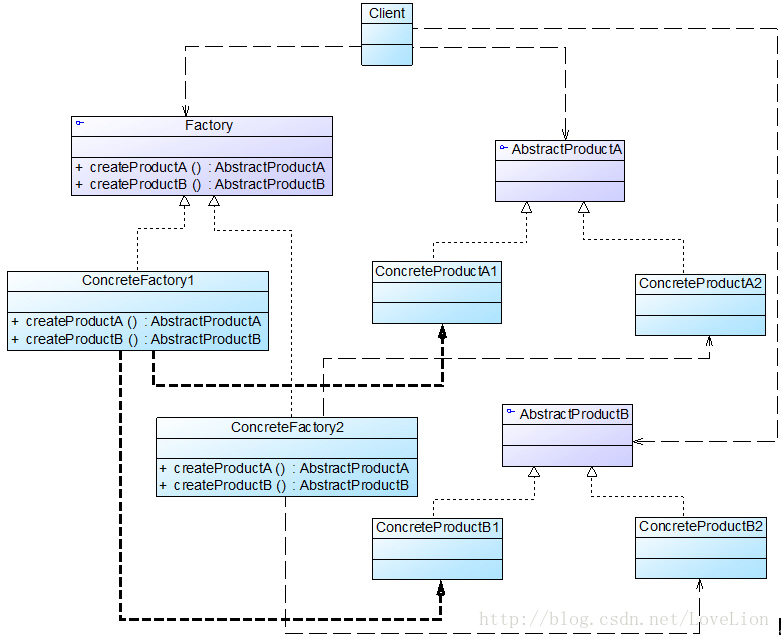
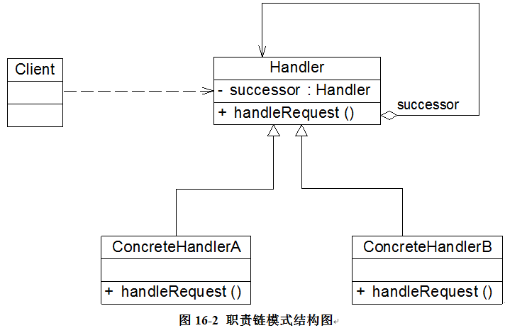
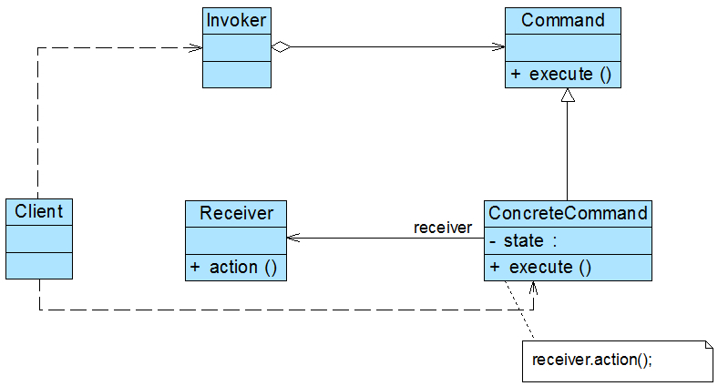
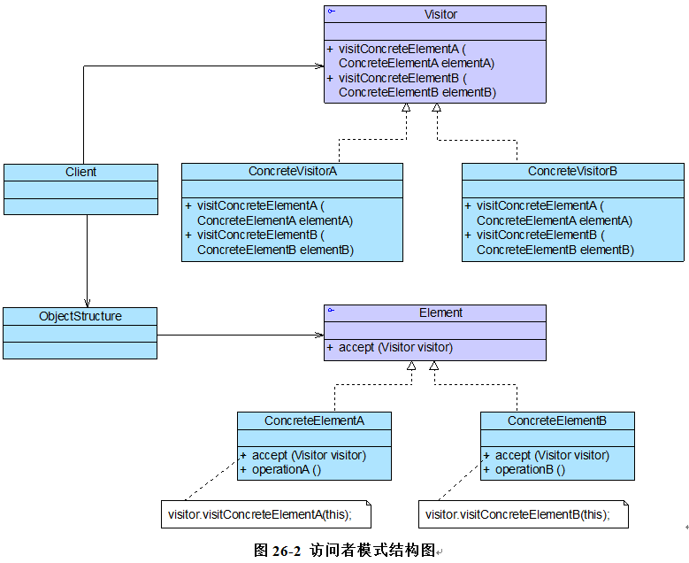

设计模式-Note 
--------------
**目录**

- [1.设计原则](#1设计原则)
- [2.六个创建型模式](#2六个创建型模式)
    - [2.1 简单工厂模式](#21-简单工厂模式)
    - [2.2 工厂方法模式](#22-工厂方法模式)
    - [2.3 抽象工厂模式](#23-抽象工厂模式)
    - [2.4 单例模式](#24-单例模式)
    - [2.5 原型模式](#25-原型模式)
    - [2.6 建造者模式](#26-建造者模式)
- [3.七个结构型模式](#3七个结构型模式)
    - [3.1 适配器模式](#31-适配器模式)
        - [3.1.1 对象适配器](#311-对象适配器)
        - [3.1.2 类适配器](#312-类适配器)
        - [3.1.3 小结](#313-小结)
    - [3.2 桥接模式](#32-桥接模式)
    - [3.3 组合模式](#33-组合模式)
    - [3.4 装饰模式](#34-装饰模式)
    - [3.5 外观模式](#35-外观模式)
    - [3.6 享元模式](#36-享元模式)
    - [3.7 代理模式](#37-代理模式)
- [4.十一个行为型模式](#4十一个行为型模式)
    - [4.1 责任链模式](#41-责任链模式)
    - [4.2 命令模式](#42-命令模式)
    - [4.3 解释器模式(了解)](#43-解释器模式了解)
    - [4.4 迭代器模式](#44-迭代器模式)
    - [4.5 中介者模式](#45-中介者模式)
    - [4.6 备忘录模式](#46-备忘录模式)
    - [4.7 观察者模式](#47-观察者模式)
    - [4.8 状态模式](#48-状态模式)
    - [4.9 策略模式](#49-策略模式)
    - [4.10 模板方法模式](#410-模板方法模式)
    - [4.11 访问者模式](#411-访问者模式)
- [5.其它](#5其它)
    - [5.1 设计模式概述](#51-设计模式概述)
        - [1. 设计模式从何而来](#1-设计模式从何而来)
        - [2. 设计模式是什么?](#2-设计模式是什么)
        - [3. 设计模式有什么用?](#3-设计模式有什么用)

**重点:** 六大设计原则, 
# 1.设计原则

* **单一职责原则**. 一个类只负责一件事.
* **开闭原则**. 对修改关闭, 对扩展开放.
* **接口隔离原则**. 使用多个专门的协议, 而不是一个庞大臃肿的协议; 协议中方法尽量精简. 例如,UITableViewDelegate,UITableViewDataSource使用两个协议而不是一个协议, 这样更符合接口隔离原则.
* **依赖倒置原则**. 抽象不不应该依赖具体实现, 具体实现可以依赖于抽象.
* **里氏替换原则**. 父类可以被子类无缝替换, 且原有功能不受影响. (KVO遵从了这个法则,无缝使用子类)
* **合成复用原则**. 尽量使用对象组合, 而不是继承来达到复用的目的. 因为继承会破坏类的封装性. 
* **迪米特法则**. 一个对象应当对其它对象尽可能少的了解. 高内聚,低耦合.

# 2.六个创建型模式
## 2.1 简单工厂模式
**简单工厂并不属于`GoF 23个经典设计模式`, 但通常作为学习其它工厂模式的基础. **

**简单工厂模式: 定义一个工厂类, 它可以根据参数的不同返回不同类的实例, 被创建的实例通常都具有共同的父类. 因为在简单工厂模式中用于创建实例的方法是静态方法, 因此简单工厂模式又被称为静态工厂方法模式, 属于创建性模式.** 


**工厂模式虽然简单, 但是存在一个严重问题. 当系统中需要引入新产品时, 由于静态工厂方法通过所传入参数的不同来创建不同的产品, 这必定要修改工厂类的源码, 将违背开闭原则. 使用工厂方法模式将避免这点.**

## 2.2 工厂方法模式
在工厂方法模式中, 我们不再提供一个统一的工厂类来创建所有的产品对象, 而是针对不同的产品提供不同的工厂, 系统提供一个与产品等级结构对应的工厂等级结构. 

**工厂方法模式: 定义一个用于创建对象的接口, 让子类决定将哪一个类实例化. 工厂方法模式让一个类的实例化过程延迟到其子类. 工厂方法模式又称为工厂模式. 工厂模式是一种创建型模式.**


与简单工厂相比, 工厂方法模式最重要的区别是引入了抽象工厂角色, 抽象工厂可以是接口, 也可以是抽象类或者具体类.

**优点**

1. 工厂方法用来创建客户所需的产品, 同时向客户隐藏了哪种具体产品类将被实例化这一细节, 用户只需关心所需产品对应的工厂, 无需关心创建细节.
2. 系统中加入新产品时, 无需修改抽象工厂和抽象产品提供的接口. 符合"开闭原则".

**缺点**

1. 在添加新产品时, 需要编写新的具体产品类, 而且还要提供与之对应的具体工厂类, 系统中类的数量将成对增加, 在一定程度傻姑娘增加了系统的复杂性, 有更多的类需要编译和运行, 会给系统带来一些额外的开销.
2. 考虑到系统扩展性, 需要引入抽象层, 在客户端代码中均使用抽象层定义, 增加了系统的抽象性和理解难度. 

## 2.3 抽象工厂模式
工厂方法模式通过引入工厂等级结构, 解决了简单工厂模式中工厂类职责太重的问题, 单时工厂方法模式中的峨眉个工厂只生产一类产品, 可能会导致系统中存在大量的工厂类, 势必会增加系统的开销. 此时, 我们可以考虑**将一些相关的产品组成一个"产品簇", 由同一个工厂来统一生产**.

工厂模式和抽象工厂模式区别: 工厂模式针对一个产品等级结构, 抽象工厂模式需要面对多个产品等级结构, 一个工厂等级可以负责多个不同产品等级结构中产品对象的创建. **当一个工厂等级结构可以创建出分属于不同产品等级结构的一个产品族中的所有对象时，抽象工厂模式比工厂方法模式更为简单、更有效率。**

**抽象工厂模式: 提供一个创建一系列相关或相互依赖对象的接口, 无需指定它们具体的类. 抽象工厂模式又称为Kit模式, 是一种对象创建型模式.**



抽象工厂模式中, 每个具体工厂都提供了多个工厂方法用于产生多种不同类型的产品, 这些产品构成了一个产品簇.

举例: 要给某个UI页面设计两套皮肤, 分别是春季皮肤和夏季皮肤. UI空间包括Button, TextField, Combox. 使用抽象工厂的设计方案如下所示: 


## 2.4 单例模式
**单例模式: 确保某一个类只有一个实例, 而且自行实例化并向整个系统提供这个实例, 这个类称为单例类, 它提供全局访问的方法. 到哪里模式是一种对象创建型模式.**


**饿汉式单例类: 在类被初始化时候就将自己实例化, 优点是无需考虑多线程访问问题.**

**懒汉式单例类: 在第一次使用时候创建, 无需一直占用资源, 实现延迟加载, 但是必须处理好多线程访问问题.**

使用懒汉式单例时候, 注意要用**双重检查锁定**来保证单例的唯一性.

```
public static LazySingleton getInstance() { 
    //第一重判断
    if (instance == null) {
        //锁定代码块
        synchronized (LazySingleton.class) {
            //第二重判断
            if (instance == null) {
                instance = new LazySingleton(); //创建单例实例
            }
        }
    }
    return instance; 
```

**优点**

1. 单例模式提供了对唯一实例的受控访问. 因为单例类封装了它的唯一实例, 所以它可以控制客户怎样以及何时访问它.
2. 由于系统内存只存在一个对象, 因此可以介于系统资源.
3. 允许可变数目的实例. 基于单例模式我们可以进行扩展, 使用与单例控制相似的方法来获得指定个数的对象实例. 既节省系统资源, 又解决了到哪里对象共享过多有损性能的问题. 

**使用场景**

1. 系统只需要一个实例对象, 如系统资源管理器, 唯一序列号生成器, 或者需要考虑消耗资源太大而只允许创建一个对象.
2. 客户调用类的单个实例只允许使用一个公共访问点, 除了该访问点, 不能通过其它途径访问该实例.

**Objective-C单例实现:**

```
@interface Singleton : NSObject

//类方法
+ (Singleton *) getInstance;

@end

#import "Singleton.h"

@implementation Singleton

//在.m文件中声明静态的类实例，不放在.h中是为了让instance私有
static Singleton* instance = nil;

//提供的类唯一实例的全局访问点
//跟C++中思路相似，判断instance是否为空
//如果为空，则创建，如果不是，则返回已经存在的instance
//不能保证线程安全
+(Singleton *) getInstance{
    static dispatch_once_t onceToken;
    dispatch_once(&onceToken, ^{
        instance = [[self alloc]init];
    });
    return instance;
}

//相当于将构造函数设置为私有，类的实例只能初始化一次
+(id) allocWithZone:(struct _NSZone*)zone {
    if (instance == nil) {
        instance = [super allocWithZone:zone];
    }
    return instance;
}

//重写copy方法中会调用的copyWithZone方法，确保单例实例复制时不会重新创建
-(id) copyWithZone:(struct _NSZone *)zone {
    return instance;
}
@end

```

**Swift单例类实现:**

```
class SingletonClass: NSObject {

    static let shared = SingletonClass()
    
    // Make sure the class has only one instance
    // Should not init or copy outside
    private override init() {}
    
    override func copy() -> Any {
        return self // SingletonClass.shared
    }
    
    override func mutableCopy() -> Any {
        return self // SingletonClass.shared
    }
    
    // Optional
    func reset() {
        // Reset all properties to default value
    }
}
```

## 2.5 原型模式
> `Cocoa Touch`中对原型模式的应用: `copy`, `mutableCopy`方法.

**原型模式:使用原型实例指定创建对象的种类, 并且通过拷贝这些原型创建新的对象. 原型模式是一种对象创建型模式.**

原型对象的原理很简单: 将一个原型对象传给哪个要发动创建的对象, 这个要发动创建的对象通过请求原型对象拷贝自己来实现创建过程. 由于在软件系统中我们经常会遇到需要创建多个相同或者相似对象的情况, 因此原型模式在真实开发中的使用频率还是非常高的. 

**通过克隆兑现所创建的对象是全新的对象, 它们在内存中拥有新的地址.** 


**优点**

1. 当创建新的对象实例比较复杂时, 使用原型模式可以简化对象的创建过程, 通过复制一个已有实例可以提高新实例的创建效率.
2. 扩展性好, 由于在原型模式中提供了抽象原型类, 在客户端可以针对抽象原型类进行编程.
3. 可以使用深拷贝的方式来保存对象的状态, 使用原型模式将对象复制一份并将其状态保存起来, 以便在需要的时候使用, 可辅助实现撤销操作.

## 2.6 建造者模式
> 示例: 构建一个游戏人物. 一个游戏任务的组成部分一般都比较复杂, 包括身体, 头发, 面部, 衣服, 武器等. 我们可以确定一个游戏任务的构建过程, 然后通过不同的构造方法来构建不同的游戏人物.

建造者模式是比较复杂的创建型模式, 它将客户端与包含多个组成部分的复杂对象的创建过程分离, 客户端无需知道复杂对象的内部组成部分与拼装方式, 只需知道所需建造者的类型即可. 它关注如何一步步创建一个复杂对象, 不同的具体建造者定义了不同的创建过程, 且具体建造者相互独立, 增加新的建造者非常方便, 无需修改已有代码, 系统有较好的扩展性.

**建造者模式: 将一个复杂对象的构建与它的表示分离, 使得同样的构建过程可以创建不同的表示. 建造者模式是一种对象创建型模式.** 


如上图所示, 关于指挥者类Director在建造过程中扮演者非常重要的作用. 某些情况下, 为了精简系统结构, 我们可以将Director和抽象建造者类进行合并, 在Builder中提供构建产品对象的`construct()`方法.  另外`construct()`中也可以通过钩子方法来对Product的构建过程进行更加精细化的控制.

> 建造者模式的核心在于如何一步步构建一个包含多个组成部件的完整对象过程, 使用相同的构建过程构建不同的产品, 在软件开发中, 我们需要创建复杂对象并希望系统具备很好的灵活性和可扩展性可以考虑使用建造者模式.

# 3.七个结构型模式
## 3.1 适配器模式
> **例子:** 笔记本电脑工作电压是20V, 我国家庭用电电压是220V, 他们之间无法直接连接, 这时候就需要一个适配器来适配两者的工作, 这就引入了电源适配器. 


**适配器模式**: 将一个接口转换成客户希望的另一个接口, 使接口不兼容的哪些类型可以一起工作, 其别名为包装类. 适配器模式既可以作为类结构型模式, 也可以作为对象结构型模式. 

**在对象适配器模式中，适配器与适配者之间是关联关系；在类适配器模式中，适配器与适配者之间是继承（或实现）关系。**
### 3.1.1 对象适配器
**对象适配器模式类图:**


Adapter继承自目标抽象类, 实现request方法. Adapter引用了Adaptee, 在其request中调用需要适配的方法.

### 3.1.2 类适配器
类适配器模式和对象适配器模式最大的不同时适配器与适配者的关系不同, 对象适配器模式中适配器与适配者是关联关系; 类适配器中适配器与适配者是继承关系, 类适配器类图如下所示:


Adapter继承自Adaptee, 实现了目标协议的request协议方法, 在方法内部调用适配者相关的方法, 完成适配工作.

### 3.1.3 小结
**优点:** 

1. 将目标类和适配者类解耦, 通过引入一个适配者类来重用现有的适配者类, 无需修改原有结构.
2. 增加类的透明性和复用性. 将具体的业务封装在适配者类中, 对客户端而言是透明的, 提高了适配者的复用性.

**使用场景:**

1. 系统需要使用一些现有的类, 而这些类的接口(方法名)不符合系统的需要, 甚至没有这些类的源代码.
2. 向创建一个可以重复使用的类, 用于与一些彼此没有太大关联的类, 包括一些可能将来需要引进的类一起工作.的.

## 3.2 桥接模式
> 示例: 设计一款跨平台的图片解压程序. 不同的图片格式是一个变化的纬度, 不同的操作系统平台又是一个变化的纬度. 这时候我们需要使用桥接模式, 将两者的变化连接起来.


**桥接模式:** 将抽象部分和它的实现部分分离, 使他们可以独立的变化. 它是一种对象结构型模式, 又称为柄体模式或者接口模式.

**桥接模式用于软件系统中某个类存在两个独立变化的纬度, 通过该模式将两个或者多个纬度的变化分离开来, 使两者可以独立扩展**, 让系统更加符合"单一职责原则". 它将两个独立变化的纬度设计为两个独立的继承等级结构, 并且在抽象层简历抽象关联, 该关联关系类似一条链接两个独立继承结构的桥, 故称桥接模式.

**桥接模式类图:**


**桥接模式和适配器模式配合使用**, 示例类图如下所示:


读取excel报表的程序需要使用ExcelAPI, 这时候通过一个适配器关联读取API类的对象, 在响应的方法中调用读取方法.

**优点:**

1. 分离抽象接口和实现部分. 桥接模式使用“对象间的关联关系”解耦了抽象和实现之间固有的绑定关系，使得抽象和实现可以沿着各自的维度来变化。
2. 取代多重继承方案.
3. 提高系统扩展性, 在两个变化纬度中任意扩展一个纬度, 都不需要修改原有系统, 符合"开闭原则".

## 3.3 组合模式
**组合模式为处理树形结构提供了一种较为完美的解决方案, 它描述了如何将容器和叶子进行递归组合, 使得用户再使用时无需对他们进行区分, 可以一致的对待容器和叶子.**

**组合模式:** 组合多个对象形成树形结构以表示具有"整体-部分"关系的层次结构. 组合模式对整个对象和组合对象的使用具有一致性, 组合模式又称为"整体-部分"模式, 是一种对象结构型模式.

组合模式类图如下所示:


组合模式的关键是定义一个抽象构件类, 它既可以代表叶子, 也可以代表容器. 而客户端针对该抽象构件类进行编程, 无需知道它到底表示的是叶子还是容器, 可以对他们统一处理.

**组合模式在Cocoa框架中最重要的应用在页面布局通用行为的UIView这个类上. 视图层级中的单个视图对象可能是叶子结点, 也可以是包含其它视图集合的composite对象.**

**优点:**

1. 组合模式可以清楚地定义分层次的复杂对象, 表示对象的全部或者部分层次, 让客户端忽略层次的差异, 方便对这个那个层次结构进行控制.
2. 在组合模式中增加新的容器构建和叶子构件都很方便, 无需对现有类进行修改, 符合"开闭原则".
3. 组合模式为树形结构的面向对象实现提供了一种灵活的解决方案.

**使用场景:**

1. 在一个面向对象语言开发的系统中需要处理一个树形结构.
2. 在具有整体和部分的层次结构中, 希望通过一种方式忽略整体和部分的差异, 客户端可以一致的对待它们.

## 3.4 装饰模式
**装饰模式:** 动态的给一个对象增加一些额外的职责, 就增加对象功能来说, 装饰模式比生成子类实现更加灵活. 装饰模式是一种对象结构型模式.

装饰器模式类图:


由于具体构建类和装饰器类都实现了相同的抽象接口, 因此装饰器模式以对客户透明的方式动态给一个对象附加更多责任, 而客户端并不会觉得对象在装饰前和装饰后有什么不同. 装饰模式可以在不需要更多子类的情况下, 对对象的功能加一扩展.

装饰器模式可以多层嵌套, 每个装饰器实现不同的新功能, 并包装旧的装饰器或者原始类, 这一切对客户端来说都是透明的.


**优点:**

1. 对于扩展一个对象的功能, 装饰模式比继承更加灵活, 不会导致类数量急剧增加.
2. 可以通过一种动态的方式扩展一个对象功能. 
3. 可以对一个对象进行多次装饰, 通过使用不同的具体装饰类的排列组合, 可以创造出很多不同的行为组合, 得到功能更加强大的对象.

**使用场景:**

1. 在不影响其它对象的情况下, 以动态透明的方式给单个对象添加职责.
2. 当不能采用继承方式进行扩展, 或者扩展将产生大量子类的情况下.

## 3.5 外观模式
**外观模式:** 为子系统的一组接口提供一个统一的入口. 外观模式定义了一个高层的接口, 这个借口使得这一子系统更容易使用.

外观模式中, 一个子系统的外部与其内部通信通过一个统一的外观类进行, 外观类将客户类与子系统的内部复杂性分割开, 使得客户类只需要与外观角色打交道, 而不需要与子系统内部的很多对象打交道. **外观模式是迪米特法则的具体实现, 通过引入外观角色可以降低原有系统的复杂度, 同时降低客户类与子系统耦合度.**

外观模式类图如下所示:


**优点:**

1. 降低子系统和客户端之间的耦合;
2. 对客户端屏蔽了子系统组件, 减少客户端所需处理的对象数目, 使子系统使用起来更加方便;
3. 一个子系统的修改对其它子系统没有影响;

**使用场景:**

1. 为一系列复杂的子系统提供一个简单入口时候可以用外观模式;
2. 客户端与多个子系统之间存在很大的依赖性;
3. 层次化结构中, 可以用外观模式定义系统每一层的入口;

## 3.6 享元模式
> 示例: 享元模式在Cocoa Touch的应用是`UITableViewCell`, `UICollectionViewCell`的复用.

**享元模式:** 运用共享技术有效的支持大量细粒度对象的复用. 系统只使用少量对象, 而这些对象都很相似, 状态变化很小, 可以实现对象的多次复用. 由于享元模式要求能够共享的对象必须是细粒度的对象, 因此它又称为轻量级模式, 它是一种对象结构型模式.

享元模式结构比较复杂, 一般结合工厂模式一起使用, 在它的结构图中包含了一个享元工厂类, 其类图如下所示:


享元模式中引入了享元工厂类, 享元工厂类的作用在于提供一个存储享元对象的享元池, 当用户需要对象时, 首先从享元池中获取, 如果享元池中不存在, 则创建一个新的享元对象返回给用户, 并在享元池中保存该对象. 典型的享元工厂类代码如下所示:

```java
class FlyweightFactory {
    //定义一个HashMap用于存储享元对象，实现享元池
       private HashMap flyweights = newHashMap();
       public Flyweight getFlyweight(String key){
              //如果对象存在，则直接从享元池获取
              if(flyweights.containsKey(key)){
                     return(Flyweight)flyweights.get(key);
              }
              //如果对象不存在，先创建一个新的对象添加到享元池中，然后返回
              else {
                     Flyweight fw = newConcreteFlyweight();
                     flyweights.put(key,fw);
                     return fw;
              }
       }
}
```

**优点**

1. 可以极大减少内存中对象的数量, 使得相同或者相似对象在内存中只保留一份, 从而节约系统资源, 提高系统性能.
2. 享元模式的外部状态相对独立, 而且不会影响其内部状态, 从而使得享元对象可以在不同环境中被共享.

**使用场景**

1. 一个系统中存在大量相同或者相似的对象, 造成内存的大量消耗.
2. 对象的大部分状态都可以外部化, 可以将这些外部状态传入对象中.
3. 在使用享元模式时候需要维护一个共享的享元对象池不, 而这需要消耗一定的系统资源, 因此, 应当在需要多次重复使用享元对象时候吃啊值得使用享元模式.

## 3.7 代理模式
**代理模式:** 给某一个对象提供一个代理或者占位符, 并由代理对象来控制对原对象的访问.

代理模式类图如下所示:


**优点**

1. 能够协调调用者和被调用者, 在一定程度上降低系统的耦合度.
2. 客户端针对抽象主题编程, 增加和更换代理类无序

# 4.十一个行为型模式
## 4.1 责任链模式
**责任链模式:** 避免请求发送者和请求接收者耦合在一起, 让多个对象都有可能接收请求, 将这些对象链接成一条链, 并且沿着这条链传递请求, 直到有对象处理它为止. 责任链模式是一种对象行为型模式.



具体的处理者是抽象处理者的子类, 它有两大作用: 处理请求或者转发请求:

```
class ConcreteHandler extends Handler {
	public void handleRequest(String request) {
		if (请求满足条件) {
			//处理请求
		}
		else {
			this.successor.handleRequest(request);  //转发请求
		}
	}
}
```

责任链模式的关键在于对调用组件隐藏了责任链上单个链的实现细节. 责任链的创建可以放在客户端, 也可以放在责任链的基类中, 根据枚举类型创建不同的责任链.(放在客户端创建责任链可能更好一点, 更加符合开闭原则)

**应用:**

1. Cocoa框架中使用责任链来处理用户界面事件. 所有UI组件都派生自UIResponder类. 每个UI组件都是责任链中的链, 他们的位置反应的是其在界面组件层级关系中的位置, 层级顶端是责任链中的最后一个链.
2. 车主邦App中, Bundle图片获取器通过责任链模式实现. 如果是二倍屏, 则先获取二倍图, 没有的话获取三倍图, 一倍图. 
3. 消息处理也可以作为责任链来开发. 当收到一个消息, 把消息传递给第一个处理器, 如果不能处理则传递给第二个处理器...

**使用场景:** 当多个对象可以响应一个请求, 而最终只有一个对象会处理请求时, 可以使用此设计模式.

## 4.2 命令模式

> 例子: 有一个模拟遥控器的页面, 遥控器面板上有几十种不同的功能. 针对这样的需求, 我们可以使用命令模式, 实现具体的命令类型, 包装具体的操作, 命令发送者只需针对抽象命令类编程, 最后把具体命令类和命令发送者关联起来. 

命令模式可以将请求发送者和接收者完全解耦, 发送者和接收者之间没有直接引用关系, 发送请求的对象只需直到如何发送请求, 而不必知道如何完成请求.

**命令模式: 将一个请求封装成一个对象, 从而让我们可用不同的请求对客户进行参数化; 对请求排队或者记录请求日志, 以及支持可撤销的操作. 命令模式是一种对象行为型模式.**



**命令模式的本质是对请求进行封装, 一个请求对应于一个命令, 将发出命令的责任和执行命令的责任分割开.** 每个命令都是一个操作: 请求的一方发出请求要求执行一个操作; 接收的一方收到请求, 并执行相应的操作. **命令模式允许请求的一方和接收的一方独立开来, 使得请求的一方不必知道接收请求方的接口, 更不必知道请求如何被接收, 操作是否被执行, 何时被执行, 以及怎么被执行. **

命令模式的关键在于引入了抽象命令类, 请求发送者针对抽象命令类编程, 只有实现了抽象命令类的具体命令才与请求接收者相关联. 

命令模式是一种使用频率非常高的设计模式, 它可以将请求发送者和接收者解耦, 请求发送者通过命令对象来间接引用请求接收者, 使得系统具有更好的灵活性和可扩展性. 

**优点**

1. 降低系统耦合度. 由于请求者和接收者之间不存在直接引用, 因此请求者和接收者实现了完全的解耦, 相同的请求者可以对应不同的接收者, 反之亦然.
2. 新的命令可以很容易的加入到系统中.
3. 可以比较容易的设计一个命令队列或者组合命令.
4. 为请求的撤销和恢复提供了一种设计和实现方案.

## 4.3 解释器模式(了解)
解释器模式是一种使用频率相对较低但学习难度较大的设计模式, 其用于描述如何使用面向对象语言构建一个简单的语言解释器. 再某些情况下, 为了更好描述某一些特定的问题, 我们可以创建一种新的语言, 这种语言拥有自己的表达式和结构, 即文法规则, 这些问题的实例将对应该语言中的句子. 此时可以使用解释器设计新的语言. 对解释器模式的学习能够加深我们对面向对象思想的理解, 并掌握编程语言中文法规则的解释过程.

**解释器模式: 定义一个语言的文法, 并且建立一个解释器来解释该语言中的句子, 这里的语言指使用规定格式和语法的嗲吗. 解释器是一种类行为型模式.**


解释器模式为自定义语言的设计和实现提供了一种解决方案，它用于定义一组文法规则并通过这组文法规则来解释语言中的句子。虽然解释器模式的使用频率不是特别高，但是它在正则表达式、XML文档解释等领域还是得到了广泛使用。与解释器模式类似，目前还诞生了很多基于抽象语法树的源代码处理工具，例如Eclipse中的Eclipse AST，它可以用于表示Java语言的语法结构，用户可以通过扩展其功能，创建自己的文法规则。

## 4.4 迭代器模式
开发中我们经常需要使用聚合对象来存储一系列数据. 聚合对象有两个职责, **一是存储数据; 二是遍历数据**. 从依赖上看, 前者是聚合对象的本质工作; 后者是可变的, 可分离的. 因此, 可以将遍历数据的行为从聚合对象中分离出来, 封装在一个被称为迭代器的对象中, 由迭代器来提供遍历聚合对象内部数据的行为, 这样简化了聚合对象的设计,  更符合"单一职责原则". 

**迭代器模式: 提供一种方法来访问聚合对象, 而不用暴露这个对象的内部表示, 其别名是游标. 迭代器模式是一种对象行为型模式.**


迭代器模式中, 提供了一个外部的迭代器来对聚合对象进行访问和遍历, 迭代器定义了一个访问该聚合元素的接口, 并可以跟踪当前遍历的元素, 了解那些元素遍历过哪些没有. 迭代器的引入, 将使得一个复杂聚合对象的操作变得简单. 

**优点**

1. 迭代器模式支持以不同的方式遍历一个聚合对象, 在同一个聚合对象上可以定义多种遍历方式, 再迭代器模式中只需要用一个不同的迭代器来替换原有迭代器即可改变遍历算法, 我们也可以自己定义迭代器的子类以支持新的遍历方式.
2. 迭代器简化了聚合类. 由于引入了迭代器, 在原有的聚合对象上不需要再执行提供数据遍历方法, 这样可以简化聚合类的设计.
3. 在迭代器模式中, 由于引入了抽象层, 增加新的聚合类和迭代器类都很方便, 无需修改原有代码, 满足开闭原则的要求.

## 4.5 中介者模式
如果一个系统中对象之间存在多对多的相互关系, 我们可以将对象的一些交互行为从各个对象中分离开来, 并几种封装在一个中介者对象中国, 并由该中介者进行统一协调, 这样对象之间多对多的复杂关系就转化成相对简单的一对多关系. **中介者模式是`迪米特法则`的一个典型应用.**


**中介者模式:** 用一个中介对象来封装一系列的对象交互, 中介者使各对象不需要显式地相互引用, 从而使其耦合松散, 而且可以独立地改变他们之间的交互. 中介者模式又称为调停者模式, 它是一种对象行为模式.


再中介者模式中, **中介者承担两方面的责任**:

1. **中转作用:** 通过中介者模式提供的中转作用, 各个同事对象就不需要显式的应用其它同事, 当需要和其它同事进行通信时, 可通过中介者来间接调用. 
2. **协调作用:** 中介者可以进一步对同事之间关系进行封装, 同事可以一致的和中介者进行交互, 而不需要指明中介者需要怎么做, 中介者根据封装在自身内部的协调逻辑, 对同事的请求进行进一步的处理.

**优点**

1. 简化了对象之间的交互.
2. 可将各同事对象解耦.
3. 减少生成子类. 

**适用场景**

1. 系统中对象之间存在复杂的引用关系, 系统结构混乱且难以理解.
2. 一个对象由于引用了其它很多对象并且直接和这些对象通信, 导致难以复用该对象.
3. 想要通过一个中间类来封装多个类的行为, 而不想生成太多的子类. 可以通过引入中介者类来实现. 

## 4.6 备忘录模式
备忘录模式提供可一种状态恢复实现机制 , 使用户可以方便的回到一个特定的历史步骤, 当新的状态无效或者存在问题时, 可以使用暂时存储起来的备忘录将状态恢复.

**备忘录模式:** 在不破坏封装的前提下, 捕获一个对象的内部状态, 并在该对象之外保存这个状态, 这样可以在以后将这个对象恢复到原先保存的状态. 他是一种对象行为型模式. 


如上图所示, **原发器(Originator)相当于需要被保存状态的对象, 比如一个象棋的棋子; 备忘录(Memento)相当于是是保存棋子位置类型等属性的数据Model, 纯粹用来存储数据的; 负责人(Caretaker)相当于是一个管理类型, 管理人会调用原发器, 生成一个备忘录对象, 管理人也可以根据备忘录对象恢复一个原发器历史的状态.**

在设计备忘录模式时要考虑其封装性, **除了Originator类, 不允许其它类来调用备忘录类的Memento的构造函数与相关方法.** 否则可能导致备忘录在保存的历史状态发生改改变, 这样备忘录模式就失去了意义.

**优点**

1. 提供了一种状态恢复的实现机制, 使用户可以方便的回到一个特定的历史步骤, 当新的状态无效或者存在问题时, 可以使用展示存储起来的备忘录将状态复原.
2. 备忘录实现了对信息的封装, 一个备忘录对象是一种原发器对象状态的标识, 不会被其它代码所改动. 备忘录保存了原发器的状态, 吃啊用列表, 堆栈等集合来存储备忘录对象可以实现多次撤销操作.

**使用场景**

1. 保存一个对象在某一个时刻的全部状态或部分状态, 周鹤洋以后需要时候它能够恢复到先前的状态, 实现撤销操作.
2. 防止完结对象破坏一个对象历史状态的封装性, 避免将对象历史状态的实现细节暴露给外界.

## 4.7 观察者模式
观察者模式是使用频率最高的设计模式之一, 它用于建立一种对象之间的依赖关系, 一个对象发生改变时将自动通知其它对象, 其它对象做出响应. 观察者模式中, 发生改变的对象称为观察目标, 被通知的对象称为观察者, 一个观察目标可以对应多个观察者, 而这些观察者之间可以没有任何相互联系, 可以根据需要增加或者减少观察者,使系统易于扩展. 

**观察者模式: 定义对象之间的一种多对多依赖关系, 使得每当一个对象状态发生改变时, 其相互依赖对象皆可得到通知并被自动更新. 观察者模式是一种对象行为型模式.**


**观察者与MVC**

MVC架构中应用了观察者模式. 其中模型对英语观察者模式中的目标, 而视图适用于观察者, 控制器残党两者的中介者. 当模型层的数据发生改变时, 视图层将自动改变其显示内容. 

**优点**

1. 观察者模式可以实现表示层和数据逻辑层的分离, 定义了稳定的消息更新传递机制, 并抽象了更新接口,使得可以有各种各样不同的表示层重放具体观察者角色.
2. 观察者模式 在观察目标和观察者之间建立一个抽象的耦合. 观察目标只需维护一个抽象观察者的集合, 无需了解具体观察者, 实现解耦.
3. 观察者模式支持广播通信, 观察哈目标会向所有已注册的观察者对象发送通知, 简化了一对多的系统设计难度.
4. 满足开闭原则的要求, 增加新的具体观察者无序修改原有系统代码, 增加新的观察目标也很方便.

## 4.8 状态模式
> 例子: Cocoa Touch中使用状态模式最典型的应用是UIButton再不同状态下表现不同. 这里状态的切换是由UIButton(Context类)的点击事件或者配置来实现切换的, 使用currentState表示当前状态, 不同状态展示不同的状态.

状态模式**用于解决系统中复杂对象的状态转换以及不同状态下行为的封装问题**. 当系统中某个对象存在多个状态, 这些状态之间可以进行转换, 而且对象在不同状态下行为不相同时可以使用状态模式. 状态模式将一个对象的状态从该对象中分离出来, 封装到专门的状态类中, 使得对象状态可以灵活变化, 对于客户端而言, 无需关心对象状态的转换以及对象当前所处当前状态, 无论对于何种状态的对象, 客户端都一致处理.

**状态模式: 允许一个对象在其内部状态改变时改变它的行为, 对象看起来似乎修改了它的类. 状态模式是一种对象行为型模式.**


在状态模式中, 我们将对象在不同状态下的行为封装到不同的状态类中, 为了让系统具有更好的灵活性和可扩展性, 同时对各状态下的共有行为进行封装, 我们需要将状态进行抽象.

在状态模式中, 一个对象的状态之间可以进行相互转换, 通常有两种状态转换方式:

1. 统一由环境类负责状态之间的转换(上图从的Context类,声明`chargeState`方法), 根据需要进行状态切换;
2. 由具体状态类负责状态之间转换. 在具体的状态类的业务方法中判断环境类的某些树形, 再根据情况为环境类设置新的状态对象, 实现状态转换. **同样也可以提供专门的方法负责属性值的判断和状态转换(KVO监听变化).**

某些情况下, 多个环境对象可能需要共享同一个状态, 如果希望在系统中实现多个环境对象共享一个或多个对象, 那么需要将这些状态定义为环境类的静态成员对象.

## 4.9 策略模式

> 举例: 一个项目中的实例就是对消息推送的组件化封装. 在推送消息组件中封装第三方消息, 推送组件包含了消息处理的管理类型和处理过程的接口. 再实际使用时候去实现协议, 定义具体的处理流程, 然后配置到管理类型中. 推送管理类型负责与具体推送服务做交互.

实现某一个功能有多条途径, 每一条途径对应一种算法, 此时我们可以使用一种设计模式来实现灵活的选择解决途径, 也能够方便的增加新的解决途径.

**策略模式:** 定义一系列算法类, 将每一个算法封装起来, 并让他们相互替换, 策略模式让算法独立于它的客户而变化, 也称为政策模式. 策略模式是一种对象行为型模式.


**策略模式的主要目的是嫁给你算法的定义和使用分开, 也就是将算法的行为和环境分开.** 

**优点**

1. 策略模式提供对"开闭原则"的完美支持, 用户可以在不修改原有系统的基础上选择算法和行为, 也可以灵活的增加新的算法和行为.
2. 策略模式提供了管理相关算法簇的办法. 
3. 策略模式提供了可以替代继承关系的办法. 使用组合代替继承.

**使用场景**

1. 一个系统需要动态的几种算法中选择一种, 那么可以将这些算法封装到一个个的具体算法类中, 而这些具体算法类都是抽象算法类的子类.
2. 一个对象有很多种行为, 如果不用恰当的模式, 这些行为就只好使用多重条件语句来进行实现.
3. 不希望客户端直到复杂的, 与算法相关的数据结构, 再具体策略类中封装算法和相关的数据结构, 可以提高算法的保密性和安全性.

## 4.10 模板方法模式
**模板方法模式**: 定义一个操作中算法的框架, 而将一些步骤延迟到子类中. 模板方法模式可以使得子类可以不改变一个算法结构即可重定义该算法的某些特定步骤.

**实现**: 在其他编程语言中, 模板方法模式的实现方式一般是定义一个基类, 并要求子类完善算法, 为缺失的步骤提供步骤. 实现此模式的第一步是将通用的固定的步骤归纳到一个类中, 而允许改变的步骤则需要定义成可通过属性配置的函数. 

**使用场景**: 此模式可以选择性的允许外界在不修改原有类的情况下, 修改任意算法中的某些步骤的具体实现. **钩子方法的引入使得子类方法可以控制父类的行为.** 

## 4.11 访问者模式
**访问者模式:** 提供一个作用于某对象结构中各元素的操作表示, 它使我们可以在不改变各元素的类的前提下定义作用于这些元素的新操作. 访问者模式是一种对象行为型模式.



访问者模式中, 对象结构存储了不同类型的元素对象, 以提供不同访问者访问. 访问者包含两个层次, 一个是访问者层次结构, 提供了抽象访问和具体访问者, 一个是元素层次结构, 提供了抽象元素和具体元素. 相同的访问者可以以不同的方式访问不同元素, 相同元素可以接受不同的访问者以不同访问方式访问. 在访问者模式中, 增加新的访问者无序修改原有系统, 系统具有较好的可扩展性. 

在访问者模式中，抽象访问者定义了访问元素对象的方法，通常为每一种类型的元素对象都提供一个访问方法，而具体访问者可以实现这些访问方法。这些访问方法的命名一般有两种方式：一种是直接在方法名中标明待访问元素对象的具体类型，如visitElementA(ElementA elementA)，还有一种是统一取名为visit()，通过参数类型的不同来定义一系列重载的visit()方法。

**优点**

1. 增加新的访问操作很方便. 使用访问者模式, 增加新的访问操作意味着增加一个新的具体访问者类, 实现简单, 无需修改源代码, 符合开闭原则.
2. 将有关元素对象的访问行为集中到一个访问者对象中，而不是分散在一个个的元素类中。类的职责更加清晰，有利于对象结构中元素对象的复用，相同的对象结构可以供多个不同的访问者访问。
3. 让用户能够在不修改现有元素类层次结构的情况下，定义作用于该层次结构的操作。

# 5.其它
## 5.1 设计模式概述
### 1. 设计模式从何而来
**模式是在特定环境下人们解决某类重复出现问题的一套成功或有效的解决方案。**每个模式都是描述一个在我们环境中不断出现的问题, 然后描述了该问题的解决方案核心, 通过这种方式, 我们可以无数次的使用那些已有的成功的解决方案, 无需再重复小矮个女童的工作. 设**计模式用于在特定的条件下 为一些重复出现的软件设计问题提供合理的, 有效的解决方案.**

### 2. 设计模式是什么?
模式是在特定环境下人们解决某类重复出现问题的一套成功或有效的解决方案。

### 3. 设计模式有什么用?
1. 设计模式来源众多专家的经验和智慧，它们是从许多优秀的软件系统中总结出的成功的、能够实现可维护性复用的设计方案，使用这些方案将可以让我们避免做一些重复性的工作，也许我们冥思苦想得到的一个“自以为很了不起”的设计方案其实就是某一个设计模式。在时间就是金钱的今天，设计模式无疑会为有助于我们提高开发和设计效率，但它不保证一定会提高.
2. 设计模式提供了一套通用的设计词汇和一种通用的形式来方便开发人员之间沟通和交流，使得设计方案更加通俗易懂。交流通常很耗时，任何有助于提高交流效率的东西都可以为我们节省不少时间。无论你使用哪种编程语言，做什么类型的项目，甚至你处于一个国际化的开发团队，当面对同一个设计模式时，你和别人的理解并无二异，因为设计模式是跨语言、跨平台、跨应用、跨国界的.
3. 设计模式提供了一套通用的设计词汇和一种通用的形式来方便开发人员之间沟通和交流，使得设计方案更加通俗易懂。交流通常很耗时，任何有助于提高交流效率的东西都可以为我们节省不少时间。无论你使用哪种编程语言，做什么类型的项目，甚至你处于一个国际化的开发团队，当面对同一个设计模式时，你和别人的理解并无二异，因为设计模式是跨语言、跨平台、跨应用、跨国界的.
4. 设计模式提供了一套通用的设计词汇和一种通用的形式来方便开发人员之间沟通和交流，使得设计方案更加通俗易懂。交流通常很耗时，任何有助于提高交流效率的东西都可以为我们节省不少时间。无论你使用哪种编程语言，做什么类型的项目，甚至你处于一个国际化的开发团队，当面对同一个设计模式时，你和别人的理解并无二异，因为设计模式是跨语言、跨平台、跨应用、跨国界的.
5. 最后一点对初学者很重要，学习设计模式将有助于初学者更加深入地理解面向对象思想，让你知道：如何将代码分散在几个不同的类中？为什么要有“接口”？何谓针对抽象编程？何时不应该使用继承？如果不修改源代码增加新功能？同时还让你能够更好地阅读和理解现有类库（如JDK）与其他系统中的源代码，让你早点脱离面向对象编程的“菜鸟期”.


