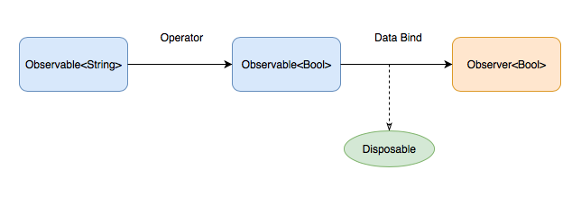
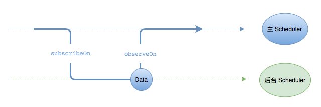

在项目中使用RxSwift，是为了更好的构建MVVM数据流，而RxSwift+MVVM实践中，对于ViewModel的公共约束是非常重要的。

通常，我们要把ViewModel当成是一个黑盒子，接收输入，产生输出，到底对输入进行什么加工产生什么样子的输出，并不是我们关系的内容。


[TOC]


# RxSwift能做什么

1.绑定按钮的点击事件。

```
btn.rx.tap.subscribe(onNext: { print("btn clicked") })
```

2.实现代理

```swift
scrollView.rx.contentOffset
    .subscribe(onNext: { contentOffset in
        print("contentOffset: \(contentOffset)")
    })
    .disposed(by: disposeBag)
```

3.实现通知

```
NotificationCenter.default.rx
    .notification(.UIApplicationWillEnterForeground)
    .subscribe(onNext: { (notification) in
        print("Application Will Enter Foreground")
    })
    .disposed(by: disposeBag)
```

4.实现多任务的依赖

```swift
/// 用 Rx 封装接口
enum API {
    /// 通过用户名密码取得一个 token
    static func token(username: String, password: String) -> Observable<String> { ... }
    /// 通过 token 取得用户信息
    static func userInfo(token: String) -> Observable<UserInfo> { ... }
}


/// 通过用户名和密码获取用户信息
API.token(username: "beeth0ven", password: "987654321")
    .flatMapLatest(API.userInfo)
    .subscribe(onNext: { userInfo in
        print("获取用户信息成功: \(userInfo)")
    }, onError: { error in
        print("获取用户信息失败: \(error)")
    })
    .disposed(by: disposeBag)
```

5.等待并发任务完成后处理结果

```swift
/// 同时取得老师信息和老师评论
Observable.zip(
      API.teacher(teacherId: teacherId),
      API.teacherComments(teacherId: teacherId)
    ).subscribe(onNext: { (teacher, comments) in
        print("获取老师信息成功: \(teacher)")
        print("获取老师评论成功: \(comments.count) 条")
    }, onError: { error in
        print("获取老师信息或评论失败: \(error)")
    })
    .disposed(by: disposeBag)
```

# 函数响应式编程

函数式编程是一种编程范式，它需要我们将函数作为参数传递，或者作为返回值返回。我们可以通过组合不同的函数来得到想要的结果。

我们通过不同的构建函数，来创建所需要的数据序列，最后通过适合的方式来响应这个序列，这就是函数响应式编程。

RxSwift中一个比较重要的概念是**数据绑定(订阅)**。是指将课件听序列绑定到观察者上。

如下代码所示，可以理解为将image对象同步到imageView上去，image表示一个可被监听的序列，这个序列中的图片可以是异步产生的，这里每产生一个图片就会将图片配置到指定的imageView上去。

```swift
let image: Observable<UIImage> = ...
image.bind(to: imageView.rx.image)
```

# RxSwift核心



RxSwift其实并没有那么复杂，最核心的内容如上图所示，Observable是可被观察的对象，通过Operator操作符进行一系列的操作转换成输出对象，Observer通过数据绑定观察Observable的结果，最终将结果展现出来。

此外，Disposeable是用来管理绑定（订阅）的声明周期的；Schedulers是用来进行线程队列调配的。

## 1.Observable-可被监听的序列

### Observable

首先需要明白，在响应式编程中，所有的事件都是序列，比如点击事件可以看成是一个不断产生点击事件的序列；文本框的变化可以看成不断产生不同输入内容的文本序列。

**如何创建序列&订阅序列**

```
//通过create创建一个可被观察的对象
let scoreObservable = Observable<Int>.create { (observer) -> Disposable in
    observer.onNext(1)
    observer.onNext(2)
    observer.onCompleted()
    return Disposables.create{ }
}
//对可被观察的对象进行一系列的操作变形
...
//订阅操作的结果，绑定到特定的类型上去
scoreObservable.subscribe(onNext: { (score) in
}, onError: { (error) in
}, onCompleted: {
}).disposed(by: DisposeBag())
```

Swift是一个强类型的语言，而强类型的语言相对于弱类型的语言的一个优点是更加严谨。我们可以通过类型判断出实例有哪些特征。**Observable也存在一些特征序列，这些特征序列可以帮助我们更加准确的描述序列。**主要有：**Single、Completable、Maybe、Driver、Signal、ControlEvent**。

### Single

Single是Observable的另一个版本，不同之处在于Observable可以发出多个元素，而**Single只能发出一个元素，要么产生一个error事件**。

一个常见的例子是执行HTTP请求，然后返回一个应答或者错误。不过你也可以用Single来描述任何只有一个元素的例子。

**例子：**

```
//创建一个可被观察的只使用一次的对象 Single
func getRepo() -> Single<String> {
    let single = Single<String>.create { (single) -> Disposable in
        if arc4random() % 100 > 50 {
            single(.success("you are success"))
        }else{
            single(.error(CustomError.defaultError))
        }
        return Disposables.create { }
    }
    return single
}
//订阅结果，一次性使用，用完扔掉
getRepo().subscribe(onSuccess: { (value) in

}) { (error) in

}
```

你同样可以对 `Observable` 调用 `.asSingle()` 方法，将它转换为 **Single**。

### Completable

它只能产生一个completed事件，要么产生一个error事件。

它的创建和使用类似Single，也是一次性使用的，不能不间断的产生事件。

```
func getCompletable() -> Completable {
    return Completable.create { (completed) -> Disposable in
        completed(.completed)
        return Disposables.create {}
    }
}
getCompletable().subscribe(onCompleted: {

}) { (error) in

}
```

### Maybe

也是一个专有的序列，它要么发出一个元素，要么产生一个completed事件，要么产生一个error事件。

### Driver

Driver是一个精心准备的序列。它主要是为了简化UI层的代码，下面情况下可以使用Driver，**不会产生error，一定在MainScheduler监听，共享附加作用**。

在一个大型系统中，要保证每一步都不被一楼并不是容易的事情，所以更好的选择是使用编译器和特征序列来确保必备条件都已经被满足。

drive方法只能被Driver调用，意味着，如果你发现代码所存在driver，那么这个序列不会产生错误并且一定在主线程监听。这样你可以安全的绑定UI元素。

### Signal

Signal和Driver的区别是，Driver会对新观察者回放（重新发送）上一个元素，而Signal不会对新观察者回放上一个元素。

像事件序列，如果使用Driver，则后订阅的会回放前一个点击事件，这不合理。于是就引入了Singal。同样的场景Signal不会回放点击事件给新的观察者，只会订阅后产生的点击事件。

**结论：状态序列我们选用Driver，事件序列我们选用Signal。**

### ControlEvent

ControlEvent专门用来描述UI控件所产生的事件，它有以下特征：不会产生error；一定在主线程订阅；一定在主线程监听；共享附加作用。

## 2.Observer-观察者

**观察者**是用来监听事件，然后它需要这个事件做出相应。例如：弹出提示框就是观察者，它对点击按钮这个事件作出相应。

### 创建观察者

和Observable一样，框架已经帮我们创建好了很多常用了观察者，如：view是否隐藏，button是否可点击，label是否被点击，imageview的当前图片。

此外有些自定义的观察者是需要我们自己创建的。这里先介绍一个最基本的创建观察者的方法：

```swift
input.username.subscribe(onNext: { (<#String#>) in
    <#code#>
}, onError: { (<#Error#>) in
    <#code#>
}, onCompleted: {
    <#code#>
}).disposed(by: disposeBag)
```

创建观察者最基本的方法就是Observable的subscribe方法后面描述事件发生时候如何做出相应。

和Observable一样，观察者也存在特征观察者，例如Binder。

### AnyObserver

AnyObserver可以用来描述任意一种观察者。如下所示：

```swift
let observer: AnyObserver<Data> = AnyObserver { (event) in
    switch event {
    case .next(let data):
        print("Data Task Success with count: \(data.count)")
    case .error(let error):
        print("Data Task Error: \(error)")
    default:
        break
    }
}

URLSession.shared.rx.data(request: URLRequest(url: url))
    .subscribe(observer)
    .disposed(by: disposeBag)
```

### Binder

Binder主要有下面两个特征：

* 不会处理错误事件；
* 确保绑定都是在给定的Scheduler上执行（默认是主线程）；

一旦产生错误事件，在调试环境下将执行fatalError，在发布环境下将打印错误信息。

**创建自定义的UI观察者**

由于**页面是否隐藏**是一个常用的观察者，所以应该让所有的 `UIView` 都提供这种观察者：

```swift
extension Reactive where Base: UIView {
  public var isHidden: Binder<Bool> {
      return Binder(self.base) { view, hidden in
          view.isHidden = hidden
      }
  }
}

usernameValid
    .bind(to: usernameValidOutlet.rx.isHidden)
    .disposed(by: disposeBag)
```

## 3.Observable&Observer-既是可监听的序列也是观察者

**在这些序列中，有一部分非常特别。他们既是课件听序列，也是观察者。**例如textField的当前文本：

```swift
// 作为可监听序列
let observable = textField.rx.text
observable.subscribe(onNext: { text in show(text: text) })
// 作为观察者
let observer = textField.rx.text
let text: Observable<String?> = ...
text.bind(to: observer)
```

在RxSwift框架中定义了一些辅助类型，他们既是可监听序列，也是观察者。选择合适的辅助类型能够帮助你更准确的描述事物的特征。这些辅助类型主要有：AsyncSubject、PublishSubject、ReplaySubject、BehaviorSubject、ControlProperty。

* **AsyncSubject**：将在源Observable产生完成事件后，发出最后一个元素（仅仅只有最后一个元素）。如果没有发出任何元素只有一个完成事件，则AsyncSubject也只有一个完成事件。如果产生error而终止，则不会发出任何元素，而是将error事件发送出来。
* **PublishSubject**：将对观察者发送订阅后产生的元素，而在订阅前发出的元素不会发送非观察者。如果你希望观察者接受到所有的元素，你可以通过Observable的create方法来创建Observable。如果差生error而终止，不发送任何元素，只是发出error事件。
* **ReplaySubject**：将对观察者发送全部的元素，无论观察者是何时订阅的。
* **BehaviorSubject**：当观察者对BehaviorSubject订阅时，它会将源中最新的元素发送出来（如果不存在则发送默认的元素）。然后将随后的元素都发送出来。如果产生了error，则不发送任何元素，发送error事件。
* **ControlProperty**：是专门用来描述UI控件属性的，它不会产生error事件；一定在主线程订阅；一定在主线程监听；共享附加作用。

## 4.Operator-操作符

操作符可以帮助创建新的序列，或者变化组合原有的序列，从而生成一个新的序列。

Rx提供了充分的操作符来帮助我们创建序列。如果内置的操作无法满足你的需求时，你也可以创建自定义的操作符。

如果你不知道该如何选择操作符，可以参考[决策树](https://beeth0ven.github.io/RxSwift-Chinese-Documentation/content/decision_tree.html)。

## 5.Disposable-可被清除的资源

通常情况下，一个序列如果发出了error或者completed事件，那么所有内部资源都会被释放。如果你需要提前释放这些资源或取消订阅的话，那么你可以对返回的可被清除的资源调用dispose方法。实际上，RxSwift更推荐使用 **清除包DisposeBag**或者 **takeUntil操作**来管理订阅的声明周期。

### DisposeBag

当清除包被释放的时候，清除包内部的额所有可被清除的资源都将被清除。通常我们的清除包定义的ViewController中，因为清除包和控制器有相同的生命周期，因此当退出页面的时候，清除包也跟着被释放了，所以订阅也就被取消了。

### tableUntil

另一种取消订阅的方法是使用`takeUntil`操作符，如下代码所示：

```swift
override func viewDidLoad() {
    super.viewDidLoad()

    ...

    _ = usernameValid
        .takeUntil(self.rx.deallocated)
        .bind(to: passwordOutlet.rx.isEnabled)

    _ = usernameValid
        .takeUntil(self.rx.deallocated)
        .bind(to: usernameValidOutlet.rx.isHidden)
}
```

这使得订阅将一直持续到控制器的dealloc事件产生为止。

## 6.Schedulers-调度器



Schedulers是Rx实现多线程的核心模块，它主要用于控制任务在哪个线程或队列运行。

```
// 后台取得数据，主线程处理结果
DispatchQueue.global(qos: .userInitiated).async {
    let data = try? Data(contentsOf: url)
    DispatchQueue.main.async {
        self.data = data
    }
}

//如果用 RxSwift 来实现，大致是这样的：
let rxData: Observable<Data> = ...
rxData
    .subscribeOn(ConcurrentDispatchQueueScheduler(qos: .userInitiated))
    .observeOn(MainScheduler.instance)
    .subscribe(onNext: { [weak self] data in
        self?.data = data
    })
    .disposed(by: disposeBag)
```

* **subscribeOn**：决定数据序列的构建函数在哪个Scheduler上运行。如上代码所示，由于获取Data可能花很长时间，因此使用subscribeOb切换到后台的线程上来获取Data。
* **observeOn**：决定哪个Scheduler监听这个数据序列。如上代码，通过observeOn切换到主线程更新页面。

## 7.Error Handling-错误处理

我们知道，一旦序列里面产生了error事件，整个序列将被终止。RxSwift有两种错误处理机制：retry、catch。

### retry

retry可以让序列在发生错误后重试，如下diamante，发生错误后将会重试三次：

```swift
// 请求 JSON 失败时，立即重试，
// 重试 3 次后仍然失败，就将错误抛出

let rxJson: Observable<JSON> = ...

rxJson
    .retry(3)
    .subscribe(onNext: { json in
        print("取得 JSON 成功: \(json)")
    }, onError: { error in
        print("取得 JSON 失败: \(error)")
    })
    .disposed(by: disposeBag)

//请求 JSON 失败时，等待 5 秒后重试，
rxJson
    .retryWhen { (rxError: Observable<Error>) -> Observable<Int> in
        return Observable.timer(retryDelay, scheduler: MainScheduler.instance)
    }
    .subscribe(...)
    .disposed(by: disposeBag)
```

### catch

catchError可以在发生错误的时候，用一个备用元素或者一组备用元素将错误替换掉，如下所示：

```swift
searchBar.rx.text.orEmpty
    ...
    .flatMapLatest { query -> Observable<[Repository]> in
        ...
        return searchGitHub(query)
            .catchErrorJustReturn([])
    }
    ...
    .bind(to: ...)
    .disposed(by: disposeBag)
```

### Result

如果我们只是想给用户错误提示，我们可以使用系统自带的枚举Result来表示错误类型，示例代码如下所示：

```
updateUserInfoButton.rx.tap
    .withLatestFrom(rxUserInfo)
    .flatMapLatest { userInfo -> Observable<Result<Void, Error>> in
        return update(userInfo)
            .map(Result.success)  // 转换成 Result
            .catchError { error in Observable.just(Result.failure(error)) }
    }
    .observeOn(MainScheduler.instance)
    .subscribe(onNext: { result in
        switch result {           // 处理 Result
        case .success:
            print("用户信息更新成功")
        case .failure(let error):
            print("用户信息更新失败： \(error.localizedDescription)")
        }
    })
    .disposed(by: disposeBag)
```

这样一来，我们的错误类型被包装成了Result.failure元素，就不会终止整个序列。即使网络请求失败了，整个订阅依然存在。如果用户再次点击更新按钮，还能够再次进行更新操作。

# 如何选择操作符

你可以使用如下的决策树来帮助你找到你需要的操作符。

**我想要创建一个 Observable**

- 产生特定的一个元素：

  just

  - 经过一段延时：[timer](https://beeth0ven.github.io/RxSwift-Chinese-Documentation/content/decision_tree/timer.html)

- 从一个序列拉取元素：[from](https://beeth0ven.github.io/RxSwift-Chinese-Documentation/content/decision_tree/from.html)

- 重复的产生某一个元素：[repeatElement](https://beeth0ven.github.io/RxSwift-Chinese-Documentation/content/decision_tree/repeatElement.html)

- 存在自定义逻辑：[create](https://beeth0ven.github.io/RxSwift-Chinese-Documentation/content/decision_tree/create.html)

- 每次订阅时产生：[deferred](https://beeth0ven.github.io/RxSwift-Chinese-Documentation/content/decision_tree/deferred.html)

- 每隔一段时间，发出一个元素：

  interval

  - 在一段延时后：[timer](https://beeth0ven.github.io/RxSwift-Chinese-Documentation/content/decision_tree/timer.html)

- 一个空序列，只有一个完成事件：[empty](https://beeth0ven.github.io/RxSwift-Chinese-Documentation/content/decision_tree/empty.html)

- 一个任何事件都没有产生的序列：[never](https://beeth0ven.github.io/RxSwift-Chinese-Documentation/content/decision_tree/never.html)

**我想要创建一个 Observable 通过组合其他的 Observables**

- 任意一个 `Observable` 产生了元素，就发出这个元素：[merge](https://beeth0ven.github.io/RxSwift-Chinese-Documentation/content/decision_tree/merge.html)
- 让这些 `Observables` 一个接一个的发出元素，当上一个 `Observable` 元素发送完毕后，下一个`Observable` 才能开始发出元素：[concat](https://beeth0ven.github.io/RxSwift-Chinese-Documentation/content/decision_tree/concat.html)
- 组合多个`Observables`的元素
  - 当每一个 `Observable` 都发出一个新的元素：[zip](https://beeth0ven.github.io/RxSwift-Chinese-Documentation/content/decision_tree/zip.html)
  - 当任意一个 `Observable` 发出一个新的元素：[combineLatest](https://beeth0ven.github.io/RxSwift-Chinese-Documentation/content/decision_tree/combineLatest.html)

**我想要转换 Observable 的元素后，再将它们发出来**

- 对每个元素直接转换：[map](https://beeth0ven.github.io/RxSwift-Chinese-Documentation/content/decision_tree/map.html)
- 转换到另一个`Observable`:flatMap
  - 只接收最新的元素转换的 `Observable` 所产生的元素：[flatMapLatest](https://beeth0ven.github.io/RxSwift-Chinese-Documentation/content/decision_tree/flatMapLatest.html)
  - 每一个元素转换的 `Observable` 按顺序产生元素：[concatMap](https://beeth0ven.github.io/RxSwift-Chinese-Documentation/content/decision_tree/concatMap.html)
- 基于所有遍历过的元素： [scan](https://beeth0ven.github.io/RxSwift-Chinese-Documentation/content/decision_tree/scan.html)

**我想要将产生的每一个元素，拖延一段时间后再发出：delay**

**我想要将产生的事件封装成元素发送出来**

- 将他们封装成`Event<Element>`: materialize
  - 然后解封出来：[dematerialize](https://beeth0ven.github.io/RxSwift-Chinese-Documentation/content/decision_tree/dematerialize.html)

**我想要忽略掉所有的 next 事件，只接收 completed 和 error 事件：ignoreElements**

**我想创建一个新的 Observable 在原有的序列前面加入一些元素：startWith**

**我想从 Observable 中收集元素，缓存这些元素之后在发出：buffer**

**我想将 Observable 拆分成多个 Observables：window**

- 基于元素的共同特征：[groupBy](https://beeth0ven.github.io/RxSwift-Chinese-Documentation/content/decision_tree/groupBy.html)

**我想只接收 Observable 中特定的元素**

- 发出唯一的元素：[single](https://beeth0ven.github.io/RxSwift-Chinese-Documentation/content/decision_tree/single.html)

**我想重新从 Observable 中发出某些元素**

- 通过判定条件过滤出一些元素：[filter](https://beeth0ven.github.io/RxSwift-Chinese-Documentation/content/decision_tree/filter.html)

- 仅仅发出头几个元素：[take](https://beeth0ven.github.io/RxSwift-Chinese-Documentation/content/decision_tree/take.html)

- 仅仅发出尾部的几个元素：[takeLast](https://beeth0ven.github.io/RxSwift-Chinese-Documentation/content/decision_tree/takeLast.html)

- 仅仅发出第 n 个元素：[elementAt](https://beeth0ven.github.io/RxSwift-Chinese-Documentation/content/decision_tree/elementAt.html)

- 跳过头几个元素

  - 跳过头 n 个元素：[skip](https://beeth0ven.github.io/RxSwift-Chinese-Documentation/content/decision_tree/skip.html)
  - 跳过头几个满足判定的元素：[skipWhile](https://beeth0ven.github.io/RxSwift-Chinese-Documentation/content/decision_tree/skipWhile.html)，[skipWhileWithIndex](https://beeth0ven.github.io/RxSwift-Chinese-Documentation/content/decision_tree/skipWhile.html)
  - 跳过某段时间内产生的头几个元素：[skip](https://beeth0ven.github.io/RxSwift-Chinese-Documentation/content/decision_tree/skip.html)
  - 跳过头几个元素直到另一个 `Observable` 发出一个元素：[skipUntil](https://beeth0ven.github.io/RxSwift-Chinese-Documentation/content/decision_tree/skipUntil.html)

- 只取头几个元素

  - 只取头几个满足判定的元素：[takeWhile](https://beeth0ven.github.io/RxSwift-Chinese-Documentation/content/decision_tree/takeWhile.html)，[takeWhileWithIndex](https://beeth0ven.github.io/RxSwift-Chinese-Documentation/content/decision_tree/takeWhile.html)
  - 只取某段时间内产生的头几个元素：[take](https://beeth0ven.github.io/RxSwift-Chinese-Documentation/content/decision_tree/take.html)
  - 只取头几个元素直到另一个 `Observable` 发出一个元素：[takeUntil](https://beeth0ven.github.io/RxSwift-Chinese-Documentation/content/decision_tree/takeUntil.html)

- 周期性的对 `Observable` 抽样：[sample](https://beeth0ven.github.io/RxSwift-Chinese-Documentation/content/decision_tree/sample.html)

- 发出那些元素，这些元素产生后的特定的时间内，没有新的元素产生：[debounce](https://beeth0ven.github.io/RxSwift-Chinese-Documentation/content/decision_tree/debounce.html)

- 直到元素的值发生变化，才发出新的元素：

  distinctUntilChanged

  - 并提供元素是否相等的判定函数：[distinctUntilChanged](https://beeth0ven.github.io/RxSwift-Chinese-Documentation/content/decision_tree/distinctUntilChanged.html)

- 在开始发出元素时，延时后进行订阅：[delaySubscription](https://beeth0ven.github.io/RxSwift-Chinese-Documentation/content/decision_tree/delaySubscription.html)

**我想要从一些 Observables 中，只取第一个产生元素的 Observable：amb**

**我想评估 Observable 的全部元素**

- 并且对每个元素应用聚合方法，待所有元素都应用聚合方法后，发出结果：[reduce](https://beeth0ven.github.io/RxSwift-Chinese-Documentation/content/decision_tree/reduce.html)
- 并且对每个元素应用聚合方法，每次应用聚合方法后，发出结果：[scan](https://beeth0ven.github.io/RxSwift-Chinese-Documentation/content/decision_tree/scan.html)

**我想把 Observable 转换为其他的数据结构：as...**

**我想在某个 Scheduler 应用操作符：subscribeOn**

- 在某个 [Scheduler](https://beeth0ven.github.io/RxSwift-Chinese-Documentation/content/rxswift_core/schedulers.html) 监听：[observeOn](https://beeth0ven.github.io/RxSwift-Chinese-Documentation/content/decision_tree/observeOn.html)

**我想要 Observable 发生某个事件时, 采取某个行动：do**

**我想要 Observable 发出一个 error 事件：error**

- 如果规定时间内没有产生元素：[timeout](https://beeth0ven.github.io/RxSwift-Chinese-Documentation/content/decision_tree/timeout.html)

**我想要 Observable 发生错误时，优雅的恢复**

- 如果规定时间内没有产生元素，就切换到备选 `Observable` ：[timeout](https://beeth0ven.github.io/RxSwift-Chinese-Documentation/content/decision_tree/timeout.html)
- 如果产生错误，将错误替换成某个元素 ：[catchErrorJustReturn](https://beeth0ven.github.io/RxSwift-Chinese-Documentation/content/decision_tree/catchError.html)
- 如果产生错误，就切换到备选 `Observable` ：[catchError](https://beeth0ven.github.io/RxSwift-Chinese-Documentation/content/decision_tree/catchError.html)
- 如果产生错误，就重试 ：[retry](https://beeth0ven.github.io/RxSwift-Chinese-Documentation/content/decision_tree/retry.html)

**我创建一个 Disposable 资源，使它与 Observable 具有相同的寿命：using**

**我创建一个 Observable，直到我通知它可以产生元素后，才能产生元素：publish**

- 并且，就算是在产生元素后订阅，也要发出全部元素：[replay](https://beeth0ven.github.io/RxSwift-Chinese-Documentation/content/decision_tree/replay.html)
- 并且，一旦所有观察者取消观察，他就被释放掉：[refCount](https://beeth0ven.github.io/RxSwift-Chinese-Documentation/content/decision_tree/refCount.html)
- 通知它可以产生元素了：[connect](https://beeth0ven.github.io/RxSwift-Chinese-Documentation/content/decision_tree/connect.html)


# 常见的应用场景示例代码

### 1.点击按钮获取文本框内容

首先你需要将所有需要用到的文本框都作为Input输入进来，然后通过`combineLatest`操作符将多个输入框组合在一起，然后在按钮的时间流中通过`withLatestFrom`操作符组合起来，这样，当点击按钮的时候，就可以获取到文本框的最新数据。

详细示例代码如下所示：

```
let requiredInputs = Driver.combineLatest(input.email, input.password)
let login = input.loginTrigger
            .withLatestFrom(requiredInputs)
            .flatMapLatest { [unowned self] (email: String, password: String) in
                return self.authModel.login(with: email, and: password)
                    .do(onNext: { [unowned self] user in
                        if user.isEmailVerified {
                            self.navigator.toList()
                        }
                    })
                    .trackError(state.error)
                    .asDriverOnErrorJustComplete()
        }
```


# 常见操作符

* **combineLatest**：将多个Observable组合起来，Observable中任何一个发出一个元素，这些元素就会通过函数组合起来。
* **withLatestFrom**：将两个Observable中最新的元素通过一个函数组合起来，然后将组合的结果发送出来。（场景：点击登录获取用户名密码输入框的内容）

* 序列变形相关函数：
  * **map**：直接对这个元素进行转换变形，然后返回转化后新元素即可。
  * **flatMap**：将源Observable的每个元素应用一个转换方法，将这些元素合并之后再发出。订阅之前发出的元素也会被重新转换发送。
  * **flatMapLatest**：将源Observable的每一个元素应用一个转换方法，一旦转换出一个新的Observable，就得将被忽略。发生在订阅之后产生的元素才会被转换和发出。
* 创建一个Observable：
  * **just**：创建并发出唯一一个元素，相当于create后，调用onNext+onCompleted。
  * **create**：创建一个Observable，自定义构建元素序列。
  * **empty**：创建一个空的Observable，这个Observable只有一个完成事件。
  * **never**：创建一个Observable，但是这个Observable不会产生任何的事件。

* **throttle**：在一段时间之内，限制只接收一条数据。适用于输入框搜索限制发送请求。
* **do**：注册一个操作来**观察观察者的生命周期**。它与subscribe是无关的，调用它并不影响subscribe。

一些存在的疑问：

2.debounce操作是什么意思？


# Tips

1. [Hot and cold Observables](https://github.com/ReactiveX/RxSwift/blob/master/Documentation/HotAndColdObservables.md)