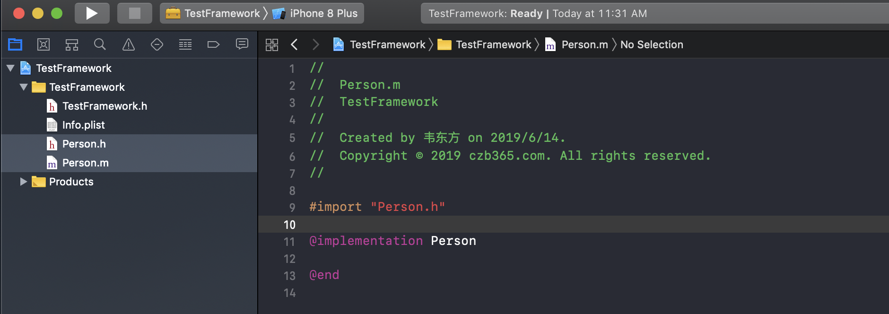
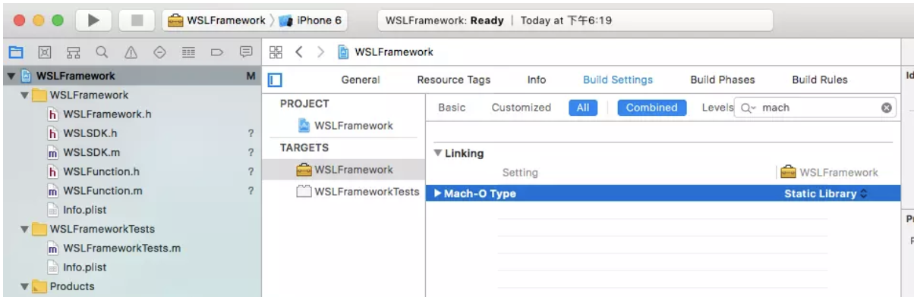
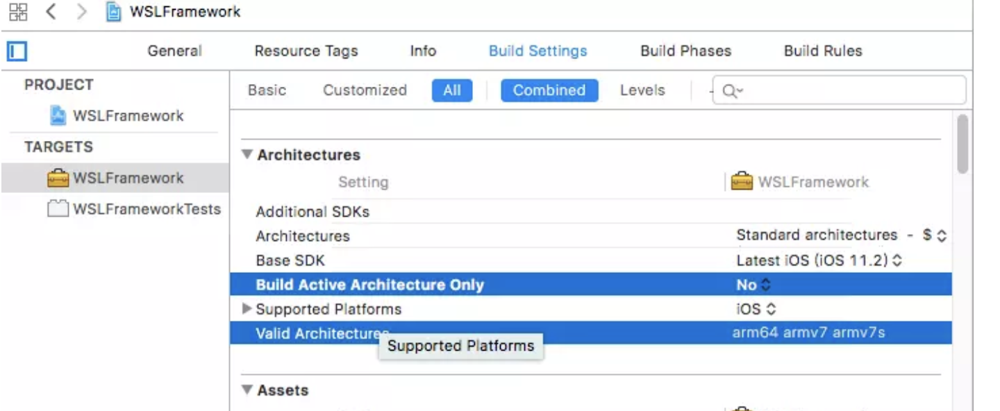
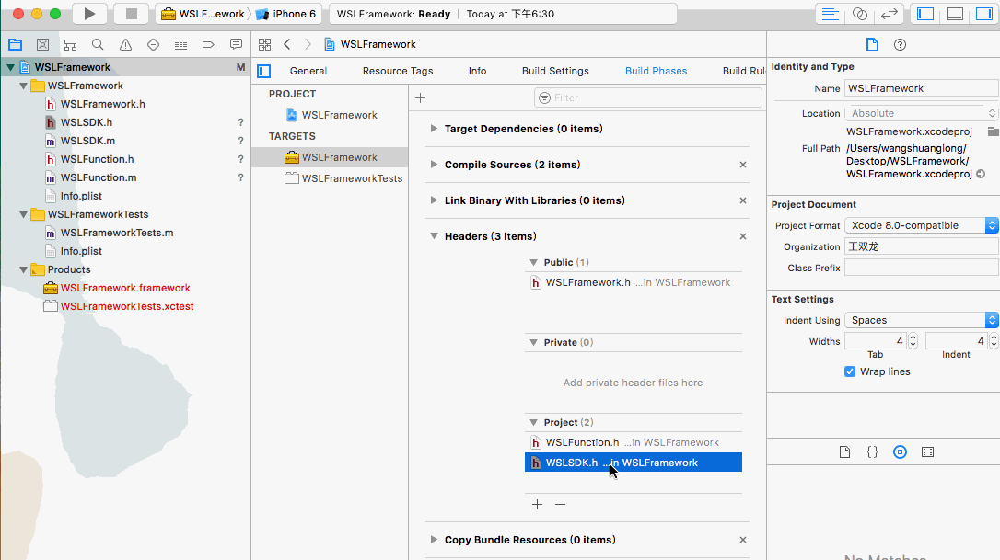
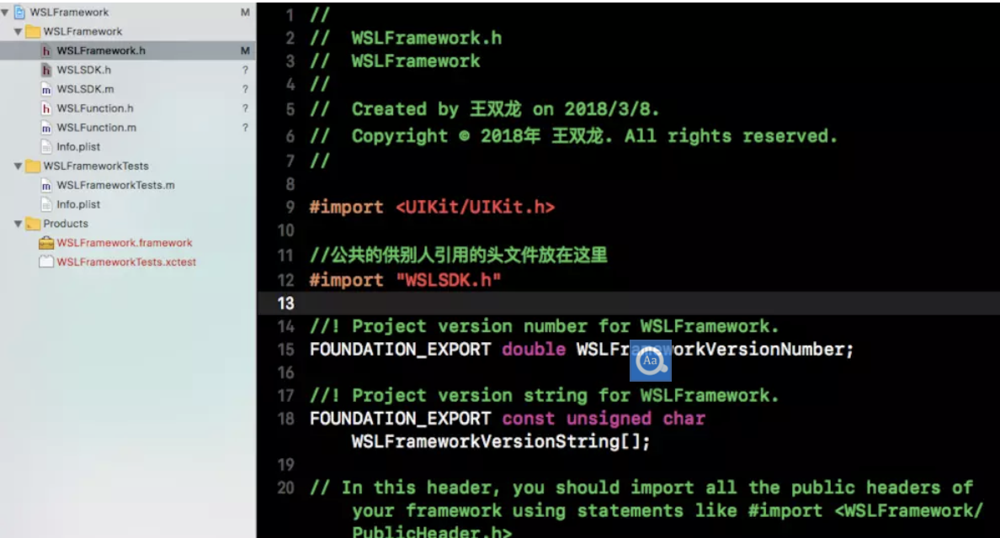
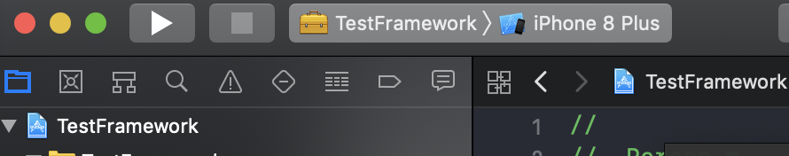
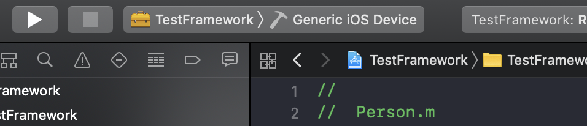
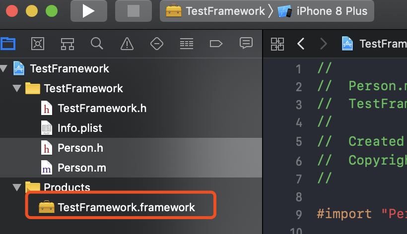
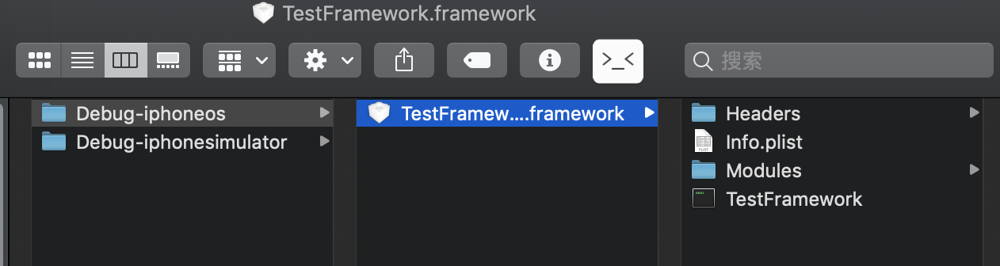
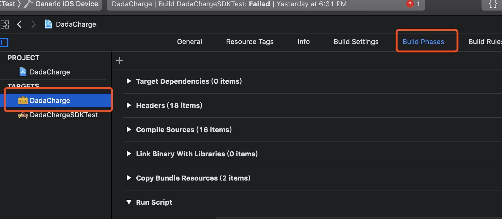

**Reference**: [https://www.jianshu.com/p/0c54e0c51b0a](https://www.jianshu.com/p/0c54e0c51b0a)

# 1.前传

Framework其实是资源的集合, 是将可执行文件和头文件, 资源文件包含到一个结构中, 让Xcode可以方便的把它纳入到你的项目中.

> 静态库: 链接时完整地拷贝到可执行文件中, 被多次使用就会有多份荣誉拷贝; 例如.a, .framework.
>
> 动态库: 链接时不复制, 程序运行时由系统动态加载到内存, 供程序调用, 系统只加载依次, 多个程序共用, 节省内存; 例如.dylib, .framework.
>
> 注意:系统提供的.framework都是动态库, 而我们自行创建framework必须创建静态库, 因为处于安全考虑, 苹果不允许包含动态库的应用上线.

> .a和.framework的区别: .a是一个纯二进制文件, .framework中除了二进制文件还有资源文件, 头文件等信息. .a不能直接使用, 需要配合.h文件一起使用. 

# 2.创建Framework工程

按照下图所示步骤创建Framework工程, 创建完毕后, 工程中会包含一个工程同名的`.h`文件盒`info.plist`文件.


我们可以在目录下创建自己的文件, 创建.bundle文件存储资源文件等.



当项目编码完毕后, 我们可以配置工程的打包环境. 

# 3.配置工程的打包环境

首先我们需要将`Mach-O Type`改为`Static Library`, 苹果不允许我们在项目中使用动态库, 因此我们只能制作静态库.



配置`Archivtecture`信息. 

Build Active Architecture Only修改为NO, 否则生成的静态库就只支持当前选择设备的架构.

iOS Deployment Target, 静态库需要支持的最低版本号, 要小于等于主项目的版本号. 

Valid Architecture, 支持的iOS CPU架构. 如果需要支持更低版本的iPhone, 我们可以自行添加支持的CPU架构.




将你需要公开的头文件拖拽到Public下, 要隐藏的放在Private或者Project下, 当然, 隐藏的头文件就无法再次被应用.



把允许别人引用的头文件引入前面创建项目自动生成的头文件中.



# 4.合并打包

因为macOS和iOS上CPU内核架构不同, 为了使我们的Framework即能够运行在iOS真机上, 又能够运行在Silumar模拟器上, 我们需要将真机版本的Framework和模拟器版本的Framework合并成一个. 

## 4.1 手动打包

首先任意选择一个模拟器, `cmd+B`打包, 然后选中`Generic iOS Device`, `cmd+B`打包. 





在工程中招到Product文件夹下的framework文件. 分别找到模拟器和真机上打包出来的.framework. 使用lipo指令进行合并.





打开控制台输入指令` lipo -create [iphoneos下frameworkTest的路径] [simulator下frameworkTest的路径] -output [新的路径]`.

最终会生成一个二进制文件, 将这个二进制文件改名成Framework项目同名, 然后复制到.framework文件夹下. 此framework即可在测试项目中进行测试.

## 4.2 使用脚本打包

手动打包的核心就是使用lipo指令进行两个framework包的合并, 既然可以通过控制台指令进行合并, 那么为什么不使用Xcode编译脚本`Run Script`进行合并工作呢? 

在Xcode中, 选中对应的Target工程, 选择`Bulid Phases`, 点击`+`创建一个新的`Run Script`. 



将下面的指令粘进去.

```shell
if [ "${ACTION}" = "build" ]
then
INSTALL_DIR=${SRCROOT}/Products/${PROJECT_NAME}.framework
DEVICE_DIR=${BUILD_ROOT}/${CONFIGURATION}-iphoneos/${PROJECT_NAME}.framework
SIMULATOR_DIR=${BUILD_ROOT}/${CONFIGURATION}-iphonesimulator/${PROJECT_NAME}.framework

if [ -d "${INSTALL_DIR}" ]
then
rm -rf "${INSTALL_DIR}"
fi

mkdir -p "${INSTALL_DIR}"

cp -R "${DEVICE_DIR}/" "${INSTALL_DIR}/"
#ditto "${DEVICE_DIR}/Headers" "${INSTALL_DIR}/Headers"

lipo -create "${DEVICE_DIR}/${PROJECT_NAME}" "${SIMULATOR_DIR}/${PROJECT_NAME}" -output "${INSTALL_DIR}/${PROJECT_NAME}"

#open "${DEVICE_DIR}"
open "${SRCROOT}/Products"
fi
```

需要打包时候, 我们需要选择模拟器编译一遍, 然后选中真机环境编译一遍, 编译结束后悔自动弹出生成最终framework的文件夹. 

✌🏻

## 4.3 使用Agreegare自动化打包

首先创建一个Agreegare工程. 新建一个Target, 选择`Cross-platform`, 选择`Agreegare`, 创建一个新的工程.

选择新建的Target, 点击`Build Phases`, 创建一个`New Script Phase`. 

将下面的脚本粘进去.

```shell
# Sets the target folders and the final framework product.
# 如果工程名称和Framework的Target名称不一样的话，要自定义FMKNAME
# 例如: FMK_NAME = "MyFramework"
FMK_NAME=${PROJECT_NAME}
# Install dir will be the final output to the framework.
# The following line create it in the root folder of the current project.
INSTALL_DIR=${SRCROOT}/Products/${FMK_NAME}.framework
# Working dir will be deleted after the framework creation.
WRK_DIR=build
DEVICE_DIR=${WRK_DIR}/Release-iphoneos/${FMK_NAME}.framework
SIMULATOR_DIR=${WRK_DIR}/Release-iphonesimulator/${FMK_NAME}.framework
# -configuration ${CONFIGURATION}
# Clean and Building both architectures.
xcodebuild -configuration "Release" -target "${FMK_NAME}" -sdk iphoneos clean build
xcodebuild -configuration "Release" -target "${FMK_NAME}" -sdk iphonesimulator clean build
# Cleaning the oldest.
if [ -d "${INSTALL_DIR}" ]
then
rm -rf "${INSTALL_DIR}"
fi
mkdir -p "${INSTALL_DIR}"
cp -R "${DEVICE_DIR}/" "${INSTALL_DIR}/"
# Uses the Lipo Tool to merge both binary files (i386 + armv6/armv7) into one Universal final product.
lipo -create "${DEVICE_DIR}/${FMK_NAME}" "${SIMULATOR_DIR}/${FMK_NAME}" -output "${INSTALL_DIR}/${FMK_NAME}"
rm -r "${WRK_DIR}"
open "${INSTALL_DIR}"
```

将编译的Target选择刚创建的Aggregate项目, Device选择`Generic iOS Device`, `cmd+B`编译即可.

> 这样看来, 使用Agreegare自动化打包这种打包方式是最简单的. 笔者在网上参考了大量的博客文章, 都有讲这种方式. 
>
> 但是笔者自己使用这种方式打包总是失败, 打包Xcode版本是`Version 10.1 (10B61)`. 打包出来的.framework是0KB的空文件, 目前尚不知问题出在哪里.

# 5.上传官方Cocoapods

如果打包完成, 要上传到官方Cocoapods去, 首先你需要校验你的podspec书写是否完整.

```shell
#本地校验
pod lib lint
#本地&远程校验
pod spec lint
#添加如下参数可以隐藏警告信息
pod lib lint --allow-warnings
#如果podspec包含静态库,则校验时候需要添加乳腺癌参数
pod lib lint --use-libraries
#如果依赖私有spec则必须指定sources
pod lib lint --sources=https://github.com/artsy/Specs,master
#使用指定的swift version进行校验(podspec中也可以指定)
pod lib lint --swift-version=VERSION
#展示更多的校验信息
pod lib lint --verbose
```

使用`pod trunk push *.podspec`命令将你的podspec版本发布到远程. 如果提醒`[!] You need to register a session first.` , 这是因为你没有在cocoapods上注册你自己, 你只需要注册一下即可(`pod trunk register`). 常见的pod trunk命令如下所示:

```shell
$ pod trunk COMMAND
      Interact with the CocoaPods API (e.g. publishing new specs)

Commands:
    + add-owner      Add an owner to a pod
    + delete         Deletes a version of a pod.
    + deprecate      Deprecates a pod.
    + info           Returns information about a Pod.
    + me             Display information about your sessions
    + push           Publish a podspec
    + register       Manage sessions
    + remove-owner   Remove an owner from a pod

Options:
    --silent         Show nothing
    --verbose        Show more debugging information
    --no-ansi        Show output without ANSI codes
    --help           Show help banner of specified command
    
#示例
#在cocoapods上注册一个用户
pod trunk register 电子邮箱 '您的姓名' --description='macbook pro'
#查看注册信息
pod trunk me
#添加其他维护者
pod trunk add-owner XXXSDK 123456@qq.com
#删除已发的版本
pod trunk delete XXXSDK 版本号
#删除某个pod
pod trunk deprecate XXXSDK
#删除其他维护者
pod trunk remove-owner XXXSDK 56789@qq.com
```

# 6.补充
使用`lipo -info [Mach-o文件]`命令, 可以查看Mach-O文件支持的CPU架构.
