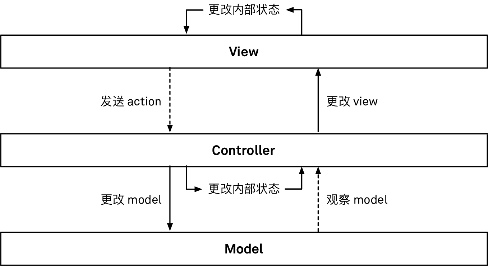
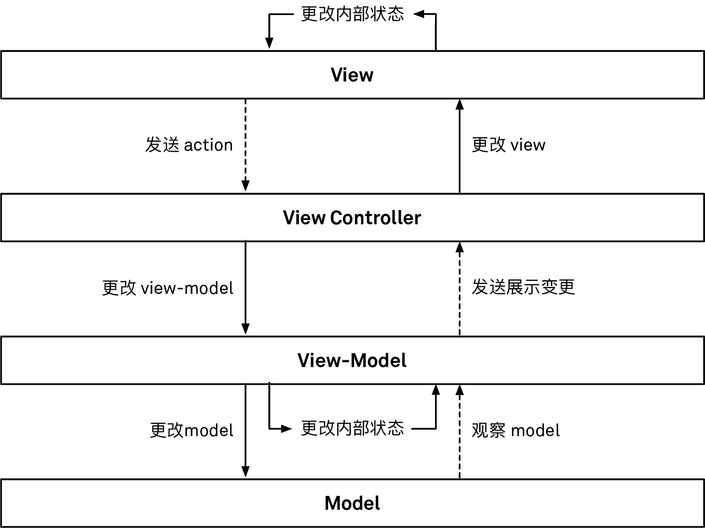

## MVC

Controller主要通过target/action或者delegate来接收view事件。当一个更改Mode的view action发生时，controller不应该直接去操作view层级。正确的做法是controller去订阅model通知，并且在通知到达时候更改view层级。这样一来数据流就可以单向进行：view action被转变成model变更，然后model发送通知，并将这个通知最后转变成view变更。

MVC的核心思想是，controller负责将model层和view层撮合到一块一起工作。controller对另外两层进行构建和配置，并对model对象和view对象之间的双向通信进行协调。在一个MVC app中，controller是作为核心来参与app反馈回路中的。

MVC有些众所周知的缺陷。就是controller过于庞大；另外mvc也面临单元测试和接口测试非常困难，甚至不可能实现。

MVC中关于肥大controller问题，我们可以将尽可能多的数据处理放到model层去

## MVVM

为了让接口测试尽可能覆盖更多的范围，view controller应当尽可能的简单。MVVM中view和view-model的绑定需要明确的框架支持，但presenter是通过传统的手动方式来传递变化的。

MVVM在view和model之间假如一层新的viewmodel，福利将model和view之间的关系构建为一系列的变形管道。提供一套独立于app框架的接口。分担了controller中关于数据处理的任务。

为了保证view和viewModel的同步，MVVM强制使用某种形式的绑定，controller负责构建这些绑定，将vm暴露的属性和场景中的vm所代表的view上的属性关联起来。

## MVP

MVP是安卓上非常流行的模式，在总体结构和使用技术上，它粗略来说是一种位于标准MVM和MVVM之间的模式。

MVP中persenter和vm扮演的角色是一样的，对比vm，persenter去除了响应式编程的部分，而是把要展示的值暴露为接口上的属性。

## 网络层设计方案

网络层的设计一般有两种方案：1.controller层拥有网络；2.Model层拥有网络。