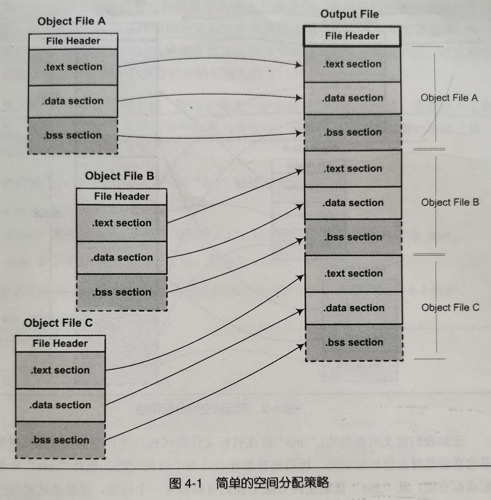
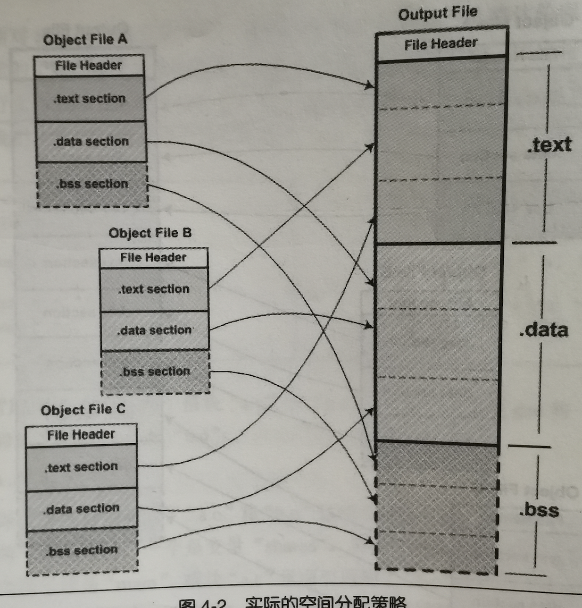

词法分析、语法分析等结果代码片段示例。

[TOC]


# 1.温故而知新

## 1.1 万变不离其宗

对于系统程序开发者来说，计算机多如牛毛的硬件设备中，最重要的只有三个，他们分别是中央处理器CPU、内存、IO控制芯片，这三个部件几乎是计算机的核心了。

早期的计算机没有很复杂的图形界面，CPU核心的频率也不高，跟内存的频率一样，他们是直接链接在同一个总线上的。

后来由于CPU核心频率的提升，导致内存跟不上CPU速度，于是产生了与内存频率一致的系统总线，而CPU采用倍频的方式和总线进行通信。为了协调CPU、内存、高速的图形芯片，人们专门设计了一个高速的**北桥芯片**，以便他们之间能够告诉的交换数据。

因为北桥的速度非常高，如果将所有的低速设备都直接连接在北桥上，则北桥还需要一个专门用来处理低速设备的低速芯片，导致北桥设计过于繁杂。于是人们设计了专门用来处理低速设备的**南桥芯片**，键盘、鼠标、磁盘、USB等都直接连接在南桥上，由南桥芯片汇总后连接在北桥上。

北桥就像是人的心脏，连接并驱动身体的各个部分，它的左边是CPU，负责所有的控制和运算，就像是人的大脑。


## 1.2 站得高看得远

传统意义上的系统软件指管理计算机本身的软件，以区别普通的应用程序。系统软件可以分成两块：一块是平台性的，比如操作系统内核、驱动程序、运行库、数以千计的系统工具等；另一块是用于程序开发的，比如编译器、链接器等开发工具和开发库。

## 1.3 操作系统做什么

操作系统一个主要功能是提供抽象的接口，另一个主要功能是管理硬件资源。一个计算机的资源主要分为CPU、存储器、IO设备。

### 1.3.1 不要让CPU打盹

在计算机发展早期，CPU资源非常昂贵，如果一个CPU只能运行一个程序，那么当程序读写磁盘时候PCU就空闲下来了，这在当时简直是暴殄天物。于是人们想了很多办法来提升CPU的利用率。

* **多道程序：**人们编写一个监控程序，当某个程序暂时无需使用CPU时候，监控程序就把另外的正在等待CPU资源的程序启动，使得CPU能够充分利用起来，这种方法被称为多道程序。这种方法在当时大大的提升了CPu的利用率，不过这个策略最大的问题是程序之间调度策略太过粗糙，程序之间无法区分缓急轻重。
* **分时系统：**每个程序运行一段时间之后都主动让出CPU给其它程序，使得一段时间内每个程序多有机会运行一小段时间。这对于交互式的任务尤为重要，比如点击鼠标或按下键盘，程序所要处理的任务可能并不多，但是需要被马上处理使得用户看到效果。这种协作方法称为分时系统。
* **多任务系统：**操作系统接管所有的硬件资源，并且本身运行在一个受硬件保护的级别。所有应用程序都以 **进程**的方式运行在比操作系统权限更低的级别，每个进程都有自己的地址空间，使得进程之间的地址空间相互隔离。CPU由系统统一分配，每个进程根据优先级的高低都有机会得到CPU，但是如果进程运行时间超出一定的时间则会被操作系统暂停，将CPU分配给其它进程。如果操作系统分配给每个进程的时间都很短，即CPU在多个进程之间快速的切换，从而造成很多进程在同时运行的假象。这种协作方式称为**多任务系统**。目前几乎所有的操作系统都采用这种方式。

### 1.3.2 设备驱动

操作系统作为硬件层的上层，它是对硬件的管理和抽象。但是对于操作系统上面的运行库来说，他们希望看到的是统一的硬件访问模式。

由于不同的计算机硬件的访问模式都是不同的，因此需要一个程序来统一所有硬件的接口，对外抛出相同的接口，这样操作系统和应用程序就可以使用统一的硬件访问模式了。而做这件事情的就是 **设备驱动程序**。

## 1.4 内存不够用怎么办


## 1.5 众人拾柴火焰高


# 2. 编译和链接

在我们日常开发中，实际上很少关注编译和链接过程，因为通常开发中我们都使用专门的IDE，IDE将编译和链接一步完成，**通常将这种编译链接合并在一起的过程称为构建。**

IDE提供的默认配置对于大部分的应用程序开发已经足够了，但是如果想要深入理解计算机语言的原理，理解程序开发中各种莫名其妙的错误，就需要深入理解计算机语言的编译链接机制，这样才能游刃有余的解决这些问题。

## 2.1 被隐藏了的过程

一般情况下，一个程序从源代码到可执行文件要经历四个过程：预处理、编译、汇编、链接。

1. **预编译**：展开宏定义#define。处理条件预编译指令#if、#else。处理#include。删除所有的注释信息。

2. **编译**：编译过程就是把预处理完的文件进行一系列的词法分析、语法分析、语义分析以及优化后生产相应的汇编代码文件，这个过程是转增个程序构建的核心部分，也是最复杂的部分。

3. **汇编**：汇编器将汇编代码转变成机器可以执行的指令，每个汇编指令几乎是对应一条机器指令。所以汇编器的汇编过程相对是比较简单的，它没有复杂的语法，也没有语义，也不需要做指令优化，只是根据汇编指令和机器指令的对照表一一翻译。

4. **链接**：将多个目标文件链接成一个可执行文件。

## 2.2 编译器做了什么

从最直观的角度上讲，**编译器就是将高级语言翻译成机器语言的一个工具**。使用汇编语言或者机器语言编写的程序依赖于特定的程序，一个为某种cpu编写的程序在另一个cpu上是无法运行的，要重新编写，这几乎让人无法接受。

编译过程一般分为6个步骤：扫描、语法分析、语义分析、源代码优化、代码生成、目标代码优化。

### 2.2.1 词法分析

首先源代码程序被输入到扫描器，扫描器进行词法分析。词法分析运用一种类似于有限状态机的算法，可以很轻松的将源代码的字符序列分割成一系列的记号（Token）。

有一个叫做lex的程序可以实现词法分析，它会按照用户之前描述好的词法规则将输入的字符串分割成一个个记号。因为这样一个程序的存在，编译器的开发者就无需为每个编译器开发一个独立的词法扫描器，而是根据需要修改词法规则即可。

示例代码词法分析结果如下所示：

```

```

### 2.2.2 语法分析

语法分析器将对由扫描器产生的记号进行语法分析，从而产生**语法树**。语法分析器产生的语法树是以 **表达式**为结点的树。

语法分析也有一个现成的工具叫做yacc。它可以根据用户给定的语法规则堆输入的记号序列进行解析，从而构建出一颗语法树。对于不同的编程语言，编译器的开发者只需改变语法规则即可，而无需为每个语言开发单独的语法分析器。

```

```

### 2.2.3 语义分析

语义分析由**语义分析器**来完成。语法分析仅仅是完成对表达式语法层面的分析，但它并不了解这个句子是否有意义。比如两个指针的乘法在语法上是对的，但是在语义上是说不通的。编译器所能够分析的语义是静态的语义，与之对应的动态语义只能在运行期才能确定。

**静态语义通常包括声明和类型的匹配，类型的转换等**。比如隐式类型转换会在这个步骤完成，所谓的静态分析就是在这个步骤完成的

### 2.2.4 中间语言生成

现代的编译器有着很多层面的优化，往往在源码级别会有一个优化过程，源码级别优化器往往是优化掉一些不需要的代码，比如表达式中的`3+6`优化后会变成`8`，return语句之后的代码会被删除掉等等，不同编译器有着不同的优化。

现代编译器一般都会将语法树生成**中间代码**，中间代码针对不同的cpu平台生成不同的可执行文件，类似于生成Mach-O的IR中间件文件。

**中间代码使得编译器可以被分为前段和后端，编译器前段负责产生与机器无关的中间代码，编译器后端负责将中间代码生成可执行二进制文件。**

### 2.2.5 目标代码生成和优化

编译器后端主要包括 **代码生成器**和 **目标代码优化器**。代码生成器主要是将中间代码生成汇编代码（汇编代码可以与机器码无缝转换）；目标代码优化器主要是针对目标代码进行优化，比如选择合适的寻址方式、使用位移代替乘除法、删除多余指令等。

目标代码中有变量定义在其它模块怎么办？事实上，定义在其它模块中的变量和函数最终在运行时的绝对地址都会在链接的过程中被确定。所以现代编译器可以将一个源代码文件编译成一个未链接的目标文件，然后由链接器最终将这些目标文件链接成可执行文件。

## 2.3 链接器

**重定位：**当有多个目标文件时候，目标文件引用其他目标文件的方法或者全局变量在编译后会生成为定义的符号，这些未定义的符号在链接的过程中会被重定位到正确的地址，这个修正未定义符号的过程叫做重定位。

**符号：**符号用来表示一个地址，这个地址可能是一段程序的起始地址，也可能是一个变量的起始地址。

## 2.4 模块的拼装-静态链接

人们把每个源代码模块独立的编译，然后按照需要将他们组装起来，这个组装模块的过程就是**链接**。链接的主要内容就是把各个模块之间相互引用的部分都处理好，使得各个模块之间能够正确的衔接。链接的过程主要包括了 **地址和空间分配**、**符号决议**、**重定位**等。

# 3.目标文件里有什么

编译器编译源码后生成的文件叫做目标文件。目标文件从结构上来看，已经是可执行文件格式，只是还没有经过链接的过程，其中有些符号或地址还没有被调整。

可执行文件格式涵盖了程序的编译、链接、装载、执行的各个方面。了解它对于认识系统、了解背后的机理大有好处。

## 3.1 目标文件的格式

目前PC平台上流行的可执行文件，主要是**windows下的PE**和**Linux下的ELF**，他们都是基于COFF格式的变种。从广义上看，**目标文件和可执行文件的格式其实几乎是一样的，所以我们可以广义地将目标文件与可执行文件看成是一种类型的文件**。

动态链接库，静态链接库也都是按照可执行文件的格式进行存储的。

## 3.2 目标文件是是什么样子的

目标文件至少有编译后的机器指令代码、数据。除了这些，还包括链接所需的一些信息，比如符号表、调试信息、字符串等。

程序原地阿妈编译后的机器指令经常被放在**代码段**，全局变量和局部静态变量经常被放在**数据段**。

ELF文件的开头是一个**文件头**。它描述整个文件的文件属性，包括文件是否可执行、是静态链接还是动态链接及入口地址、目标硬件、目标系统等信息。文件头还包括一个**段表**，段表用来描述文件中各个段的数组。（描述文件中各个段在段表中的偏移位置以及段的属性等，从段表中可以得到每个段的所有信息）

* **.text**：高级语言编译后执行语句都编译成机器代码，保存在.text段。
* **.data**：存放已初始化全局变量和局部静态变量。
* **.bss**：存放未初始化全局变量和局部静态变量。

**.bss段只是为未初始化全局变量和局部变量预留位置而已，并没有内容，所在它在文件中也不占据空间。**

**总体来说，程序源代码被编译后主要分为两部分：程序指令和程序数据。代码段属于程序指令，而数据段和.bss数据程序数据。**

为什么程序指令和数据要分开呢？主要有以下几个原因：

1. 程序被装载后，数据和指令会被映射到两个虚存区域。数据区是可读写的，而指令区是只读的，这样防止程序指令被有意无意的修改。
2. 现在CPU有这强大的缓存体系。根据局部性原理，为了提高缓存命中率，分开是比较好的。
3. 最重要的是，当系统运行多个程序副本的时候，他们指令是一样的，所以内存中只需保留一份程序指令数据。

## 3.3 挖掘.o文件

真正了不起的程序员，对自己程序的每个字节都了如指掌。

```c
#include <stdio.h>

int global_init_var = 84;
int global_uninit_var;

void func1(int i){
    printf("%d\n", i);
}

int main(void) {
    static int static_var = 85;
    static int static_var2;
    int a = 1;
    int b;
    func1(static_var + static_var2 + a + b);
    return a;
}	
```

如上所示是一段C语言代码清单(`SimpleSection.c`)。我们可以使用gcc命令将它编译成.o文件，如下所示：

```
gcc -c SimpleSection.c
```

查看.o文件结构的命令如下所示：

```
objdump -h SimpleSection.o
```

在mac下，x86架构cpu，gcc编译后文件格式如下所示：

```shell
Test objdump -h SimpleSection.o

SimpleSection.o:	file format Mach-O 64-bit x86-64

Sections:
Idx Name          Size      Address          Type
  0 __text        00000068 0000000000000000 TEXT
  1 __data        00000008 0000000000000068 DATA
  2 __cstring     00000004 0000000000000070 DATA
  3 __bss         00000004 0000000000000120 BSS
  4 __compact_unwind 00000040 0000000000000078 DATA
  5 __eh_frame    00000068 00000000000000b8 DATA
```

### 3.3.1 代码段

通过objdump查看代码段结构如下所示：

```shell
objdump -s -d SimpleSection.o

SimpleSection.o:	file format Mach-O 64-bit x86-64

Disassembly of section __TEXT,__text:
_func1:
       0:	55 	pushq	%rbp
       1:	48 89 e5 	movq	%rsp, %rbp
       4:	48 83 ec 10 	subq	$16, %rsp
       8:	89 7d fc 	movl	%edi, -4(%rbp)
       b:	8b 75 fc 	movl	-4(%rbp), %esi
       e:	48 8d 3d 5b 00 00 00 	leaq	91(%rip), %rdi
      15:	b0 00 	movb	$0, %al
      17:	e8 00 00 00 00 	callq	0 <_func1+0x1c>
      1c:	89 45 f8 	movl	%eax, -8(%rbp)
      1f:	48 83 c4 10 	addq	$16, %rsp
      23:	5d 	popq	%rbp
      24:	c3 	retq
      25:	66 2e 0f 1f 84 00 00 00 00 00 	nopw	%cs:(%rax,%rax)
      2f:	90 	nop

_main:
      30:	55 	pushq	%rbp
      31:	48 89 e5 	movq	%rsp, %rbp
      34:	48 83 ec 10 	subq	$16, %rsp
      38:	c7 45 fc 00 00 00 00 	movl	$0, -4(%rbp)
      3f:	c7 45 f8 01 00 00 00 	movl	$1, -8(%rbp)
      46:	8b 05 00 00 00 00 	movl	(%rip), %eax
      4c:	03 05 00 00 00 00 	addl	(%rip), %eax
      52:	03 45 f8 	addl	-8(%rbp), %eax
      55:	03 45 f4 	addl	-12(%rbp), %eax
      58:	89 c7 	movl	%eax, %edi
      5a:	e8 00 00 00 00 	callq	0 <_main+0x2f>
      5f:	8b 45 f8 	movl	-8(%rbp), %eax
      62:	48 83 c4 10 	addq	$16, %rsp
      66:	5d 	popq	%rbp
      67:	c3 	retq
Contents of section __text:
 0000 554889e5 4883ec10 897dfc8b 75fc488d  UH..H....}..u.H.
 0010 3d5b0000 00b000e8 00000000 8945f848  =[...........E.H
 0020 83c4105d c3662e0f 1f840000 00000090  ...].f..........
 0030 554889e5 4883ec10 c745fc00 000000c7  UH..H....E......
 0040 45f80100 00008b05 00000000 03050000  E...............
 0050 00000345 f80345f4 89c7e800 0000008b  ...E..E.........
 0060 45f84883 c4105dc3                    E.H...].
```

被编译后的.o文件中存储的是机器码，.text段的大小，和前面导出的大小是一致的。

### 3.3.2 DATA段

.data段保存的是那些已经初始化的全局静态变量和局部静态变量。在上述例子中，字符串被保存在了.cstring段中。

### 3.3.3 BSS段

.bss存放的是未初始化的全局变量和局部静态变量。

### 3.3.4 其它段

除了.text/.data/.bss这三个最常见的段之外，ELF文件还可能包含很多其它的段。常见的有：

* .comment：存放编译器版本信息。
* .rodata1：存放只读数据，比如字符串常量，全局const常量等。
* .debug：存放调试信息。
* .symtab：符号表。
* .plt/.got：动态链接的跳转表和全局入口表。

有时候你可能希望变量或某些部分代码能够存放到你指定的段中，以实现某些特定的功能。实际上也是可以实现的。

**我们可以在全局函数或者变量之前加上`__attribute__((section("sss")))`属性，就可以把相应的函数和变量存放到指定的代码段中了。**（c工程测试好像不太好使，但是ios开发中肯定还有别的方法。）

## 3.4 ELF文件结构描述

ELF目标文件格式的最前部是**ELF文件头（ELF Header）**，它包含了描述整个文件的基本属性，比如ELF文件版本、目标机器型号、程序入口地址等。

紧接着是ELF文件的各个段。其中与ELF文件中段有关的重要结构就是**段表（Section Header Table）**，该表描述了ELF文件包含的所有段相关的信息，比如每个段的段名、段的长度、在文件中的偏移、读写权限以及段的其它属性。

### 3.4.1 文件头

你可以通过readelf命令行工具查看elf文件头内容。

ELF文件头中定义了ELF魔数、文件机器字节长度、数据存储方式、版本、运行平台、ABI版本、ELF重定位类型、硬件平台、硬件平台版本、入口地址、程序头入口和长度、段表的位置和长度以及段的数量等信息。

**ELF魔数：**.o文件最前面16个字节，代表的是魔数，这16个字节被ELF标准规定用来标识ELF文件的平台属性。

最开始的四个字节是是所有ELF文件都必须相同的标识码：7f 45 4c 46，7f对应ASCII中DEL控制符，后面三个数字是ASCII编码中ELF的编码。**这四个字节又被称为ELF文件的魔数，几乎所有可执行文件最开始几个字节都是魔数。**这种魔数主要用来确认文件类型，**操作系统在加载文件的时候会根据魔数来判断文件类型，如果魔数不正确，操作系统会拒绝加载**。

**文件类型：**e_type成员表示ELF文件的文件类型，**每个文件类型对应一个常量。系统通过这个常量来判断文件类型，而不是通过后缀。**

**机器类型：**ELF文件格式被设计成可以在多个平台下使用。e_machine成员表示该ELF文件的平台属性，每个常量代表不同的cup机器类型。

### 3.4.2 段表

我们知道ELF文件中有很多的段，而**段表**就是保存这些段基本信息的结构。**段表是ELF文件除了文件头之外最重要的结构**，它描述了ELF各个段的信息，比如：每个段的段名、段的长度、在文件中的偏移、读写权限以及其他属性。也就是说，**ELF文件的段结构就是由段表决定的，编译器、连接器、装载器都是依靠段表来定位和访问各个段的信息的。**

ELF文件中，**段表是以`Elf32-Shdr`结构体为元素的数组**。数组元素的个数等于段的个数，每个Elf32-Shdr结构体对应一个段。Elf32-Shdr又被称为**段描述符**。Elf32-Shdr的成员变量描述一个段的详细信息。（详见程序员的自我修养p75）

**段的类型（sh-type）：**段的名字只是在链接和编译过程中有意义，但是并不能真正的表示段的类型。我们可以将一个数据段命名为.text，但是对于编译连接器来说，决定段的属性的是sh_type和sh_flags属性。

**段的标记位（sh_flags）：**段的标志位表示该段在进程虚拟地址空间中的属性，比如是否可写，是否可执行等。

**段的链接信息（sh_link、sh_info）：**如果段的类型是与链接相关的，则会存储符号表偏移等信息。如果是不相关的，则这两个字段没有意义。

### 3.4.3 重定位表

经过解析可以发现，在ELF文件中有个叫做`.rel.text`段，它的类型是`SHT_REL`，也就是说，它是一个重定位表。连接器处理目标文件时候，需要对目标文件某些部分进行重定位，即代码段和数据段中那些对绝对地址的引用的位置。

**一个重定位表也是一个ELF段，这个段的类型sh_type是SHT_REL。原则上每个需要重定位的段都有一个与之对应的重定位表。**

### 3.4.4 字符串表

ELF文件中用到很多字符串，比如段名、变量名等。因为字符串的长度往往是不固定的，所以用固定结构表示比较困难。一种很常见的做法就是，**把字符串集中起来存放到一个表，然后使用字符串在表中的偏移来引用字符串**。

通过这种方法，在ELF中引用字符串，只需要给出一个字符串的起始位置下标即可，不用考虑字符串长度的问题。一般字符串表在ELF中也是以段的形式保存，通常段名是.strtab或.shstrtab，这两个字符串分别是**字符串表**和**段表字符串表**。顾名思义，字符串表用来表示普通的字符串，段表字符串表用来保存段表中用到的字符串，比如段名。

## 3.5 链接的接口——符号

链接过程的本质就是要把多个不同的目标文件之间相互粘在一起，或者说像玩具积木一样，可以拼装成一个整体。在链接中，**目标文件之间相互拼合实际上是目标文件之间对地址的引用，即对函数和变量地址的引用。**在链接中，我们将函数和变量统称为**符号**，**函数名或变量名就是符号名**。

我们可以将符号看成是链接的粘合剂，整个链接过程正是基于符号才能完成的。链接过程中很关键的一部分就是符号的管理，**每个目标文件都会有一个相应的符号表**，这个表里面记录了目标文件中所用到的所有符号。每个对应的符号都有一个对应的值，叫做**符号值**。

### 3.5.1 ELF符号表结构

ELF文件中的符号表往往是文件中的一个段，段名叫做`.symtab`。符号表的结构很简单，是一个以`Elf32_Sym`结构的数组。

```c
typedef struct {
  //符号名，表示该符号名在字符串表中的下标
  Elf32_Word st_name;
  //符号对应的值。可能是一个绝对值，也可能是一个地址。
  Elf32_Addr st_value;
  //符号大小。
  Elf32_Word st_size
  //符号类型和绑定信息
  unsigned char st_info;
  //该成员目前是0，没有使用；
  unsigned char st_other;
  //符号所在段
  Elf32_Half st_shndx;
}Efl32_Sym
```

**符号所在段：**如果符号定义在本目标文件中，那么该成员表示该符号所在的段在段表的下标；如果符号不是定义在本目标文件中，就是其它的值，比如undef，common(未初始化全局变量就是这个类型)。

**符号值：**如果这个符号是一个函数或者变量的定义，那么这个值就是这个函数或者变量的定义。（具体情况更复杂一点，请参考：程序员的自我修养p83）

### 3.5.2 特殊符号（选修）

当我们使用ld作为连接器来连接生产可执行文件时候，它会为我们定义很多特殊符号，这些符号并没有在你的程序中定义，但是你可以直接声明并使用它们，我们称之为**特殊符号**。链接器会在程序最终链接成可执行文件的过程中将其解析成正确的值，注意只有使用ld链接生产可执行文件时候，这些符号才会存在。

常见特殊符号：\_\_executable_start,  \_\_etext, \_\_edata, \_\_end等等。

### 3.5.3 符号修饰与函数签名

上个世纪七十年代，编译器编译源代码产生目标文件时，符号名和相应的变量和函数名是相同的。后台，一个程序使用的库越来越多，这时候，符号名冲突的问题就出现了。

为了解决这个问题，C++语言设计了**命名空间**的方法，C++语言拥有强大又复杂的类、继承、重载、命名空间等特性，为了支持这些特性，人们发明了**符号修饰**机制。

比如函数的重载中，知识函数参数或者函数返回值的不同。我们引入了一个术语，叫做**函数签名**。函数签名包含了一个函数的信息，包括函数名、参数类型、返回值类型、命名空间以及其它信息。函数签名可以用于识别不同的函数，就像签名用于识别不同的人一样，函数的名字只是函数签名的一部分。

编译器在将C++源代码编译成目标文件时候，会将函数和变量的名字进行修饰，形成符号名，也就是说，**C++的源代码在编译后的目标文件中所使用的符号名是对应的函数和变量的修饰后名称。**

比如：`int func(int) ==> _Z4funci, float func(float) ==> _Z4funcf`

**由于不同的编译器采用不同的名字修饰方法，必然会导致由不同编译器编译产生的目标文件无法正常相互链接，这是导致不同编译器之间不能相互操作的主要原因之一。**

### 3.5.4 extern "C"（选修）

C++为了兼容C语言，在符号管理上，C++有一个用来声明或定义一个C的符号的`extern C`关键字的用法，如下所示：

```c++
extern "C"{
	int func(int)；
	int var;
}
```

C++编译器会将在extern C的大括号内部的代码当做C语言代码处理。所以在如上代码中，C++名称修饰机制不会生效。

### 3.5.5 弱符号和强符号

我们经常在编译过程中碰到一种情况叫做“符号重定义”。多个目标文件中含有相同的名字的全局符号的定义，那么这些目标文件在链接时候会出现符号重复定义的错误。

这种符号的定义可以被称为**强符号**。有些符号的定义可以被称为 **弱符号**。我们可以通过GCC的`__attribtue((weak))`来定义任何一个强符号为弱符号。

## 3.6 小结

本章节深入分析了各种目标文件格式，主要介绍ELF文件的代码段、数据段、BSS段等与程序运行密切相关的段结构。除此之外，还详细介绍了ELF文件的文件头、段表、重定位表、字符串表、符号表、调试表等结构。

其实无论是可执行文件、目标文件、库文件，他们实际上都一样是基于段的文件或是这种文件的集合。**程序的源代码编译后，按照代码和数据分别存放在不同的段中，编译器还会将一些辅助信息诸如符号、重定位信息等也按照表的方式存放在目标文件中，而通常情况下，一个表往往就是一个段**。

有了这些目标文件后，接下来的问题就是如何将它们组合起来，形成一个可知使用的程序或者更大的模块，这就是静态链接索要解决的问题。

# 4. 静态链接

当我们有两个目标文件时候，如何将它们组合起来形成一个可执行文件？这中间发生了什么？这基本上就是链接的核心内容：**静态链接**。

**详细列子请参考《程序员的自我修养》p98**

## 4.1 空间和地址分配

对于连接器来说，整个链接过程实际上就是将几个输入目标文件加工后合并成一个输出文件。那么对于多个输入文件，该怎么进行合并呢？主要有两种方法。

### 4.1.1 按序叠加

**一个最简单的方案就是将输入的目标文件按照次序叠加起来，就是直接将各个目标文件以此合并**。这样会造成的问题是，在有很多输入文件的时候，输出文件将会是很多散落的段。



**这种做法非常浪费空间，因为每个段都有一定的地址和空间对齐的要求**，比如对于x86硬件来说，段的装载地址和空间的对齐单位是页，也就是4096字节。

### 4.1.2 相似段合并

**一个更实际的做法是将相同性质的段合并在一起。**比如讲所有输入文件中的.text合并到同一个.text段中。如图所示：




> 注意：.bss段在目标文件中和可执行文件中并不占用文件的空间，因为它没有任何内容，但它在装载时候占用地址空间。所以链接器在合并.bss段的时候会将.bss段合并，并且分配虚拟空间。

**事实上，我们这里谈到的空间分配只关注于虚拟地址空间的分配。**

现在的链接器在空间分配策略上基本上都采用这种方法，使用这种方法链接的链接器一般都采用 **两步链接**的方法。

1. **空间与地址分配。**扫描所有的输入目标文件，获得他们各个段的长度、属性、位置，并且将输入文件中所有的符号定义和符号引用收集起来，统一放到一个全局符号表中。这一步中，链接器将获得所有输入目标文件的段长度，并且将他们合并，计算出输出文件中各个段合并后的长度和位置，并建立映射关系。
2. **符号解析和重定位。**使用第一步收集到的信息，读取输入文件中段的数据、重定位信息，并且进行符号的解析和重定位、调整代码中的地址等。**事实上这一步是链接过程的核心，特别是重定位过程。**

**链接后的程序中所使用的地址已经是程序在进程中的虚拟地址。**

### 4.1.3 符号地址的确定

在链接过程的第一步，扫描和空间地址分配阶段，连接器按照前面介绍的方法进行空间和地址的分配，这时候输入文件中的各个段在链接后的虚拟地址就已经确定了。

前面一步完成后，链接器开始计算各个符号的虚拟地址。**因为各个符号在段内的相对位置是固定的，所以这时候各个符号的地址就很容易计算出来了**。连接器只不过需要给每个符号添加一个偏移量，它就能调整到正确的虚拟地址了。

## 4.2 符号解析和重定位

### 4.2.1 重定位

**详情请参考《程序员的自我修养》p103**

**在完成空间和地址的分配后，链接器就进入了符号解析和重定位的步骤，，这也是静态链接的核心内容。**

在链接之前，目标文件中调用其它文件函数的部分，编译器暂时使用0x00000000或者0xFFFFFFFF代替，编译器将计算真实地址的工作交给我链接器。

因为链接器在完成地址和空间分配之后就确定了所有符号的虚拟地址了，所以链接器可以根据符号的地址对每个需要重定位的指令进行地址修正。

### 4.2.2 重定位表

那么链接器如何知道哪些指令是要被调整的呢？实际上，在ELF文件中，有一个叫做 **重定位表**的结构专门用来保存这些与重定位相关的信息，重定位表在ELF中往往是一个段，每个需要重定位的段都包含一个它自己的重定位段。

### 4.2.3 符号解析

在我们通常的观念里，链接是因为目标文件中所用到的符号被定义在其它目标文件中，所以要链接起来。从普通程序员的角度看，符号解析占据了链接的主要内容。

其实在重定位的过程也伴随着符号的解析过程，每个目标文件都可能定义一些符号，也可能引用到其它目标文件中的符号。**重定位的过程，每个重定位的入口都对应一个符号的引用，那么链接器必须要对某个符号的引用进行重定位时候，它就要确定这个符号的目标地址。这时候链接器就会去查找所有输入目标文件的符号表组成的全局符号表，找到相应的符号进行重定位。**

所以，链接器扫描完所有输入目标文件后，所有这些未定义的符号都应该能够在符号表中找到，否则链接器就会报符号未定义错误。

## 4.3 COMMON块（选修）

事实上，现代的编译器都支持一种叫做COMMON块的机制，COMMON类型的链接规则是针对符号都是弱符号的情况，如果其中一个符号是强符号，那么最终输出结果中符号所占空间与强符号相同。

更多信息请参考《程序员的自我修养》p111。

## 4.4 C++相关问题

C++的一些语言特性，使之必须由编译器和链接器共同支持才能完成工作，最主要的有两个方面，一个是C++重复代码消除，还有一个是全局构造和析构。另外**由于C++的各种特性，比如虚拟函数、函数重载、继承、异常等，使得它背后的数据结构异常复杂，这些数据结构往往在不同的编译器和链接器之间相互不能通用，使得C++程序的二进制兼容性成了一个很大的问题。**

**C++与ABI**

如果要使两个编译器编译出来的目标文件能够相互连接，那么两个目标文件必须满足如下的条件：采用同样的目标文件格式、拥有同样的目标文件修饰符、变量的内存分布方式相同、函数的调用方式相同。**我们把符号修饰标准、变量内存分布、函数调用方式等这些跟可执行代码二进制兼容性相关的内容称为ABI。**

ABI指的是二进制层面的接口，影响ABI的因素非常多，硬件、编程语言、编译器、链接器、操作系统等等都会影响ABI。

对于C语言来说，以下几个方面会决定目标文件之间是否二进制兼容：

* 内置类型（int、float、double等）的大小和在存储器中的放置方式（大端、小端、对齐方式等）。
* 组合类型（struct、数组、union）的存储方式和内存分布。
* 函数调用方式，比如参数入栈顺序、返回值如果传递等。
* 堆栈的分布方式，比如参数和局部变量在对战的位置，参数传递方法等。
* 寄存器约定，函数调用时哪些寄存器可以修改，哪些需要保留等等。

## 4.5 静态库链接

程序之所以有用，是因为它有输入输出，这些输入输出的对象可以是数据，也可以是人，还可以是另一个程序，一个没有输入输出的程序是没有任何意义的。

实际上一个静态库可以看成是一组目标文件的集合，即很多目标文件打包压缩后形成的一个文件。

## 4.6 链接过程控制（选修）

更多信息请参考《程序员的自我修养》p123。

## 4.7 BFD库

BFD库是一个GNU项目，它的目标就是希望通过一种统一的接口来处理不同的目标文件格式。BFD把目标文件抽象成统一的模型，使得BFD库程序只要通过操作这个统一的抽象模型就能够实现操作所有BFD支持的目标文件格式。

**现在GCC、链接器ld、调试器GDB等工具都是通过BFD来操作目标文件，而不是直接操作目标文件。这样的好处是，将编译器和链接器本身和具体的目标文件格式隔离开来，一旦我们需要支持新的目标文件格式，主需要修改BFD库即可，而不需要修改编译器和链接器。**

## 4.8 小结

本章首先介绍了静态链接的第一个步骤，即目标文件在被连接成最终可执行文件时，输入目标文件中各个段是如何被合并到输出文件中的，链接器如何分配他们在输出文件中的空间和地址。一旦输出段的最终地址被确定，，接下来就可以进行符号的解析和重定位，链接器会将输入文件中对各个文件中对于外部符号的引用进行解析，把每个段中需要重定位的指令和数据进行”修补“，使得他们指向正确的位置。

# 5.Windows PE/COFF（选修）

详情请参看《程序员的自我修养》p134.

# 6.可执行文件的装载和进程

## 6.1 进程虚拟地址空间

程序是一个静态的概念，它就是一些预先编译好的指令和数据集合的一个文件；进程则是一个动态的概念，他是程序运行时的一个过程，很多时候把动态库叫做运行时也是有一定含义的。

> 有人做过一个有意思的比喻：把程序和进程比作做菜的话，那么**程序就是菜谱**，计算机的CPU就是人，相关的厨具就是计算机的其它硬件，整个**炒菜过程就是一个进程**。计算机按照程序指令把输入数据加工成输出数据，就好像菜谱指导着人把材料做成美味可口的菜肴。

每个程序在被运行起来后会拥有自己独立的 **虚拟地址空间**，这个虚拟地址空间的大小由计算机硬件平台决定，具体说就是计算机CPU的位数决定。硬件决定了地址空间的理论上线，即硬件的寻址空间大小，比如32位平台的虚拟地址空间大小是0~2^32，即4GB的虚拟空间大小，64位CPU将拥有64位寻址能力，总共是17179869184GB。

一般来说，C语言指针大小的位数与虚拟空间的位数相同，即32位下是32位，4个字节，64位硬件平台是64位，8个字节。

进程只能使用那些操作系统分配给进程的地址，如果访问未经允许的空间，那么操作系统将会捕获到这些访问，将进程的这种访问当成是非法操作，强制结束进程。

## 6.2 装载的方式

程序执行时所需要的指令和数据必须在内存中才能够正常运行，最简单的办法就是将程序运行所需要的指令和数据全部装入内存中，这样程序才能正常运行，这就是最简单的静态装入的方法。但是大多数情况下，计算机并没有足够的内存将所有的程序和数据装入内存。研究发现，程序运行时是有局部性原理的，**我们可以将程序最常用的部分驻留到内存中，而将不常用的数据和指令驻留在磁盘中，这就是动态装入的基本原理。**

**覆盖装入**和 **页映射**是两种常见的动态装入方法，他们所采用的思想差不多，都是利用了程序的局部性原理。动态装入就是程序用到哪个模块就将哪个模块装入内存，如果不用就暂时不装入，存放在磁盘中。

### 6.2.1 覆盖装入

覆盖装入在没有发明虚拟存储之前应用比较广泛，现在已经被淘汰了。这种方式在计算机发展的初期能够在内存受限的机器侠正常运行提供了一种解决方案。它所表现的思想还是非常有意义的。

**覆盖装入的方法将挖掘内存潜力的任务交给了程序员，程序员在编写程序时候必须手工将程序分割成若干块，然后编写辅助代码来管理这些模块何时应该在内存中，而何时应该被替换掉**。这个小的辅助代码就是所谓的**覆盖管理器**。

更多信息请参看书本p153。

### 6.2.2 页映射

**页映射是虚拟存储的一部分，它随着虚拟存储的发明而诞生。**也映射将内存和所有磁盘中数据和指令按照`页（Page）`为单位划分成若干个页，所以后面所有操作和装载的单位就是页。

页映射中也是需要装载管理器，装载管理器控制哪些页装载进入内存，哪些页驻留在磁盘。这个所谓的装载管理器就是现代的操作系统，更准确的说就是系统的存储管理器。目前几乎所有的操作系统都是按照这种方式装载可执行文件的，Windows和Linux都是使用这种方式装载的。

## 6.3 从操作系统角度看可执行文件的装载

**在虚拟存储中，现代的硬件MMU都提供地址转换功能。**

### 6.3.1 进程的建立

**从操作系统的角度上看，一个进程最关键的特征就是它拥有独立的虚拟地址空间，这使他有别于其他的进程。**

一个进程的建立一般分为三个步骤：

**1.创建独立的虚拟地址空间**

一个虚拟空间由一组页映射函数将虚拟空间的各个页映射到相应的物理空间，那么**创建一个虚拟空间实际上并不是创建空间，而是创建映射函数所需要的响应的数据结构。**

**2.读取可执行文件头，并且建立虚拟空间与可执行文件的映射关系**

这一步所做的实际是虚拟空间和可执行文件的映射关系。

> 由于可执行文件在装载的时候实际上是被映射的虚拟空间，所以可执行文件很多时候又被称为 **映像文件**。

当程序在执行发生页错误时，操作系统将从物理内存中分配一个物理页，然后将该“缺页”从磁盘读取到内存中，再设置物理页和虚拟页的映射关系，这样程序才能正常运行。

**当操作系统捕获缺页错误时候，它应知道程序当前所需的页在可执行文件中的具体位置，这就是虚拟页和可执行文件之间的映射关系。**从某种意义上看，这一步是装载过程中最重要的一步，也是传统意义上装载的过程。

**3.将CPU指令寄存器设置成可执行文件的入口地址，启动运行**

这一步是最简答的一步，操作系统通过设置CPU的指令寄存器将控制权交给进程，由此进程开始执行。（在ELF文件的文件头中有保存整个程序的入口地址）

> 从可执行文件到进程虚拟空间之间的映射关系，只是保存在操作系统内部的一个数据结构。Linux中将进程虚拟空间中的一个段叫做 **虚拟内存区域（VMA：Virtual Memory Area）**。

### 6.3.2 页错误

进程建立后，实际上可执行文件真正的指令和数据并没有装载进内存中，操作系统只是根据可执行文件的头信息建立了一个可执行文件和进程虚拟内存之间的映射关系而已。当进程执行到尚未加载到内存中的页时候，就会发生 **页错误**。然后CPU将控制权交给操作系统，操作系统有专门的页错误处理例程来处理这种情况。

## 6.4 进程虚存空间分布

### 6.4.1 ELF文件链接视图和执行视图

如果一个可执行文件只有一个代码段，那么可执行文件被装载到进程地址空间之后，对应的只有一个VMA。但是实际情况要比这复杂的多，在一个正常的进程中，可执行文件中包含的往往不止代码段，还有数据段、BSS段等，所以映射到进程虚拟空间的往往不止是一个段。

当段的数量增多时候，就会产生空间浪费。因为ELF文件映射时候是以页为长度单位的。就是说，如果一个段没有占满一个页，剩余的部分也是不能够被使用的。

实际上，站在操作系统的角度考虑，操作系统并不关系可执行文件所包含的各个段的具体内容，它只关心装载相关的问题，最主要的是段的权限：可读、可写、可执行等。

那么有一个很简单的方案就是：**对于相同权限的段，将他们合并到一起当做一个段进行映射。**

> ELF文件中引入一个概念叫做Segment，一个Segment可以包含多个Section。几个权限相同的段合并在一起被称为一个Segment，ELF文件在装载的时候是以Segment为单位进行映射的。就是说，一个Segment不管包含了多少个Section，在映射后只会有一个VMA。这样可以很明显的减少页面内部碎片，节省内存空间。

Segment的概念实际上是从装载的角度重新划分了ELF的各个段。在将目标文件链接成可执行文件的时候，链接器会尽量把相同权限的段分配在同一个空间。

总的来说，Segment和Section是从不同的角度来划分ELF文件。这个在ELF中被称为不同的视图，在Section角度来看ELF文件就是**链接视图**，从Segment角度来看就是**执行视图**。

ELF可执行文件中有一个专门的数据结构叫做**程序头表**来保存Segment信息。因为ELF目标文件不需要被装载，所以没有程序头表，而ELF可执行文件和共享库文件都有。

### 6.4.2 堆和栈

VMA除了被用来映射可执行文件中的各个Segment以外，操作系统还通过VMA对进程的地址空间进行管理。**进程运行过程中堆栈等空间，事实上他们在进程的虚拟空间中都是通过VMA来管理的**，很多时候，一个进程的堆栈分别对应一个VMA。

操作系统通过给进程空间划分出一个个的VMA来管理进程的虚拟空间；基本原则是将相同权限属性的、有相同映像文件的映射成一个VMA；一个进程基本可以划分为以下几个VMA：

1. 代码VMA，权限只读、可执行；有映像文件。
2. 数据VMA，权限可读写、可执行；有映像文件。
3. 堆VMA，权限可读写、可执行；无映像文件，匿名，可向上扩展。
4. 栈VMA，权限可读写、不可执行；无映射文件，匿名，可向下扩展。

### 6.4.3 堆的最大申请数量

Linux下虚拟地址空间分给进程本身的是3G，具体实际情况，你可以通过编写小程序测试malloc最大内存申请数量。

实际上，具体的数值会受到操作系统版本号，程序本身大小，用到的动态共享库数量、大小、程序栈数量、大小等，甚至每次运行的结果都不同，因为有些操作系统使用一种叫做随机地址空间分布技术。

### 6.4.4 段地址映射

在映射的过程中，页是映射的最小单位。对于4096B/Page来说，如果我们要在物理内存和进程虚拟地址空间之间建立映射关系，这段内存空间程度必须是4096的整数倍，并且这段空间在物理内存和进程虚拟内存空间中的起始地址都必须是4096整数倍。所以对于可执行文件来说，应该尽可能的优化自己的空间和地址的安排。

**操作系统将同一个物理页映射到两份虚拟的地址空间中：** **UNIX采用一个很取巧的做法，让两个段接壤的部分，共享一个物理页面，然后将该物理页面映射两次。操作系统将同一个物理页映射到两份虚拟的地址空间中，其它页面按照正常的页面粒度进行映射。**

**更多信息参看p169.**

## 6.5 小结

本章主要探讨了程序运行时如何使用内存空间的问题，即进程虚拟地址空间问题。接着围绕程序如何被操作系统装载到内存中，介绍了覆盖装入和页映射两种方式。分析了为什么要以页映射的方式将程序映射到进程地址空间，这样做的好处是什么，并从操作系统的角度观察了进程如何被建立，当程序开始执行时候发生页错误该如何处理。

我们还详细介绍了进程虚拟地址空间的分布，操作系统如何为程序的代码、数据、堆、栈在进程地址空间中分配，他们是如何分布的。

# 7.动态链接

## 7.1 为什么要动态链接

静态链接使得不同的程序和开发者和部门能够相对独立的开发和测试自己的程序模块，从某种意义上提升了开发效率。但是，静态链接也存在很多的问题。

**1.内存和磁盘空间**

静态链接的方式对于计算机内存和磁盘空间的浪费非常严重，特别是多进程操作系统下，静态链接极大的浪费了内存空间。

因为在静态链接中，每个应用程序都包含自身所有用到的库，如果两个程序使用同一个库也会被包含两份。

**2.不利于程序开发和发布**

静态链接对程序的更新和部署和发布都会带来麻烦。相对于动态加载，程序的模块可以动态的从远程下载并安装到本地，而静态链接只能每次安装完整的程序。

**3.动态链接**

简单说，就是不对组成程序的目标文件进行链接，等到程序要运行时再去链接。就是把链接这个过程推迟到运行时，这就是**动态链接**的基本思路。

动态链接中，在内存中共享一个目标文件的好处不仅仅能够节省内存，还可以减少物理页面的换入换出，也可以增加CPU缓存的命中率，因为不同程序的数据和指令访问都集中在了同一个共享模块上了。

动态链接的方式使得开发过程中各个模块更加独立，耦合性更小，便于不同的开发者和开发组织之间独立进行开发和测试。

**4.程序可扩展性和兼容性**

动态链接还有一个特定就是程序在运行时可以动态的选择加载各种程序模块，这个优点可以被用来制作程序的插件。

**5.动态链接的基本实现**

动态链接的基本原理是把程序按照模块拆分成各个相对独立的部分，再在程序运行时将他们链接在一起形成完整的程序，而不是像静态链接一样把所有的程序模块都链接成单独的可执行文件。

动态链接涉及到运行时的链接和多个文件的装载，必须要有操作系统的支持，因为在动态链接的情况下，进程的虚拟地址空间的分布比静态链接要复杂的多。

动态链接会导致程序在性能上的一些损失，但是我们可以对动态链接过程进行优化，比如延迟绑定的方法，可以使得动态链接的性能损失降低到最小。

## 7.2  动态链接示例

> 在静态链接中，整个程序只有一个可执行文件，它是不可分割的整体。但是在动态链接下，一个程序被分割成若干个文件，有程序的主要部分，即可执行文件和程序锁依赖的共享对象，很多时候我们把这些部分称为模块，即动态链接下，可执行文件和共享对象都可以看成是程序的一个模块。

## 7.3 地址无关代码

### 7.3.1 固定装载地址的困扰

使用同一个模块的程序，这个模块的地址在编译之前就确定好，操作系统会将这个模块装载的固定的位置，所有引用这个模块的地方只需要固定的使用这个模块。

这种方法对于修改是灾难性的，如果修改了共享模块，所有引用共享模块的程序都必须重新编译安装。这种方法不可行

### 7.3.2 装载时重定位

共享对象呗装载时，如何确定它在虚拟地址空间中的位置？

一种方法是上述的 **固定装载**。但是那种方法导致：地址冲突；共享库升级困难；空间受限。

另一种方法就是 **装载时重定位**。当程序被装载时，系统的动态链接器会将程序所需的所有动态链接库（例如最基本的libc.so）装载到进程的地址空间，且将程序中所有未决议的符号绑定到相应的动态链接库中，并进行重定位工作。**动态链接是把可执行的elf文件生成过程中从本来的程序连接前推迟到装载时。**共享对象的最终装载地址在编译时是不确定的，但是在装载时，装载器根据当前地址空间的空闲情况，动态的分配足够大的虚拟地址空间给相应的共享对象。

关键在于共享对象也就是动态链接库在被装载到物理内存后，始终是只有一份的，不管有多少个进程使用它。但是对于每一个进程，共享对象会映射一次到虚拟地址空间，也就是每个进程空间都有一份共享对象的映射，此时，对于不同的进程，映射的地址（基址）是不一样的（大部分情况下）。紧接着，进行装载时重定位。装载时重定位由动态链接器完成，动态链接器会被一起映射到进程空间中。它根据共享对象在虚拟内存空间中的地址修改在物理内存中的共享对象中的指令，为什么会修改指令，原因在于绝对地址访问（如模块内的变量访问）是直接用mov指令完成的，也就是直接将地址打入寄存器，所以，此时的重定位会直接修改指令。进一步，共享对象中修改的指令是根据共享对象被映射到虚拟空间中的地址（基址）决定的，而每个进程对共享对象的映射不可能都是在相同地址。所以也就无法完成这一部分代码的共享。

### 7.3.3 地址无关代码

装载时重定位可以解决动态模块中有绝对地址引用的问题，但是缺点是指令部分无法在多个程序之间共享，这样就失去了动态链接节省内存的优势。

其实我们的目的就是，希望程序中共享的指令部分，在装载时不需要因为装载地址的改变而改变，所以实现的基本思路就是将指令中需要被修改的部分分离开来，跟数据部分放在一起，这样指令部分就可以保持不变了，而数据部分可以在每个进程中保存一份副本。这种方案就是目前被称为 **地址无关代码**的技术。

共享对象模块引用方式，我们可以分为四种情况：

1. 模块内部的函数调用、跳转。
2. 模块内部的数据访问，比如模块内部定义的全局变量、静态变量。
3. 模块外部的函数调用、跳转。
4. 模块外部的数据访问，比如定义在其它模块中的全局变量。

**类型一 模块内部调用和跳转**

这种情况比较简单，被调用的函数和函数调用者位于同一模块内，他们之间的相对位置是固定的。对于现代的操作系统来说，模块内部的跳转、函数调用都是相对地址调用，或者基于寄存器的相对调用，所以对于这种指令不需要重定位。

**类型二 模块内部数据访问**

很明显，指令中不能包含数据的绝对地址。但是任何一条指令和它需要访问的模块内部数据之间的相对位置是固定的，那么只需要根据当前指令加上一个偏移量即可得到模块内部制定数据的位置了。

**类型三 模块间数据访问**

要使得代码地址无关，基本思想就是把地址相关的部分放到数据段里面。ELF的做法是在数据段里面建立一个 **指向这些变量的指针数组，也被称为全局偏移表**，当代码需要引用该全局变量时候，可以通过GOT中相对应的项间接引用，他的基本思路如下图所示：


链接器在装载时候，会查找每个变量所在地址，然后填充GOT表的各个项，以确保每个指针指向的地址是正确的。由于GOT表本身是放在数据段的，所以它可以在模块在装载时候修改，并且每个进程都有相对应的副本，相互不受影响。

**类型四 模块间调用、跳转**

模块间的调用和跳转，采用和类型三类似的做法，不同的是GOT表中对应的项保存的是目标函数的地址，当模块要调用目标函数时候，可以通过GOT表中的项进行间接跳转。

### 7.3.4 共享模块全局变量问题

上节所述的解决方案实际上并不包含共享模块中全局变量问题的处理。如果共享模块全局变量使用相对地址，则所有引用该模块的位置都会共享同一个全局变量，因此是行不通的。

于是解决方法只有一个，就是所有使用这个全局变量的指令都指向位于可执行文件中的那个副本。**ELF共享库在编译时，默认把定义在模块内部的全局变量当做定义在其它模块中的全局变量，通过GOT表来实现变量的访问**。当共享模块被装载时候，如果某个全局变量在可执行文件中有副本，那么动态连接器就会将GOT中的相对地址指向该副本，这样改变量在运行时实际上只有一个实例。

## 7.4 延迟绑定（PLT）

动态链接比静态链接灵活的多，但是它是以牺牲一部分性能为代价的。据统计ELF程序在静态链接下比动态链接快1%~5%，具体取决于程序本身以及运行环境。动态链接慢一点的主要原因是**对于全局以及静态的数据访问都要通过GOT定位，然后间接寻址**；**模块间的调用也要先从GOT定位，然后进行间接跳转**。另一个慢的原因是，**动态链接的链接工作是在运行时完成的**，即程序开始执行时候，动态连接器会进行一次链接工作。动态链接器会寻找并装载所需要的共享对象，然后进行符号查找地址重定位等工作，这些工作会减慢程序的启动速度。

**延迟绑定的实现**

动态链接下，程序模块之间包含了大量的函数引用，所以程序在执行之前会耗费不少时间用于解决模块之间函数引用的符号查找和重定位，也就是上面提到减慢程序启动的第二个原因。但是可以想象，因为局部性原理，在程序运行过程中，很多函数都不会被执行，程序启动时候却要链接所有的函数，这是一种浪费。

ELF采用了一种叫做 **延迟绑定**的做法，基本思想是**当函数第一次被用到时候再进行绑定**（符号查找、重定位等），如果一直没有用到，则一直不进行绑定。这种做法可以大大加快程序的启动速度，特别有利于大量函数引用和大量模块的程序。

ELF是通过**PLT（Procedure Linkage Table）**的方式实现延迟绑定的。PLT将GOT（Global Offset Table 全局偏移表）拆分成了两个表：".got" 和 ".got.plt" (正好是PLT的小写形式），.got 用来保存全局变量引用的地址，.got.plt 用来保存函数引用的地址，所有外部函数的引用都被分离到了这里。


举个例子，比如一个动态库中有一个函数叫做`bar()`，那么当此函数第一次被外部调用时候，PLT在做什么工作呢？

我们知道，为了实现延迟跳转，添加了PLT层间接跳转。调用函数并不直接通过GOT跳转，而是通过一个叫做PLT项的结构来进行跳转，每个外部函数在PLT中都有对应的项，比如bar()函数在PLT中的项的地址我们称之为`bar@plt`，先来看看bar@plt的实现：

```shell
bar@plt:										//1.函数的名字
jump *(bar@GOT)							//2.跳转指令
push n											//3.bar符号引用在重定位表`.rel.plt`中的下标
push moduleID								//4.模块ID压栈
jump _dl_runtime_resolve		//5.跳转到_dl_runtime_resolve函数之心动态绑定操作
```

1. `jump *(bar@GOT)`是一条通过GOT间接跳转的指令。`bar@GOT`表示GOT中保存bar()这个函数的地址，如果这个函数已经实现了绑定，则这句指令会直接跳转到GOT中正确的函数地址中去，实现函数的正确调用；如果此时是首次外部调用bar函数，bar@GOT表示的是第二句指令`push n`的地址，这句代码不需查找任何符号，相当于指令的顺序执行第二句指令。（编译完成后，bar@GOT默认表示的就是第二句指令的地址）
2. 第二条指令将数字n压栈，这个数字是bar这个符号引用在重定位表`.rel.plt`中的下标。
3. 第三条指令将moduleID压栈，moduleID表示模块的ID。
4. 第四条指令跳转到`_dl_runtime_resolve`函数，_dl_runtime_resolve函数的作用就是根据决议符号和模块ID，在进行一系列工作后，将bar()真正的地址填入到`bar@GOT`中。此时，再次调用`jump *(bar@GOT)`，就会直接跳转到正确的bar()函数地址。

## 7.5 动态链接相关结构

实际上，动态链接在不同的操作系统上有不同的实现。在动态链接下，可执行文件的装载和静态链接的装载基本类似。首先操作系统会读取可执行文件的头部，检查文件的合法性，然后从头部读取每个Segment的虚拟地址、文件地址属性等，并将他们映射到进程虚拟空间的对应位置。这些步骤和静态链接装载步骤基本相同。静态连接下，接下来系统会把程序控制权交给可执行文件的入口地址，然后开始执行。

在动态连接下，此时操作系统还不能讲程序控制权交给可执行文件，因为可执行文件还引用很多共享对象。此时可执行文件对很多外部符号的引用还处于无效地址的状态，即还没有跟对应的共享对象在实际位置链接起来。所以在映射玩可执行文件后，操作系统会首先启动一个**动态连接器**。

动态连接器实际上也是一个共享对象，操作系统同样通过映射的方式将它加载到进程的地址空间。操作系统在加载完动态连接器之后将程序的控制权交给动态连接器。动态连接器得到控制权之后开始执行自身的初始化工作，当动态连接器的工作完成之后，将程序的控制权交给可执行文件的入口地址，程序开始正式执行。

可执行文件中的一些和动态链接相关的重要的段：

1. **.interp段：**此段内保存的是一个字符串，字符串表示可执行文件所需要的动态连接器所在的位置。
2. **.dynamic段：**动态链接ELF中最重要的结构，保存动态连接器所需要的基本信息，比如依赖哪些共享对象、动态链接符号表位置、共享对象符号表位置等。
3. **.dynaym段：**保存动态链接符号信息。

## 7.6 动态链接的步骤和实现

动态链接器的实际链接步骤基本上可以分为三步：

**1.启动动态链接器本身**

首先动态链接器本身也是共享对象，但是动态链接器和普通的共享对象是有区别的。**首先动态链接器本身不能依赖任何其他共享对象；其次动态链接器用到的全局和静态变量的重定位工作由它自己完成。**

**2.装载所有需要的共享对象**

动态链接器自身启动之后，会将可执行文件和链接器本身的符号表都合并到一个符号表中，我们称之为 **全局符号表**。

**3.重定位和初始化**

链接器开始遍历可执行文件和每个共享对象的重定位表，将他们的GOT/PLT中每个需要重定位的位置进行修正。

## 7.7 小结

本章首先分析使用动态链接技术的原因，因为使用动态链接可以更加有效的利用内存和磁盘资源，可以更加方便的维护升级程序，可以让程序的重用变得更加的可行和有效。接着介绍了动态链接的例子，分析了动态链接中装载地址不确定时如何解决绝对地址引用的问题。

装载时重定位和地址无关代码是解决绝对地址引用的两个方法，装载时重定位的缺点是无法共享代码，但是速度比较快；地址无关代码运行速度稍慢，但它可以实现代码段在各个进程之间的共享。此外还介绍了ELF延迟绑定PLT技术。


