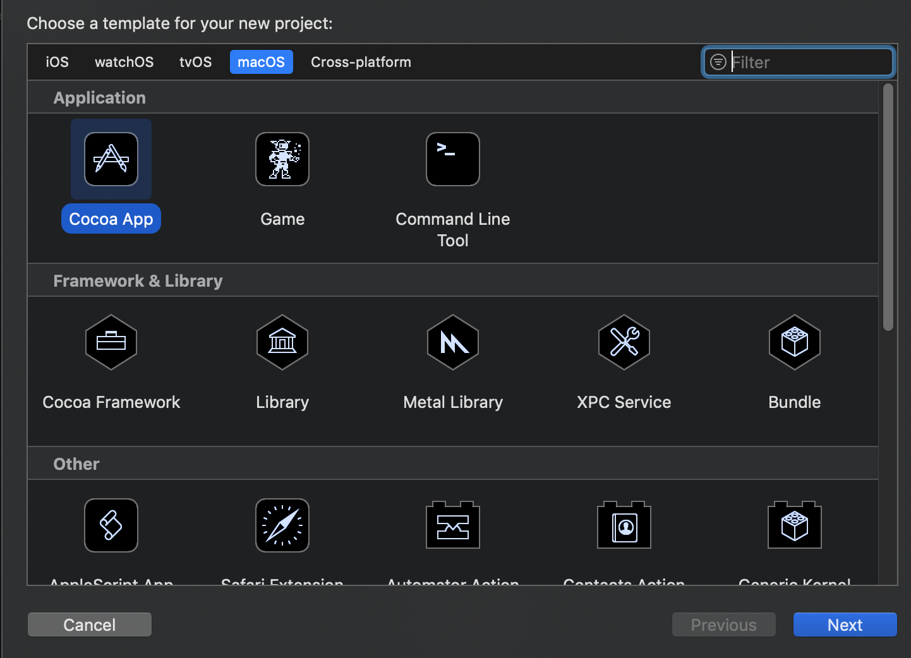
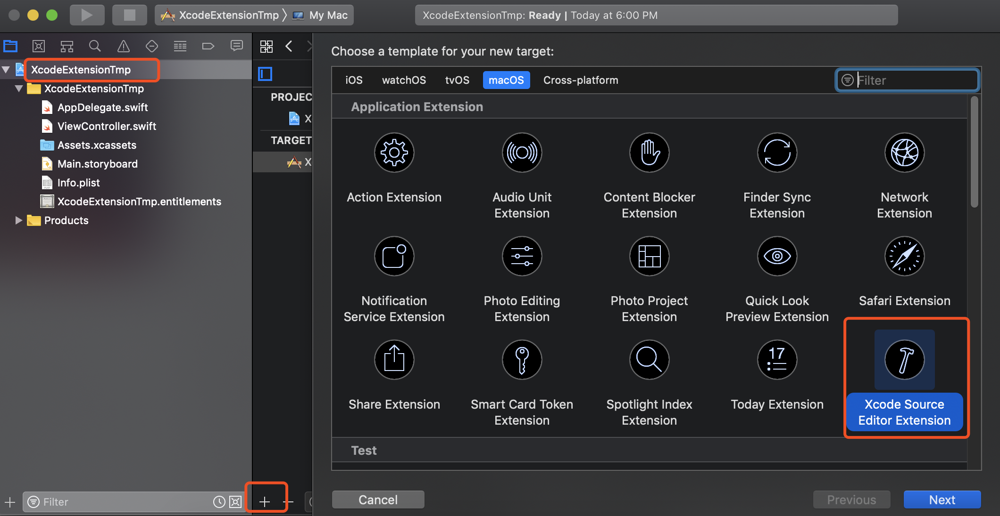
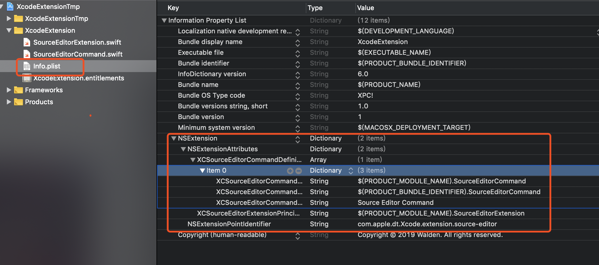

>  目前在网上也参看了不少关于Xcode Source Editor Extension的资料，也经过自己的实践，事实上它能够做的事情并不多。总的来说它只能够操作单个文件之内的文本，并且不能创建交互的UI。就是说我们只能对当前视图的文本做一些审查或者修改。（希望苹果以后会完善这个功能吧！）

# 1.搭建插件项目

首先我们需要创建一个MacOS系统下壳工程程序。如下图所示：



壳工程创建完毕后，在选中Target，添加一个Xcode Source Editor Extension工程，如下图所示：



# 2.编写插件项目

xcode extension工程创建完毕之后，实际目录如下图所示，主要有两个源文件和一个plist文件。xcode插件启动的加载的类实际上是在plist中配置的，你可以在这里指定新的类，或者添加新的类。



SourceEditorExtension类是一个遵守`XCSourceEditorExtension`协议的类，协议定义如下图所示，如下代码所示。

```
@protocol XCSourceEditorExtension <NSObject>

@optional

/** Invoked when the extension has been launched, which may be some time before the extension actually receives a command (if ever).
 
 \note Make no assumptions about the thread or queue on which this method will be invoked.
 */
- (void)extensionDidFinishLaunching;

/** An array of command definitions, just as they appear in the XCSourceEditorCommandDefinitions key of this extension's NSExtensionAttributes in its Info.plist.
 
 \note Make no assumptions about the thread or queue on which this property will be read.
 */
@property (readonly, copy) NSArray <NSDictionary <XCSourceEditorCommandDefinitionKey, id> *> *commandDefinitions;

@end
```

`- (void)extensionDidFinishLaunching`方法会在插件初始化之前做一些事情，你可以在这个方法中做一些插件启动的准备工作。

`commandDefinitions`属性主要返回一个二维数组，二维数组中定义了这个插件包含的item有哪些，你需要指定item的name、identifity、接受事件的类。（需要注意的一点是在swift中runtime动态生成类型是需要添加命名空间的，因此`classNameKey`对应值的字符串中，需要在类型之前添加工程名字，如下示例所示：`[XCSourceEditorCommandDefinitionKey.classNameKey: "WHXcodeExtension.SourceEditorCommand"`）

示例代码如下所示：

```swift
class SourceEditorExtension: NSObject, XCSourceEditorExtension {
    func extensionDidFinishLaunching() {
        // If your extension needs to do any work at launch, implement this optional method.
        print("WHXcodeExtension Finish launch")
    }
    
    var commandDefinitions: [[XCSourceEditorCommandDefinitionKey: Any]] {
        let firstItem: [XCSourceEditorCommandDefinitionKey: Any] =
            [XCSourceEditorCommandDefinitionKey.classNameKey: "WHXcodeExtension.SourceEditorCommand",
             XCSourceEditorCommandDefinitionKey.identifierKey:"com.walden.first",
             XCSourceEditorCommandDefinitionKey.nameKey: "first"]
        let secendItem: [XCSourceEditorCommandDefinitionKey: Any] =
            [XCSourceEditorCommandDefinitionKey.classNameKey: "WHXcodeExtension.SourceEditorCommand",
             XCSourceEditorCommandDefinitionKey.identifierKey:"com.walden.secend",
             XCSourceEditorCommandDefinitionKey.nameKey: "secend"]
        return [firstItem, secendItem]
    }
}
```

在`SourceEditorCommand`类中，你可以通过`invocation`对象拿到当前源码上下文相关的信息以及当前点击的命令identifity。你需要在这里处理在`SourceEditorExtension`中声明的那些命令。

```swift
class SourceEditorCommand: NSObject, XCSourceEditorCommand {
    func perform(with invocation: XCSourceEditorCommandInvocation, completionHandler: @escaping (Error?) -> Void ) -> Void {
        print(invocation.commandIdentifier)
        print(invocation.buffer.lines)
        completionHandler(nil)
    }
}
```


