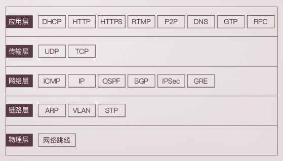

# 为什么学习网络协议

要想打造互联网世界的通天塔,只教给一台机器做什么事不够的，你需要学会教给一大片机器做什么。这就是网络协议。只有通过网络协议，，才能使一大片机器相互协议、共通完成一件事。

从浏览器输入一个地址到打开一个网页，中间经历了什么？

1. 比如我们输入www.baidu.com，浏览器只知道名字但是并不知道具体地点，于是它需要打开地址簿去查找。可以使用一般的地址簿协议DNS去查找，也可以使用另一种更加精准的地址簿协议HTTPDNS去查找。最终找到了地址`106.114.138.24`。
2. 知道了目标地址，浏览器开始打包请求。可以是http请求或者加密传输的https请求，无论是哪种请求，里面都要写明你要查找的内容是什么。
3. DNS、http、https所在的层我们称为应用层。经过应用层的封装后，浏览器会将应用层的包教给协议层去完成，通过socket编程来实现。协议层是传输层，传输层有两个协议TCP、UDP，TCP能够保证请求包一定能够到达目的地。如果不能到达，就会重新发送，知道送达。
4. TCP协议里面会有两个端口，一个是浏览器监听的端口，一个是电商的服务器监听的端口。操作系统往往通过端口来判断，它得到的包应该给哪个进程。
5. 传输层封装完毕后，浏览器会将包教给操作系统的**网络层**。网络层的协议是IP协议。IP协议中有源IP和目标IP地址。
6. 操作系统知道IP之后，就开始根据门牌号查找目标机器。操作系统往往会判断IP是本地IP还是其它地方的IP。操作系统可以根据自身所在IP段判断出来。
7. 如果要去远处的IP目的地，就要离开本地局域网，那么就需要经过网关。而操作系统启动时候，就会被DHCP协议配置IP地址，以及默认网关地址192.168.1.1。
8. 在局域网本地通信基本靠吼。通过ARP协议可以获取对应IP地址的MAC地址。
9. 网关内部往往有一个路由表，网关收到数据包会根据目标IP地址将数据发送到正确的端口上去。

**本文需要设计到的网络协议：**



我们通过路由表就能得到写一个城关的IP地址，那么为什么还要通过本地的MAC地址呢？

> mac主要用于局域网中通信，ip用于网关之间通信。举个例子，身份证号是你的唯一标识，不会重复，一落户就有（网卡一出厂就有mac）。现在我要和你通信（写信给你），地址用你的姓名+身份证，信能送到你手上吗?明显不能！身份证号前六位能定位你出生的县。mac地址前几位也可以定位生产厂家。但是你出生后会离开这个县（哪怕在这个县，也不能具体找到你）。所以一般写个人信息就要有出生地和现居地址了。


# 网络分层含义是什么？ 

网络包的格式很复杂，程序也很复杂。复杂的程序都要分层，这是程序设计的要求。

网络分层是什么？举一个最形象的例子：通信协议就像是没有天桥的双子楼，要从A座24层到达B座的24层就得先下楼再上楼。其它的协议也是如此，比如4G、5G。


# ifconfig：最熟悉又陌生的命令行

怎么查看电脑的IP地址？

答案：在windows上是ipconfig，在linux上是ifconfig。在linux上还有一个命令`ip addr`，如果你不知道这个答案，那么你可能没有用过linux。

```shell
en0: flags=8863<UP,BROADCAST,SMART,RUNNING,SIMPLEX,MULTICAST> mtu 1500
	ether f0:18:98:1c:0a:e6
	inet6 fe80::81f:5b82:b71b:df7e%en0 prefixlen 64 secured scopeid 0xa
	inet 10.0.21.246 netmask 0xffffff00 broadcast 10.0.21.255
	nd6 options=201<PERFORMNUD,DAD>
	media: autoselect
	status: active	
```


IP地址是一个网卡在网络世界的通讯地址，相当于我们现实世界的门牌号码。

在32位的IP环境中，IP地址被划分为5类。


## CIDR

这样的分类存在一个问题，就是C类地址能包含的最大主机数量实在太少，只有254个。当时设计时候没有想到，现在估计一个网吧都不够用。为了解决这个问题，于是有一个折中的方案叫做 **无类型域间选路**，简称 **CIDR**。

这种设计方案打破原来设计的几类地址的做法，将32位的IP地址一分为二，前面的是网络号，后面的是主机号。从哪里分呢?`10.100.122.2/24`比如这个IP地址中有一个斜杠，斜杠后面有个数字24.这种地址表示形式就是CIDR。后面24表示在32位中，前面24位是网络号，后面8位是主机号。

## 其它相关概念

**广播地址：**广播地址(Broadcast Address)是专门用于同时向网络中所有[工作站](https://baike.baidu.com/item/工作站/217955)进行发送的一个**地址**。在使用TCP/IP 协议的网络中，[主机](https://baike.baidu.com/item/主机/455151)标识段host ID 为全1 的IP 地址为广播地址，广播的分组传送给host ID段所涉及的所有计算机。

**子网掩码：**子网掩码(subnet mask)又叫[网络掩码](https://baike.baidu.com/item/网络掩码/7862514)、[地址掩码](https://baike.baidu.com/item/地址掩码/8623995)、子网络遮罩，它是一种用来指明一个[IP地址](https://baike.baidu.com/item/IP地址)的哪些位标识的是[主机](https://baike.baidu.com/item/主机/455151)所在的子网，以及哪些位标识的是主机的位掩码。子网掩码不能单独存在，它必须结合IP地址一起使用。子网掩码只有一个作用，就是将某个IP地址划分成[网络地址](https://baike.baidu.com/item/网络地址/9765459)和[主机地址](https://baike.baidu.com/item/主机地址/9765500)两部分。

**公有IP&私有IP：**公有 IP 地址有个组织统一分配，你需要去买。如果你搭建一个网站，给你学校的人使用，让你们学校的 IT 人员给你一个 IP 地址就行。但是假如你要做一个类似网易 163 这样的网站，就需要有公有 IP 地址，这样全世界的人才能访问。

**MAC地址：**MAC地址更像是身份证，是一个唯一的标识。它的唯一性设计是为了组网的时候，不同的网卡放在一个网络里面的时候，可以不担心冲突。从硬件角度，保证不同的网卡有不同的标识。

一个网络包从一个地方传到另一个地方，除了要有确定的地址，还需要有定位功能。具有门牌号属性的IP地址具有远程定位功能，而MAC地址用于在局域网内定位到具体的机器。就是说，MAC地址的通信范围比较小，局限在一个子网里面。

## 网络设备状态标识

```shell
flags=8863<UP,BROADCAST,SMART,RUNNING,SIMPLEX,MULTICAST> mtu 1500	
```

UP 表示网卡处于启动的状态；BROADCAST 表示这个网卡有广播地址，可以发送广播包；MULTICAST 表示网卡可以发送多播包；LOWER_UP 表示 L1 是启动的，也即网线插着呢。MTU1500 是指什么意思呢？是哪一层的概念呢？最大传输单元 MTU 为 1500，这是以太网的默认值。


# DHCP与PXE：IP是怎么来的，又是怎么没的？

一台新的设备被接入一个新的网络环境中，刚开始是没有IP地址的，我们可以手动通过`net-tools`或者`iproute2`进行IP的配置工作。关于网络配置，不同系统的配置文件格式不同，但是无非就是CIDR、子网掩码、广播地址和网关地址。

##  DHCP

试想在一个咖啡厅，人来人往，如果每个人接入网络都需要网络管理员配置IP，那么过于麻烦，浪费大量的人力。因此我们需要一个自动配置网络的协议，这就是 **动态主机配置协议**，简称 **DHCP**。

**DHCP工作方式：**

1. 新机器接入网络环境，首先使用IP地址0.0.0.0，目的IP地址255.255.255.255，发送广播包，广播包封装了UDP。意思就是告诉所有人：我是新来的，我的MAC地址是这个，我还没有IP，谁能租给我一个IP地址！
2. 如果在一个网络环境中配置了`DHCP Server`，它就相当于IP管理员。它收到消息后知道这是一个新的机器，IP管理员会租给他一个IP地址，并保留此IP地址，防止将同一个IP分配给两个人。DHCP仍然通过广播的方式发送IP地址，广播信息包括子网掩码、网关、IP地址以及租期等信息。如果局域网配置了多个DHCP服务器，则会收到多个被分配的IP地址，一般会以第一个收到的作为自身的IP地址。
3. 此时新接入网络的机器需要向`DHCP Server`发送最后的确认，以便告诉DHCP机器接受的哪个IP地址，被多余分配的地址会被重新清除掉。
4. DHCP Server接收到消息后，会广播返回给客户端一个`DHCP ACK`，告诉客户机服务器已经确认信息。
5. 客户机收到ACK消息后就拥有了自己的IP地址，此时客户机可以使用IP地址进行通信了。

既然IP地址是租的，那么肯定有租期，租期到了肯定要回收的。客户机在租期过去50%的时候，会直接向其提供服务的DHCP Server发送DHCP request消息包。客户机收到服务器返回的ACK消息后会更新自己的租期以及其他IP配置信息。这样，IP租用更新就完成了。

## PXE 预启动执行环境

机房管理员可能一次拿到几百台机器，并且都是空白的机器，如果人工一台一台安装操作系统，过于复杂，效率也不高。这时候我们可以使用PXE来进行操作系统的批量安装。

PXE协议分为客户端和服务器端，由于还没有操作系统，只能先把客户端放在BIOS中。当计算机启动时候，BIOS把PXE客户端调入内存们就可以链接到服务端做一些操作了。

PXE的工作流程大概是这样的，如下图所示：


