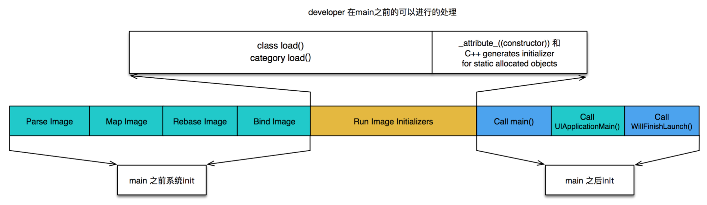

## 设计模式相关

MVC， MVP， MVVM-RxSwift等App架构。

7个设计原则、单例模式、工厂模式、代理模式、适配器、观察者、桥接、组合、装饰、责任链、中介者、状态、策略、模板方法等设计模式。

APP优化方案：

卡顿优化

CPU和GPU： CPU负责对象的创建、对象属性调整、布局计算、文本计算和排版、图片的解码和转换、图像的绘制。GPU负责纹理渲染。

CPU优化：

1. 使用轻量级对象，用不到事件处理则使用CALayer。
2. 不要频繁调整UIView属性。
3. 控制线程最大并发量。
4. 图片size大小控制一下。
5. 耗时操作放在子线程中：图片解码，文本计算。

GPU优化：

1. 避免同时使用大量图片。
2. 尽量减少视图的层级和数量。
3. 较少透明的视图，尽量使用不透明的视图。
4. 尽量避免出现离屏渲染。

离屏渲染设计上下文切换，开辟新的缓冲区造成耗时。光栅化、遮罩、圆角、阴影会导致离屏渲染。

耗电优化

主要用电大户：CPU、网络请求、定位、图像、不停的IO操作。

1. 不要频繁的进行IO操作，如果是少量的数据，则统一在APP退出时候统一写数据。
2. 减少网络请求，数据缓存，获取到定位后马上关闭定位。
3. 优化持续使用CPU的代码。

APP启动优化

App启动过程：

1. dyld：通过dyld加载递归加载依赖的动态库、动态链接。
2. runtime：class load， category load，加载可执行文件和动态库到内存中，被runtime管理。
3. main：调用didFinishLaunch方法，这里尽可能少的代码，尽可能将代码放在异步线程中去。

优化：

dyld阶段：尽可能少使用动态库，合并动态库。较少类分类数量，定期清理没用的类和分类和方法。

runtime阶段：尽可能少的使用load方法。

main阶段：极可能将一些操作延迟，按需加载。

安装包瘦身

1. 清理没用代码。
2. 图片等资源进行压缩。
3. 开启编译器优化，bitcode，瘦身等。
4. AppCode检测未使用代码并删除掉。
5. 检查占用体积比较大的三方库，尽可能少使用第三方库，如果只使用到一个三方库很小的功能，尝试自己写。

App你想相关内容

学习方法：抓住一个技术点，然后刨根问题，循序渐进，学习记录其中涉及的每一个其它技术要点。

什么是越狱？ 利用ios系统存在漏洞，获取ios系统最高权限，解开之前的各种限制。

完美越狱、不完美越狱。

cydia，越狱后的AppStore，用来安装各种越狱后的插件。Cydia软件源。

SpringBoard就是ios系统的桌面应用程序，用来管理其他应用程序的启动关闭等等。

越狱后的系统通过Cydia安装的是deb格式的软件安装包，会通过动态加载的形式挂载在应用程序上。

电脑和手机之间的通信，通过ssh远程登录到ios系统中，可以通过局域网ip形式，也可以通过数据线通过端口转发进行访问。访问root账户，重置root账户密码，然后可以做任意的事情了。

Cycript脚本：

是Cydia作者开发的，主要用于探索，修改，调试正在运行的MacOS、iosApp。通过Cydia安装Cycript，可以再iPhone上调试运行中的APP。Cycript支持oc，js，java语法，不过调用的是oc的方法。

对于常用的cy脚本，我们可以将代码封装在。cy文件中，在运行时直接通过方法调用来使用代码。

Reveal神器：

Reveal是一款ios层序UI界面调试神器。ios设备上需要安装Reveal Loader，然后可以通过mac端的Reveal查看任意app的界面层级关系，view关系。

Mach-O文件：

dyld是一个动态连接器,主要用来加载动态库.

Mach-O式mac/iOS上用于存储程序,库的标准格式. Mach-O文件主要包含三个主要组合成部分, Header:文件类型,目标架构类型等. Load commands:描述文件在虚拟内存中的逻辑结构,布局. Raw segment data:Load commands中定义的Segment的原始数据.

iOS逆向App思路:

界面分析:Cycript,Reveal.

代码分析:MachOView, class-dump, Hooper Dissassembler, ida.

动态调试:debugserver, LLDB

代码编写:注入代码到App中, 必要时可能需要重新签名,打包ipa

* class-dump: 把Mach-O文件中的class信心dump出来,生成头文进
* Hooper Disassmbler能够将Mach-O文件的机器语言代码反编译成汇编代码, OC伪代码或者swift伪代码.

脱壳:

加壳就是利用特殊的算法,对可执行文件的编码进行改变(比如压缩,加密),以达到保护程序代码的目的.

脱壳就是摘掉壳程序,将维嘉工的可执行文件还原出来.  (脱壳方式有硬脱壳:直接将源文件算法进行解密获取可执行文件,iOS是通过这种方式脱壳的; 动态脱壳:从内存中提取可执行文件出来.)

iOS从脱壳工具,常用的有两个: Clutch, dumpdecryted

theos

一款编写逆向动态注入可执行文件的工具. iOS越狱开发中,各种破解补丁的统称是tweak,通常意义上我们所说的越狱开发, 都是指开发一个tweak. tweak的实质是iOS平台的动态库.

开发tweak最常用的环境是theos.

theos开发过程: 编写tweak.xm文件,生成dylib动态库,连同签名文件plist一起生成deb文件, 通过ssh存放在iphone中,通过cydia来安装deb文件.

theos运行原理: App启动时去指定位置加载动态库, 动态库加载完成后会动态影响App的动作.

动态调试

常用软件：

爱思助手、pp助手越狱、iFunBox查看管理文件系统、Alfred、XtraFinder、iTerm2、Go2Shell

