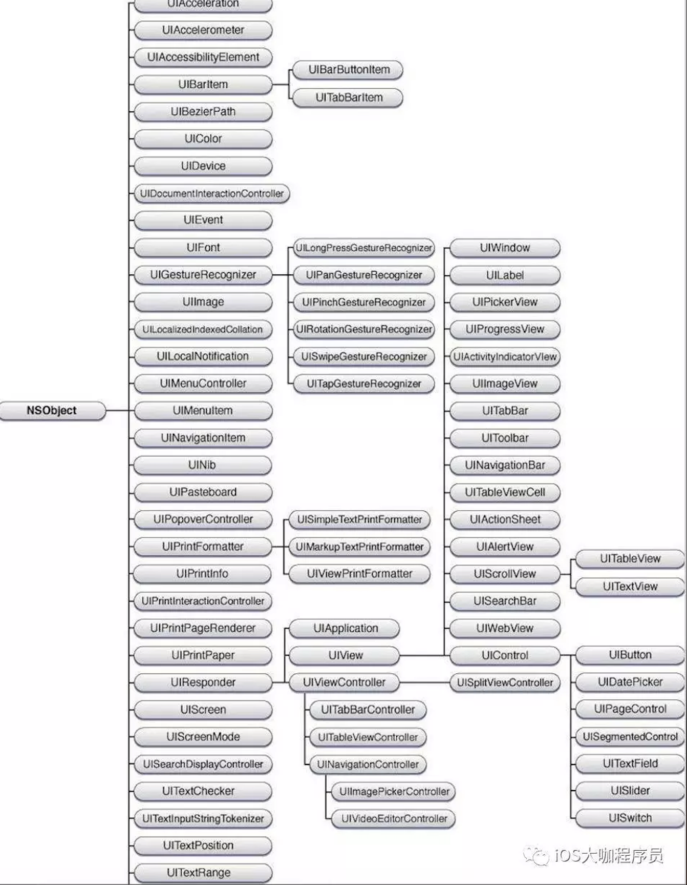
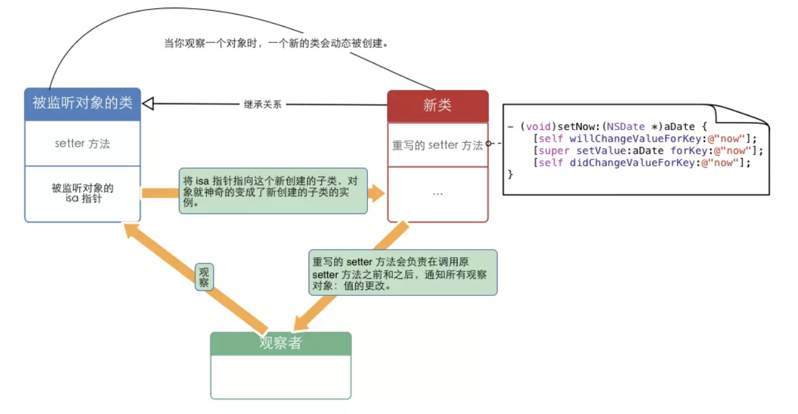

# 1. UI视图

UIView和CALayer有什么区别呢?

> CALayer是UIView用于绘制视图内容的部分，这样设计师符合类型单一职责原则的设计方案。CALayer主要用于绘制内容，就是屏幕上我们所看到的文字，图像，还有动画也是作用于Layer层级的。而UIView主要用于处理时间，设计到整个时间响应链条，查找事件发生的位置，判断响应事件的view，这些都是在UIView中进行判断处理的。
>
> UIView响应事件的能力来自于其继承自UIResponder，因此可以添加点击事件。
>
> NSView底层用于绘制部分也使用的CALayer。但是事件处理部分不同，因此Cocoa中主要处理的是鼠标事件，而CocoaTouch中主要处理的是触摸事件。


imageNamed和imageWithContainsOfFile两个方法的区别

> 1. imageNamed的方式加载图片，图片使用完毕会被缓存到内存中，内存消耗比较多，再次加载速度比较快。即使放到自动释放池中，这份缓存也不会被释放，如果图像较大或者较多，则这种方式会消耗很大的内存。适用于高频、图片小的资源。
> 2. imageWithContainsOfFile加载，图片并不会缓存，使用完毕会被释放，适用于使用频次低、图片比较大的资源。


比较frame, bounds有什么不同?

> frame是指在该view在父view坐标系中的位置和大小。参照物是父view的坐标系统。
>
> bounds是指该view在本身坐标系统中的位置和大小。


遇到tableView卡顿吗? 会造成卡顿的原因有哪些?

> **1. 避免cell重新布局, 提前计算并缓存cell的树形和内容**
>
> cell的布局计算比较耗时, 最好是在创建cell之后就布局好, autolayout之类的东西, 之后如果能不改变其布局就不要去改变。如果cell是动态高度，如果每次cell重新进入屏幕都去计算，计算过程会浪费时间也会消耗不必要的cpu资源，这时候可以提前缓存cell的高度，需要的时候直接去取出来就行了。
>
> **2. 减少cell上控件数量， 尽可能不使用clearColor和透明度**
>
> 如果cell上控件数量多会导致渲染比较耗时，计算autolayout也会消耗更多的时间，一不小心就会导致卡顿。尽可能不要在cellForRow：方法中创建新的控件，控件尽可能在cell初始化时候创建完毕，之后拿来用就行了。另外尽可能不要使用clearColor，透明度的view需要将两个甚至多个图层颜色叠加计算最终的颜色，因此会消耗更多的cpu时间。
>
> **3.加载网络数据，下载图片都使用异步下载，尽可能缓存**
>
> 异步下载图片网络等数据，可重用的数据，尽可能缓存起来。
>
> **4.预渲染图像、预解码**
>
> 加载图片可以将图像放在子线程中进行预加载，在子线程中创建图片上下文，将图像绘制一遍，图像就会发生解码，这时候使用解码后的图像会更快一点。


描述你所了解的UIKit



> 所有能够看到的东西都继承自UIView，它主要来控制视图的显示，实现calayer相关的接口，比如绘制接口，它的子类有UIWindow、UILabel、UIImageView、UIWebView、UIScrollView等等等，其中有个子类是UIControl，其子类能够响应target-selector方式响应时间，有UIButton、UISwitch、UITextField等等。UIView的父类是UIResponder，只要是它的子类全部都能够响应事件，UIViewController、UIApplication、UITabbarController、UINavigationController都是它的子类。
>
> UIResponder同等级的类型有UIScreen、UIImage、UIDevice、UIColor、UIFont等对象。
>
> 然后可以阐述UIView和CALayer的关系。


高性能绘制图片圆角？

> 同时设置layer的maskToBounds和cornerRadius会触发离屏渲染。离屏渲染是GPU在当前屏幕缓冲区以外开辟新的缓冲区进行渲染的操作。如果一定使用触发离屏渲染的方式设置圆角，可以同时开启光栅化，开启光栅化可以使离屏渲染结果缓存到内存中存为位图，使用的时候直接使用缓存，节省了一直使用离屏渲染损耗的性能。如果layer以及sublayer是经常改变，则会一直不停的 渲染以及删除缓存重新创建缓存，这种情况下不建议使用光栅化，因为在动态变化layer中使用光栅化会更加消耗性能。
>
> 另一个常用的设置圆角的方法是在图形上下文中自己绘制圆角图片，如果嫌绘制耗时，可以将绘制流程放在子线程中来完成，最后回调到主线程设置到imageView上。


#2. 内存管理

简单介绍内存分区？

> 我们的应用程序被加载到程序区. 应用程序被分为三部分加载到内存中, 代码段区（text）、已初始化数据区（data）、未初始化数据区（bss）。此区域之外是堆区（heap）和栈区（stack），堆区内存地址从低向高增长，栈区的内存地址从高向低增长。
>
> - stack：方法调用。
> - heap：通过alloc等分配的对象。
> - bss：未初始化的全局变量等。
> - data：已初始化的全局变量等。
> - text：程序代码。


# 3. Runtime

runtime高级面试题目

```objective-c
//MNPerson
@interface MNPerson : NSObject
@property (nonatomic, copy)NSString *name;
- (void)print;
@end

@implementation MNPerson
- (void)print{
    NSLog(@"self.name = %@",self.name);
}
@end
---------------------------------------------------
@implementation ViewController
- (void)viewDidLoad {
    [super viewDidLoad];
    id cls = [MNPerson class];
    void *obj = &cls;
    [(__bridge id)obj print];
}
```


这里为什么不会崩溃, 为什么打印了`self.name = <ViewController: 0x7fe667608ae0>` ? 

> 解答 [https://www.jianshu.com/p/117b5cb6a420](https://www.jianshu.com/p/117b5cb6a420)


Runtime如何通过selector找到对应的IMP地址？

> 详见InviewView Course中欧辰消息转发流程。


# 4. Objective-C语言特性

重写一个类的方法，使用继承好还是使用分类号？为什么？

> 使用分类更好。使用类别仅会影响到本类，并不会影响到本类与其他类型的关系，符合软件设计的开闭原则。


@property的本质是什么? 

> @property = ivar + getter + setter
>
> 属性作为OC的一项特性，主要用于封装对象中的数据。oc对象通常会把所需要的数据保存为各种实例变量。实例变量一般通过存取方法来访问。
>
> 属性可以拥有的特质有：
>
> 原子性：atomic，nonatomic
>
> 读写权限：readwrite，readonly
>
> 内存管理语义：assign，strong，weak，copy，unsafe_unretained


weak和assign的区别

> weak和assign都不会触发引用计数，不同的是weak只能用来修饰oc对象类型，当其所指对象被释放之后，weak指针自动置nil；assign可以用来修饰oc对象也可以修饰基本数据类型，当其所致对象销毁后，指针会变成野指针，继续使用会导致程序崩溃。


我们说oc是动态运行时语言是什么意思？

> 就是说，oc中将数据类型的确定从编译时推迟到了运行时。简单说，运行时机制使我们直到运行时才去决定一个对象的类别，以及调用该类别对象指定方法。而像swift，java这样的语言，他们的类型是在编译时确定的，就是说，在编译时候就已经确定了方法调用，比如在某个位置调用了某个方法，编译后可能这里被替换成了一个函数指针，运行时执行到这里会直接进行方法的跳转。而oc中是在运行时通过isa指针找到方法列表依次遍历找到对应方法的。


delegate和Notification的区别？

> 代理主要用于一对一的消息通知功能，而通知主要是用于1对多的关系中。或者消息的发送者和接受者之间没有任何逻辑上关联，层级上没有联系但是又必须传递消息，这时候只能使用 通知了。


KVO实现原理是怎样的？

> KVO是观察者模式的一种实现，当被观察的属性发生更改时，观察者对象会获得通知。
>
> 在运行时，当一个对象第一次被添加了KVO监听之后，runtime会动态生成这个类型的一个子类，并动态将指向原始类型的isa指针指向其动态生成的子类。在子类中重写了对应属性的setter方法，当setter方法被触发的时候就会触发KVO通知，原理大概就是这样的。
>
> KVO是基于runtime机制实现的，KVO运用了isa-swizzling技术（isa混写技术），将两个对象的isa指针相互调换。




# 5.Swift语言特性

比较Objective-C和Swift。

> OC最大的优点就是他的动态性，oc的运行时机制导致oc无所不能，我们可以再运行时任意的干预程序的执行，交换方法，交换isa指针，动态生成对象，动态生成类型，我们甚至可以通过js动态生成一个app。不好的地方就是没有命名空间，必须使用前缀来解决，oc语法和其它大众化的语言语法差异比较大；其次oc的动态性导致过于灵活，如果不注意代码规范，那么写出来的代码可以是灾难性的，发生bug找都不知道从哪找。
>
> Swift的话，我最喜欢的地方是它的可选类型，它从编译器的层面上禁止我们使用未解包的数据，虽然麻烦了点，但是保证了我们程序的安全，自从我使用swift搭建项目，项目的崩溃率真的会比使用oc降低很多很多。其次是它的协议类型，swift协议异常的强大，我们可以定义一个协议集成自另一个协议，也可以组合两个或者多个协议，这样实现接口隔离的设计原则，我们可以直接扩展协议实现协议方法，这样在遵守协议时候就不需要再实现，当然如果你遵守协议时候重新实现了协议方法，那么系统将会调用你新实现的协议方法。swift泛型可以让我们用一份代码干很多事情，泛型特化又保证了泛型的性能。Fundation中很多数据结构都使用struct实现，值类型能够保证安全性，在传递重新赋值时候都会发生复制，不会出现改了一个地方影响了其它地方这种bug。


swift和oc语言的本质区别是什么？

> 最本质的区别，swift是一门静态语言，类似java，c++一样，通过目击表来进行函数调用的。而oc是消息机制，所有的函数调用都是通过消息机制来进行调用的。swift中的函数，在编译器，如果能用静态派发系统就会尽可能的使用静态派发，这样能够很大程度的提升swift语言的运行速度，静态派发中系统可以使用内联来优化函数调用，换做是消息机制，这完全是不可能实现的。

# 6. Block

简述对block和函数指针的理解?

> 相同点：他们都能实现回调的操作。
>
> 不同点：函数指针只能指向预先定义好的函数代码块，函数地址是在编译链接时就已经确定好的。Block本质上是一个OC对象，block不仅能够访问全局变量，还能访问局部变量。函数指针只是指向代码区的一段可执行代码，而block会在运行时栈上动态创建对象，发生copy操作能够将block转移到堆上。


block有哪些类型，为啥要用copy修饰？

> block的三种类型:
> 一 NSGlobalBlock：全局的静态block 没有访问外部变量 你的block类型就是这种类型（也就是说你的block没有调用其他外部变量）
> 二 NSStackBlock：保存在栈中的block，没有用copy去修饰并且访问了外部变量，你的block类型就是这种类型，会在函数调用结束被销毁 （需要在MRC）
> 三 NSMallocBlock 保存在堆中的block 此类型blcok是用copy修饰出来的block 它会随着对象的销毁而销毁，只要对象不销毁，我们就可以调用的到在堆中的block。
>
> 默认情况下，block会存档在栈中(栈是吃了吐)，所以block会在函数调用结束被销毁，在调用会报空指针异常，如果用copy修饰的话，可以使其保存在堆区(堆是吃了拉) ，它的生命周期会随着对象的销毁而结束的。只要对象不销毁，我们就可以调用在堆中的block。


# 7.多线程

比较NSOperationQueue和GCD。

> 使用NSOperationQueue主要可以用来管理子类化的NSOperation对象，控制器线程并发数目，取消已经添加到队列中的任务，但是这个取消并不是真正的将任务状态从执行变成取消，而是做一个标记，当任务执行任务执行完毕后，不去触发回调而已，正在执行的任务是没办法取消掉的。NSOperationQueue是面向对象变成的，在项目中会让项目结构更好。可以实现多个任务的依赖协调，更加精细化的控制线程的执行。
>
> GCD的话非常简单易用，简洁明了，可读性比较高，使用频次也是比较高的。通过dispatch_barrier也可以实现多个任务的依赖协调。
>
> GCD是镀层的C语言构成的API，NSOperationQueue是相关OC对象。NSOperationQueue是GCD基础上实现的，是GCD更高级的抽象。NSOperationQueue可以方便的建立任务的依赖关系；NSOperationQueue支持KVO监听operation是否在执行，是否被取消等。
>
> 从编程原则上，我个人比较习惯面向对象封装的NSOperationQueue，GCD会作为一个备选项，能不用就不用。


GCD的实现原理是怎么样的？

> GCD底层有一个线程池，这个池中存放的是一个个的线程。线程池中的线程是可重用的，当然会有确定的线程上限，上限的值应该与机器内核数量和内核类型相关，由系统决定。当需要新线程时候，就从线程池取一条，进行初始化配置工作，完事把任务扔到线程中一步一步来执行，执行完毕做清理工作然后归还给线程。


# 8. Runloop

### NStimer准吗？谈谈你的看法？如果不准该怎样实现一个精确的NSTimer?

> NSTimer不准，NSTimer默认被添加在runloop、主线程中的，defaultMode，main主要负责主线程事件，比如UI操作，计算，主线程在这时候可能产生阻塞，导致NSTimer不准；主线程有两个mode，当切换到trackingMode时候，defaultMode中事件是不会被触发的，也导致不准。
>
> 针对NSTimer存在问题，我们可以使用`dispatch source`来创建更加精确的计时器，我觉得这个dispatch source可能是通过直接创建一个source然后添加到commonMode中来实现的；CADisplayLink也要比NSTimer经度更高，CADisplayLink会在每次屏幕刷新只有调用，而ios上屏幕刷新频率是固定的。
>
> **GCD做计时是准确的，GCD的线程管理是通过系统直接管理的，并不依赖主线程阻塞的影响**。GCD timer直接通过dispatch port给runloop发送消息，来使runloop执行相应的block，如果所在线程没有Runloop，那么GCD会临时创建线程去执行block，因此GCD的timer不依赖runloop。


runloop内部如何实现逻辑的？

> 详见InviewView Course中Runloop实现逻辑。


# 9. 网络

什么是Socket？


什么是心跳？


http集中请求方式？

> * GET:获取指定资源。
> * POST：向指定资源提交数据进行处理请求，在RESTFUL分各种用于新增资源。
> * HEAD：获取指定资源头部信息。
> * PUT：替换指定资源，不支持浏览器操作。
> * DELETE：删除指定资源。


http三次握手四次挥手？


https通信加密原理？


http和https的区别？


# 10. 软件架构

**一般开始做一个项目，你的架构是如何思考的？**

Reference: [iOS应用架构谈 view层的组织和调用方案](https://casatwy.com/iosying-yong-jia-gou-tan-viewceng-de-zu-zhi-he-diao-yong-fang-an.html),  [iOS应用架构谈 网络层设计方案](https://casatwy.com/iosying-yong-jia-gou-tan-wang-luo-ceng-she-ji-fang-an.html)

上面两篇博客讲的不错，可以参考一下。


你是如何进行组件化解耦的？

> 模块化设计，抽离基础组件，实现基础的功能。
>
> 抽离跨App的业务组件，此组件不依赖App，不可以在多个App中使用。定义统一的对外接口。
>
> 抽离App相关的业务组件，比如加油首页，个人中心，登录注册等功能模块。
>
> 业务模块之间通信的话，现在如果让我来设计这样的组件通信，我会用Target-Action的方法来实现，因为这样解耦更加的彻底。我们无需再App启动时候注册各个组件相关的功能。


# 11. 算法


# 其它

App冷启动和热启动的区别是什么？

> **app冷启动**： 当应用启动时，后台没有该应用的进程，这时系统会重新创建一个新的进程分配给该应用， 这个启动方式就叫做冷启动（后台不存在该应用进程）。
>
> **app热启动**： 当应用已经被打开， 但是被按下返回键、Home键等按键时回到桌面或者是其他程序的时候，再重新打开该app时， 这个方式叫做热启动（后台已经存在该应用进程）。


iOS编译过程做了那些事情?

> 编译型语言在执行时候，必须先通过编译器生成机器码，机器码可以直接在cpu上执行，所以执行效率比较高。
>
> 不管是swift还是oc都是使用LLVM作为编译器后端的，oc、c、c++使用clang作为编译器前段，swift使用swiftc作为编译器前段。编译器前段主要进行语法分析、语义分析，这时候如果发现代码错误或者警告编译器都会有提醒，最终生成LLVM支持的IR中间件。然后编译器后端会将IR统一的中间件代码进一步的优化，比如bitcode，然后会针对不同的cpu架构做不同的优化操作。
>
> swift的编译过程也差不多，不一样的地方在swift编译器前段，swift编译器前段也是进行语法分析，语义分析，然后他会生成swift专属的SIL中间件，在SIL基础上，编译器会针对语言进行大量的优化，swift性能之所以能够那么高也是因为这里进行了很多的优化。优化完事之后也会生成IR中间件，交给LLVM编译器进行进一步的优化，最后生成正对不同CPU架构的代码。


字典的实现原理是什么?

> 字典主要是通过hash算法来实现key-value之间的映射，以此来实现数据存储的。
>
> 哈希表本质应该是一个数组，value所在的index是通过hash算法计算出来的，如果发生了hash冲突，有两种解决方案，一种是开放寻址法一种是拉链法，拉链法就是后面拉一个链表，使用拉链法，当链表长度很长可以将链表转换成红黑树、跳表或者其它更加高效的数据结构，java中有个hashMap好像就是拉链，超过8个元素时候链表会转换成红黑树，红黑树支持更加高效的增删改查。
>
> hash算法中还有一个概念叫装填因子，在拉链法中可以保持装填因子大于1时候，效率也一样比较高，但是在开放寻址法中，必须保证装填因子小于0.8甚至更小，否则寻址会浪费很多时间。


OC中你了解的锁有哪些? 在此基础上二次提问:

追问一：自旋和互斥对比？ 

追问二：使用以上锁需要注意哪些？ 

追问三：用C/OC/C++，任选其一，实现自旋或互斥？口述即可！ 

> 在计算机科学中，锁是一种同步机制，用于在存在多线程的环境中实施对资源的访问限制，可以理解成用于排除并发的一种策略。
>
> 在ios中常见锁有递归锁、自旋锁、普通的锁。主要有以下几种：NSLock，@synchronize、NSRecursiveLock、OSSpinLock。
>
> 自旋锁和互斥锁的区别：互斥锁，如果共享数据已经被其它线程加锁，线程会进入休眠状态，等待被唤醒，被加锁的线程在解锁后会通知睡眠的线程唤醒，并继续执行任务。自旋锁，如果共享数据被其它线程加锁，线程会死循环的方式不停尝试是否解锁，一旦资源被解锁，等待线程会被立马执行。
>
> 自旋锁的效率高与互斥锁，但是循环等会会消耗额外的cpu资源。对于操作比较简单的加锁任务适合使用自旋锁，比如oc中引用计数的加减操作。
>
> 实现自旋锁或者互斥锁：从两种锁的实现原理入手，描述两种锁的实现。


内存泄露可能出现的几种原因是什么?

非OC对象内存泄露怎么处理? 地图的内存泄露怎么处理? 如果常用框架出现内存泄露怎么处理?

> 最主要的原因可能是循环引用。block属性中强持有的self，代理没有加weak，NSTimer循环引用，第三方库的内存泄漏等
>
> 对于程序中用到的非oc类型，需要手动执行内存释放操作，比如CG开头哪些绘制的类型。
>
> 地图类型是比较耗费内存的，这个需要详细阅读文档，正确的使用地图类型，使用完毕时候注意将地图的代理置空。大头针要注意复用，使用完毕后清理数组。


项目做容错处理了没有? 如果拦截潜在的崩溃?

> 团队开发中，水平参差不齐，很难控制代码质量，为了保证代码健壮性问题，需要做容错处理。
>
> 最近两年我用的swift开发，实际上，在swift开发中很少发生崩溃，因为swift引入可选类型，针对可选类型必须解包之后才能用，相当于在语言层面上，强制你必须去判断值是否是空。保证了程序的健壮性。针对项目中的swift代码，以及调用三方库或者系统的代码，我们从runtime上进行了拦截，在release环境中，对uncongnizeSelector进行拦截处理，不让程序崩溃。
>
> 在开发中不能过分相信服务端数据会永远正确；数据处理上，要进行容错处理，进行判断后再使用是好的编程习惯。


简述APNS消息发送机制

> 1. 在客户算，应用程序向iOS操作系统注册通知，然后iOS系统会给对应app生成全网唯一的一个device token。
> 2. 应用程序在接收到token之后，将token发送给自己的服务器。
> 3. 当需要发送推送通知时候，服务器把要推送的内容token以及发送给APNS服务器。
> 4. APNS服务器通过其与ios系统保持的长连接，找到对应的设备，将消息推送到对应的iOS设备上去。


http协议中，post和get有什么区别？

>  get一般用于向服务器请求数据，post用于提交数据; get请求参数是直接拼接在url上面，长度是有限的，不适合传输图片密码等； post没有长度的限制，其请求参数被放在body中。


有使用过runtime运行时吗？用它做了什么？

> 用过。
>
> 1. 用来交换两个方法的实现。主要用法是在load方法中，先获取方法的Method对象，然后通过`method_exchangeImplementations`交换两个方法的实现。
> 2. 很早之前使用oc时候，对象转模型的方法。通过runtime生成模型类型，获取类型方法列表属性列表，把字典中的值存放到对应的model中并返回出去。


自动释放池是什么？如何工作的？

> 自动释放池是以栈为结点的双向链表数据结构构成的。当创建一个自动释放池时候，实际上只是向自动释放池栈结构push一个占位的标记结点。之后如果遇到[obj release]，则会直接将obj push到栈结构的最上层。当执行自动释放池pop操作时候，会从自动释放池栈中取出元素并执行它们的release操作，销毁掉元素，自动释放池一直执行pop操作，直到遇到标记位停止。


dSYM你是如何分析的？

> 我们项目有将符号表上传Apple开发中账号后台，我们会在Xcode构建版本中去查看崩溃信息。另外我们项目集成了bugly，我们使用脚本在Archive时候会将dsym文件上传bugly服务器，我们也开会在bugly上查看崩溃或者卡顿信息，然后定位 问题解决问题。并没有直接对dsym文件进行过完整分析。


深入理解iOS App启动过程&优化启动时间

> App启动过程：
>
> 1. dyld加载Mach-O文件，加载动态库。dyld首先会读取Mach-O文件的Header和load commands，接着就知道这个可执行文件依赖的动态库。dyld通过递归加载的方式将所有依赖的动态库加载到内存中。其中大多说是系统的动态库。
> 2. Rebase和Bind。Rebase用来修正内部指向当前Mach-O文件的指针指向，因为Mach-O文件被加载到内存中后，会进行一个随机偏移，这是为了增加破解反编译的难度，偏移后Mach-O内部指向地址就不对了，所以这里也需要做一个偏移。Bind是将Mach-O调用系统动态库的地方函数进行绑定，因为系统动态库所在内存地址并不是固定的，我们需要通过在加载时候动态绑定到正确的地址上去。
> 3. Objective-C Runtime初始化。OC是被动态语言，在执行main函数之前，需要把类的信息注册到一个全局的Table中。同时，需要将Category中方法注册到对运营的类型中。
> 4. main函数之后，创建UIApplication，UIWindow，UIViewController。
>
> 优化启动时间：
>
> 我们所处的优化启动时间一般是指优化冷启动的启动时间。冷启动的启动过程分为main函数之前和main函数之后，实际上主要的性能问题一般存在在main函数之后，因此main函数之后的优化应该是优化的重点。
>
> 1. 调用`didFinishLaunchingWithOptions`方法。我们经常会在此方法中做一些初始化工作，我们可以将不必要的初始化工作放到异步线程中或者延迟执行。
> 2. 创建UIViewController，初始化UITableBarController。假如我们App存在多个TableBarItem，我们可以将第一个要显示 的创建出来，其它的先用同一个UIViewController代替，当用户点击时候再去创建真正的控制器。
> 3. 获取本地数据和网络数据。将数据获取放在异步线程中，添加加载等待的标识。


ios怎么防止反编译？

> 1. 本地存储数据解密，将数据加密后存储在本地（字符串，图片可以转换成Data类型然后计算反码或者异或运算）。
> 2. URL，关键的token，key等进行编码加密，防止被静态分析。
> 3. 代码混淆技术。混淆关键文件的方法名类名，变量名。


什么是事务？

> 事务是并发控制的基本单元。**所谓的事务就是一个操作序列，这些操作要么都执行，要么都不执行**，他是一个不可分割的工作单元。可以拿银行两个账号转账的操作来做比喻。
>
> 事务的基本特征：原子性、一致性、隔离性、持久性。


load和initinstance比较

> 系统都执行一次；假如父类和子类都被调用，父类在子类之前被调用。
>
> 1. load方法会在加载类的时候被调用，也就是ios启动的时候，就会加载所有的类，就会调用每个类的load方法。
> 2. initialize会在第一次使用这个类的时候被调用。在这里可以初始化静态变量等操作。
> 3. load会在main()之前被调用。initialize则在类实例化或类方法被调用时调用。
> 4. 将类型的初始化尽可能的写在initialize中更好，这里是懒调用的，如果你一直不适用这个类，则方法可能一直不会被调用，而load会在main之前被调用，增加应用启动时间。
> 5. 类在接受消息时，会先检查是否调用过initialize，如果没有则会先进行调用。initialize是通过`objc_msgSend`进行调用，并且Category中方法会覆盖类中的方法。


使用了哪些第三方库？有看他们是怎么实现的吗？

MJRefresh、Moya为例，谈到自己实现的CZBNetwork，封装的三方框架等。


# 面试题目归档

## 初级

1. 为什么说Objective-C是一门动态的语言？
2. 讲一下MVC和MVVM，MVP？
3. 为什么代理要用weak？代理的delegate和dataSource有什么区别？block和代理的区别?
4. 属性的实质是什么？包括哪几个部分？属性默认的关键字都有哪些？@dynamic关键字和@synthesize关键字是用来做什么的？
5. 属性的默认关键字是什么？
6. NSString为什么要用copy关键字，如果用strong会有什么问题？（注意：这里没有说用strong就一定不行。使用copy和strong是看情况而定的）
7. nonatomic和atomic的区别？atomic是绝对的线程安全么？为什么？如果不是，那应该如何实现？
8. 用StoryBoard开发界面有什么弊端？如何避免？
9. 进程和线程的区别？同步异步的区别？并行和并发的区别？
10. 如何使用队列来避免资源抢夺？
11. NSCache优于NSDictionary的几点？
12. 知不知道Designated Initializer？使用它的时候有什么需要注意的问题？

## 中级

#### **Block**

1. block的实质是什么？一共有几种block？都是什么情况下生成的？

#### **Runtime**

1. objc在向一个对象发送消息时，发生了什么？
2. 什么时候会报unrecognized selector错误？iOS有哪些机制来避免走到这一步？
3. 能否向编译后得到的类中增加实例变量？能否向运行时创建的类中添加实例变量？为什么？
4. runtime如何实现weak变量的自动置nil？
5. 给类添加一个属性后，在类结构体里哪些元素会发生变化？

#### **RunLoop**

1. runloop是来做什么的？runloop和线程有什么关系？主线程默认开启了runloop么？子线程呢？
2. runloop的mode是用来做什么的？有几种mode？
3. 为什么把NSTimer对象以NSDefaultRunLoopMode（kCFRunLoopDefaultMode）添加到主运行循环以后，滑动scrollview的时候NSTimer却不动了？
4. 苹果是如何实现Autorelease Pool的？

#### **类结构**

1. isa指针？（对象的isa，类对象的isa，元类的isa都要说）
2. 类方法和实例方法有什么区别？
3. 介绍一下分类，能用分类做什么？内部是如何实现的？它为什么会覆盖掉原来的方法？
4. 运行时能增加成员变量么？能增加属性么？如果能，如何增加？如果不能，为什么？
5. objc中向一个nil对象发送消息将会发生什么？（返回值是对象，是标量，结构体）

## **高级**

1. UITableview的优化方法（缓存高度，异步绘制，减少层级，hide，避免离屏渲染）
2. 有没有用过运行时，用它都能做什么？（交换方法，创建类，给新创建的类增加方法，改变isa指针）
3. 看过哪些第三方框架的源码？都是如何实现的？（如果没有，问一下多图下载的设计）
4. KVO的使用？实现原理？（为什么要创建子类来实现）
5. KVC的使用？实现原理？（KVC拿到key以后，是如何赋值的？知不知道集合操作符，能不能访问私有属性，能不能直接访问_ivar）

## 项目

1. 有已经上线的项目么？
2. 项目里哪个部分是你完成的？（找一个亮点问一下如何实现的）
3. 开发过程中遇到过什么困难，是如何解决的？

## 学习

1. 遇到一个问题完全不能理解的时候，是如何帮助自己理解的？举个例子？
2. 有看书的习惯么？最近看的一本是什么书？有什么心得？

### 其它

boss、作业帮、陌陌、美图

分类的底层实现;
自动释放池的底层实现, 主线程下, 对象的释放时机;
block的底层实现;
分类为啥不能添加成员变量, 只能添加方法;
还有给一个类添加分类后，不导入头文件，能调用分类方法吗;
消息机制里面，分类复写本类里面的方法后，为啥优先调用分类的方法而不是本类;
性能优化应该从哪几个方面着手;
block有哪些类型，为啥要用copy修饰;
声明属性的时候，有哪些默认修饰词;
常用设计模式有哪些，设计一个类的时候要遵循哪些原则（7大原则）;
KVO的原理底层实现;
再底层就问 LVVM的流程;
对clang有没有了解;
Masonry 是如何实现链式编程的;
关联对象里面的修饰词，为啥没有weak;
weak和assgin的区别   assgin能否修饰对象;
可变数组线程安全吗？如果不安全 设计一个可变数组（字典）来实现线程安全;
当有UITableView滑动的时候，NSTimer会停止工作，为什么;
如何去降低程序的耗电量;
简单说一下你这个项目的一个架构;
对MVP MVC MVVM的区别;
Block的本质是啥，回答代码块的话直接就pass了;
说一下消息机制以及消息转发;
个别公司会问七层网络模型是啥？HTTP工作在哪个层  TCP在哪个层;
如果让你来设计一个字典，你会如何实现？（变相问字典的底层实现原理）;
数据结构 一般都是问冒泡和快速排序， 偶尔问二叉树;


如果遇到自己不会或者不太懂的问题。

> 这个问题呢我没有深入的去了解，我只能说一下我的观点，然后把你掌握的相关的知识说一遍，然后推出一个可能的结果。